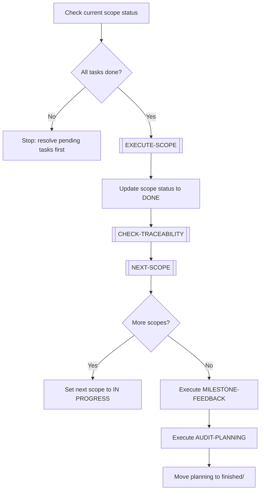

# ADVANCE-PLANNING

> [← README](README.md)

Advances a planning from its current scope to the next. Used when the current scope in DEEPENING is complete and the next scope must begin.

---

---

## Steps

1. Verify all tasks in the current scope are completed (outputs exist, criteria met).
2. Execute `[EXECUTE-SCOPE]` sub-workflow to validate done criteria.
3. Mark current scope as `DONE` in its file.
4. Execute `[CHECK-TRACEABILITY]` — ensure all new terms/decisions are recorded.
5. Execute `[NEXT-SCOPE]` sub-workflow to identify the next pending scope.
6. If more scopes remain: set next scope to `IN PROGRESS`, proceed.
7. If no more scopes: execute `MILESTONE-FEEDBACK` → `AUDIT-PLANNING` → archive.

---

**Sub-workflows used:** [`[EXECUTE-SCOPE]`](../04-SUB-WORKFLOWS/EXECUTE-SCOPE.md) · [`[CHECK-TRACEABILITY]`](../04-SUB-WORKFLOWS/CHECK-TRACEABILITY.md) · [`[NEXT-SCOPE]`](../04-SUB-WORKFLOWS/NEXT-SCOPE.md)

**Leads to:** [`MILESTONE-FEEDBACK`](../03-MAINTENANCE-WORKFLOWS/MILESTONE-FEEDBACK.md) · [`AUDIT-PLANNING`](../03-MAINTENANCE-WORKFLOWS/AUDIT-PLANNING.md)

---

> [← README](README.md)
