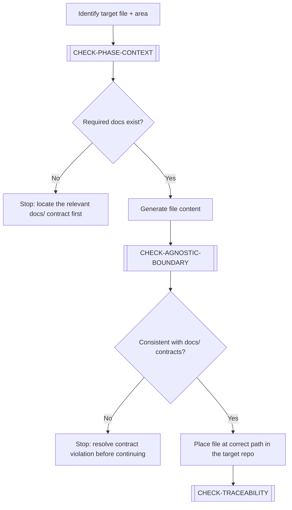

# GENERATE-DOCUMENT

> [← README](README.md)

Creates a new file — code, configuration, migration, or documentation — either from scratch or following the structure defined in `docs/`. The primary workflow for producing implementation outputs.

---

---

## Steps

1. Identify the target file and which repository area it belongs to (DO / WB / AP / AG / IN).
2. Execute `[CHECK-PHASE-CONTEXT]` — verify the required `docs/` contract documents exist and have been read.
3. Generate file content following the conventions for that area (see [`05-SDLC-PHASE-GUIDANCE/`](../05-SDLC-PHASE-GUIDANCE/README.md)).
4. Execute `[CHECK-AGNOSTIC-BOUNDARY]` — verify the output is consistent with `docs/` contracts (entity names, enum values, endpoint paths, module structure).
5. Place the file at the correct path in the target repository.
6. Execute `[CHECK-TRACEABILITY]` — register any new domain terms or concepts introduced.

> **Area-specific guidance**: For detailed per-area inputs, constraints, and done criteria, consult [`05-SDLC-PHASE-GUIDANCE/`](../05-SDLC-PHASE-GUIDANCE/README.md) before executing this workflow.

---

**Sub-workflows used:** [`[CHECK-PHASE-CONTEXT]`](../04-SUB-WORKFLOWS/CHECK-PHASE-CONTEXT.md) · [`[CHECK-AGNOSTIC-BOUNDARY]`](../04-SUB-WORKFLOWS/CHECK-AGNOSTIC-BOUNDARY.md) · [`[CHECK-TRACEABILITY]`](../04-SUB-WORKFLOWS/CHECK-TRACEABILITY.md)

---

> [← README](README.md)
