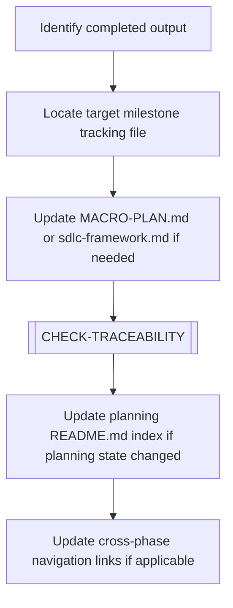

# INTEGRATE-MILESTONE

> [← README](README.md)

Connects the output of a completed scope or planning to the broader SDLC phase outputs and milestone tracking files.

---

---

## Steps

1. Identify what was just completed (a document, a template, a guide section).
2. Locate the appropriate milestone tracking file:
   - `01-templates/00-documentation-planning/macro-plan.md` (progress status)
   - `01-templates/00-documentation-planning/sdlc-framework.md` (phase mapping)
3. Update tracking entries for the completed deliverable.
4. Execute `[CHECK-TRACEABILITY]` — ensure new terms are recorded.
5. Update cross-phase navigation links in README files if the new document is part of a chain.

---

**Sub-workflows used:** [`[CHECK-TRACEABILITY]`](../04-SUB-WORKFLOWS/CHECK-TRACEABILITY.md)

---

> [← README](README.md)
