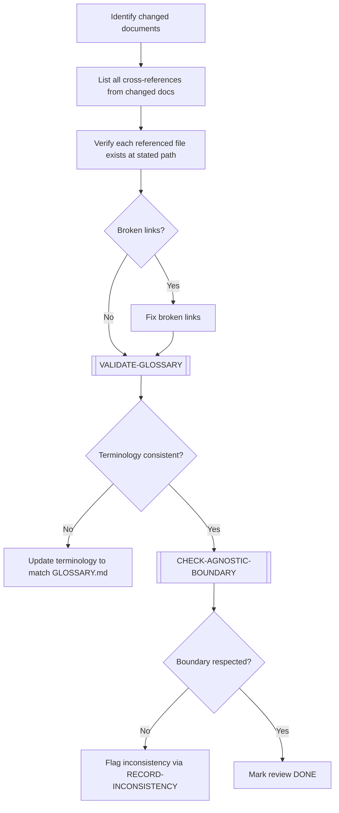

# REVIEW-COHERENCE

> [← README](README.md)

Validates cross-references, links, and terminology consistency after a document has been modified.

---

---

## Steps

1. List all documents modified in the current scope.
2. For each modified document: extract all links and cross-references.
3. Verify each link resolves to an existing file at the expected path.
4. Execute `[VALIDATE-GLOSSARY]` — check terminology matches the project glossary.
5. Execute `[CHECK-AGNOSTIC-BOUNDARY]` if any of the modified docs are in phases 1–5.
6. If inconsistencies are found: trigger `RECORD-INCONSISTENCY` workflow.

---

**Sub-workflows used:** [`[VALIDATE-GLOSSARY]`](../04-SUB-WORKFLOWS/VALIDATE-GLOSSARY.md) · [`[CHECK-AGNOSTIC-BOUNDARY]`](../04-SUB-WORKFLOWS/CHECK-AGNOSTIC-BOUNDARY.md)

**May trigger:** [`RECORD-INCONSISTENCY`](../03-MAINTENANCE-WORKFLOWS/RECORD-INCONSISTENCY.md)

---

> [← README](README.md)
