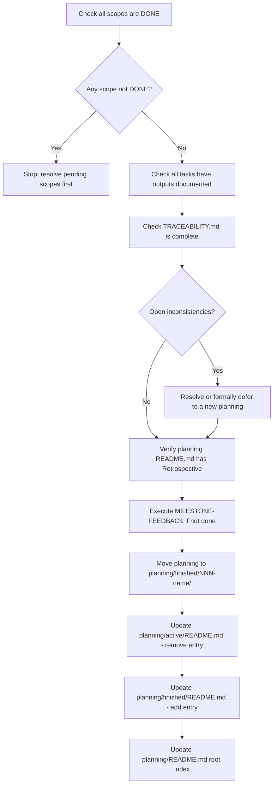

# AUDIT-PLANNING

> [← README](README.md)

Verifies all completeness conditions before a planning can be archived to `finished/`.

---

---

## Steps

1. Verify all scopes in `02-deepening/` have status `DONE`.
2. Verify all tasks in each scope have their documented output.
3. Verify `TRACEABILITY.md` is fully populated (no empty cells for evaluated terms).
4. Verify no open inconsistencies remain unaddressed.
5. Verify `README.md` has a `## Retrospective` section.
6. Execute `MILESTONE-FEEDBACK` if not already done.
7. Move planning folder to `planning/finished/`.
8. Update `planning/active/README.md` — remove entry.
9. Update `planning/finished/README.md` — add entry with key outputs.
10. Update `planning/README.md` root index.

---

**Called by:** [`ADVANCE-PLANNING`](../01-PLANNING-WORKFLOWS/ADVANCE-PLANNING.md)

**Leads to:** [`MILESTONE-FEEDBACK`](MILESTONE-FEEDBACK.md)

---

> [← README](README.md)
