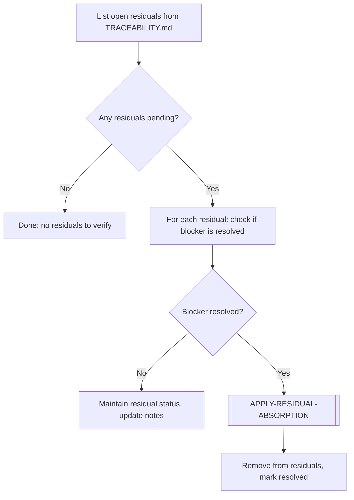

# RESIDUAL-VERIFICATION

> [← README](README.md)

Checks if a previously deferred residual can now be resolved, given new work completed in subsequent scopes or plannings.

---

---

## Steps

1. Open `TRACEABILITY.md` and list all rows with residual status.
2. For each residual: check if the blocker condition mentioned in the notes has been resolved by recent work.
3. If still blocked: update notes with current status and move on.
4. If unblocked: execute `[APPLY-RESIDUAL-ABSORPTION]` sub-workflow.
5. Update `TRACEABILITY.md` — remove from residual section, mark as resolved.

---

**Sub-workflows used:** [`[APPLY-RESIDUAL-ABSORPTION]`](../04-SUB-WORKFLOWS/APPLY-RESIDUAL-ABSORPTION.md)

---

> [← README](README.md)
