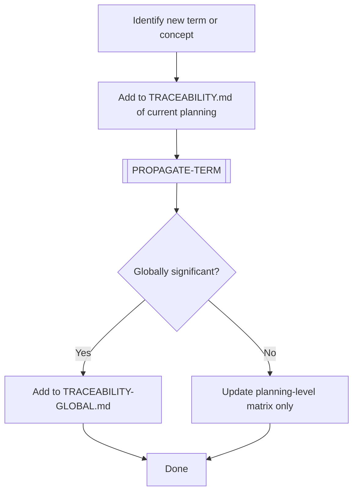

# UPDATE-TRACEABILITY

> [← README](README.md)

Registers a new term, concept, or decision in the traceability matrix and maps it across all relevant SDLC phases.

---

---

## Steps

1. Identify the term, concept, or decision that needs to be tracked.
2. Add a row to the local `TRACEABILITY.md` of the active planning.
3. Execute `[PROPAGATE-TERM]` to evaluate which SDLC phase codes are affected.
4. Mark cells: `✅` if present/consistent, `⚠️` if present but needs review, `❌` if missing, `N/A` if not applicable.
5. If the term is globally relevant (affects multiple plannings): add to `TRACEABILITY-GLOBAL.md`.

---

**Sub-workflows used:** [`[PROPAGATE-TERM]`](../04-SUB-WORKFLOWS/PROPAGATE-TERM.md)

---

> [← README](README.md)
