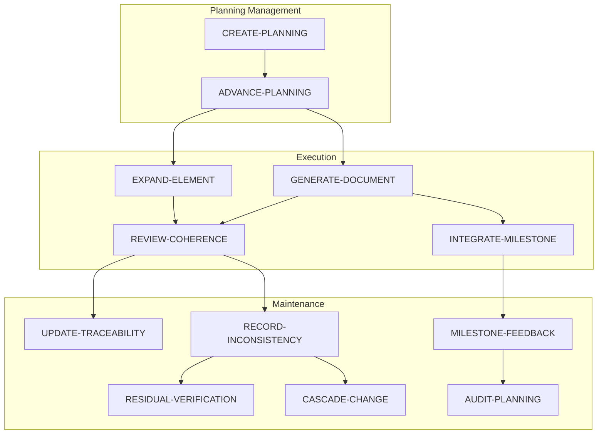

# 🔄 Workflows — Catalog

> [← planning/README.md](../README.md)

All workflows and sub-workflows for the planning system. Every task in every scope must reference one of these.

---

## Workflow Groups

| Group | Folder | Description |
|-------|--------|-------------|
| Planning | [01-PLANNING-WORKFLOWS/](01-PLANNING-WORKFLOWS/README.md) | Create and advance plannings |
| Execution | [02-EXECUTION-WORKFLOWS/](02-EXECUTION-WORKFLOWS/README.md) | Produce and review documents |
| Maintenance | [03-MAINTENANCE-WORKFLOWS/](03-MAINTENANCE-WORKFLOWS/README.md) | Traceability and integrity |
| Sub-workflows | [04-SUB-WORKFLOWS/](04-SUB-WORKFLOWS/README.md) | Reusable step sequences |
| SDLC Guidance | [05-SDLC-PHASE-GUIDANCE/](05-SDLC-PHASE-GUIDANCE/README.md) | Per-phase GENERATE-DOCUMENT reference |

---

## When to Use Which Workflow

| Workflow | When to use |
|---------|-------------|
| [ADVANCE-PLANNING](01-PLANNING-WORKFLOWS/ADVANCE-PLANNING.md) | You have a scope in DEEPENING to advance to the next task |
| [CREATE-PLANNING](01-PLANNING-WORKFLOWS/CREATE-PLANNING.md) | You need to start a brand new planning |
| [GENERATE-DOCUMENT](02-EXECUTION-WORKFLOWS/GENERATE-DOCUMENT.md) | Creating a new document from scratch or from a template |
| [REVIEW-COHERENCE](02-EXECUTION-WORKFLOWS/REVIEW-COHERENCE.md) | Validating cross-references and consistency after changes |
| [EXPAND-ELEMENT](02-EXECUTION-WORKFLOWS/EXPAND-ELEMENT.md) | Deepening an existing document section or template |
| [INTEGRATE-MILESTONE](02-EXECUTION-WORKFLOWS/INTEGRATE-MILESTONE.md) | Connecting completed work to the SDLC phase outputs |
| [UPDATE-TRACEABILITY](03-MAINTENANCE-WORKFLOWS/UPDATE-TRACEABILITY.md) | A new term, concept, or decision was introduced |
| [RESIDUAL-VERIFICATION](03-MAINTENANCE-WORKFLOWS/RESIDUAL-VERIFICATION.md) | Checking if a deferred residual can now be resolved |
| [RECORD-INCONSISTENCY](03-MAINTENANCE-WORKFLOWS/RECORD-INCONSISTENCY.md) | You detected a contradiction or gap between documents |
| [CASCADE-CHANGE](03-MAINTENANCE-WORKFLOWS/CASCADE-CHANGE.md) | A change in one document requires updates across many others |
| [MILESTONE-FEEDBACK](03-MAINTENANCE-WORKFLOWS/MILESTONE-FEEDBACK.md) | Closing a scope or planning with a review summary |
| [AUDIT-PLANNING](03-MAINTENANCE-WORKFLOWS/AUDIT-PLANNING.md) | Verifying completeness before archiving a planning |

> For per-phase guidance when executing `GENERATE-DOCUMENT`, see [05-SDLC-PHASE-GUIDANCE/](05-SDLC-PHASE-GUIDANCE/README.md).

---

## Master Diagram

---

## Sub-Workflow Index

Sub-workflows are reusable steps invoked within the main workflows above. See [04-SUB-WORKFLOWS/](04-SUB-WORKFLOWS/README.md) for all files.

| Sub-workflow | Used by |
|-------------|---------|
| [[NEXT-SCOPE]](04-SUB-WORKFLOWS/NEXT-SCOPE.md) | ADVANCE-PLANNING |
| [[EXECUTE-SCOPE]](04-SUB-WORKFLOWS/EXECUTE-SCOPE.md) | ADVANCE-PLANNING |
| [[RESOLVE-CONFLICT]](04-SUB-WORKFLOWS/RESOLVE-CONFLICT.md) | RECORD-INCONSISTENCY, CASCADE-CHANGE |
| [[APPLY-RESIDUAL-ABSORPTION]](04-SUB-WORKFLOWS/APPLY-RESIDUAL-ABSORPTION.md) | RESIDUAL-VERIFICATION |
| [[PROPAGATE-TERM]](04-SUB-WORKFLOWS/PROPAGATE-TERM.md) | UPDATE-TRACEABILITY, CASCADE-CHANGE |
| [[CHECK-AGNOSTIC-BOUNDARY]](04-SUB-WORKFLOWS/CHECK-AGNOSTIC-BOUNDARY.md) | GENERATE-DOCUMENT, REVIEW-COHERENCE |
| [[CHECK-PHASE-CONTEXT]](04-SUB-WORKFLOWS/CHECK-PHASE-CONTEXT.md) | GENERATE-DOCUMENT |
| [[CHECK-TRACEABILITY]](04-SUB-WORKFLOWS/CHECK-TRACEABILITY.md) | INTEGRATE-MILESTONE, UPDATE-TRACEABILITY |
| [[VALIDATE-GLOSSARY]](04-SUB-WORKFLOWS/VALIDATE-GLOSSARY.md) | REVIEW-COHERENCE, EXPAND-ELEMENT |
| [[CHECK-PHASE5-CHAIN]](04-SUB-WORKFLOWS/CHECK-PHASE5-CHAIN.md) | GENERATE-DOCUMENT (Phase 5), REVIEW-COHERENCE |
| [[CHECK-DEVWORKFLOW-CONSISTENCY]](04-SUB-WORKFLOWS/CHECK-DEVWORKFLOW-CONSISTENCY.md) | GENERATE-DOCUMENT (Phase 6 workflow), REVIEW-COHERENCE |
| [[CHECK-VERSIONING-ALIGNMENT]](04-SUB-WORKFLOWS/CHECK-VERSIONING-ALIGNMENT.md) | GENERATE-DOCUMENT (Phase 8), REVIEW-COHERENCE |

---

> [← planning/README.md](../README.md)
