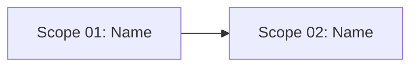

# 🚀 EXPANSION: [Planning Name]

> **Status:** Expansion
> [← planning/README.md](../../README.md)

---

## Scope Summary

| # | Scope | SDLC Phase(s) | Depends On | Status |
|---|-------|--------------|------------|--------|
| 01 | [scope name] | [D / R / S / …] | — | PENDING |
| 02 | [scope name] | [D / R / S / …] | 01 | PENDING |

---

## Dependency Map

---

## Impact per Repository Area

| Code | Area | Affected? | What changes |
|------|------|----------|-------------|
| DO | `docs/` | ☐ | — |
| WB | `web/` | ☐ | — |
| AP | `api/` | ☐ | — |
| AG | `agents/` | ☐ | — |
| IN | `infra/` | ☐ | — |
| W | `.planning/` | ☐ | — |

---

## Notes

*Add context, risks, or cross-cutting concerns here.*

---

> [← planning/README.md](../../README.md)
