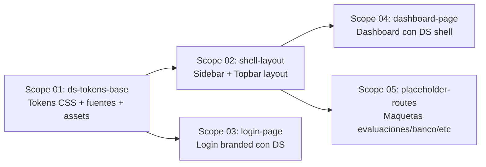

# 🚀 EXPANSION: 005-design-template

> **Status:** DEEPENING
> [← planning/README.md](../../README.md)

---

## Scope Summary

| # | Scope | Área | Depends On | Status |
|---|-------|------|------------|--------|
| 01 | ds-tokens-base | WB | — | PENDING |
| 02 | shell-layout | WB | 01 | PENDING |
| 03 | login-page | WB | 01 | PENDING |
| 04 | dashboard-page | WB | 02 | PENDING |
| 05 | placeholder-routes | WB | 02 | PENDING |

---

## Dependency Map

> **S01** es la base que todos los demás requieren — debe ejecutarse primero.  
> **S02 y S03** pueden ejecutarse en paralelo una vez S01 esté completo.  
> **S04 y S05** requieren S02 (el shell).

---

## Impact per Repository Area

| Code | Area | Affected? | What changes |
|------|------|----------|-------------|
| DO | `docs/` | ☐ | Solo lectura — referencia al design system |
| WB | `web/` | ☑ | globals.css, layout root, nuevos componentes DS, páginas login y dashboard refactorizadas |
| AP | `api/` | ☐ | — |
| AG | `agents/` | ☐ | — |
| IN | `infra/` | ☐ | — |
| W | `.planning/` | ☑ | Este planning |

---

## Decisiones Transversales

### Estrategia de tokens CSS
- Los tokens del DS (`design/design-system/tokens/`) se copian a `web/src/styles/ds-tokens/` o se importan como `@import url()` relativo desde `globals.css`.
- Se mantiene Tailwind v4 para utilidades de layout/spacing genérico, pero los colores de marca, tipografía y radios se definen desde los tokens del DS.
- Los tokens del DS son custom properties CSS (`--brand`, `--surface-card`, etc.) y funcionan sin conflicto con Tailwind.

### Estrategia de componentes
- **No se migra el namespace `GradeOpsAIDesignSystem_fcd12b`** (son componentes JSX standalone del UI kit, no un paquete npm).
- Se crean **componentes React/TSX propios** en `web/src/components/ds/` que replican visualmente las primitivas del DS usando los tokens CSS:
  - `Button.tsx` — variantes primary/ghost/outline
  - `Badge.tsx` — tones brand/gold/success/warning/danger/neutral/info
  - `StatCard.tsx` — métrica con delta
  - `Card.tsx` — card con header/body/footer
  - `Avatar.tsx` — iniciales con background brand-soft
- Estos componentes son **thin wrappers** que aplican los tokens via `style` o className con CSS modules.

### Fuentes Google
- `next/font/google` en el root layout: `Bricolage_Grotesque` (variable, 400/600/700) + `Hanken_Grotesque` (variable, 400/500/600) + `JetBrains_Mono` (variable, 400).
- Las variables CSS `--font-display`, `--font-sans`, `--font-mono` se setean en `:root` en `globals.css`.

### Assets / Logos
- `design/design-system/assets/*.svg` se copian a `web/public/brand/`.
- `AppLogo.tsx` se actualiza para usar los SVGs del DS.

### Shell del portal docente
- El shell (sidebar 256px + topbar 64px) se implementa en `web/src/app/(protected)/layout.tsx`.
- La autenticación (`AuthGuard`) permanece sin cambios.
- El shell usa los tokens del DS directamente vía CSS custom properties.

### Rutas maqueta
- Rutas no implementadas (`/assessments`, `/bank`, `/students`, `/reports`) se crean como pages Next.js con contenido placeholder estilizado con el DS.
- Cada maqueta muestra un estado vacío con un mensaje orientativo ("Próximamente") dentro del shell correcto.

---

## Notes

- Este planning **no modifica la lógica funcional** existente (auth, API calls, Firebase) — solo apunta a la capa visual.
- El dashboard existente (`DashboardPage`) se adapta visualmente sin cambiar sus llamadas a `getAssessments()`.
- El template del DS (`TeacherPortal.dc.html`) y el UI kit (`ui_kits/teacher/`) son la **referencia visual principal** para cada scope.
- Este es un template de diseño — no se espera perfección por funcionalidad; se espera que el look&feel sea correcto y el shell funcione como base para implementaciones futuras.

---

> [← planning/README.md](../../README.md)
