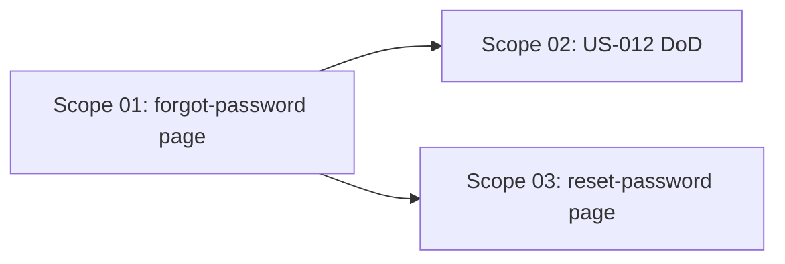

# 🚀 EXPANSION: 006-password-recovery

> **Status:** SUPERSEDED — Reemplazado por `007-password-recovery-custom-email`
> Los scopes están DONE pero la implementación fue reemplazada: Firebase `sendPasswordResetEmail` descartado a favor de email service propio en `api/`. Ver `007-password-recovery-custom-email`.
> [← planning/README.md](../../README.md)

---

## Scope Summary

| # | Scope | SDLC Phase(s) | Depends On | Status |
|---|-------|--------------|------------|--------|
| 01 | Página `/forgot-password` y enlace desde `/login` | D / S | — | DONE |
| 02 | Documentar US-012 como implementada | DO | 01 | DONE |
| 03 | Página custom `/reset-password` (Opción B) | D / S | 01 | DONE |

---

## Dependency Map

---

## Impact per Repository Area

| Code | Area | Affected? | What changes |
|------|------|----------|-------------|
| DO | `docs/` | ☑ | Definition of Done de US-012 marcada |
| WB | `web/` | ☑ | Nueva ruta `/forgot-password`, enlace en `/login` actualizado, tests |
| AP | `api/` | ☐ | Sin cambios |
| AG | `agents/` | ☐ | Sin cambios |
| IN | `infra/` | ☐ | Sin cambios |
| W | `.planning/` | ☑ | Este planning |

---

## Notes

- Firebase Auth SDK envía el correo directamente desde el cliente — sin API call al backend.
- El mensaje de confirmación debe ser neutral (no revelar si el correo existe) para evitar user enumeration.
- Usar `FieldWithHelper` + RHF + Zod como exige la regla de diseño de formularios.
- Layout debe seguir el mismo estilo de columna izquierda que `/login` y `/register` (panel Sprout a la derecha).

---

> [← planning/README.md](../../README.md)
