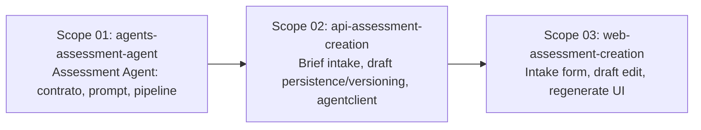

# 🚀 EXPANSION: 008-assessment-creation

> **Status:** Expansion
> [← planning/README.md](../../README.md)

---

## Scope Summary

| # | Scope | Área | Depends On | Status |
|---|-------|------|------------|--------|
| 01 | agents-assessment-agent | AG | — | PENDING |
| 02 | api-assessment-creation | AP | 01 | PENDING |
| 03 | web-assessment-creation | WB | 02 | PENDING |

> `docs/` no requiere scope — US-010, US-011, US-012 ya fueron enriquecidos (DoD, Technical Notes, Dependencies, Complexity) vía `/us-enrich` antes de esta expansión.
> `infra/` no requiere scope — Cloud Run, Artifact Registry, IAM (incluyendo `aiplatform.user` para la SA de `agents/`) y Secret Manager ya están provisionados en `infra/terraform/environments/demo/` para los tres servicios; esta planning extiende servicios existentes, no introduce uno nuevo.

Stories covered: **US-010** Assessment Brief Intake (P0), **US-011** Assessment Draft Generation (P0), **US-012** Assessment Draft Regeneration (P1) — `docs/02-product/user-stories/epic-02-assessment-creation/`.

---

## Dependency Map

> **S01** se construye primero porque define el contrato `AssessmentCommand` / `AssessmentResult` que `api/` consume — sin agentes no hay qué integrar.
> **S02** espera S01 para invocar el agente real vía `agentclient`, aunque el modelo de persistencia (brief, draft, versionado) puede diseñarse en paralelo usando el contrato documentado.
> **S03** espera S02 porque el formulario de intake y la vista de draft consumen los endpoints reales del API.

---

## Impact per Repository Area

| Code | Area | Affected? | What changes |
|------|------|----------|-------------|
| DO | `docs/` | ☐ | Sin cambios — US-010/011/012 ya enriquecidos |
| WB | `web/` | ☑ | Intake form (learning goal, topic, level/difficulty, duración, lenguaje) con React Hook Form + Zod; vista de draft editable (title, context, instructions, objectives, deliverables, constraints); acción de regeneración con adjustment notes; vista de versiones previas |
| AP | `api/` | ☑ | Entidad + migración Flyway para `AssessmentBrief`; entidad + migración para `AssessmentDraft` versionado; endpoints de intake, generación y regeneración; integración con `agents/` vía `agentclient`; persistencia de `AgentExecutionLog` por cada ejecución |
| AG | `agents/` | ☑ | Assessment Agent: contrato `AssessmentCommand`/`AssessmentResult`, prompt versionado `.st` (soporta adjustment notes opcionales para regeneración), pipeline fijo (validar → cargar → envelope → Gemini → validar output → log → retornar) |
| IN | `infra/` | ☐ | Verificado — sin cambios necesarios (ver nota arriba) |
| W | `.planning/` | ☑ | Este planning |

---

## Notes

- **Orden de construcción bottom-up:** a diferencia de plannings previos (auth-only), esta es la primera planning que toca `agents/`. El contrato de agente se define primero (S01) para que `api/` (S02) y `web/` (S03) integren contra una interfaz estable.
- **Persistencia antes de invocar al agente (US-010 DoD):** el brief debe guardarse en su propia transacción/request, separada y previa a la que invoca al agente — así una falla del agente no pierde el input del profesor.
- **Versionado de drafts (US-012):** cada regeneración crea una nueva versión enlazada al draft/assessment original; la versión previa nunca se sobreescribe ni se borra, y debe seguir siendo recuperable.
- **`AgentExecutionLog` por ejecución:** tanto la generación inicial (US-011) como cada regeneración (US-012) producen su propio registro (modelo, costo estimado, status) — son ejecuciones distintas, no se comparten logs.
- **Convención de formularios:** todo formulario en `web/` usa React Hook Form + Zod (`zodResolver`), nunca validación nativa HTML — regla ya establecida en el proyecto.
- **Gemini API key server-side only:** la invocación del Assessment Agent ocurre exclusivamente en `agents/`; la key nunca se expone al frontend.
- **P1 dentro del mismo scope:** US-012 (regeneración, P1) no obtiene un scope propio — comparte capas con US-011 (mismo contrato de agente, mismo modelo de persistencia extendido con versionado, misma UI de draft extendida con la acción de regenerar). Si se requiere despriorizar, las tareas de regeneración pueden diferirse dentro de cada scope sin bloquear US-010/US-011.

---

> [← planning/README.md](../../README.md)
