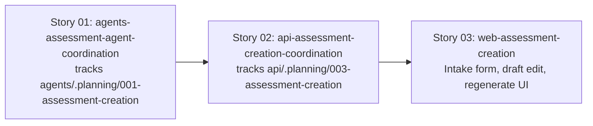

# 🚀 EXPANSION: 008-assessment-creation

> **Status:** Expansion
> [← planning/README.md](../../README.md)

---

## Story Summary

| # | Story | Área | Depends On | Risk | External Issue | Status |
|---|-------|------|------------|------|----------------|--------|
| 01 | agents-assessment-agent-coordination | AG | — | M | — | TODO |
| 02 | api-assessment-creation-coordination | AP | 01 | M | — | TODO |
| 03 | web-assessment-creation | WB | 02 | L | — | TODO |

> **Correction (2026-07-09):** Stories 01 and 02 were originally scoped in this root planning as full implementation stories. That violated the monorepo parent/child coordination rule — `agents/` and `api/` each have (or now have) their own `.planning/` workspace, so their implementation must live in a child planning there, not duplicated in the parent. Both were converted to coordination stories; see `Linked Child Plannings` below for where the real implementation tasks now live.
>
> `docs/` no requiere story — US-010, US-011, US-012 ya fueron enriquecidos (DoD, Technical Notes, Dependencies, Complexity) vía `/us-enrich` antes de esta expansión.
> `infra/` no requiere story — Cloud Run, Artifact Registry, IAM (incluyendo `aiplatform.user` para la SA de `agents/`) y Secret Manager ya están provisionados en `infra/terraform/environments/demo/` para los tres servicios; esta planning extiende servicios existentes, no introduce uno nuevo.

Stories covered: **US-010** Assessment Brief Intake (P0), **US-011** Assessment Draft Generation (P0), **US-012** Assessment Draft Regeneration (P1) — `docs/02-product/user-stories/epic-02-assessment-creation/`.

---

## Dependency Map

> **S01** tracks the child planning that defines the `AssessmentCommand` / `AssessmentResult` contract — `api/` cannot integrate against a real agent until it's ready.
> **S02** tracks the child planning that builds brief/draft persistence and calls the agent via `agentclient`; it depends on S01's child planning reaching a stable contract.
> **S03** (implemented directly in this root planning — `web/` has no child `.planning/`) depends on S02's child planning exposing real endpoints.

---

## Impact per Repository Area

| Code | Area | Affected? | What changes |
|------|------|----------|-------------|
| DO | `docs/` | ☐ | Sin cambios — US-010/011/012 ya enriquecidos |
| WB | `web/` | ☑ | Intake form (learning goal, topic, level/difficulty, duración, lenguaje) con React Hook Form + Zod; vista de draft editable (title, context, instructions, objectives, deliverables, constraints); acción de regeneración con adjustment notes; vista de versiones previas — **implemented directly in this planning (Story 03)** |
| AP | `api/` | ☑ | Entidad + migración Flyway para `AssessmentBrief`; entidad + migración para `AssessmentDraft` versionado; endpoints de intake, generación y regeneración; integración con `agents/` vía `agentclient`; persistencia de `AgentExecutionLog` por cada ejecución — **implemented in child planning `api/.planning/003-assessment-creation`, tracked here via Story 02** |
| AG | `agents/` | ☑ | Assessment Agent: contrato `AssessmentCommand`/`AssessmentResult`, prompt versionado `.st` (soporta adjustment notes opcionales para regeneración), pipeline fijo (validar → cargar → envelope → Gemini → validar output → log → retornar) — **implemented in child planning `agents/.planning/001-assessment-creation`, tracked here via Story 01** |
| IN | `infra/` | ☐ | Verificado — sin cambios necesarios (ver nota arriba) |
| W | `.planning/` | ☑ | Este planning + 2 child plannings creados (`api/.planning/003-assessment-creation`, `agents/.planning/001-assessment-creation`) |

---

## Linked Child Plannings

Use this section when a parent monorepo planning coordinates work owned by child artifact workspaces. Child implementation must live in each child's own worktree and `./.planning/`; the parent keeps only synchronization and parent-scope work. Under git, preserve the child worktree prefix before the story/task branch name, for example `gradeops-agents/story-01-assessment-agent`.

| Child Worktree | Child Branch | Child Planning | Ownership | Sync Notes | Status |
|----------------|--------------|----------------|-----------|------------|--------|
| `../gradeops-agents` (`agents/`) | `gradeops-agents/story-01-assessment-agent` | [001-assessment-creation](../../../agents/.planning/active/001-assessment-creation/README.md) | child | Defines `AssessmentCommand`/`AssessmentResult` contract and the internal endpoint `api/` calls via `agentclient`. Must reach a stable contract before `api/`'s child planning can integration-test against a real agent. | TODO |
| `../gradeops-api` (`api/`) | `gradeops-api/story-01-assessment-creation-persistence` | [003-assessment-creation](../../../api/.planning/active/003-assessment-creation/README.md) | child | Persists brief/draft, calls `agents/` via `agentclient`, exposes the endpoints `web/` (Story 03) consumes. Depends on the `agents/` child planning's contract. | TODO |

`agents/.planning/` did not exist before this correction — it was initialized via `/plan-init` (area `AG` → `src/`) specifically so this work could be owned there instead of duplicated in this root planning. `api/.planning/` already existed (with prior plannings `001-hexagonal-refactor`, `002-drop-old-password-recovery-requests`); `003-assessment-creation` is the next planning in that workspace's own sequence.

---

## Notes

- **Orden de construcción bottom-up:** esta es la primera planning que toca `agents/`. El contrato de agente se define primero (child planning de `agents/`) para que `api/` (child planning) y `web/` (Story 03, este planning) integren contra una interfaz estable.
- **Persistencia antes de invocar al agente (US-010 DoD):** el brief debe guardarse en su propia transacción/request, separada y previa a la que invoca al agente — así una falla del agente no pierde el input del profesor. Detallado en `api/.planning/003-assessment-creation`.
- **Versionado de drafts (US-012):** cada regeneración crea una nueva versión enlazada al draft/assessment original; la versión previa nunca se sobreescribe ni se borra. Detallado en `api/.planning/003-assessment-creation`.
- **`AgentExecutionLog` por ejecución:** tanto la generación inicial (US-011) como cada regeneración (US-012) producen su propio registro (modelo, costo estimado, status) — son ejecuciones distintas, no se comparten logs.
- **Convención de formularios:** todo formulario en `web/` usa React Hook Form + Zod (`zodResolver`), nunca validación nativa HTML — regla ya establecida en el proyecto.
- **Gemini API key server-side only:** la invocación del Assessment Agent ocurre exclusivamente en `agents/`; la key nunca se expone al frontend.
- **P1 dentro del mismo story:** US-012 (regeneración, P1) no obtiene un story propio en ningún workspace — comparte capas con US-011 en ambos child plannings.

---

## Risk Register

| ID | Risk | Impact | Likelihood | Mitigation | Owner | Status |
|----|------|--------|------------|------------|-------|--------|
| R-01 | Assessment Agent structured output from Gemini is malformed or drifts from the expected schema | M | M | Tracked and mitigated in `agents/.planning/001-assessment-creation` (schema validation before returning to `api/`) | agents/ owner | Open |
| R-02 | Draft versioning model is under-designed and regeneration silently overwrites a previous version | H | L | Tracked and mitigated in `api/.planning/003-assessment-creation` (DoD requires previous versions retrievable, covered by integration test) | api/ owner | Open |
| R-03 | Coordination drift between the two child plannings and this parent (e.g. contract changes not reflected on both sides) | M | M | Update this table's `Sync Notes` whenever either child planning's contract or endpoint shape changes | parent owner | Open |

Use `L`, `M`, or `H` for impact and likelihood. Carry high risks into the related story and task files.

---

## External Issue Mapping

| Story | External System | External ID / URL | Sync Notes |
|-------|-----------------|-------------------|------------|
| 01 | — | — | — |
| 02 | — | — | — |
| 03 | — | — | — |

---

> [← planning/README.md](../../README.md)
