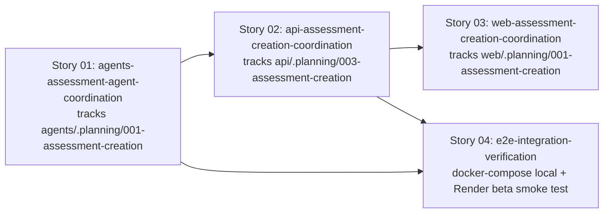

# 🚀 EXPANSION: 008-assessment-creation

> **Status:** Expansion
> [← planning/README.md](../../README.md)

---

## Story Summary

| # | Story | Área | Depends On | Risk | External Issue | Status |
|---|-------|------|------------|------|----------------|--------|
| 01 | agents-assessment-agent-coordination | AG | — | M | — | IN PROGRESS |
| 02 | api-assessment-creation-coordination | AP | 01 | M | — | IN PROGRESS |
| 03 | web-assessment-creation-coordination | WB | 02 | L | — | TODO |
| 04 | e2e-integration-verification | IN | 01, 02 | M | — | DONE |
| 05 | automated-cross-service-test-suite | IN | 01, 02, 04 | M | — | TODO |

> **Correction (2026-07-09, extended 2026-07-14):** Stories 01 and 02 were originally scoped in this root planning as full implementation stories. That violated the monorepo parent/child coordination rule — `agents/` and `api/` each have (or now have) their own `.planning/` workspace, so their implementation must live in a child planning there, not duplicated in the parent. Both were converted to coordination stories; see `Linked Child Plannings` below for where the real implementation tasks now live. **Story 03 received the same correction on 2026-07-14** — `web/` now has its own `.planning/` workspace (`web/.planning/active/001-assessment-creation`), and Story 03's original 6-task implementation breakdown was moved there unchanged; this story is now a coordination story like 01 and 02.
>
> `docs/` no requiere story — US-010, US-011, US-012 ya fueron enriquecidos (DoD, Technical Notes, Dependencies, Complexity) vía `/us-enrich` antes de esta expansión.
> `infra/` no requiere story — Cloud Run, Artifact Registry, IAM (incluyendo `aiplatform.user` para la SA de `agents/`) y Secret Manager ya están provisionados en `infra/terraform/environments/demo/` para los tres servicios; esta planning extiende servicios existentes, no introduce uno nuevo.
>
> **Story 04 added 2026-07-14** (post-initial-expansion discovery): both child coordination stories (01, 02) verify their own child planning's Done Criteria, but neither proves `api/` can actually reach `agents/` over the network — `api/003`'s own test suite mocks `AssessmentAgentClient` at every layer (unit tests, integration tests, the full end-to-end flow test), so no automated test anywhere exercises a real HTTP call between the two services. Story 04 closes that gap directly at the root level, since no single child workspace owns cross-service reachability — same reasoning as Story 03 being implemented directly here. No new Terraform/infra resources are introduced (root `compose.yml` and the already-documented Render `beta` environment, not `infra/terraform/`), area `IN` reflects the deployment/reachability nature of the work, not a literal `infra/` directory match.

Stories covered: **US-010** Assessment Brief Intake (P0), **US-011** Assessment Draft Generation (P0), **US-012** Assessment Draft Regeneration (P1) — `docs/02-product/user-stories/epic-02-assessment-creation/`.

---

## Dependency Map

> **S01** tracks the child planning that defines the `AssessmentCommand` / `AssessmentResult` contract — `api/` cannot integrate against a real agent until it's ready.
> **S02** tracks the child planning that builds brief/draft persistence and calls the agent via `agentclient`; it depends on S01's child planning reaching a stable contract.
> **S03** tracks the child planning (`web/.planning/active/001-assessment-creation`) that builds the intake/draft/regenerate/version-history UI; it depends on S02's child planning exposing real endpoints. **As of 2026-07-14, `web/` has its own `.planning/` workspace — S03 is a coordination story, not an implementation story, same as S01/S02.**
> **S04** (implemented directly in this root planning — no single child workspace owns cross-service reachability) depends on both S01 and S02's child plannings being functionally complete, since it proves the real network path between the services they each built in isolation.

---

## Impact per Repository Area

| Code | Area | Affected? | What changes |
|------|------|----------|-------------|
| DO | `docs/` | ☐ | Sin cambios — US-010/011/012 ya enriquecidos |
| WB | `web/` | ☑ | Intake form (learning goal, topic, level/difficulty, duración, lenguaje) con React Hook Form + Zod; vista de draft editable (title, context, instructions, objectives, deliverables, constraints); acción de regeneración con adjustment notes; vista de versiones previas — **implemented in child planning `web/.planning/001-assessment-creation`, tracked here via Story 03** |
| AP | `api/` | ☑ | Entidad + migración Flyway para `AssessmentBrief`; entidad + migración para `AssessmentDraft` versionado; endpoints de intake, generación y regeneración; integración con `agents/` vía `agentclient`; persistencia de `AgentExecutionLog` por cada ejecución — **implemented in child planning `api/.planning/003-assessment-creation`, tracked here via Story 02** |
| AG | `agents/` | ☑ | Assessment Agent: contrato `AssessmentCommand`/`AssessmentResult`, prompt versionado `.st` (soporta adjustment notes opcionales para regeneración), pipeline fijo (validar → cargar → envelope → Gemini → validar output → log → retornar) — **implemented in child planning `agents/.planning/001-assessment-creation`, tracked here via Story 01** |
| IN | `infra/` | ☑ | Sin nuevos recursos Terraform — Story 04 agrega el servicio `agents` al `compose.yml` raíz (ausente hoy) y un smoke check contra el ambiente `beta` ya documentado en `docs/04-architecture/beta-environment-design.md` (Render, auto-deploy on push) — **implemented directly in this planning (Story 04)** |
| W | `.planning/` | ☑ | Este planning + 3 child plannings creados (`api/.planning/003-assessment-creation`, `agents/.planning/001-assessment-creation`, `web/.planning/001-assessment-creation`) |

---

## Linked Child Plannings

Use this section when a parent monorepo planning coordinates work owned by child artifact workspaces. Child implementation must live in each child's own worktree and `./.planning/`; the parent keeps only synchronization and parent-scope work. Under git, preserve the child worktree prefix before the story/task branch name, for example `gradeops-agents/story-01-assessment-agent`.

| Child Worktree | Child Branch | Child Planning | Ownership | Sync Notes | Status |
|----------------|--------------|----------------|-----------|------------|--------|
| `../gradeops-agents` (`agents/`) | `gradeops-agents/story-01-assessment-agent` | [001-assessment-creation](../../../agents/.planning/active/001-assessment-creation/README.md) | child | Defines `AssessmentCommand`/`AssessmentResult` contract and the internal endpoint `api/` calls via `agentclient`. Must reach a stable contract before `api/`'s child planning can integration-test against a real agent. | DONE (2026-07-12) — story-01 `assessment-agent` DONE, all tasks and Done Criteria complete; child planning itself still open (Deepening) pending archive |
| `../gradeops-api` (`api/`) | `gradeops-api/story-01-assessment-creation-persistence` | [003-assessment-creation](../../../api/.planning/finished/003-assessment-creation/README.md) | child | Persists brief/draft, calls `agents/` via `agentclient`, exposes the endpoints `web/` (Story 03) consumes. Depends on the `agents/` child planning's contract. | DONE (2026-07-14) — story-01 `assessment-creation-persistence` DONE, 11/11 tasks, PR #44 merged; child planning archived to `api/.planning/finished/`. Note: `api/`'s own tests mock the `agents/` HTTP call — real cross-service reachability is not yet proven, tracked by this planning's new Story 04. |
| `../gradeops-web` (`web/`) | `gradeops-web/story-01-assessment-creation-ui` | [001-assessment-creation](../../../web/.planning/active/001-assessment-creation/README.md) | child | Builds the intake form, draft view/edit, regenerate action, and version history UI. Depends on `api/`'s child planning exposing real endpoints — already `DONE`, so no "wait for the contract to stabilize" risk exists here the way it did for `api/`. | TODO — `web/.planning/` initialized 2026-07-14, Story 01 (`assessment-creation-ui`) dimensioned but not yet atomized |

`agents/.planning/` did not exist before this correction — it was initialized via `/plan-init` (area `AG` → `src/`) specifically so this work could be owned there instead of duplicated in this root planning. `api/.planning/` already existed (with prior plannings `001-hexagonal-refactor`, `002-drop-old-password-recovery-requests`); `003-assessment-creation` is the next planning in that workspace's own sequence. `web/.planning/` did not exist before 2026-07-14 — initialized via `/plan-init` (area `WB` → `src/`) the same way `agents/.planning/` was, specifically to own Story 03's implementation instead of duplicating it here.

---

## Notes

- **Orden de construcción bottom-up:** esta es la primera planning que toca `agents/`. El contrato de agente se define primero (child planning de `agents/`) para que `api/` (child planning) y `web/` (child planning, tracked via Story 03) integren contra una interfaz estable.
- **Persistencia antes de invocar al agente (US-010 DoD):** el brief debe guardarse en su propia transacción/request, separada y previa a la que invoca al agente — así una falla del agente no pierde el input del profesor. Detallado en `api/.planning/003-assessment-creation`.
- **Versionado de drafts (US-012):** cada regeneración crea una nueva versión enlazada al draft/assessment original; la versión previa nunca se sobreescribe ni se borra. Detallado en `api/.planning/003-assessment-creation`.
- **`AgentExecutionLog` por ejecución:** tanto la generación inicial (US-011) como cada regeneración (US-012) producen su propio registro (modelo, costo estimado, status) — son ejecuciones distintas, no se comparten logs.
- **Convención de formularios:** todo formulario en `web/` usa React Hook Form + Zod (`zodResolver`), nunca validación nativa HTML — regla ya establecida en el proyecto.
- **Gemini API key server-side only:** la invocación del Assessment Agent ocurre exclusivamente en `agents/`; la key nunca se expone al frontend.
- **P1 dentro del mismo story:** US-012 (regeneración, P1) no obtiene un story propio en ningún workspace — comparte capas con US-011 en ambos child plannings.

---

## Risk Register

| ID | Risk | Impact | Likelihood | Mitigation | Owner | Status |
|----|------|--------|------------|------------|-------|--------|
| R-01 | Assessment Agent structured output from Gemini is malformed or drifts from the expected schema | M | M | Tracked and mitigated in `agents/.planning/001-assessment-creation` (schema validation before returning to `api/`) | agents/ owner | Open |
| R-02 | Draft versioning model is under-designed and regeneration silently overwrites a previous version | H | L | Tracked and mitigated in `api/.planning/003-assessment-creation` (DoD requires previous versions retrievable, covered by integration test) | api/ owner | Open |
| R-03 | Coordination drift between the two child plannings and this parent (e.g. contract changes not reflected on both sides) | M | M | Update this table's `Sync Notes` whenever either child planning's contract or endpoint shape changes | parent owner | Open |
| R-04 | Both child plannings' automated test suites mock the `api/`↔`agents/` network call at every layer — no test today proves the real HTTP path works, only that each side's own logic is individually correct | M | M | Story 04 closes this directly: a real docker-compose run and a real Render `beta` post-deploy smoke check, neither relying on mocks | parent owner | Open |

Use `L`, `M`, or `H` for impact and likelihood. Carry high risks into the related story and task files.

---

## External Issue Mapping

| Story | External System | External ID / URL | Sync Notes |
|-------|-----------------|-------------------|------------|
| 01 | — | — | — |
| 02 | — | — | — |
| 03 | — | — | — |
| 04 | — | — | — |
| 05 | — | — | — |

---

> [← planning/README.md](../../README.md)
