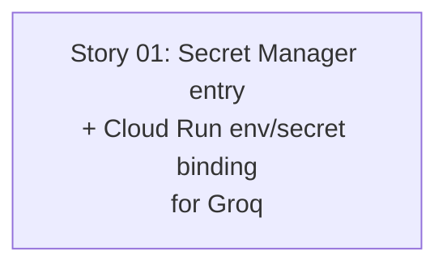

# 🚀 EXPANSION: 009-groq-infra-provisioning

> **Status:** Expansion
> [← planning/README.md](../../README.md)

---

## Story Summary

| # | Story | SDLC Phase(s) | Depends On | Risk | External Issue | Status |
|---|-------|--------------|------------|------|----------------|--------|
| 01 | [Cloud Run / Secret Manager provisioning for Groq credentials](02-deepening/story-01-groq-infra-provisioning.md) | IN | — | L | — | TODO |

---

## Dependency Map

---

## Impact per Repository Area

| Code | Area | Affected? | What changes |
|------|------|----------|-------------|
| DO | `docs/` | ☐ | — |
| WB | `web/` | ☐ | — |
| AP | `api/` | ☐ | — |
| AG | `agents/` | ☐ | — (already DONE in `002-groq-genai-provider`; consumed here read-only for env-var names/shape) |
| IN | `infra/` | ☑ | Secret Manager entry for the Groq API key, Cloud Run env var/secret binding for the existing `agents/` service — no new Cloud Run service, since this modifies an already-provisioned service |
| W | `.planning/` | ☑ | This planning; coordination note added to `agents/.planning/active/002-groq-genai-provider` |

---

## Linked Child Plannings

*N/A — `infra/` has no `.planning/` workspace of its own (verified 2026-07-12), so this parent planning owns the Terraform implementation directly rather than delegating to a child. `agents/002-groq-genai-provider` is a sibling child planning this work depends on (already DONE) — not a child of this planning.*

---

## Notes

- **Origin:** this planning's single story was originally story-02 of `agents/.planning/active/002-groq-genai-provider` (worktree `../gradeops-agents`). Relocated here 2026-07-12 at explicit human direction, since `infra/`-only work with no dedicated child workspace belongs in the parent planning, not inside a sibling child's (`agents/`) planning tree. Objective, Risk, Tasks, and Done Criteria are carried forward unchanged from the original story file.
- `agents/`'s story-01 (the Groq adapter, provider/model selection, `GRADEOPS_*` env var naming) is `DONE` and merged (`develop` PR #39) — the env var names this story wires into Terraform are final, not subject to further drift.
- Terraform apply against `demo` is a real, shared-state operation — plan review with the human is required before any apply, same as this project's other infra work.

---

## Risk Register

| ID | Risk | Impact | Likelihood | Mitigation | Owner | Status |
|----|------|--------|------------|------------|-------|--------|
| R-01 | Terraform apply against `demo` environment is a real, shared-state operation | M | L | Run `terraform plan` and review the diff with the human before any `terraform apply`; this is a destructive/hard-to-reverse-adjacent action per this project's execution-care rules | infra/ owner | Open |

Use `L`, `M`, or `H` for impact and likelihood. Carry high risks into the related story and task files.

---

## External Issue Mapping

| Story | External System | External ID / URL | Sync Notes |
|-------|-----------------|-------------------|------------|
| 01 | — | — | — |

---

> [← planning/README.md](../../README.md)
