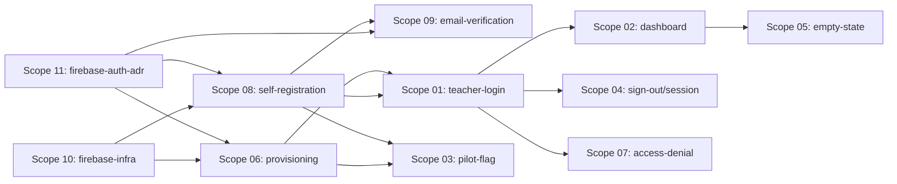

# 🚀 EXPANSION: Teacher Onboarding and Workspace

> **Status:** Expansion
> [← planning/README.md](../../README.md)

---

## Scope Summary

| # | Scope | Area(s) | Priority | Depends On | Status |
|---|-------|---------|----------|------------|--------|
| 01 | teacher-login | WB, AP | P0 | 06 or 08 | PENDING |
| 02 | assessment-dashboard | WB, AP | P0 | 01 | PENDING |
| 03 | pilot-account-flag | AP | P1 | 06 or 08 | PENDING |
| 04 | sign-out-session-expiry | WB, AP | P1 | 01 | PENDING |
| 05 | dashboard-empty-state | WB | P1 | 02 | PENDING |
| 06 | teacher-account-provisioning | AP | P0 | 10, 11 | PENDING |
| 07 | cross-teacher-access-denial | AP | P0 | 01 | PENDING |
| 08 | teacher-self-registration | WB, AP | P0 | 10, 11 | PENDING |
| 09 | email-verification | WB, AP | P0 | 08, 11 | PENDING |
| 10 | firebase-identity-platform-setup | IN | P0 | — | TODO |
| 11 | firebase-auth-adr | DO | P0 | — | TODO |

---

## Dependency Map

---

## Impact per Repository Area

| Code | Area | Affected? | What changes |
|------|------|----------|-------------|
| DO | `docs/` | ☑ | ADR for Firebase Authentication decision |
| WB | `web/` | ☑ | Registration, verification, sign-in/out, dashboard, empty state |
| AP | `api/` | ☑ | Token validation, teacher records, aggregation endpoint, isolation, pilot flags |
| AG | `agents/` | ☐ | — (no AI agents in this epic) |
| IN | `infra/` | ☑ | Firebase / Identity Platform Terraform provisioning |
| W | `.planning/` | ☑ | This planning + traceability |

---

## Notes

- Identity provider: Firebase Authentication (Google Identity Platform). Email verification uses the native link flow (`email_verified` claim), not a custom OTP.
- Self-registration (scope-08) and operator provisioning (scope-06) coexist; both produce the same teacher record.
- No `AgentExecutionLog` requirements in this epic — no AI agents involved (per epic DoD).
- All 9 source stories are fully enriched (DoD, Technical Notes, Dependencies, Complexity); scopes were synced accordingly — no `[inferred]` markers remain.
- **Open decisions** (operator access mechanism, pre-verified email for provisioned accounts, session expiry strategy) are closed by the ADR in scope-11 — execute it before scopes 03/04/06/08/09.
- Scope-10 extracts the Firebase provisioning work that scope-08 previously carried as an external dependency; scope-08 is now WB+AP only.

---

## Source

Generated from `docs/02-product/user-stories/epic-01-teacher-onboarding/` (9 stories → 9 scopes, no filter) on 2026-06-12.

---

> [← planning/README.md](../../README.md)
