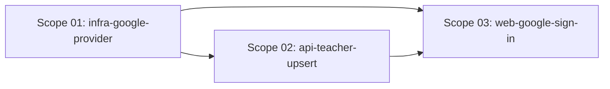

# 🚀 EXPANSION: 002-google-sign-in

> **Status:** Expansion
> [← planning/README.md](../../README.md)

---

## Scope Summary

| # | Scope | Area(s) | Priority | Depends On | Status |
|---|-------|---------|----------|------------|--------|
| 01 | infra-google-provider | IN | P0 | — | DONE |
| 02 | api-teacher-upsert | AP | P0 | 01 | DONE |
| 03 | web-google-sign-in | WB | P0 | 01, 02 | DONE |

---

## Dependency Map

---

## Impact per Repository Area

| Code | Area | Affected? | What changes |
|------|------|----------|-------------|
| DO | `docs/` | ☑ | US-011 already written — no further changes |
| WB | `web/` | ☑ | Google sign-in button on /login and /register; AuthGuard bypass for Google-authenticated users |
| AP | `api/` | ☑ | Upsert teacher record by Firebase UID on first Google sign-in |
| AG | `agents/` | ☐ | — (no AI agents involved) |
| IN | `infra/` | ☑ | `google_identity_platform_default_supported_idp_config` for Google provider in demo environment |
| W | `.planning/` | ☑ | This planning + traceability |

---

## Notes

- The Firebase Google provider is already enabled in the Firebase console; scope-01 is the IaC alignment to match that state in Terraform.
- The API token verification path is unchanged — Google ID tokens are verified identically to email/password tokens via Firebase Admin SDK / JWKS. Only the teacher upsert logic is new.
- Google-authenticated users have `emailVerified: true` by default; the `AuthGuard` check must account for this to avoid sending Google users to `/verify-email`.
- "Sign in with Google" appears **alongside** (not replacing) the email/password form on both `/login` and `/register`.
- No `AgentExecutionLog` required — no AI agents involved.
- Source: US-011 (`docs/02-product/user-stories/epic-01-teacher-onboarding/11-google-sign-in.md`)

---

> [← planning/README.md](../../README.md)
