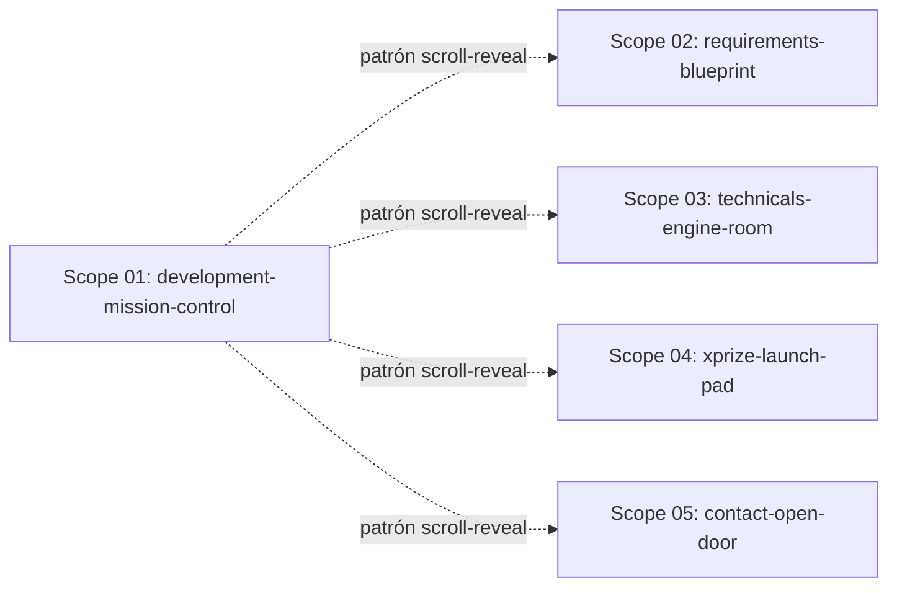

# 🚀 EXPANSION: 004-subpage-identity

> **Status:** Expansion
> [← planning/README.md](../../../README.md)

---

## Scope Summary

| # | Scope | Area | Depends On | Status |
|---|-------|------|------------|--------|
| 01 | development-mission-control | WB | — | DONE |
| 02 | requirements-blueprint | WB | — | DONE |
| 03 | technicals-engine-room | WB | — | DONE |
| 04 | xprize-launch-pad | WB | — | DONE |
| 05 | contact-open-door | WB | — | DONE |

Todos los scopes son independientes entre sí — tocan páginas distintas. El patrón de scroll-reveal (`IntersectionObserver` + `<script is:inline>`) se establece en scope-01 y los demás lo replican.

---

## Dependency Map

> Las flechas punteadas son dependencias de patrón (no bloqueantes). Los scopes 02–05 pueden ejecutarse en paralelo entre sí una vez que el patrón de scroll-reveal está establecido por scope-01.

---

## Impact per Repository Area

| Code | Area | Affected? | What changes |
|------|------|-----------|--------------|
| DO | `docs/` | ☐ | Solo lectura — extracción de contenido, sin modificación |
| WB | `site/` | ☑ | 5 páginas × 2 idiomas (ES + EN) rediseñadas: `src/pages/*.astro` y `src/pages/en/*.astro` |
| AP | `api/` | ☐ | — |
| AG | `agents/` | ☐ | — |
| IN | `infra/` | ☐ | — |
| W | `.planning/` | ☑ | Este planning |

---

## Decisiones Transversales

### Scroll-reveal
- Técnica: `IntersectionObserver` con `<script is:inline>` por página. Sin dependencias npm nuevas.
- Clases CSS controladas por JS: `opacity-0 translate-y-4` → `opacity-100 translate-y-0` con `transition-all duration-500`.
- Respetar `prefers-reduced-motion`: skip transition if `matchMedia('(prefers-reduced-motion: reduce)').matches`.
- Stagger: cada card recibe `transition-delay: Nms` inline al renderizar el array en Astro.

### Idiomas (ES/EN)
- Cada scope modifica **ambas versiones** de la página (`src/pages/[nombre].astro` ES + `src/pages/en/[nombre].astro` EN).
- El contenido nuevo se inline en el archivo (no en i18n) para mantener autonomía por página.
- Contenido: ES en la página raíz, EN en `en/`.

### Fondos / identidad visual
- Los fondos con SVG/gradiente se implementan como `
` decorativo absoluto dentro del `<slot>` de la página. No se modifica el layout `Base.astro`.
- `prefers-reduced-motion` también controla las animaciones de fondo (pulso, partículas, grid).

---

## Notes

- La modificación a `Base.astro` NO es parte de este planning — cada página inyecta su identidad visual de forma autónoma.
- El site es Astro + Tailwind CSS + TypeScript. No hay framework de animación; todo se hace con CSS `transition` + JS inline.
- Las páginas raíz (ES) y `en/` son estructuralmente idénticas pero en idioma distinto. El patrón de modificación es el mismo.

---

> [← planning/README.md](../../../README.md)
