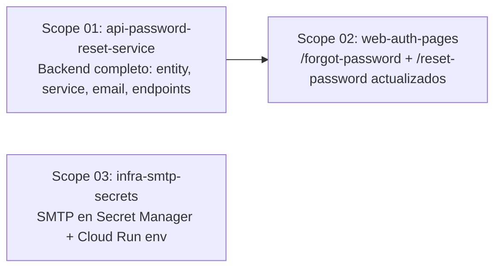

# 🚀 EXPANSION: 007-password-recovery-custom-email

> **Status:** DONE — all scopes completed
> **Supersedes:** `006-password-recovery` (Camino B — sobreescribir encima; las rutas web sobreviven, la lógica interna se reemplaza)
> [← planning/README.md](../../README.md)

---

## Scope Summary

| # | Scope | Área | Depends On | Status |
|---|-------|------|------------|--------|
| 01 | api-password-reset-service | AP | — | DONE |
| 02 | web-auth-pages | WB | 01 | DONE |
| 03 | infra-smtp-secrets | IN | — | DONE |

> `docs/` no requiere scope — ya fue actualizado en la sesión de diseño (US-012, API Reference, spec en `docs/superpowers/specs/`).

---

## Dependency Map

> **S01** y **S03** pueden ejecutarse en paralelo — no tienen dependencia entre sí.
> **S02** espera S01 para poder integrar contra el API real, aunque la implementación puede avanzar en paralelo usando los contratos documentados.

---

## Impact per Repository Area

| Code | Area | Affected? | What changes |
|------|------|----------|-------------|
| DO | `docs/` | ☐ | Sin cambios — ya actualizado |
| WB | `web/` | ☑ | `/forgot-password` (quitar Firebase SDK, llamar API), `/reset-password` (reescritura completa — quitar Firebase, agregar campo email, leer `?code=`, llamar PUT endpoint), nuevo `forgotPassword()` y `resetPassword()` en `lib/api/auth.ts` |
| AP | `api/` | ☑ | `PasswordResetCodeEntity`, `PasswordResetCodeRepository`, `PasswordResetService`, `EmailService`, Thymeleaf template, `GradeOpsEmailProperties`, `GradeOpsWebProperties`, `AuthPort.updatePassword()`, `FirebaseAuthAdapter.updatePassword()`, endpoints `POST /forgot-password` + `PUT /reset-password`, `SecurityConfig` whitelist, Flyway V5, YAML config, tests |
| AG | `agents/` | ☐ | — |
| IN | `infra/` | ☑ | Secretos SMTP en Secret Manager (`smtp-host`, `smtp-port`, `smtp-username`, `smtp-password`, `mail-from`), `GRADEOPS_WEB_BASE_URL` en Cloud Run service del `api/` |
| W | `.planning/` | ☑ | Este planning |

---

## Decisiones Transversales

### Reemplaza pero no revierte (Camino B)
Las páginas `/forgot-password` y `/reset-password` que creó el plan 006 permanecen en `web/`. Su lógica interna (imports de Firebase Auth SDK, `sendPasswordResetEmail`, `verifyPasswordResetCode`, `confirmPasswordReset`) se elimina y reemplaza por llamadas al API propio. No hay dead code al terminar.

### Token propio UUID vs. Firebase oobCode
El backend genera un UUID v4 como token de reset. Se almacena en `password_reset_codes` con TTL de 30 minutos. Un código es single-use — `used_at` se fija al consumirlo. Un teacher solo puede tener un código activo a la vez (upsert con delete previo).

### Firebase Admin SDK solo para `updatePassword`
Firebase Auth SDK sigue usándose en el backend (`AuthPort.updatePassword`) para aplicar el cambio de contraseña, ya que Firebase es el IdP. El frontend deja de llamar a Firebase Auth SDK directamente.

### Mensaje neutral mantenido de 006
El endpoint `POST /forgot-password` siempre retorna 200 — teacher no encontrado, teacher con Google como provider, o teacher con EMAIL_PASSWORD. El mensaje de confirmación en el frontend es siempre el mismo ("Si existe una cuenta con ese correo...").

### `email` como factor adicional en el reset
El `PUT /reset-password` recibe `{ email, password, passwordRepeat }`. El `email` es verificado contra el teacher asociado al código, previniendo que un atacante que obtenga un token (URL) complete el reset sin conocer el email.

---

## Notes

- La spec completa aprobada está en `docs/superpowers/specs/2026-06-21-password-recovery-custom-email-design.md`.
- La spec de implementación de API (con código completo) está en `api/docs/password-reset-implementation.md`.
- Para desarrollo local usar Mailtrap como SMTP sandbox (`sandbox.smtp.mailtrap.io:587`). Las credenciales van en `application-local.yml` o como env vars locales — nunca en `.env` commiteado.
- Flyway: la siguiente migración es `V5__add_password_reset_codes.sql` — verificar cuál es el último número antes de crear el archivo.

---

> [← planning/README.md](../../README.md)
