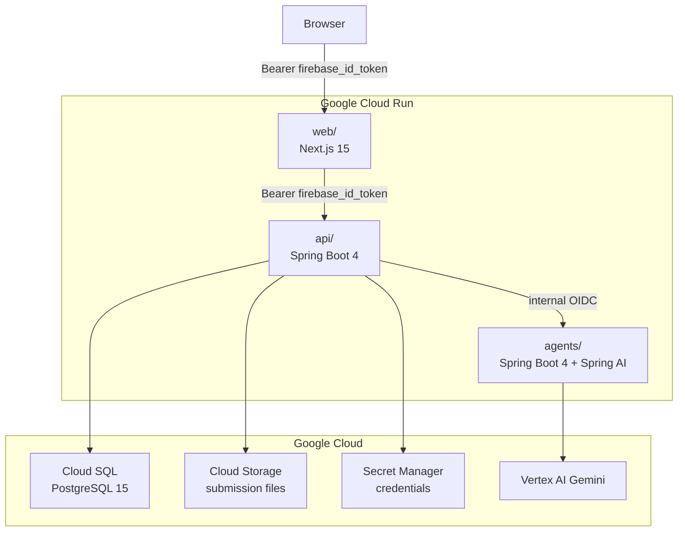

```
 ██████╗ ██████╗  █████╗ ██████╗ ███████╗ ██████╗ ██████╗ ███████╗    █████╗ ██╗
██╔════╝ ██╔══██╗██╔══██╗██╔══██╗██╔════╝██╔═══██╗██╔══██╗██╔════╝   ██╔══██╗██║
██║  ███╗██████╔╝███████║██║  ██║█████╗  ██║   ██║██████╔╝███████╗   ███████║██║
██║   ██║██╔══██╗██╔══██║██║  ██║██╔══╝  ██║   ██║██╔═══╝ ╚════██║   ██╔══██║██║
╚██████╔╝██║  ██║██║  ██║██████╔╝███████╗╚██████╔╝██║     ███████║██╗██║  ██║██║
 ╚═════╝ ╚═╝  ╚═╝╚═╝  ╚═╝╚═════╝ ╚══════╝ ╚═════╝ ╚═╝     ╚══════╝╚═╝╚═╝  ╚═╝╚═╝
```

<div align="center">

**AI-Native Assessment Operations Platform**

`grade-ops-ai` · Monorepo


</div>

---

## What this is

GradeOps AI helps programming educators operate assessment workflows with AI agents — from learning goal through grading, feedback, gap detection, and reports — while keeping teachers in control of every judgment, approval, and student-facing output.

Two assessment modes:

- **Open** — practical code/text submissions; rubric-based AI grading suggestions; teacher approval required before any result is acted on.
- **Closed** — objective questions (TF/SC/MC); AI-native question bank; deterministic grading against a frozen answer key.

---

## Repository structure

This is a **monorepo**. Each subdirectory is a self-contained component of the platform.

| Directory | Component | Stack | README |
|-----------|-----------|-------|--------|
| [`web/`](web/) | Teacher workspace (frontend) | Next.js 15 · TypeScript · Tailwind CSS · Firebase Auth | [web/README.md](web/README.md) |
| [`api/`](api/) | Domain API (backend) | Spring Boot 4 · Java 21 · PostgreSQL · Flyway | [api/README.md](api/README.md) |
| [`agents/`](agents/) | Agent runtime | Spring Boot 4 · Java 21 · Spring AI · Vertex AI Gemini | [agents/README.md](agents/README.md) |
| [`infra/`](infra/) | Cloud infrastructure | Terraform · Google Cloud Run · Cloud SQL · Secret Manager | [infra/README.md](infra/README.md) |
| [`docs/`](docs/) | Product and architecture documentation | Markdown | [docs/README.md](docs/README.md) |

---

## System architecture



- **`web/`** owns the teacher UI and student access pages. It holds no business logic.
- **`api/`** owns all domain state, workflow rules, persistence, and billing. It is the single source of truth.
- **`agents/`** exposes an internal REST API. Each agent receives a command, calls Gemini, and returns a structured result. Agents persist nothing directly.
- **`infra/`** provisions all Google Cloud resources via Terraform. The `demo` environment is the primary hackathon target.

---

## Agent pipeline

Thirteen agents cover both assessment modes. Every run produces a structured `AgentExecutionLog`.

**Open assessment:**
Assessment → Rubric → Grading → Feedback → Learning Gap → Recovery → Teacher Report → Ops Evidence

**Closed assessment:**
Question Generation → Distractor Quality → Ambiguity Review → Assessment Assembly → Item Analytics

Agents generate and suggest — they never finalize scores, silently modify approved rubrics, or deliver output to students without an explicit teacher `ApprovalEvent`.

---

## Local development

### Prerequisites

| Tool | Version |
|------|---------|
| Node.js | 18+ |
| Java | 21 |
| Maven Wrapper | included (`./mvnw`) |
| PostgreSQL | 15+ (local instance) |
| Terraform | 1.5+ (infra only) |
| `gcloud` CLI | latest (for Vertex AI / Secret Manager) |

### Start all services

```bash
docker compose up -d        # local PostgreSQL + any auxiliary containers
```

Then in separate terminals:

```bash
# API
cd api && ./mvnw spring-boot:run -Dspring.profiles.active=local

# Agents
cd agents && ./mvnw spring-boot:run -Dspring.profiles.active=local

# Web
cd web && npm install && npm run dev
```

The teacher workspace is available at `http://localhost:3000`.

### Environment variables

Each component reads its configuration from `application-local.yml` (Java) or `.env.local` (Next.js). See the component READMEs for the full variable list.

- `api/` — database URL, Firebase Admin secret, internal secret header
- `agents/` — Gemini API key, internal secret header, `api/` base URL
- `web/` — Firebase public config (`NEXT_PUBLIC_FIREBASE_*`)

---

## Key rules

- **Teacher approval is explicit.** Every AI-generated output that affects grading, feedback, or student-facing content requires an `ApprovalEvent` before it is acted on.
- **Agents do not own domain entities.** They receive `{Agent}Command`, return `{Agent}Result`, and persist nothing directly. Persistence is the API's responsibility.
- **No student login.** Students access assessments and results via signed token links (`AssessmentInvitation`). `LearnerRef` is a minimal reference record, not an account.
- **Gemini API key is server-side only.** Never expose it to the frontend or commit it to version control.
- **Schema migrations live in `api/src/main/resources/db/migration/`** (Flyway). No undocumented manual schema changes.
- **Types flow from API to Web.** The frontend mirrors API DTO contracts; no independent shared-type definitions.

---

## Documentation

Full product, architecture, and agent documentation lives in [`docs/`](docs/). Start with [`docs/README.md`](docs/README.md) for an index of all sections.
