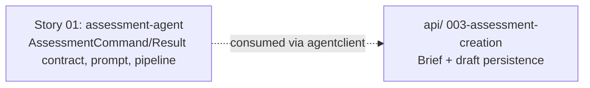

# 🚀 EXPANSION: 001-assessment-creation

> **Status:** Expansion
> [← planning/README.md](../../README.md)

---

## Story Summary

| # | Story | SDLC Phase(s) | Depends On | Risk | External Issue | Status |
|---|-------|--------------|------------|------|----------------|--------|
| 01 | assessment-agent | AG | — | M | — | TODO |

---

## Dependency Map

---

## Impact per Repository Area

| Code | Area | Affected? | What changes |
|------|------|----------|-------------|
| AG | `src/` | ☑ | `AssessmentCommand`/`AssessmentResult` contract, `assessment-generation.st` prompt template, `AssessmentAgentService` (fixed pipeline), structured-output validation, internal REST endpoint |
| W | `.planning/` | ☑ | Este planning |

---

## Linked Child Plannings

*N/A — this is itself a child planning of the monorepo root (`.planning/active/008-assessment-creation/` at the repo root). It has no further child workspaces of its own.*

---

## Notes

- **Child planning of the monorepo root.** This planning implements the `agents/` half of the parent monorepo planning `008-assessment-creation`. Sibling child planning: `api/.planning/003-assessment-creation` (consumes this planning's contract via `agentclient`).
- First planning ever executed in this `agents/.planning/` workspace — no prior Assessment Agent contract exists yet; this story defines it.
- Source stories (root docs repo): `docs/02-product/user-stories/epic-02-assessment-creation/02-assessment-draft-generation.md` (US-011), `03-assessment-draft-regeneration.md` (US-012).
- **Cross-repo consumer:** `api/.planning/003-assessment-creation` depends on this story's contract and internal endpoint. That dependency is tracked by the parent monorepo planning, not expressible directly in this workspace's own tables.

---

## Risk Register

| ID | Risk | Impact | Likelihood | Mitigation | Owner | Status |
|----|------|--------|------------|------------|-------|--------|
| R-01 | Gemini structured output is malformed or drifts from the expected schema | M | M | Schema-validate every response before returning it; reject and surface a clear error rather than returning a malformed result | agents/ owner | Open |

Use `L`, `M`, or `H` for impact and likelihood. Carry high risks into the related story and task files.

---

## External Issue Mapping

| Story | External System | External ID / URL | Sync Notes |
|-------|-----------------|-------------------|------------|
| 01 | — | — | — |

---

> [← planning/README.md](../../README.md)
