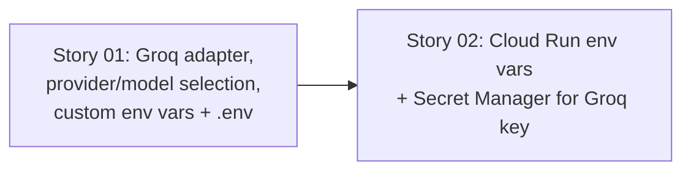

# 🚀 EXPANSION: 002-groq-genai-provider

> **Status:** Expansion
> [← planning/README.md](../../README.md)

---

## Story Summary

| # | Story | SDLC Phase(s) | Depends On | Risk | External Issue | Status |
|---|-------|--------------|------------|------|----------------|--------|
| 01 | [Groq LLM provider adapter and on-demand provider/model selection](02-deepening/story-01-groq-provider-adapter.md) | AG | — | M | — | TODO |
| 02 | [Cloud Run / Secret Manager provisioning for Groq credentials](02-deepening/story-02-groq-infra-provisioning.md) | IN | 01 | L | — | TODO |

---

## Dependency Map

---

## Impact per Repository Area

| Code | Area | Affected? | What changes |
|------|------|----------|-------------|
| DO | `docs/` | ☐ | — |
| WB | `web/` | ☐ | — |
| AP | `api/` | ☐ | — |
| AG | `agents/` | ☑ | New `GroqAssessmentGenerationAdapter` implementing the existing `AssessmentGenerationPort`, a provider/model selection mechanism (config default `groq`, overridable per request), custom `app.agents.*` env-var-driven configuration (not `spring.ai.*` auto-config paths), `.env`-based local/test config loading |
| IN | `infra/` | ☑ | Secret Manager entry for the Groq API key, Cloud Run env var/secret binding for the existing `agents/` service — no new Cloud Run service, since this modifies an already-provisioned service (per `CLAUDE.md`'s infra checklist, only applicable when a service is *introduced*) |
| W | `.planning/` | ☐ | — |

---

## Linked Child Plannings

*N/A — this planning is itself a child workspace of the monorepo root (agents/.planning/), scoped entirely to `agents/` and the `infra/` Terraform it depends on. It has no further child workspaces of its own.*

---

## Notes

- **Not a supersession of `001-assessment-creation`.** Confirmed explicitly with the human: Groq is an additional provider, Gemini's adapter (`GeminiAssessmentGenerationAdapter`) is not removed. `AssessmentGenerationPort` (the existing port interface from `001`) is reused as-is; both providers implement it.
- **Motivation:** `001-assessment-creation`'s story-01 has an open residual — no successful live Gemini call has ever been observed in this environment, blocked on the Google AI Studio account's depleted prepayment credits (see `001-assessment-creation/02-deepening/story-01-assessment-agent.md` Residual #1). Groq gives a free-tier path to unblock live verification while also proving out low-friction provider switching.
- **Default flips to Groq.** Today's config default is Gemini (`app.agents.gemini.enabled`). This planning's default becomes Groq; Gemini remains selectable, not removed. Story 01 must decide and document how a caller opts back into Gemini (config default vs. explicit per-request override) — carried over from `00-initial.md`'s open questions.
- **Per-request provider/model selection is a contract question, not just wiring.** Whether the selector field lives on `AssessmentCommand` (visible to `api/`'s `agentclient`, same cross-repo notification concern as `previousDraft` in `001`) or stays transport-only on `AssessmentController` must be decided as an explicit task-level design fork in story-01, with the human consulted the same way `001` resolved its own three architecture forks (see `001-assessment-creation/RETROSPECTIVE-RAW.md`, 2026-07-10 14:10 entry) — not assumed at this expansion stage.
- Every task in story 01 must be cross-checked against `api/docs/gradeops-ai-java-guidelines/` *before* implementation, not corrected after — this was the single largest source of rework in `001` (four correction rounds on task-01 alone). Apply the guideline-alignment pass during `/plan-atomize`, not reactively per task.
- Groq's chat completions API is OpenAI-compatible; whether Spring AI's OpenAI client (pointed at Groq's base URL) is a clean fit, or whether a raw client is needed, is a story-01 implementation-task decision — not resolved here.
- Manual verification procedure for both providers (direct-to-provider `curl` and local-endpoint `curl`) is documented once, reusably, in [`MANUAL-PROVIDER-TESTING.md`](MANUAL-PROVIDER-TESTING.md) rather than duplicated per task.
- **Future direction, out of scope for this planning:** a per-provider model registry plus a capability-based discovery endpoint (so `api/` can ask "what model for rubric-generation vs. assessment-generation" instead of hardcoding model names) — see story-01's Residual #1.

---

## Risk Register

| ID | Risk | Impact | Likelihood | Mitigation | Owner | Status |
|----|------|--------|------------|------------|-------|--------|
| R-01 | Groq's OpenAI-compatible API may not fully support the structured-output / JSON-mode behavior `GenerateAssessmentDraftHandler` relies on for `AssessmentResult` | M | M | Verify Groq's structured-output support with a real call before committing the adapter's design; add an explicit JSON-parsing fallback layer if native structured output isn't available | agents/ owner | Open |
| R-02 | Introducing `.env`-based config loading adds a new dependency/mechanism whose interaction with Spring profiles (`test`, `beta`, `demo`) is unproven | M | L | Evaluate 1-2 concrete options (e.g. a dotenv-loading library vs. a custom `EnvironmentPostProcessor`) against how `application-test.yml` already excludes AI autoconfiguration, before picking one | agents/ owner | Open |
| R-03 | Gating Groq beans incorrectly could repeat `001`'s `@ConditionalOnBean` ordering bug (passed `contextLoads`, silently 404'd for real requests) | M | M | Reuse the `@ConditionalOnProperty` pattern already fixed and verified in `001` (`AssessmentConfig`/`AssessmentController`) instead of re-deriving a bean-presence conditional from scratch | agents/ owner | Open |

Use `L`, `M`, or `H` for impact and likelihood. Carry high risks into the related story and task files.

---

## External Issue Mapping

| Story | External System | External ID / URL | Sync Notes |
|-------|-----------------|-------------------|------------|
| 01 | — | — | — |
| 02 | — | — | — |

---

> [← planning/README.md](../../README.md)
