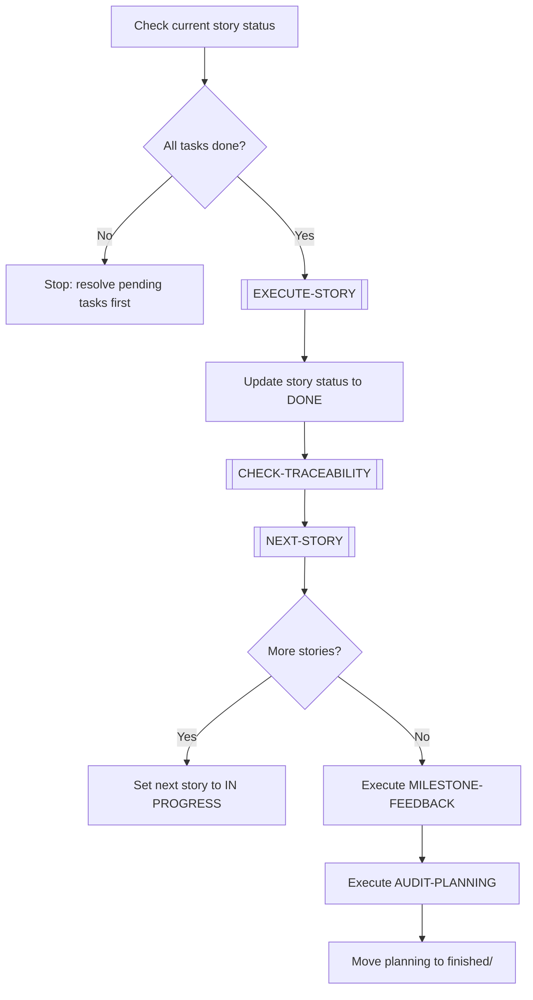

# ADVANCE-PLANNING

> [← README](README.md)

Advances a planning from its current story to the next. Used when the current story in DEEPENING is complete and the next story must begin.

---

---

## Steps

1. Verify all tasks in the current story are completed (outputs exist, criteria met).
2. Execute `[EXECUTE-STORY]` sub-workflow to validate done criteria.
3. Mark current story as `DONE` in its file.
4. Execute `[CHECK-TRACEABILITY]` — ensure all new terms/decisions are recorded.
5. Execute `[NEXT-STORY]` sub-workflow to identify the next pending story.
6. If more stories remain: set next story to `IN PROGRESS`, proceed.
7. If no more stories: execute `MILESTONE-FEEDBACK` → `AUDIT-PLANNING` → archive.

---

**Sub-workflows used:** [`[EXECUTE-STORY]`](../04-SUB-WORKFLOWS/EXECUTE-STORY.md) · [`[CHECK-TRACEABILITY]`](../04-SUB-WORKFLOWS/CHECK-TRACEABILITY.md) · [`[NEXT-STORY]`](../04-SUB-WORKFLOWS/NEXT-STORY.md)

**Leads to:** [`MILESTONE-FEEDBACK`](../03-MAINTENANCE-WORKFLOWS/MILESTONE-FEEDBACK.md) · [`AUDIT-PLANNING`](../03-MAINTENANCE-WORKFLOWS/AUDIT-PLANNING.md)

---

> [← README](README.md)
