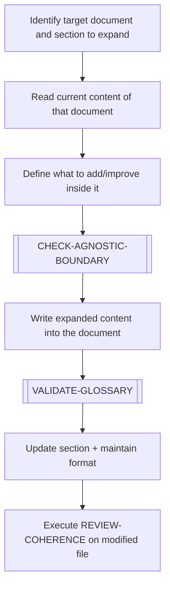

# EXPAND-ELEMENT

> [← README](README.md)

## Cómo invocar

```
@<ruta/al/documento.md> EXPAND-ELEMENT
```
> Sin instrucción adicional: el agente toma el contexto de la conversación actual que tenga
> relación con el documento citado y decide qué secciones expandir y con qué contenido.

```
@<ruta/al/documento.md> EXPAND-ELEMENT — añade ejemplos a la sección Tasks
```

```
@<ruta/al/documento.md> EXPAND-ELEMENT — profundiza los Done Criteria y agrega contenido propuesto
```

---

Deepens the **indicated document** — adding content, examples, sub-sections, or additional context to it. Does not create a new document.

> **The target is the document named in the invocation, not the artefact that document describes.**
> Example: `story-01-api-readme.md EXPAND-ELEMENT` → expand `story-01-api-readme.md` itself
> (add proposed content, sharper criteria, etc.), not `api/README.md`.

---



---

## Steps

1. Identify the exact document and section to expand (the file named in the invocation).
2. Read its current content to understand what exists.
3. Define what will be added, improved, or deepened inside it.
4. Execute `[CHECK-AGNOSTIC-BOUNDARY]` if applicable.
5. Write the expanded content into the document.
6. Execute `[VALIDATE-GLOSSARY]` — check new terminology.
7. Apply `DOCUMENT-STRUCTURE-STANDARD.md` format to new sections.
8. Trigger `REVIEW-COHERENCE` on the modified file.

---

**Sub-workflows used:** [`[CHECK-AGNOSTIC-BOUNDARY]`](../04-SUB-WORKFLOWS/CHECK-AGNOSTIC-BOUNDARY.md) · [`[VALIDATE-GLOSSARY]`](../04-SUB-WORKFLOWS/VALIDATE-GLOSSARY.md)

**Leads to:** [`REVIEW-COHERENCE`](REVIEW-COHERENCE.md)

---

> [← README](README.md)
