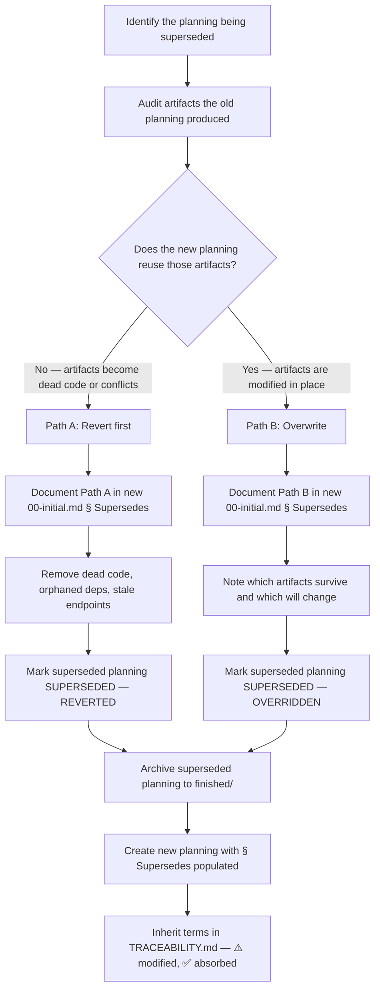

# SUPERSEDE-PLANNING

> [← README](README.md)

Formal process for replacing an active or recently completed planning whose output is being contradicted, migrated away from, or rebuilt by a new planning.

Execute this workflow **before** creating the new planning, not after.

---

## When to use

Execute SUPERSEDE-PLANNING when the new planning meets any of these conditions:

- Its intent mentions the same functional domain as an existing planning.
- It explicitly replaces, discards, or migrates away from something already implemented.
- It modifies files that a previous planning produced as output.

If none of these apply: skip this workflow and proceed with CREATE-PLANNING normally.

---



---

## Steps

### Step 1 — Identify the superseded planning

1. Read the intent of the new planning.
2. Search `.planning/active/` and `.planning/finished/` for plannings that share the same functional domain, mention the same files or features, or whose output the new planning modifies.
3. If no existing planning is identified: stop — this workflow does not apply.
4. State clearly which planning is being superseded before continuing.

---

### Step 2 — Audit artifacts from the superseded planning

1. Read the superseded planning's `01-expansion.md` (story list) and each `02-deepening/story-NN-*.md` (task outputs).
2. Collect the full artifact list: files created, endpoints added, dependencies installed, configurations changed, documents written.
3. For each artifact, classify it:
   - **Reused** — the new planning modifies this artifact in place; it remains in the codebase.
   - **Abandoned** — the new planning does not need this artifact and it will no longer be correct or useful.

---

### Step 3 — Force the path decision

Present the artifact classification and require an explicit decision:

> **Artifact analysis for planning `NNN-old-slug`:**
>
> | Artifact | Classification |
> |----------|----------------|
> | `src/auth/firebase.ts` | Abandoned |
> | `package.json: firebase ^10` | Abandoned |
> | `pages/forgot-password.tsx` | Reused |
> | `pages/reset-password.tsx` | Reused |
>
> **Path A — Revert first:** one or more abandoned artifacts would leave dead code, orphaned dependencies, or a route/endpoint that must not exist after the new planning executes. These must be removed before the new planning begins.
>
> **Path B — Overwrite:** all abandoned artifacts are either already absent or will be cleanly replaced by the new planning with no residual. The new planning modifies the reused artifacts internally.
>
> Which path applies?

Do not infer the answer. Wait for explicit confirmation before continuing.

---

### Step 4A — Execute Path A (Revert first)

1. Remove every abandoned artifact: delete files, uninstall dependencies, remove routes/endpoints, revert configuration changes.
2. Run the project's test suite and/or lint to confirm the revert leaves the project in a consistent state. If checks fail, resolve before continuing.
3. Document every removed artifact in a list for the superseded planning's retrospective.
4. Set the superseded planning's status to `SUPERSEDED — REVERTED` in its `README.md`.
5. Add a `## Supersession` section to the superseded planning's `README.md`:

```markdown
## Supersession

| Field | Value |
|-------|-------|
| Superseded by | NNN-new-slug |
| Path | A — Reverted |
| Artifacts removed | [list each file/dependency/endpoint deleted] |
| Date | YYYY-MM-DD |
```

6. Archive the superseded planning: move folder to `.planning/finished/NNN-old-slug/`.
7. Update `.planning/active/README.md` (remove entry) and `.planning/finished/README.md` (add entry with SUPERSEDED — REVERTED status).

---

### Step 4B — Execute Path B (Overwrite)

1. Document which artifacts survive unchanged and which will be modified by the new planning.
2. Set the superseded planning's status to `SUPERSEDED — OVERRIDDEN` in its `README.md`.
3. Add a `## Supersession` section to the superseded planning's `README.md`:

```markdown
## Supersession

| Field | Value |
|-------|-------|
| Superseded by | NNN-new-slug |
| Path | B — Overridden |
| Surviving artifacts | [list files/features that remain in place] |
| Modified by new planning | [list files the new planning will change internally] |
| Date | YYYY-MM-DD |
```

4. Archive the superseded planning: move folder to `.planning/finished/NNN-old-slug/`.
5. Update `.planning/active/README.md` (remove entry) and `.planning/finished/README.md` (add entry with SUPERSEDED — OVERRIDDEN status).

---

### Step 5 — Create the new planning with `## Supersedes` populated

Proceed with CREATE-PLANNING. When filling `00-initial.md`, populate the `## Supersedes` section:

```markdown
## Supersedes

| Field | Value |
|-------|-------|
| Planning replaced | NNN-old-slug |
| Path | A — Revert first / B — Overwrite |
| Justification | [One sentence: why this path and not the other] |
| Surviving artifacts | [Path B only — list of files/features inherited from the old planning] |
```

---

### Step 6 — Inherit terms in the new planning's traceability

In the new planning's `TRACEABILITY.md`, explicitly evaluate every term from the superseded planning:

- `⚠️` — term was **modified** by the new planning (the concept exists but its implementation changed).
- `✅` — term was **absorbed without changes** (Path B only; the artifact and its semantics survive intact).
- `❌` — term was **removed** (Path A; the concept no longer exists in the codebase).

Do not leave inherited terms blank. Every term from the superseded planning must appear with an explicit status.

---

**Called by:** `/plan-new` (when supersession is detected)

---

> [← README](README.md)
