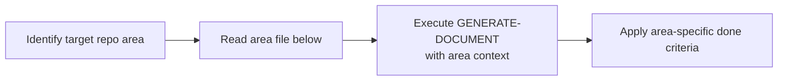

# 📘 Repository Area Guidance for GENERATE-DOCUMENT

> [← WORKFLOWS/README.md](../README.md)

Per-area reference for executing the `GENERATE-DOCUMENT` workflow. Each file specifies the key inputs, constraints, done criteria, and consistency checks for that repository area.

---

## Overview

`GENERATE-DOCUMENT` is the generic workflow for producing any implementation output. This group extends it with area-specific knowledge so that AI agents know exactly what to check and produce for each repository.

---

## How to Use

1. Identify which repository the work targets.
2. Open the corresponding area file below.
3. Execute `GENERATE-DOCUMENT` with the inputs, constraints, and done criteria specified there.
4. Run the consistency checks listed in the "Key Checks" field.

> **Customize for your project:** The AREA-*.md files below ship as starter templates based on a reference project. Edit each file to match your project's actual stack, doc references, and conventions. Remove rows that don't apply and add any areas your project needs.

---

## Area Quick Reference

<!-- AREAS-TABLE: populated by plan-init based on project structure — one AREA-<CODE>-<dir>.md file per area -->
| Code | Area | Key Doc References | File |
|------|------|--------------------|------|
| AP | `src/` — Java / Spring Boot 4 API | `docs/superpowers/plans/`, `src/main/resources/db/migration/` | [AREA-AP-src.md](AREA-AP-src.md) |
| DO | `docs/` — documentación | `docs/superpowers/plans/` | [AREA-DO-docs.md](AREA-DO-docs.md) |
| W | `.planning/` — meta-workflow | *(built-in)* | *(built-in)* |

> Area files are generated by `/plan-init`. Each `AREA-<CODE>-<dir>.md` file in this directory covers one project area. See `AREA-EXAMPLE.md` for the expected format.

---

> [← WORKFLOWS/README.md](../README.md)
