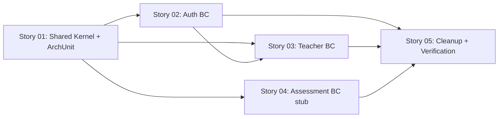

# 🚀 EXPANSION: 001-hexagonal-refactor

> **Status:** Expansion
> [← planning/README.md](../../README.md)

---

## Story Summary

| # | Story | Area | Depends On | Status |
|---|-------|------|------------|--------|
| 01 | Shared Kernel + ArchUnit Setup | AP | — | TODO |
| 02 | Auth Bounded Context | AP | 01 | TODO |
| 03 | Teacher Bounded Context | AP | 01, 02 | TODO |
| 04 | Assessment Bounded Context (stub) | AP | 01 | TODO |
| 05 | Legacy Package Cleanup + Final Verification | AP | 02, 03, 04 | TODO |

---

## Dependency Map

> Story 03 depends on Story 02 because `ProvisionTeacherHandler` injects `IssuePasswordResetCodeUseCase` (interface defined in auth application layer).

---

## Impact per Repository Area

| Code | Area | Affected? | What changes |
|------|------|-----------|-------------|
| DO | `docs/` | ☑ | Planning documents only (no code docs changed) |
| WB | `web/` | ☐ | No changes — HTTP contracts unchanged |
| AP | `api/src/` | ☑ | Full package restructure to hexagonal / feature-package layout; new domain aggregates, ports, handlers, orchestrators, adapters, mappers, ArchUnit tests |
| AG | `agents/` | ☐ | Not affected |
| IN | `infra/` | ☐ | Not affected — no new Cloud Run services introduced |
| W | `.planning/` | ☑ | This expansion and story files |

---

## Notes

### Coexistence Strategy
During Stories 01–04, old and new packages coexist in the codebase. Each story creates the new package structure AND removes the old code it supersedes, so the build remains green after every story. Story 05 is the final pass to catch any stragglers and confirm ArchUnit constraints hold.

### Open Questions Resolved
1. **`TeacherIdentity`** stays in `auth.domain.model` — it models an authenticated Firebase identity (token claim), not the `Teacher` domain aggregate.
2. **Branch** — recommend `refactor/hexagonal-architecture` feature branch; merge to `develop` when Story 05 is done.
3. **ArchUnit** — added in Story 01 (skeleton assertion) so it guards each subsequent story from regressions.

### No Schema Changes
Flyway migrations V1–V6 are untouched. `@Table`, `@Column`, and column names on JPA entities do not change — only their Java package and class name change.

### Testing Strategy
- Existing 14 tests migrate to their new package home within the story that moves their target class.
- New unit tests are written for: `Teacher` aggregate, `PasswordResetCode` aggregate, all handlers, both orchestrators, and both persistence adapters.
- `HexagonalArchitectureTest` (ArchUnit) is created in Story 01 and must pass green from Story 02 onward.

---

> [← planning/README.md](../../README.md)
