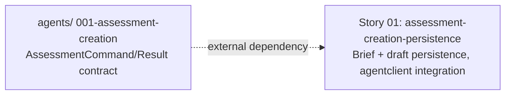

# 🚀 EXPANSION: 003-assessment-creation

> **Status:** Expansion
> [← planning/README.md](../../README.md)

---

## Story Summary

| # | Story | SDLC Phase(s) | Depends On | Status |
|---|-------|--------------|------------|--------|
| 01 | assessment-creation-persistence | AP | — (external: `agents/` 001-assessment-creation) | TODO |

> This story depends on the **external** contract produced by the sibling child planning `agents/.planning/001-assessment-creation` (the `AssessmentCommand`/`AssessmentResult` contract and the internal agent endpoint). That dependency is cross-repository and is not expressible in this workspace's own `Depends On` column — it is tracked by the parent planning (root `.planning/active/008-assessment-creation/01-expansion.md → Linked Child Plannings`).

---

## Dependency Map

---

## Impact per Repository Area

| Code | Area | Affected? | What changes |
|------|------|----------|-------------|
| DO | `docs/` | ☐ | — |
| WB | `web/` | ☐ | — |
| AP | `api/` | ☑ | New Flyway migrations + entities/repositories for `AssessmentBrief` and versioned `AssessmentDraft`; brief intake, draft generation, draft regeneration, draft edit, and draft/version retrieval endpoints; `agentclient` integration; `AgentExecutionLog` persistence per execution |
| AG | `agents/` | ☐ | — (consumed via `agentclient`, implemented in the sibling child planning) |
| IN | `infra/` | ☐ | — |
| W | `.planning/` | ☑ | Este planning |

---

## Notes

- **Child planning of the monorepo root.** This planning implements the `api/` half of the parent monorepo planning `008-assessment-creation` (root `.planning/active/008-assessment-creation/`). Source stories: `docs/02-product/user-stories/epic-02-assessment-creation/01-assessment-brief-intake.md` (US-010), `02-assessment-draft-generation.md` (US-011), `03-assessment-draft-regeneration.md` (US-012).
- **Persistencia antes de invocar al agente (US-010 DoD):** el brief debe guardarse en su propia transacción/request, separada y previa a la que invoca al agente — así una falla del agente no pierde el input del profesor.
- **Versionado de drafts (US-012):** cada regeneración crea una nueva versión enlazada al draft/assessment original; la versión previa nunca se sobreescribe ni se borra, y debe seguir siendo recuperable.
- **`AgentExecutionLog` por ejecución:** tanto la generación inicial (US-011) como cada regeneración (US-012) producen su propio registro (modelo, costo estimado, status) — son ejecuciones distintas, no se comparten logs.
- **Cross-repo dependency:** this story cannot be fully executed against a real agent until `agents/.planning/001-assessment-creation` exposes its internal endpoint. The command/result contract can be developed in parallel against the documented shape; integration testing waits for the real endpoint.
- **Riesgo:** el modelo de versionado de drafts está poco probado — si no se cubre con un test de integración, una regeneración podría sobreescribir silenciosamente una versión previa (Impact: H, Likelihood: L). Mitigación: cubrir explícitamente en Done Criteria y en los tests de la story.

---

> [← planning/README.md](../../README.md)
