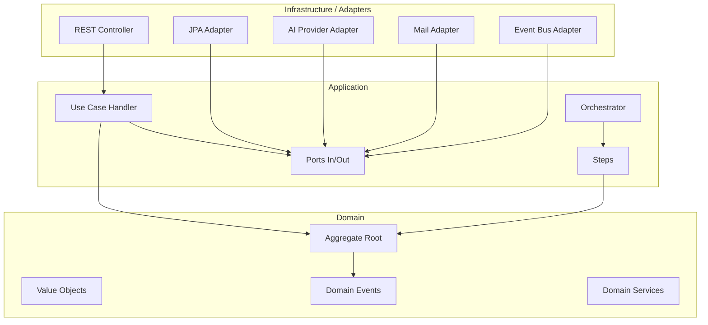

# 01 — Arquitectura hexagonal y estructura de paquetes

## Regla de dependencias

La dependencia siempre apunta hacia adentro:

```text
infrastructure / adapters  --->  application  --->  domain
api / controllers          --->  application  --->  domain
run / bootstrap            --->  todas para cablear
```

`domain` no depende de nadie.

`application` depende solo de `domain` y de contratos propios.

`infrastructure` depende de `application` y `domain` para implementar puertos.

`api` depende de `application` para invocar casos de uso y traducir requests/responses.

## Estructura base de package

Estándar GradeOps AI:

```text
<base-package>.<artifact>.<feature>.<layer>
```

Base package recomendado:

```text
ai.gradeops
```

Ejemplos:

```text
ai.gradeops.api.assessment.domain
ai.gradeops.api.assessment.application
ai.gradeops.api.assessment.infrastructure
ai.gradeops.api.assessment.infrastructure.adapter.in.web
ai.gradeops.api.assessment.infrastructure.adapter.out.persistence
ai.gradeops.api.assessment.infrastructure.adapter.out.ai

ai.gradeops.agents.grading.domain
ai.gradeops.agents.grading.application
ai.gradeops.agents.grading.infrastructure.adapter.out.gemini
```

Si el proyecto necesita un namespace más corporativo, se puede reemplazar el base package, pero no la regla estructural.

## Feature package primero

Organizar por feature antes que por tipo técnico.

Preferir:

```text
ai.gradeops.api.assessment.domain
ai.gradeops.api.assessment.application
ai.gradeops.api.assessment.infrastructure
ai.gradeops.api.rubric.domain
ai.gradeops.api.rubric.application
ai.gradeops.api.rubric.infrastructure
```

Evitar:

```text
ai.gradeops.api.domain.assessment
ai.gradeops.api.controllers.assessment
ai.gradeops.api.repositories.assessment
ai.gradeops.api.services.assessment
```

La estructura por feature reduce acoplamiento, mejora navegación y permite extraer módulos o microservicios con menor costo.

## Capas por feature

Plantilla completa para una feature mediana/grande:

```text
ai.gradeops.<artifact>.<feature>
├── domain
│   ├── model
│   │   ├── <Aggregate>.java
│   │   ├── <ValueObject>.java
│   │   └── <DomainEntity>.java
│   ├── event
│   │   └── <SomethingHappenedEvent>.java
│   ├── service
│   │   └── <DomainService>.java
│   ├── policy
│   │   └── <Policy>.java
│   └── exception
│       └── <DomainException>.java
├── application
│   ├── port
│   │   ├── in
│   │   │   └── <UseCase>.java
│   │   └── out
│   │       └── <RepositoryPort>.java
│   ├── usecase
│   │   └── <UseCaseHandler>.java
│   ├── command
│   │   └── <Command>.java
│   ├── query
│   │   └── <Query>.java
│   ├── result
│   │   └── <Result>.java
│   ├── orchestrator
│   │   └── <FeatureOrchestrator>.java
│   ├── step
│   │   └── <FeatureStep>.java
│   └── mapper
│       └── <ApplicationMapper>.java
└── infrastructure
    ├── adapter
    │   ├── in
    │   │   ├── web
    │   │   │   ├── <Controller>.java
    │   │   │   ├── request
    │   │   │   └── response
    │   │   ├── messaging
    │   │   └── scheduler
    │   └── out
    │       ├── persistence
    │       │   ├── <JpaEntity>.java
    │       │   ├── <SpringDataRepository>.java
    │       │   ├── <PersistenceAdapter>.java
    │       │   └── <PersistenceMapper>.java
    │       ├── ai
    │       ├── mail
    │       ├── storage
    │       └── eventbus
    └── config
```

Para features pequeñas se permite una versión reducida, pero sin mezclar responsabilidades.

## Módulos recomendados por artifact

En un monolito modular:

```text
gradeops-api
├── shared-kernel
├── assessment
├── rubric
├── submission
├── grading
├── feedback
├── learning-gap
├── recovery
├── teacher-report
├── billing
├── audit
└── run
```

En multi-repo o multi-artifact:

```text
grade-ops-ai-api
├── ai.gradeops.api.assessment
├── ai.gradeops.api.submission
├── ai.gradeops.api.billing
└── ai.gradeops.api.audit

grade-ops-ai-agents
├── ai.gradeops.agents.assessment
├── ai.gradeops.agents.grading
├── ai.gradeops.agents.feedback
└── ai.gradeops.agents.ops
```

## Comunicación entre features

Orden de preferencia:

1. Método de aplicación interno cuando está en el mismo bounded context.
2. Puerto explícito entre aplicaciones si hay dependencia funcional clara.
3. Evento de dominio o evento de integración si debe ser asincrónico.
4. API REST solo si cruza proceso, servicio o repositorio.

Evitar llamadas directas a repositories de otra feature.

## Shared Kernel

Usar `shared-kernel` solo para conceptos verdaderamente compartidos y estables:

- `TenantId`.
- `UserId`.
- `CourseId`.
- `Money`.
- `CreditAmount`.
- `ClockProvider` o `TimeProvider` como puerto.
- Errores base.
- `DomainEvent` base.

No poner lógica de negocio específica en shared kernel.

## Mermaid de referencia



## Reglas obligatorias

- Ningún import de `org.springframework.*` en `domain`.
- Ningún import de `jakarta.persistence.*` en `domain`.
- Ningún controller debe acceder directamente a un repository JPA.
- Ningún adapter externo debe modificar estado sin pasar por un caso de uso.
- Ningún mapper debe contener reglas de negocio.
- Ningún `@Transactional` en controller.
- Las transacciones viven en la capa de aplicación o en un adapter de persistencia cuidadosamente definido.

## Wiring de Spring (cableado de beans)

### Única anotación de estereotipo permitida: `@RestController`

La única anotación de estereotipo Spring permitida es `@RestController`, exclusivamente en controllers HTTP.

Prohibido en cualquier otra clase:

- `@Service`
- `@Component`
- `@Repository`

### Cómo se registran los beans

Todos los beans de las capas `application` e `infrastructure` (handlers, orchestrators, adapters, mappers) se declaran explícitamente mediante `@Bean` en clases `@Configuration`.

Cada bounded context tiene una o más clases `@Configuration` en `<feature>/infrastructure/config/`:

```java
// teacher/infrastructure/config/TeacherConfig.java
@Configuration
@RequiredArgsConstructor
class TeacherConfig {

    @Bean
    ProvisionTeacherHandler provisionTeacherHandler(
            AuthPort authPort,
            TeacherRepositoryPort teacherRepository,
            IssuePasswordResetCodeUseCase issuePasswordResetCodeUseCase) {
        return new ProvisionTeacherHandler(authPort, teacherRepository, issuePasswordResetCodeUseCase);
    }

    @Bean
    UpdatePilotFlagsHandler updatePilotFlagsHandler(TeacherRepositoryPort teacherRepository) {
        return new UpdatePilotFlagsHandler(teacherRepository);
    }

    @Bean
    TeacherPersistenceAdapter teacherPersistenceAdapter(
            TeacherJpaRepository jpaRepository,
            TeacherPersistenceMapper mapper) {
        return new TeacherPersistenceAdapter(jpaRepository, mapper);
    }

    @Bean
    TeacherPersistenceMapper teacherPersistenceMapper() {
        return new TeacherPersistenceMapper();
    }
}
```

Los handlers y adapters son clases Java ordinarias con `@RequiredArgsConstructor` — sin anotación de estereotipo:

```java
// NO @Service, NO @Component
@RequiredArgsConstructor
public class ProvisionTeacherHandler implements ProvisionTeacherUseCase {

    private final AuthPort authPort;
    private final TeacherRepositoryPort teacherRepository;
    private final IssuePasswordResetCodeUseCase issuePasswordResetCodeUseCase;

    @Override
    @Transactional
    public ProvisionTeacherResult execute(ProvisionTeacherCommand command) {
        // ...
    }
}
```

`@Transactional` funciona correctamente sobre beans declarados vía `@Bean` porque Spring genera el proxy AOP independientemente de cómo fue registrado el bean.

### Spring Data JPA repos

Los repos que extienden `JpaRepository` **no requieren `@Repository`**. Spring Data los detecta automáticamente:

```java
// package-private — sin @Repository
interface TeacherJpaRepository extends JpaRepository<TeacherJpaEntity, String> {
    Optional<TeacherJpaEntity> findByEmail(String email);
}
```

### Inyección de dependencias

Toda inyección es por constructor. Usar `@RequiredArgsConstructor` de Lombok. Prohibido `@Autowired` en cualquier capa.
