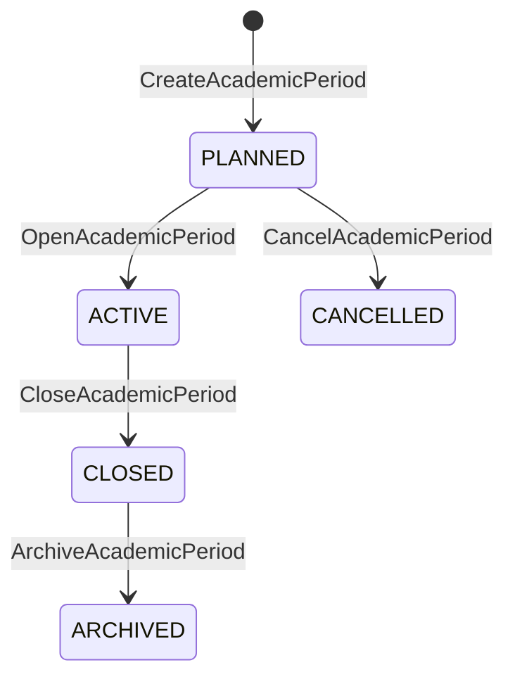
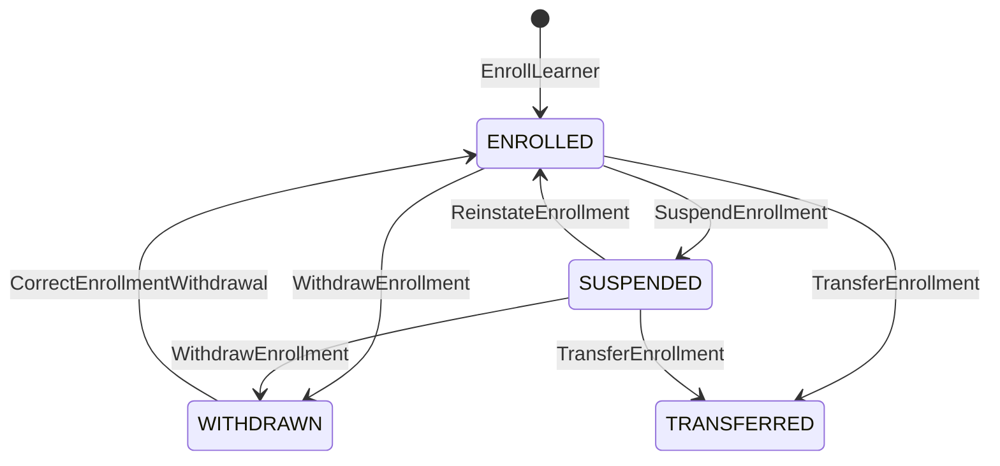
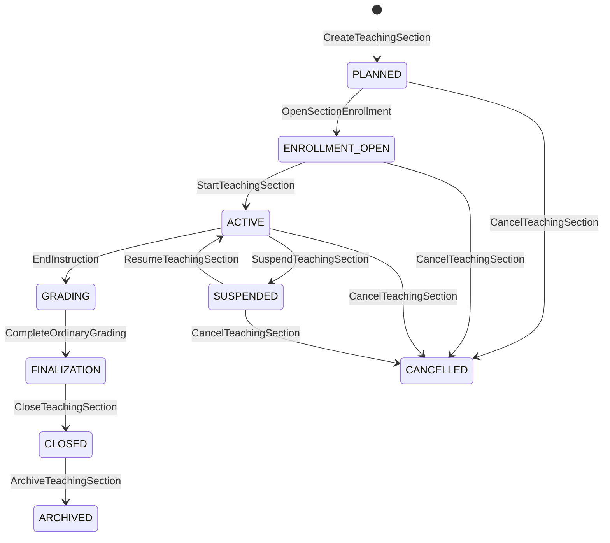

<a id="top"></a>

# ADR UI/UX: Periodos, secciones y matrículas con historia temporal

- **Status:** Accepted
- **Validation:** Internally validated
- **Date:** 2026-07-27
- **Decision owner:** Product Owner
- **Related decision:** [`2026-07-27-transparent-grading-policy.md`](2026-07-27-transparent-grading-policy.md)
- **Technical impact:** Confirmed

## Contexto

GradeOps AI necesita distinguir la definición reutilizable de una asignatura de
su ejecución real durante un periodo. Reutilizar una misma sección, reemplazar
su roster o conservar únicamente el estado actual mezclaría evaluaciones,
matrículas, políticas y resultados de ejecuciones diferentes.

Además, incorporación tardía, retiro, transferencia y correcciones posteriores
requieren diferenciar la fecha de registro de la fecha efectiva y conservar el
estado histórico aplicable a cada evaluación.

## Opciones consideradas

### Opción A: sección reutilizable

Se cambia el periodo y se reemplazan estudiantes y evaluaciones. Reduce
entidades visibles, pero destruye identidad histórica y auditabilidad.

### Opción B: snapshot completo sin relaciones temporales

Conserva copias por periodo, pero dificulta expresar cambios de matrícula,
vigencia retroactiva, transferencias y elegibilidad.

### Opción C: ejecución por periodo y relaciones temporales

Cada sección recibe identidad propia y las personas participan mediante
matrículas con vigencia e historia. Exige más conceptos, pero permite reconstruir
qué era válido en cualquier momento.

## Decisión

Se adopta la opción C.

### Periodo y sección

```text
AcademicPeriod
├── academicPeriodId
├── workspaceReference
├── code
├── name
├── periodType
├── startsAt
├── endsAt
├── timezone
└── status

TeachingSection
├── teachingSectionId
├── subjectReference
├── academicPeriodReference
├── sectionCode
├── modality
├── educators
├── curriculumVersionReference
├── gradingPolicyVersionReference
└── lifecycleStatus
```

`AcademicPeriod` no asumirá semestres; admitirá semestre, trimestre,
cuatrimestre, bimestre, anual, intensivo y personalizado.

La misma asignatura y código pueden repetirse en periodos distintos. Cada
ejecución crea otra `TeachingSection`.

El periodo y la sección tienen ciclos separados:



| Origen | Comando | Guarda principal | Destino | Evento |
|---|---|---|---|---|
| Inexistente | `CreateAcademicPeriod` | Código, fechas, zona horaria y workspace válidos | `PLANNED` | `AcademicPeriodCreated` |
| `PLANNED` | `OpenAcademicPeriod` | Inicio permitido y configuración mínima completa | `ACTIVE` | `AcademicPeriodOpened` |
| `ACTIVE` | `CloseAcademicPeriod` | Secciones cerradas o excepciones controladas | `CLOSED` | `AcademicPeriodClosed` |
| `CLOSED` | `ArchiveAcademicPeriod` | Retención y reportes satisfechos | `ARCHIVED` | `AcademicPeriodArchived` |
| `PLANNED` | `CancelAcademicPeriod` | Actor autorizado, motivo e impacto registrados | `CANCELLED` | `AcademicPeriodCancelled` |

Cerrar un periodo no elimina ni fusiona sus secciones. Cada
`TeachingSection` conserva su propio cierre, casos incompletos y revisiones.

### Copia controlada

Crear una sección desde otra podrá copiar:

- currículo y configuración seleccionada;
- política de evaluación como nueva configuración editable;
- plantillas de evaluaciones y rúbricas;
- ajustes operativos explícitamente elegidos.

Nunca copiará matrículas, calificaciones, entregas, feedback, grupos,
asistencia, excepciones, incidentes ni evidencias.

| Elemento | ¿Se copia? | Tratamiento |
|---|---:|---|
| Currículo y configuración seleccionada | Sí | Nueva referencia editable para el periodo destino |
| Política de evaluación | Sí | Nueva configuración; no reutiliza una versión mutable |
| Plantillas de evaluaciones y rúbricas | Sí | Conserva procedencia y versiones de origen |
| Ajustes operativos | Opcional | Solo los elegidos explícitamente |
| Matrículas y datos personales | No | Se incorporan mediante el flujo del nuevo periodo |
| Calificaciones, entregas y feedback | No | Permanecen vinculados a la ejecución histórica |
| Grupos, asistencia y excepciones | No | Se reconstruyen en el contexto nuevo |
| Incidentes y evidencias de auditoría | No | Permanecen inmutables en su sección de origen |

### Matrícula temporal

```text
SectionEnrollment
├── enrollmentId
├── sectionReference
├── learnerReference
├── administrativeStatus
├── academicCompletionStatus
├── effectiveFrom
├── effectiveUntil
├── enrolledAt
├── withdrawnAt
├── provenance
└── revisionHistory
```

El estado administrativo y el resultado académico son dimensiones diferentes.
Retirar a una persona no elimina sus entregas, resultados, equipos ni
decisiones anteriores.

`enrolledAt` registra cuándo se incorporó el dato; `effectiveFrom` expresa desde
cuándo tiene efecto académico. La misma distinción aplica a retiros,
transferencias y correcciones.



| Origen | Comando | Guardas principales | Destino | Evento |
|---|---|---|---|---|
| Inexistente | `EnrollLearner` | Sección válida, identidad no duplicada y vigencia informada | `ENROLLED` | `LearnerEnrolledInSection` |
| `ENROLLED` | `SuspendEnrollment` | Actor autorizado, motivo y vigencia | `SUSPENDED` | `SectionEnrollmentSuspended` |
| `SUSPENDED` | `ReinstateEnrollment` | Causa resuelta y nueva vigencia válida | `ENROLLED` | `SectionEnrollmentReinstated` |
| `ENROLLED`, `SUSPENDED` | `WithdrawEnrollment` | Actor autorizado, motivo y fecha efectiva | `WITHDRAWN` | `LearnerWithdrawnFromSection` |
| `ENROLLED`, `SUSPENDED` | `TransferEnrollment` | Sección destino válida y decisión de transferencia | `TRANSFERRED` | `SectionEnrollmentTransferred` |
| `WITHDRAWN` | `CorrectEnrollmentWithdrawal` | Evidencia de error, autorización y motivo | `ENROLLED` | `EnrollmentWithdrawalCorrected` |

La corrección del retiro no borra el hecho anterior: crea una revisión temporal.
`academicCompletionStatus` se mantiene separado y no se infiere de estos
estados administrativos.

### Incorporación tardía y retiro

Una incorporación tardía debe resolver explícitamente evaluaciones previas:

| Resolución | Semántica |
|---|---|
| `NOT_APPLICABLE` | La evaluación no forma parte de las obligaciones de esa matrícula |
| `EXCUSED` | Existe una exención autorizada sin calificación |
| `PENDING` | La resolución todavía requiere una decisión |
| `MUST_COMPLETE` | La persona debe completar la administración original o una habilitada |
| `REPLACED_BY_RECOVERY` | Una recuperativa identificada sustituye la obligación |
| `TRANSFERRED_RESULT` | Se reconoce explícitamente un resultado equivalente |
| `ADMINISTRATIVELY_RESOLVED` | Una decisión administrativa cierra el caso con trazabilidad |

No genera notas cero automáticamente.

El retiro preserva la historia y determina elegibilidad futura según fecha
efectiva y política aplicable.

### Elegibilidad histórica

Cada `AssessmentAdministration` conservará sus participantes:

```text
AdministrationParticipant
├── enrollmentReference
├── eligibilityStatus
├── eligibilityReason
├── includedAt
├── excludedAt
└── sourceRevision
```

La lista se deriva inicialmente de matrículas y excepciones, pero queda
congelada o versionada. El roster actual no reescribe quién debía participar en
una administración pasada.

| Estado de elegibilidad | Puede participar | Requiere resolución | Efecto histórico |
|---|---:|---:|---|
| `ELIGIBLE` | Sí | No | Forma parte de la administración |
| `NOT_ELIGIBLE` | No | No | Conserva el motivo de exclusión |
| `PENDING` | No, hasta resolver | Sí | No genera una calificación implícita |
| `EXCUSED` | No | No | Conserva la exención autorizada |
| `WITHDRAWN` | Depende de fecha efectiva | Puede requerirla | No elimina participación previa |

### Transferencia y repetición

Una transferencia conecta una matrícula de origen con otra de destino. Los
resultados solo se trasladan mediante decisión explícita de equivalencia porque
las secciones pueden diferir en evaluaciones, fechas, rúbricas y ponderaciones.

Repetir una asignatura crea otra matrícula. Los resultados anteriores son
antecedentes, no valores reutilizables salvo reconocimiento autorizado.

| Caso | Identidad de matrícula | Resultado anterior | Decisión requerida |
|---|---|---|---|
| Transferencia de sección | Nueva en destino | No se copia automáticamente | Equivalencia por evaluación o componente |
| Repetición de asignatura | Nueva | Solo antecedente | Reconocimiento académico explícito |
| Corrección administrativa | Misma, con revisión | Se conserva | Actor, motivo y fecha efectiva |
| Copia de sección | No copia matrículas | No se traslada | Nueva incorporación en el periodo destino |

### Ciclo de vida



| Origen | Comando | Guardas principales | Destino | Evento |
|---|---|---|---|---|
| Inexistente | `CreateTeachingSection` | Periodo, asignatura y responsables válidos | `PLANNED` | `TeachingSectionCreated` |
| `PLANNED` | `OpenSectionEnrollment` | Ventana y política de matrícula definidas | `ENROLLMENT_OPEN` | `SectionEnrollmentOpened` |
| `ENROLLMENT_OPEN` | `StartTeachingSection` | Inicio permitido y configuración académica válida | `ACTIVE` | `TeachingSectionStarted` |
| `ACTIVE` | `SuspendTeachingSection` | Actor autorizado, motivo y alcance | `SUSPENDED` | `TeachingSectionSuspended` |
| `SUSPENDED` | `ResumeTeachingSection` | Condición de suspensión resuelta | `ACTIVE` | `TeachingSectionResumed` |
| `ACTIVE` | `EndInstruction` | Periodo de aplicación terminado o cierre autorizado | `GRADING` | `TeachingSectionInstructionEnded` |
| `GRADING` | `CompleteOrdinaryGrading` | Resultados ordinarios resueltos o pendientes declarados | `FINALIZATION` | `TeachingSectionGradingCompleted` |
| `FINALIZATION` | `CloseTeachingSection` | Política publicada, resultados obligatorios y casos pendientes controlados | `CLOSED` | `TeachingSectionClosed` |
| `CLOSED` | `ArchiveTeachingSection` | Retención y exportaciones satisfechas | `ARCHIVED` | `TeachingSectionArchived` |
| `PLANNED`, `ENROLLMENT_OPEN`, `ACTIVE`, `SUSPENDED` | `CancelTeachingSection` | Actor autorizado, motivo e impacto registrados | `CANCELLED` | `TeachingSectionCancelled` |

El cierre valida resultados obligatorios, pendientes declarados, políticas
publicadas y decisiones finales. Una corrección posterior genera nuevas
revisiones; no reabre informalmente ni elimina publicaciones previas.

## Invariantes

1. Cada sección pertenece a un periodo concreto.
2. Una sección no se reutiliza cambiando su periodo.
3. Repetir código, docente y asignatura no implica identidad.
4. Cada ejecución académica recibe identidad propia.
5. La matrícula conserva historia y vigencia.
6. Retirar a una persona no elimina evidencias ni resultados.
7. Una incorporación tardía no genera calificaciones cero.
8. Cada administración conserva participantes y elegibilidad.
9. El roster actual no reescribe el histórico.
10. Una transferencia conecta dos matrículas diferentes.
11. Transferir resultados exige equivalencia explícita.
12. Repetir una asignatura crea una matrícula nueva.
13. El cierre no elimina situaciones incompletas.
14. Corregir después del cierre genera una revisión.
15. Fecha de registro y fecha efectiva son conceptos distintos.
16. Copiar una sección no copia datos personales ni resultados.
17. Todo cálculo final referencia sección y matrícula exactas.
18. Toda decisión temporal conserva actor, motivo y vigencia.

## Alcance

### MVP

- `AcademicPeriod`;
- nueva `TeachingSection` por ejecución;
- `SectionEnrollment` con estado y vigencia;
- incorporación, retiro y participantes elegibles sin eliminación histórica;
- copia controlada entre periodos;
- ciclo de vida y cierre;
- correcciones mediante revisiones auditables;
- fechas operativas con semántica explícita.

### Previsto, no implementado

- transferencia automatizada;
- convalidación institucional;
- sincronización SIS o LMS;
- calendarios institucionales complejos;
- promoción automática;
- correcciones con múltiples aprobadores.

## Consecuencias

- La UI deberá distinguir asignatura, periodo, sección y matrícula.
- Copiar una sección será una operación selectiva con exclusiones visibles.
- La elegibilidad de cada administración no dependerá exclusivamente del roster
  actual.
- API y persistencia requerirán vigencia temporal, revisiones y referencias
  estables.
- Los reportes históricos se reconstruirán desde hechos y versiones, no desde
  el estado mutable actual.

## Impacto potencial en la plataforma

El impacto se registra en `DMI-014` del
[`Data Model Impact Ledger`](data-model-impact-ledger.md).

Esta decisión no define el esquema físico ni la integración con sistemas
institucionales.

## Validación

Aceptada internamente por el Product Owner. Debe validarse con escenarios reales
de matrícula tardía, retiro, cambio de sección, repetición y rectificación.

## Condición de revisión

Revisar si una institución necesita identidad de sección o vigencia diferente,
o si la reconstrucción histórica requiere hechos adicionales no representados.

## Referencias

- [`2026-07-27-transparent-grading-policy.md`](2026-07-27-transparent-grading-policy.md)
- [`2026-07-27-assessment-exceptions-effective-results.md`](2026-07-27-assessment-exceptions-effective-results.md)
- [`business-rule-catalog.md`](business-rule-catalog.md)
- [`data-model-impact-ledger.md`](data-model-impact-ledger.md)

---

[← Índice de decisiones](README.md) · [Siguiente: Excepciones y resultados efectivos →](2026-07-27-assessment-exceptions-effective-results.md) · [↑ Volver al inicio](#top)
