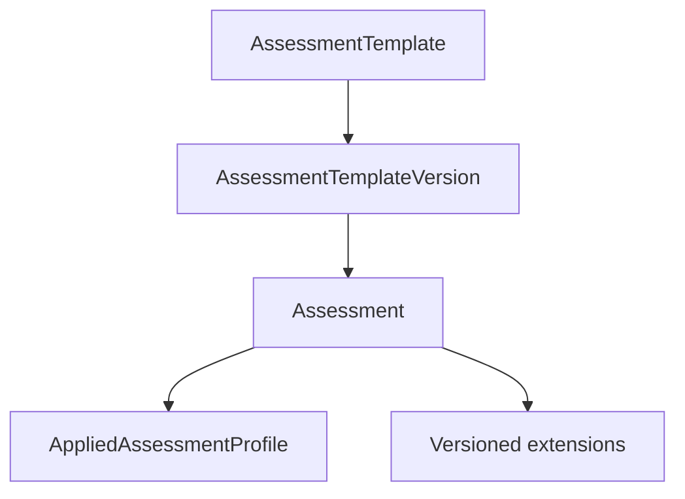

<a id="top"></a>

# ADR UI/UX: Fundamentos del dominio evaluativo extensible

- **Status:** Accepted
- **Validation:** Internally validated
- **Date:** 2026-07-27
- **Decision owner:** Product Owner
- **Related flow:** [`02-descubrimiento-ux.md`](../workflow/02-descubrimiento-ux.md)
- **Technical impact:** Confirmed

## Contexto

El alcance inicial describía GradeOps AI desde el caso de uso de docentes de
programación y distinguía principalmente evaluaciones abiertas y cerradas. Ese
encuadre es útil para la primera validación comercial, pero no representa el
problema de producto completo.

El ciclo evaluativo general aparece en múltiples disciplinas:

```text
Planificar → diseñar → aplicar → recopilar evidencias → evaluar
→ retroalimentar → publicar → analizar → tomar decisiones
```

Lo que cambia de manera material no es solo la disciplina, sino la naturaleza de
la evidencia, la participación, la temporalidad, el método de valoración y el
grado de automatización. Diseñar el núcleo alrededor de programación produciría
rigidez; resolver toda variación con estructuras genéricas sin esquema
eliminaría invariantes y trasladaría ambigüedad a la implementación.

Este descubrimiento también expuso comportamiento de dominio —versionado,
estados, transiciones, comandos, eventos, autorización y auditoría— que debe
registrarse como hipótesis técnica sin convertir todavía esta decisión UI/UX en
un esquema físico o diseño final de código.

## Evidencia

La decisión se basa en:

- revisión interna del ciclo de evaluación de GradeOps AI;
- comparación conceptual de evaluaciones estructuradas, desarrolladas,
  prácticas, orales, por proyecto, portafolio y mixtas;
- análisis de los flujos Open y Closed existentes;
- requisitos ya aprobados de control docente, trazabilidad y corrección
  determinística;
- experiencia de producto del Product Owner como docente.

No existe todavía evidencia externa suficiente para afirmar que el mismo modelo
resuelve satisfactoriamente todas las disciplinas. La transversalidad del núcleo
y la utilidad de los arquetipos deben validarse con docentes y casos reales.

## Opciones consideradas

### Opción A: vertical de programación

Modelar evaluaciones, evidencias y estados según entregas de código.

- Favorece velocidad en el primer dominio.
- Simplifica algunos contratos iniciales.
- Introduce conceptos disciplinares en el núcleo.
- Hace costosa la expansión a evaluaciones orales, prácticas o longitudinales.

### Opción B: tipos evaluativos rígidos

Crear tipos excluyentes como `PROGRAMMING_EXAM`, `ORAL_EXAM` o
`PRACTICAL_ASSESSMENT`.

- Resulta reconocible al comienzo.
- Cada evaluación mixta exige otro tipo o excepciones.
- Duplica comportamiento común.
- Produce combinaciones difíciles de evolucionar.

### Opción C: configuración completamente genérica

Representar cualquier evaluación mediante campos arbitrarios, EAV o JSON sin
contrato.

- Maximiza flexibilidad aparente.
- Debilita invariantes, validación, contratos, migraciones y análisis.
- Transfiere complejidad a UI, API, agentes y reporting.

### Opción D: núcleo estable con perfiles y extensiones controladas

Representar el ciclo común mediante conceptos estables, describir cada
evaluación con un perfil compuesto, facilitar su creación mediante plantillas
versionadas y reservar puntos explícitos para especializaciones.

- Conserva invariantes y trazabilidad.
- Permite evaluaciones mixtas sin crear un tipo por combinación.
- Mantiene programación como primer dominio sin convertirla en restricción.
- Exige gobierno de catálogos, compatibilidad y versiones.

## Decisión

Se adopta la opción D.

### Alcance del descubrimiento

El usuario conceptual primario será el **docente evaluador**. Programación será
el primer dominio de validación y entrada al mercado, no la frontera conceptual
del producto.

Estudiante, operador y revisor participarán solo en los puntos del ciclo donde
realizan tareas o toman decisiones. La etapa 02 estudiará el ciclo completo,
incluidos los modos Open y Closed, sin organizar la investigación como una lista
de pantallas o funcionalidades.

### Perfil evaluativo multidimensional

Una evaluación se describirá mediante dimensiones combinables:

| Eje | Valores iniciales de referencia |
|---|---|
| Propósito | Diagnóstica, formativa, sumativa, certificadora |
| Evidencia | Estructurada, texto, cálculo, archivo, código, audio, video, ejecución, observación, portafolio |
| Composición | Evidencia única, múltiples evidencias, etapas o hitos |
| Participación | Individual, grupal, pares, autoevaluación, múltiples evaluadores |
| Temporalidad | Sincrónica, asincrónica, con plazo, por sesión, longitudinal |
| Modalidad | Presencial, remota, híbrida |
| Valoración | Respuesta correcta, puntaje, criterios, rúbrica, escala, juicio experto o combinación |
| Automatización | Manual, automática, asistida por IA o híbrida |

El perfil también podrá expresar intentos, peso académico, nivel de
consecuencia, política de feedback, revisión humana, publicación, trazabilidad,
identidad y adaptaciones.

Estas dimensiones no se expondrán necesariamente como un formulario completo.
La taxonomía sirve primero para comprender y comparar flujos, identificar
capacidades compartidas y construir arquetipos comprensibles.

### Taxonomía, plantilla y evaluación

Se separan tres conceptos:

| Concepto | Responsabilidad |
|---|---|
| Taxonomía | Define dimensiones y valores gobernados para describir evaluaciones. |
| `AssessmentTemplate` | Identidad reutilizable de un arquetipo evaluativo. |
| `AssessmentTemplateVersion` | Configuración publicada e inmutable de una plantilla. |
| `Assessment` | Evaluación concreta creada directamente o desde una versión de plantilla. |
| `AppliedAssessmentProfile` | Configuración aplicada a la evaluación y snapshot de su definición. |

Las plantillas podrán tener alcance de sistema, institución o docente. El MVP
implementará plantillas de sistema y personales; el alcance institucional
completo quedará previsto.

El docente podrá:

- crear una evaluación desde una plantilla;
- personalizar la evaluación sin modificar su origen;
- guardar la personalización como plantilla nueva;
- actualizar su plantilla para evaluaciones futuras;
- adoptar una versión posterior mediante una acción explícita.

Una evaluación conservará la identidad y versión de origen cuando corresponda.
No se mantendrán `AssessmentProfile` y `AssessmentProfileSnapshot` como
conceptos duplicados si contienen la misma información:
`AppliedAssessmentProfile` constituye el snapshot aplicado.

### Núcleo, configuración y extensiones



Los catálogos serán gobernados y versionados cuando su evolución pueda afectar
compatibilidad. Un catálogo genérico solo será válido para valores
descriptivos; los conceptos con comportamiento, restricciones o relaciones
propias tendrán contratos explícitos.

Las especializaciones disciplinares complementarán el perfil común. Por
ejemplo, programación podrá añadir repositorio, lenguaje y ejecución de pruebas;
una evaluación oral podrá añadir audio y transcripción. Las extensiones no
podrán contradecir invariantes del núcleo y deberán declarar esquema y versión.

### Ciclos de vida separados

No se consolidarán todos los comportamientos en un único `status`. Se modelarán
al menos estas dimensiones:

| Ciclo | Estados conceptuales iniciales |
|---|---|
| Plantilla | `DRAFT`, `PUBLISHED`, `DEPRECATED`, `ARCHIVED` |
| Preparación | `DRAFT`, `READY`, `SCHEDULED`, `PUBLISHED` |
| Aplicación | `NOT_STARTED`, `OPEN`, `PAUSED`, `CLOSED`, `CANCELLED` |
| Revisión por entrega o participante | `PENDING`, `IN_REVIEW`, `NEEDS_REVISION`, `REVIEWED`, `APPROVED` |
| Publicación de resultados | `UNPUBLISHED`, `PARTIALLY_PUBLISHED`, `PUBLISHED`, `CORRECTED` |

Los estados agregados se derivarán de los registros reales cuando sea posible.
Publicar una evaluación, cerrar su aplicación, completar una revisión y publicar
resultados son operaciones diferentes.

### Congelamiento y correcciones

Al publicar la evaluación se congelará su definición académica aplicada:

- perfil, evidencias requeridas y extensiones;
- criterios, rúbricas, ponderaciones y reglas de cálculo;
- instrucciones visibles;
- intentos;
- políticas de feedback y publicación;
- identidad y versión de plantilla de origen.

La operación podrá continuar mediante fechas permitidas, asignaciones,
extensiones individuales, aclaraciones, pausas, responsables y metadatos sin
efecto académico.

Una corrección académica posterior a la publicación será una revisión explícita:
conservará el valor anterior, actor, motivo, alcance e impacto; requerirá
confirmación humana cuando afecte resultados; reprocesará únicamente lo
necesario y notificará consecuencias visibles. Una excepción individual no
modificará la regla general.

### Semántica DDD de las transiciones

Todo diagrama de estados deberá especificar la transición completa:

```text
Command or trigger [guard] / domain action → DomainEvent
```

La convención es:

```text
Intención → caso de uso → aggregate valida invariantes
→ cambia estado → emite evento de dominio
```

Un evento de dominio expresa normalmente un hecho ocurrido; no sustituye el
comando que solicitó la transición. La API, el scheduler o un adaptador no
decidirán por sí mismos si una transición es válida.

Cada catálogo de transiciones deberá registrar:

- aggregate propietario;
- comando o disparador;
- actor autorizado;
- estado de origen y destino;
- guardas e invariantes;
- datos requeridos;
- acción de dominio;
- evento resultante;
- idempotencia;
- auditoría y motivo cuando corresponda;
- efectos secundarios asíncronos;
- transiciones prohibidas.

Los casos de uso orquestarán mediante puertos de entrada. Persistencia,
mensajería, notificaciones, identidad y proveedores externos permanecerán detrás
de puertos de salida y adaptadores.

## Invariantes fundacionales

1. Toda evaluación posee un `AppliedAssessmentProfile` válido.
2. Una evaluación puede crearse desde una plantilla o directamente.
3. Si tiene plantilla de origen, conserva su identidad y versión.
4. Una versión publicada de plantilla es inmutable.
5. Personalizar una evaluación no modifica su plantilla.
6. Archivar una plantilla no invalida evaluaciones existentes.
7. Toda evidencia requerida posee un método de valoración compatible.
8. La definición de una evaluación publicada no cambia silenciosamente.
9. Una propuesta de IA y una decisión docente son registros diferentes.
10. Ningún resultado publicado se sobrescribe sin conservar su versión anterior.
11. Toda extensión declara contrato, esquema y versión.
12. Toda transición sensible valida permisos e invariantes en el aggregate.
13. Reabrir, corregir o cancelar conserva motivo, actor, alcance y auditoría.
14. Los identificadores y estados técnicos permanecen en inglés y separados de
    textos localizados.

## Alcance de implementación

### Fundación obligatoria

- separación entre evaluación, plantilla y versión;
- `AppliedAssessmentProfile` como snapshot histórico;
- perfil multidimensional y evidencias múltiples;
- propiedad, alcance, visibilidad y ciclo de vida;
- catálogos gobernados;
- auditoría del origen y cambios relevantes;
- estados independientes, transiciones explícitas y eventos;
- extensiones con contratos versionados.

### MVP

- plantillas de sistema y personales;
- selección, clonación y personalización;
- entre seis y ocho arquetipos representativos;
- catálogo inicial gobernado;
- evaluaciones mixtas;
- configuraciones necesarias para programación como primer dominio;
- aprobación docente cuando la IA afecte decisiones académicas.

### Previsto, no implementado

- gobierno institucional avanzado;
- herencia multinivel de plantillas;
- marketplace;
- extensiones instalables;
- migración masiva entre versiones;
- campos personalizados arbitrarios;
- aprobaciones institucionales;
- compatibilidad completa con LMS.

## Consecuencias

- La experiencia podrá partir de arquetipos reconocibles sin exigir que el
  docente complete una taxonomía en cada evaluación.
- El núcleo podrá incorporar nuevas disciplinas sin crear un tipo rígido por
  cada combinación.
- El modelo deberá asumir costo explícito de versionado, compatibilidad,
  auditoría y gobierno.
- Las UI deberán distinguir definición, aplicación, revisión y publicación de
  resultados.
- Los cambios posteriores a la publicación requerirán flujos de revisión y
  análisis de impacto.
- Los equipos de dominio, API, Web y Agents deberán compartir lenguaje ubicuo,
  estados y eventos.

## Impacto potencial en la plataforma

El impacto confirmado se registra en `DMI-008` a `DMI-011` del
[`Data Model Impact Ledger`](data-model-impact-ledger.md).

Afecta dominio, persistencia, API, eventos, autorización, auditoría, agentes,
UX, migraciones y pruebas. Esta decisión no autoriza todavía clases, tablas,
endpoints ni contratos físicos.

## Validación

La decisión fue revisada y aceptada internamente por el Product Owner durante la
etapa 02.

Continúan pendientes:

- validar taxonomía y arquetipos con docentes de disciplinas distintas;
- tensionar el modelo con evaluaciones mixtas reales;
- verificar comprensión y descubribilidad de plantillas;
- medir si la personalización evita complejidad sin ocultar controles críticos.

## Excepciones

None.

## Condición de revisión

Revisar la decisión si:

- una evaluación real no puede describirse sin modificar el núcleo;
- docentes no comprenden los arquetipos o requieren configurar todas las
  dimensiones repetidamente;
- una extensión disciplinar necesita contradecir invariantes comunes;
- el catálogo de transiciones revela que dos ciclos considerados independientes
  forman realmente una sola consistencia transaccional;
- evidencia externa invalida la transversalidad propuesta.

## Fuera de este checkpoint

Quedan para el siguiente bloque:

- catálogo completo de transiciones de plantilla, preparación, aplicación,
  revisión y publicación de resultados;
- límites finales de aggregates y consistencia;
- participantes, grupos, intentos, entregas y evidencias;
- process managers o sagas;
- esquema físico, migraciones, endpoints y contratos de integración.

## Referencias

- [`02-descubrimiento-ux.md`](../workflow/02-descubrimiento-ux.md)
- [`01-principios-y-gobierno.md`](../workflow/01-principios-y-gobierno.md)
- [`data-model-impact-ledger.md`](data-model-impact-ledger.md)
- [`2026-07-21-ui-design-data-semantics.md`](../../docs/99-decisions/2026-07-21-ui-design-data-semantics.md)

---

[← Índice de decisiones](README.md) · [Siguiente: Data Model Impact Ledger →](data-model-impact-ledger.md) · [↑ Volver al inicio](#top)
