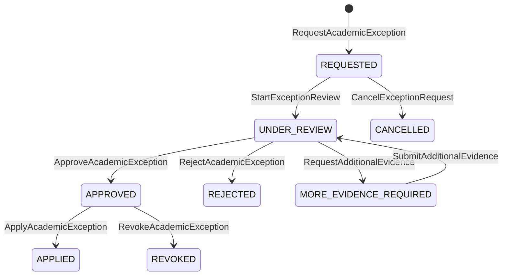
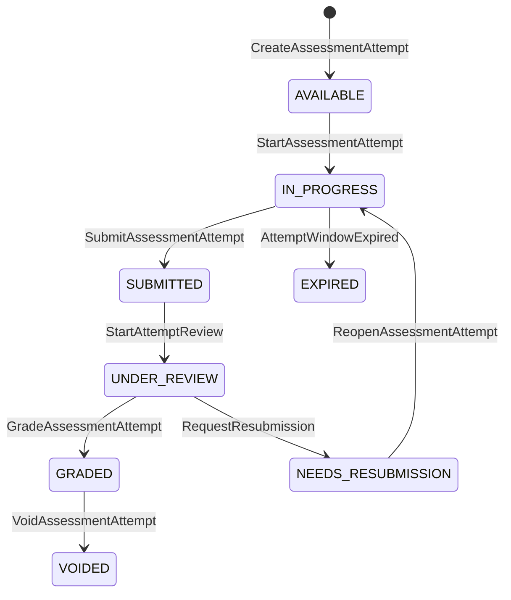
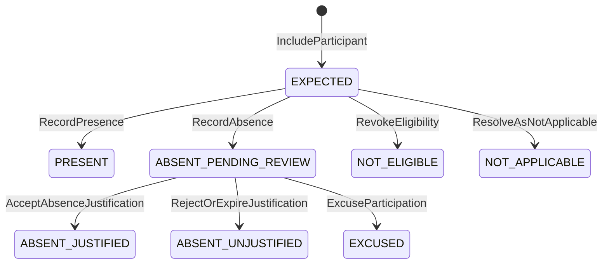
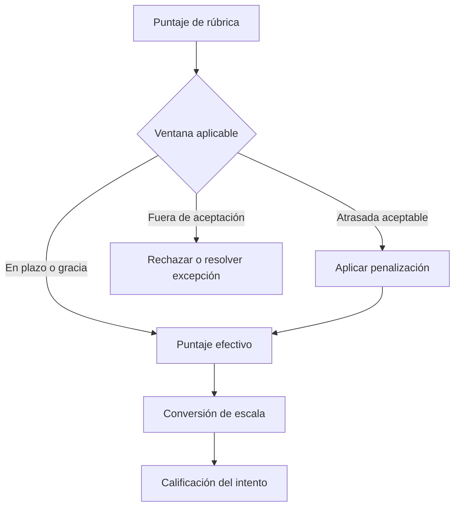
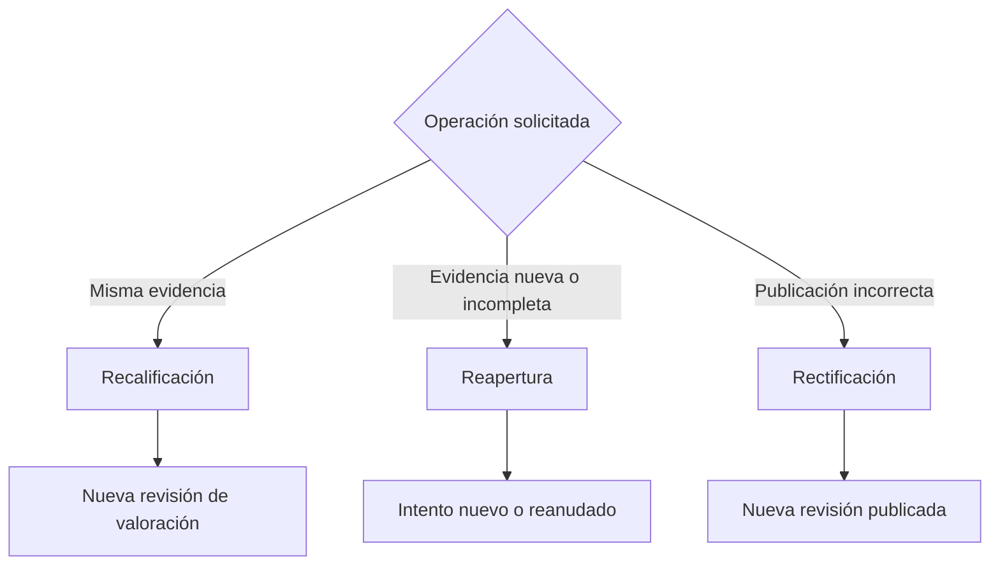
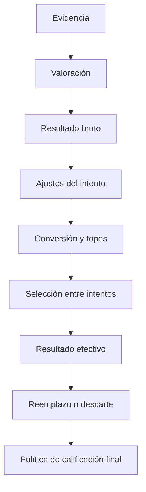

<a id="top"></a>

# ADR UI/UX: Excepciones, intentos y resultados efectivos

- **Status:** Accepted
- **Validation:** Internally validated
- **Date:** 2026-07-27
- **Decision owner:** Product Owner
- **Related decision:** [`2026-07-27-academic-period-section-enrollment.md`](2026-07-27-academic-period-section-enrollment.md)
- **Technical impact:** Confirmed

## Contexto

Recuperativas, ausencias, atrasos, reaperturas y rectificaciones suelen
implementarse editando una nota. Esa simplificación mezcla hechos de
participación, autorizaciones, evidencias, intentos y valores efectivos; además
destruye la historia necesaria para explicar una calificación.

Una recuperativa tampoco tiene una semántica universal: puede completar una
ausencia, mejorar una nota, sustituir una administración inválida o recuperar
solo un componente.

## Opciones consideradas

### Opción A: una nota mutable con flags

Es fácil de visualizar, pero no representa múltiples intentos ni explica cómo
se eligió el resultado vigente.

### Opción B: excepciones como cambios directos a la política

Reutiliza el motor general, pero convierte casos individuales en modificaciones
retroactivas y dificulta mantener igualdad y auditoría.

### Opción C: hechos, casos, intentos y decisión efectiva separados

Conserva el resultado original, registra la excepción y selecciona
determinísticamente qué revisión participa en el cálculo.

## Decisión

Se adopta la opción C.

### Modelo conceptual

```text
Resultado original
→ hecho o solicitud excepcional
→ decisión académica autorizada
→ intento o revisión candidata
→ regla de selección
→ resultado efectivo
```

```text
AcademicExceptionCase
├── enrollmentReference
├── assessmentReference
├── exceptionType
├── reasonCode
├── evidenceReferences
├── requestedAt
├── effectiveAt
├── decision
├── authorizedBy
├── status
└── auditTrail

AssessmentResult
├── attempts
├── effectiveResultDecision
└── publicationRevisions
```

La evidencia justificativa puede ser sensible. Su visibilidad se controlará por
rol y propósito; la vista académica no necesita exponer detalles médicos o
personales.



| Origen | Comando | Guardas principales | Destino | Evento |
|---|---|---|---|---|
| Inexistente | `RequestAcademicException` | Matrícula y evaluación válidas; motivo informado | `REQUESTED` | `AcademicExceptionRequested` |
| `REQUESTED` | `StartExceptionReview` | Revisor autorizado y caso completo | `UNDER_REVIEW` | `AcademicExceptionReviewStarted` |
| `REQUESTED` | `CancelExceptionRequest` | Solicitante autorizado y sin decisión | `CANCELLED` | `AcademicExceptionRequestCancelled` |
| `UNDER_REVIEW` | `RequestAdditionalEvidence` | Faltante identificado sin exponer datos sensibles | `MORE_EVIDENCE_REQUIRED` | `AdditionalExceptionEvidenceRequested` |
| `MORE_EVIDENCE_REQUIRED` | `SubmitAdditionalEvidence` | Evidencia admitida y vigente | `UNDER_REVIEW` | `AdditionalExceptionEvidenceSubmitted` |
| `UNDER_REVIEW` | `ApproveAcademicException` | Autoridad, política y alcance válidos | `APPROVED` | `AcademicExceptionApproved` |
| `UNDER_REVIEW` | `RejectAcademicException` | Motivo obligatorio | `REJECTED` | `AcademicExceptionRejected` |
| `APPROVED` | `ApplyAcademicException` | Revisión aprobada todavía aplicable | `APPLIED` | `AcademicExceptionApplied` |
| `APPROVED` | `RevokeAcademicException` | Causa justificada y evaluación de impacto | `REVOKED` | `AcademicExceptionRevoked` |

### Intentos y recuperativas

Cada `AssessmentAttempt` conserva tipo, número, evidencia, estado y revisión
calificada. El MVP distingue:

```text
ORDINARY
RECOVERY
MAKE_UP
RESUBMISSION
REASSESSMENT
```

La política de recuperación declara:

- reglas de elegibilidad;
- evaluación o componente afectado;
- máximo de intentos;
- plazo;
- regla de selección;
- tope opcional;
- obligatoriedad;
- visibilidad.

Las reglas iniciales serán `LATEST_ATTEMPT`, `BEST_RESULT` y
`REPLACE_IF_HIGHER`. Un tope se aplica antes de seleccionar el resultado
efectivo y debe haberse publicado antes del intento.

Recuperar un componente no recalcula componentes no afectados.



| Estado | Significado | Puede aportar resultado |
|---|---|---:|
| `AVAILABLE` | Intento autorizado todavía no iniciado | No |
| `IN_PROGRESS` | Ventana o sesión activa | No |
| `SUBMITTED` | Evidencia recibida e inmutable por revisión | No |
| `UNDER_REVIEW` | Valoración en curso | No |
| `NEEDS_RESUBMISSION` | Se habilitó corregir o completar evidencia | No |
| `GRADED` | Existe una revisión calificada candidata | Sí |
| `EXPIRED` | La ventana terminó sin entrega válida | No |
| `VOIDED` | El intento fue invalidado con motivo | No |

| Regla de selección | Resultado efectivo |
|---|---|
| `LATEST_ATTEMPT` | Último intento elegible después de ajustes y topes |
| `BEST_RESULT` | Mayor resultado elegible después de ajustes y topes |
| `REPLACE_IF_HIGHER` | Recuperativa solo sustituye al ordinario si lo mejora |

### Ausencia como participación

Una ausencia no es una nota:

```text
EXPECTED
PRESENT
ABSENT_PENDING_REVIEW
ABSENT_JUSTIFIED
ABSENT_UNJUSTIFIED
EXCUSED
NOT_ELIGIBLE
NOT_APPLICABLE
```

La secuencia será:



| Estado | Tratamiento |
|---|---|
| `EXPECTED` | Participación esperada; todavía no existe hecho de asistencia |
| `PRESENT` | Existe participación o entrega válida |
| `ABSENT_PENDING_REVIEW` | Ausencia registrada dentro del flujo de justificación |
| `ABSENT_JUSTIFIED` | Ausencia aceptada; la política decide la consecuencia |
| `ABSENT_UNJUSTIFIED` | Ausencia no justificada; la política decide la consecuencia |
| `EXCUSED` | No se exige participación en esa administración |
| `NOT_ELIGIBLE` | La persona no podía participar |
| `NOT_APPLICABLE` | La administración no forma parte de sus obligaciones |

Una consecuencia como nota mínima, cero, pérdida de recuperación o fallo de un
requisito crítico solo se aplica cuando una política publicada la establece.

### Entregas atrasadas

Se distinguen:

```text
submittedAt
dueAt
gracePeriodUntil
acceptedUntil
authorizedExtensionUntil
```

La política declara ventana, base de penalización, tramos, máximo, piso,
rechazo y zona horaria. La etapa matemática es explícita:



| Marca temporal | Propósito | Precedencia |
|---|---|---:|
| `authorizedExtensionUntil` | Extensión individual o grupal autorizada | 1 |
| `gracePeriodUntil` | Tolerancia general sin penalización | 2 |
| `dueAt` | Fecha objetivo de entrega | 3 |
| `acceptedUntil` | Límite absoluto ordinario de recepción | 4 |
| `submittedAt` | Hecho observado de entrega | Se compara con la fecha aplicable |

Una extensión individual sustituye la fecha aplicable solo para la persona o
equipo autorizado.

### Pendientes y simulaciones

`PENDING` es estado con causa, no valor numérico. Entre sus razones se
encuentran entrega no calificada, revisión, justificación, recuperativa,
apelación, incidente técnico e integridad académica.

El cálculo `OFFICIAL` exige resolver todos los requisitos aplicables. El modo
`SIMULATION` puede usar supuestos visibles, pero no renormaliza ni publica
silenciosamente notas disponibles.

### Recalificación, reapertura y rectificación

| Operación | Evidencia | Intento | Propósito |
|---|---|---|---|
| Recalificación | Misma | No | Revisar criterios o error de corrección |
| Reapertura | Puede cambiar | Nuevo o reanudado | Completar o reenviar |
| Rectificación | Misma o administrativa | No necesariamente | Corregir publicación |

Cada operación conserva autorización, motivo, alcance y revisiones. Una
rectificación publicada crea una publicación nueva y notifica a los afectados.



| Operación | Autoridad mínima | Efecto permitido | Efecto prohibido |
|---|---|---|---|
| Recalificación | Docente o revisor autorizado | Nueva revisión sobre la misma evidencia | Reemplazar o borrar la revisión anterior |
| Reapertura | Autoridad académica según política | Habilitar un intento nuevo o reanudar uno existente | Cambiar la regla general para todos |
| Rectificación | Autoridad de publicación | Crear una publicación corregida y notificar | Editar en sitio una publicación histórica |

### Cierre incompleto

Cerrar una sección no equivale a finalizar cada matrícula. Una persona puede
quedar `INCOMPLETE`, `PENDING_RECOVERY`, `PENDING_APPEAL` o
`PENDING_ADMINISTRATIVE_DECISION`.

Cada caso tendrá requisitos pendientes, responsable, plazo, acciones permitidas
y consecuencia si no se resuelve. No se convertirán pendientes en cero para
forzar el cierre ni se reabrirá toda la sección por un caso individual.

| Estado de finalización | Qué falta | Condición de salida |
|---|---|---|
| `INCOMPLETE` | Evidencia o requisito obligatorio | Completar, eximir o resolver administrativamente |
| `PENDING_RECOVERY` | Intento recuperativo autorizado | Calificar o expirar según política |
| `PENDING_APPEAL` | Decisión sobre apelación | Resolver y aplicar la decisión |
| `PENDING_ADMINISTRATIVE_DECISION` | Resolución no académica | Registrar decisión autorizada y efecto |

### Orden de cálculo y explicación



La explicación utiliza la misma traza:

```text
Intento ordinario:                3,2
Intento recuperativo:             5,1
Tope publicado:                   4,0
Resultado candidato ajustado:     4,0
Regla:                            REPLACE_IF_HIGHER
Resultado efectivo:               4,0
```

## Invariantes

1. Una excepción no modifica la política publicada.
2. Cada excepción conserva actor, motivo, fecha y evidencia.
3. Un intento no sobrescribe intentos anteriores.
4. El resultado efectivo referencia todos sus candidatos y regla.
5. Una recuperativa declara elegibilidad, alcance y selección.
6. Recuperar un componente no recalcula otros componentes.
7. Todo tope se conoce antes del intento.
8. Una ausencia no es una calificación.
9. Una ausencia pendiente no se convierte automáticamente en cero.
10. Una entrega atrasada usa la fecha aplicable al participante.
11. Toda penalización declara en qué etapa se aplica.
12. Un pendiente no participa silenciosamente en cálculos oficiales.
13. Una simulación nunca se publica como resultado definitivo.
14. Recalificación, reapertura y recuperación son operaciones distintas.
15. Una rectificación genera una revisión nueva.
16. La IA no autoriza ni publica excepciones.
17. Un caso incompleto posee responsable y plazo.
18. Resolver un caso individual no recalcula personas no afectadas.
19. La explicación deriva de la traza efectiva.
20. Las reglas excepcionales son visibles para docente y estudiante.

## Alcance

### MVP

- ausencias justificadas e injustificadas como estados;
- recuperativa completa o por componente;
- un intento recuperativo;
- `LATEST_ATTEMPT`, `BEST_RESULT` y `REPLACE_IF_HIGHER`;
- tope opcional;
- extensión individual;
- penalización por puntaje o nota máxima;
- pendientes con causa;
- recalificación sobre la misma evidencia;
- rectificación versionada;
- cierre con casos incompletos controlados;
- traza comprensible.

### Previsto, no implementado

- múltiples intentos ponderados;
- descarte automático complejo entre pesos diferentes;
- equivalencias entre secciones;
- apelación institucional multinivel;
- reglas libres;
- recuperación adaptativa autónoma mediante IA.

## Consecuencias

- La interfaz deberá mostrar por separado participación, intentos, decisión
  efectiva y publicación.
- Editar directamente una nota publicada dejará de ser una operación válida.
- API y persistencia necesitarán historial, casos de excepción, selección
  determinista y control de acceso a evidencia sensible.
- Las pruebas deberán cubrir combinaciones de intentos, topes, atrasos,
  pendientes y rectificaciones.
- El MVP limita variantes para evitar que la flexibilidad comprometa velocidad
  y coherencia.

## Impacto potencial en la plataforma

El impacto se registra en `DMI-015` del
[`Data Model Impact Ledger`](data-model-impact-ledger.md).

Esta decisión no define todavía endpoints, persistencia ni workflow de
aprobación institucional.

## Validación

Aceptada internamente por el Product Owner. Requiere validación externa con
reglamentos y casos reales, especialmente recuperativas parciales, ausencias,
atrasos y cierre incompleto.

## Condición de revisión

Revisar si una excepción real no puede expresarse sin mutar historia o si las
variantes excluidas son requisito para el primer piloto.

## Referencias

- [`2026-07-27-transparent-grading-policy.md`](2026-07-27-transparent-grading-policy.md)
- [`2026-07-27-academic-period-section-enrollment.md`](2026-07-27-academic-period-section-enrollment.md)
- [`business-rule-catalog.md`](business-rule-catalog.md)
- [`data-model-impact-ledger.md`](data-model-impact-ledger.md)

---

[← Índice de decisiones](README.md) · [Siguiente: Catálogo de reglas →](business-rule-catalog.md) · [↑ Volver al inicio](#top)
