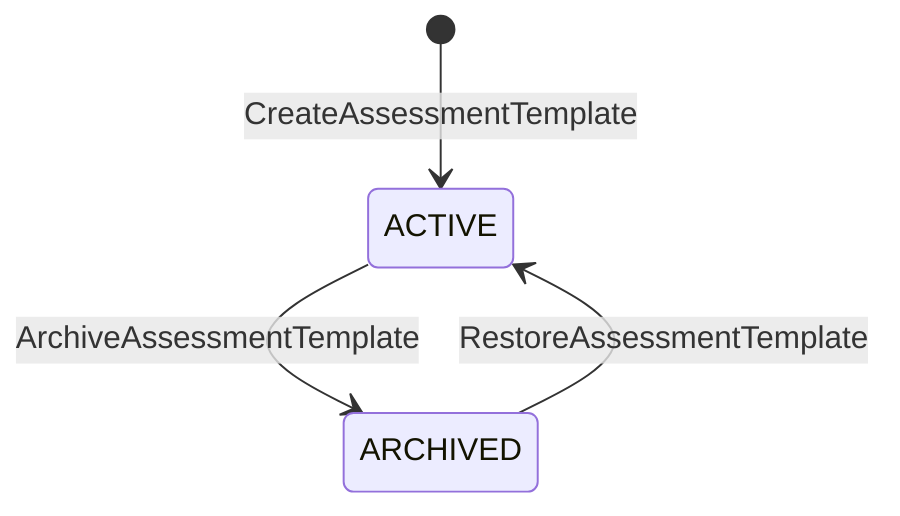
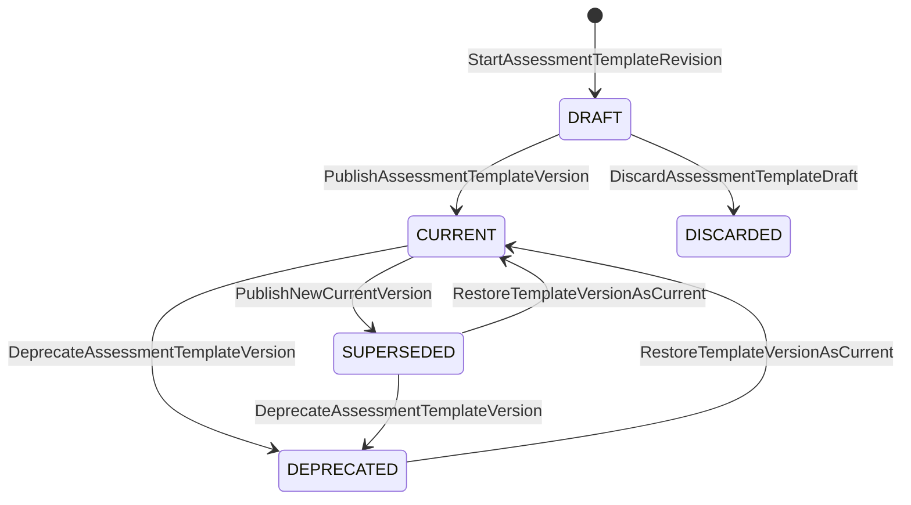
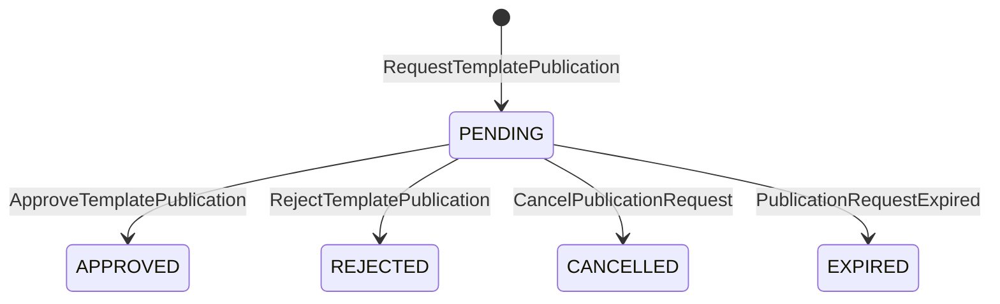
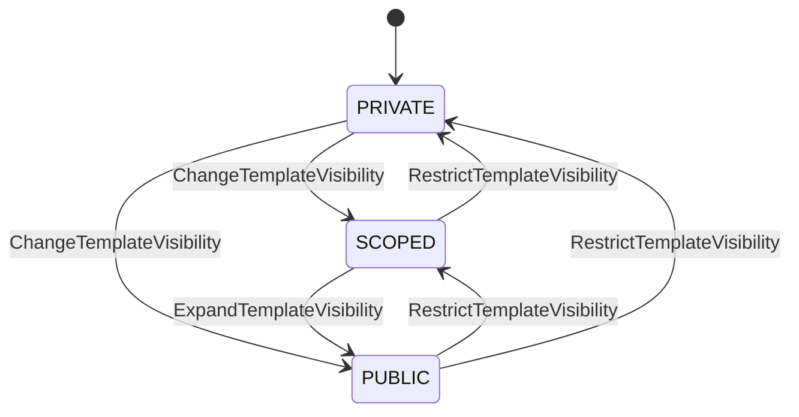

<a id="top"></a>

# ADR UI/UX: Ciclo de vida y gobierno de plantillas evaluativas

- **Status:** Accepted
- **Validation:** Internally validated
- **Date:** 2026-07-27
- **Decision owner:** Product Owner
- **Related decision:** [`2026-07-27-assessment-domain-foundations.md`](2026-07-27-assessment-domain-foundations.md)
- **Technical impact:** Confirmed

## Contexto

Los fundamentos del dominio separaron taxonomía, plantilla, versión de plantilla,
evaluación y perfil aplicado. Para convertir esa separación conceptual en una
experiencia coherente faltaba definir el comportamiento de
`AssessmentTemplate`:

- qué significa archivar una plantilla;
- cómo se crea, publica, reemplaza, depreca o descarta una versión;
- quién controla una plantilla y quién puede descubrirla, usarla o clonarla;
- cómo cambia la publicación según el contexto personal, institucional o de
  plataforma;
- qué información histórica debe conservar una evaluación creada desde una
  plantilla;
- qué colaboración es necesaria en el MVP.

Representar todo mediante un único estado o un permiso genérico mezclaría
identidad, contenido versionado, gobernanza y autorización. También permitiría
errores como editar una versión ya utilizada, aprobar una revisión y publicar
otra, o asumir que una plantilla visible puede utilizarse automáticamente.

## Decisión

`AssessmentTemplate` controlará la identidad, propiedad, alcance, visibilidad,
política de uso y vigencia de sus versiones. La identidad y cada versión tendrán
ciclos de vida independientes.

Para este descubrimiento, `AssessmentTemplate` es el aggregate conceptual
propietario de:

- identidad y propiedad;
- alcance administrativo;
- estado general;
- versión actualmente recomendada;
- borrador activo;
- invariantes de publicación y reemplazo.

Esto define un límite de consistencia conceptual, no una estrategia de carga,
tabla, documento ni clase final.

## Ciclo de la identidad



| Origen | Comando | Guardas principales | Destino | Evento |
|---|---|---|---|---|
| Inexistente | `CreateAssessmentTemplate` | Propietario, alcance y definición inicial válidos | `ACTIVE` | `AssessmentTemplateCreated` |
| `ACTIVE` | `ArchiveAssessmentTemplate` | Actor autorizado y motivo informado | `ARCHIVED` | `AssessmentTemplateArchived` |
| `ARCHIVED` | `RestoreAssessmentTemplate` | Actor autorizado y alcance todavía válido | `ACTIVE` | `AssessmentTemplateRestored` |

Archivar:

- retira la plantilla de la selección y búsqueda ordinarias;
- impide iniciar revisiones o publicar versiones;
- no modifica versiones existentes;
- no invalida evaluaciones creadas desde ella;
- no elimina procedencia ni auditoría;
- conserva su política de visibilidad para una eventual restauración.

## Ciclo de una versión

Los estados de `AssessmentTemplateVersion` son:

- `DRAFT`: versión editable todavía no publicada;
- `CURRENT`: versión publicada recomendada para usos nuevos;
- `SUPERSEDED`: versión publicada reemplazada por otra;
- `DEPRECATED`: versión publicada cuyo uso nuevo se desaconseja;
- `DISCARDED`: borrador abandonado y terminal.



`CURRENT` expresa recomendación para operaciones nuevas. No invalida ni oculta
la validez histórica de versiones anteriores.

## Catálogo de transiciones

### Crear una plantilla

```text
CreateAssessmentTemplate
→ valida propietario, alcance y datos mínimos
→ crea AssessmentTemplate ACTIVE
→ crea versión inicial DRAFT
→ emite AssessmentTemplateCreated
```

`AssessmentTemplateCreated` puede incluir `initialDraftVersionId`; no se exige
un segundo evento si la creación del borrador forma parte de la misma intención
de negocio.

### Iniciar una revisión

```text
StartAssessmentTemplateRevision
→ valida plantilla ACTIVE
→ valida versión de origen elegible
→ valida que no exista otro borrador activo
→ copia la definición de origen en una versión DRAFT nueva
→ emite AssessmentTemplateRevisionStarted
```

El MVP admite un solo borrador activo por plantilla. Las ramas de revisión,
mezcla de cambios y coautoría concurrente quedan fuera de alcance.

### Publicar una versión

```text
PublishAssessmentTemplateVersion
→ valida plantilla ACTIVE
→ valida DRAFT completo y consistente
→ congela su contenido
→ cambia la CURRENT anterior a SUPERSEDED, si existe
→ cambia el DRAFT a CURRENT
→ actualiza currentVersionId
→ emite AssessmentTemplateVersionPublished
→ emite AssessmentTemplateVersionSuperseded, si corresponde
```

El reemplazo de la versión vigente y la publicación nueva deben ser atómicos.

### Descartar un borrador

```text
DiscardAssessmentTemplateDraft
→ valida versión DRAFT
→ exige motivo
→ cambia a DISCARDED
→ emite AssessmentTemplateDraftDiscarded
```

Un borrador descartado no se reactiva. Recuperar su contenido, si se habilita,
creará una revisión nueva mediante una operación explícita.

### Deprecar una versión

```text
DeprecateAssessmentTemplateVersion
→ valida versión publicada
→ exige motivo
→ registra reemplazo recomendado, si existe
→ cambia a DEPRECATED
→ emite AssessmentTemplateVersionDeprecated
```

La deprecación no invalida evaluaciones existentes ni elimina la versión.

### Restaurar una versión como vigente

```text
RestoreTemplateVersionAsCurrent
→ valida plantilla ACTIVE
→ valida compatibilidad con catálogos y extensiones vigentes
→ exige motivo
→ reemplaza la CURRENT existente
→ selecciona la versión sin modificar su contenido
→ emite AssessmentTemplateVersionRestoredAsCurrent
```

## Publicación y gobernanza

La publicación congela y habilita una versión. No determina automáticamente
quién puede descubrirla o utilizarla.

| Propietario | Publicación | Horizonte |
|---|---|---|
| Usuario | Directa por el propietario después de validaciones | MVP |
| Plataforma | Curación y release controlados por GradeOps AI | MVP |
| Institución | Solicitud y aprobación según política institucional | Future |

Las plantillas de plataforma requieren la capacidad
`CURATE_SYSTEM_TEMPLATES`, revisión funcional/técnica y trazabilidad de autor,
revisor, versión y procedencia. Git, CI/CD o archivos seed podrán actuar como
adaptadores, pero no formarán parte de las reglas esenciales del dominio.

### Aprobación institucional futura

Los estados de aprobación no se incorporarán a
`AssessmentTemplateVersion`. Pertenecen a otro concepto:

```text
TemplatePublicationRequest
└── PENDING | APPROVED | REJECTED | CANCELLED | EXPIRED
```



| Origen | Comando o disparador | Guarda principal | Destino | Evento |
|---|---|---|---|---|
| Inexistente | `RequestTemplatePublication` | Borrador válido y actor autorizado | `PENDING` | `TemplatePublicationRequested` |
| `PENDING` | `ApproveTemplatePublication` | Revisor autorizado y política satisfecha | `APPROVED` | `TemplatePublicationApproved` |
| `PENDING` | `RejectTemplatePublication` | Motivo obligatorio | `REJECTED` | `TemplatePublicationRejected` |
| `PENDING` | `CancelTemplatePublicationRequest` | Solicitante autorizado | `CANCELLED` | `TemplatePublicationRequestCancelled` |
| `PENDING` | `PublicationRequestExpired` | Plazo agotado | `EXPIRED` | `TemplatePublicationRequestExpired` |

La solicitud se vinculará a `templateId`, `draftVersionId`, revisión o hash de
contenido, solicitante, versión de política y fecha. Si cambia el borrador, la
aprobación deja de ser aplicable y debe solicitarse nuevamente.

La coordinación futura será conceptual:

```text
TemplatePublicationRequest protege solicitud y decisión
→ TemplatePublicationProcess reacciona a la aprobación
→ solicita PublishApprovedTemplateVersion
→ AssessmentTemplate valida la revisión exacta
→ publica la versión revisada
```

El workflow institucional se documenta para evitar incompatibilidades, pero no
se implementará en el MVP.

## Propiedad, alcance, visibilidad y uso

Se separan cuatro dimensiones:

| Dimensión | Pregunta |
|---|---|
| `Ownership` | ¿Quién controla administrativamente la plantilla? |
| `Scope` | ¿En qué contexto organizacional existe? |
| `Visibility` | ¿Quién puede descubrirla? |
| `UsagePolicy` | ¿Quién puede utilizarla o clonarla y bajo qué condiciones? |

Modelo conceptual:

```text
Ownership
├── ownerType: USER | INSTITUTION | PLATFORM
└── ownerId

TemplateScope
├── scopeType: USER | ORGANIZATION | ORGANIZATIONAL_UNIT | PLATFORM
└── scopeId

Visibility
└── PRIVATE | SCOPED | PUBLIC
```

Las categorías personal, institucional y de sistema se derivan principalmente
del propietario; no se duplican como un estado susceptible de contradicción.
Para el MVP se utilizan `USER` y `PLATFORM`. Los alcances organizacionales y la
visibilidad `SCOPED` quedan previstos para gobernanza institucional.

La descubribilidad efectiva requiere:

```text
visibility permits discovery
AND template.lifecycleStatus == ACTIVE
AND an eligible published version exists
```

Una versión `DRAFT` nunca es utilizable públicamente. La visibilidad no concede
por sí sola derecho de uso.

### Cambio de visibilidad



Cada cambio valida capacidad y compatibilidad con el propietario, conserva la
política anterior, emite `AssessmentTemplateVisibilityChanged` e invalida los
índices o cachés de descubrimiento necesarios. No modifica versiones ni
evaluaciones existentes.

## Capacidades

La autorización se expresa mediante capacidades específicas, no mediante roles
codificados en el aggregate:

| Capacidad | Intención |
|---|---|
| `VIEW_TEMPLATE` | Consultar metadatos y contenido permitido |
| `DISCOVER_TEMPLATE` | Encontrar la plantilla en catálogos |
| `USE_TEMPLATE` | Crear una evaluación desde una versión |
| `CLONE_TEMPLATE` | Crear una plantilla independiente |
| `EDIT_TEMPLATE_DRAFT` | Modificar el borrador activo |
| `START_TEMPLATE_REVISION` | Crear una revisión |
| `PUBLISH_TEMPLATE_VERSION` | Publicar una versión |
| `CHANGE_TEMPLATE_VISIBILITY` | Cambiar descubribilidad |
| `DEPRECATE_TEMPLATE_VERSION` | Desaconsejar una versión |
| `ARCHIVE_TEMPLATE` | Archivar la identidad |
| `CURATE_SYSTEM_TEMPLATES` | Administrar plantillas de plataforma |
| `REQUEST_TEMPLATE_PUBLICATION` | Solicitar aprobación institucional |
| `APPROVE_TEMPLATE_PUBLICATION` | Resolver una solicitud |

Roles como docente, administrador institucional o curador de plataforma se
mapearán a capacidades en la política de autorización. El caso de uso verifica
identidad y capacidad; el aggregate protege invariantes.

## Usar, personalizar y clonar

Son operaciones distintas.

### Usar

```text
CreateAssessmentFromTemplate
→ selecciona una versión publicada elegible
→ verifica USE_TEMPLATE
→ copia su definición al AppliedAssessmentProfile
→ registra templateId y templateVersionId
→ crea Assessment DRAFT
→ emite AssessmentCreatedFromTemplate
```

La evaluación conserva procedencia exacta, pero desde su creación posee su
propia configuración aplicada.

### Personalizar una evaluación

Personalizar una evaluación en borrador:

- no modifica ni crea automáticamente una plantilla;
- conserva la procedencia;
- registra que difiere de la versión de origen;
- podrá mantener un resumen de diferencias para trazabilidad.

Los eventos representarán operaciones semánticas o una revisión guardada, no
necesariamente cada cambio de formulario.

### Clonar

```text
CloneAssessmentTemplate
→ verifica CLONE_TEMPLATE
→ selecciona una versión publicada elegible
→ crea una identidad AssessmentTemplate nueva
→ asigna el solicitante como propietario
→ crea una versión inicial DRAFT
→ registra lineage
→ emite AssessmentTemplateCloned
```

La clonación:

- no mantiene sincronización automática con el origen;
- comienza como `PRIVATE`;
- no hereda permisos, visibilidad, comentarios, auditoría ni solicitudes;
- conserva `sourceTemplateId` y `sourceVersionId`;
- incorpora cambios posteriores del origen solo mediante una operación futura
  explícita de comparación o importación.

## Colaboración y transferencia

Para el MVP:

- cada plantilla posee un único propietario;
- solo existe un borrador activo;
- la edición del borrador es individual;
- compartir concede capacidades de descubrimiento, uso o clonación según
  política;
- compartir no concede coautoría concurrente;
- la transferencia de propiedad no es una edición ordinaria;
- una plantilla de plataforma no puede transferirse a un usuario.

Coautoría, ramas de revisión, conciliación de cambios y transferencia se
incorporarán únicamente cuando exista un caso institucional validado.

## Idempotencia y auditoría

Los comandos sensibles incluyen `commandId`.

- Repetir el mismo comando no duplica cambios ni eventos.
- Un comando diferente contra un estado ya transitado se vuelve a validar y
  normalmente se rechaza.
- La idempotencia técnica no convierte una intención contradictoria en éxito.
- Publicación, descarte, deprecación, restauración, archivado y cambio de
  visibilidad conservan actor, fecha y motivo cuando corresponda.

## Invariantes

1. Toda plantilla posee propietario y alcance compatibles.
2. Una plantilla archivada no admite revisiones ni publicaciones.
3. Solo existe una versión `CURRENT`.
4. En el MVP solo existe un `DRAFT` activo.
5. Una versión publicada nunca vuelve a ser editable.
6. Publicar reemplaza atómicamente la versión vigente.
7. `SUPERSEDED` mantiene validez histórica.
8. `DEPRECATED` no se recomienda para operaciones nuevas.
9. Archivar, deprecar o restringir visibilidad no invalida evaluaciones ya
   creadas legítimamente.
10. Ningún cambio de plantilla modifica evaluaciones existentes.
11. Solo una versión publicada y elegible puede utilizarse o clonarse.
12. La visibilidad no concede por sí sola uso o clonación.
13. Clonar crea identidad, propiedad y borrador nuevos.
14. Clonar no copia permisos ni visibilidad.
15. Personalizar una evaluación no crea ni modifica una plantilla.
16. Toda evaluación derivada conserva procedencia exacta.
17. Una aprobación se aplica únicamente a la revisión que fue evaluada.
18. Los permisos se verifican al ejecutar la operación; no se incrustan como
    decisiones permanentes en el snapshot académico.
19. No existe eliminación física ordinaria.
20. Las transiciones sensibles son autorizadas, idempotentes y auditables.

## Alcance

### MVP

- plantillas personales y de plataforma;
- publicación directa personal y curación controlada de plataforma;
- una versión vigente y un borrador activo;
- uso, personalización y clonación con linaje;
- propiedad única, edición individual, visibilidad y política de uso;
- archivado, descarte, deprecación y restauración auditables.

### Previsto, no implementado

- plantillas institucionales;
- solicitudes y aprobaciones institucionales;
- coautoría y edición concurrente;
- ramas y conciliación de revisiones;
- transferencia de propiedad;
- sincronización o importación de mejoras entre clones;
- marketplace y licenciamiento.

## Consecuencias

- La UI deberá distinguir publicar, hacer visible, permitir uso y permitir
  clonación.
- La selección de plantillas mostrará únicamente versiones elegibles.
- Los borradores descartados y versiones anteriores requerirán vistas de
  historial, no aparecerán como opciones ordinarias.
- El backend necesitará consistencia atómica al reemplazar la versión vigente,
  control de concurrencia, deduplicación de comandos y publicación confiable de
  eventos.
- Los índices de descubrimiento y cachés serán proyecciones derivadas, no fuente
  de verdad.
- La gobernanza institucional podrá añadirse sin contaminar el ciclo de la
  versión.

## Validación

La decisión fue revisada y aceptada internamente por el Product Owner durante la
etapa 02. Requiere validación externa de:

- comprensión de publicar frente a compartir;
- valor y claridad de usar frente a clonar;
- necesidad real de coautoría;
- políticas institucionales de aprobación;
- comportamiento esperado al deprecar o archivar.

## Condición de revisión

Revisar esta decisión si:

- los docentes necesitan más de un borrador activo;
- la coautoría aparece como condición del primer producto validable;
- una institución requiere que aprobación y publicación sean una sola
  consistencia transaccional;
- la visibilidad no permite expresar una política real sin mezclar
  autorización;
- restaurar una versión incompatible requiere migración de contenido.

## Fuera de este checkpoint

- catálogo de transiciones de preparación, aplicación, revisión y publicación
  de resultados;
- participantes, grupos, intentos, entregas y evidencias;
- persistencia, endpoints, contratos de integración y migraciones;
- selección definitiva de aggregates y process managers técnicos.

## Referencias

- [`2026-07-27-assessment-domain-foundations.md`](2026-07-27-assessment-domain-foundations.md)
- [`data-model-impact-ledger.md`](data-model-impact-ledger.md)
- [`02-descubrimiento-ux.md`](../workflow/02-descubrimiento-ux.md)
- [`2026-07-21-security-authorization-by-release.md`](../../docs/99-decisions/2026-07-21-security-authorization-by-release.md)

---

[← Fundamentos del dominio](2026-07-27-assessment-domain-foundations.md) · [Siguiente: Data Model Impact Ledger →](data-model-impact-ledger.md) · [↑ Volver al inicio](#top)
