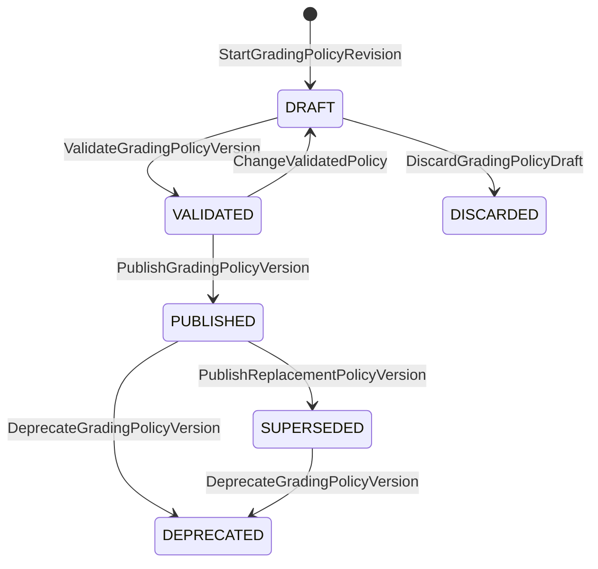
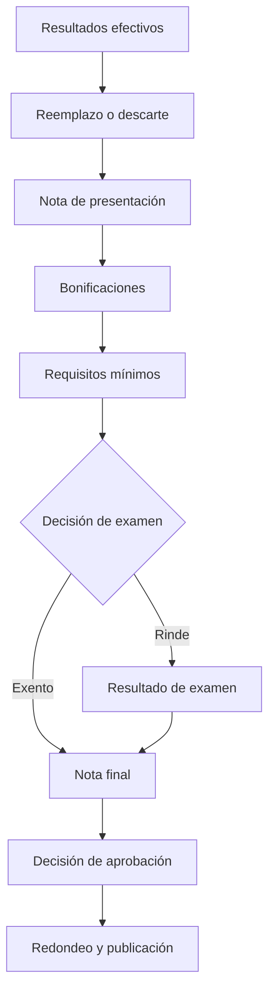
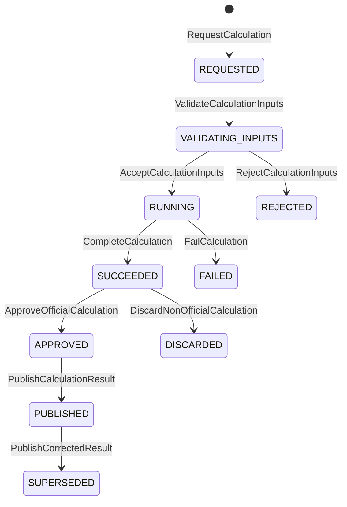

<a id="top"></a>

# ADR UI/UX: Política de calificación transparente y reproducible

- **Status:** Accepted
- **Validation:** Internally validated
- **Date:** 2026-07-27
- **Decision owner:** Product Owner
- **Related decision:** [`2026-07-27-assessment-domain-foundations.md`](2026-07-27-assessment-domain-foundations.md)
- **Technical impact:** Confirmed

## Contexto

Una evaluación no termina al producir puntajes por criterio. GradeOps AI debe
transformar evidencias, componentes, bonificaciones, recuperativas y examen en
resultados académicos que docentes y estudiantes puedan comprender y
reconstruir.

Resolverlo mediante fórmulas libres, scripts o una nota final editable
introduciría riesgos difíciles de controlar:

- reglas que cambian sin dejar historia;
- cálculos imposibles de validar antes de publicar;
- resultados sin explicación reproducible;
- diferencias entre lo que calcula el sistema y lo que muestra la interfaz;
- dependencia de conocimiento tácito del docente;
- imposibilidad de simular impacto y casos límite.

La transparencia no puede ser un texto agregado después del cálculo. Debe
derivarse de la misma ejecución determinista que produjo el resultado.

## Opciones consideradas

### Opción A: fórmula o script libre

Ofrece máxima expresividad inicial, pero dificulta validación, seguridad,
versionado, explicación y compatibilidad.

### Opción B: tipos rígidos de plan de notas

Simplifica los casos comunes, pero obliga a crear variantes por institución y
no representa adecuadamente planes mixtos.

### Opción C: bloques deterministas y versionados

Compone políticas mediante operaciones permitidas, contratos cerrados y orden
de ejecución explícito. Limita la libertad arbitraria, pero permite validar,
simular, explicar y versionar cada regla.

## Decisión

Se adopta la opción C.

### Conceptos separados

```text
GradingPolicy
└── GradingPolicyVersion
    ├── inputs
    ├── calculationGraph
    ├── constraints
    ├── roundingPolicy
    ├── publicationState
    └── visibilityPolicy

CalculationExecution
├── policyVersionReference
├── inputResultRevisions
├── intermediateSteps
├── adjustments
├── effectiveResult
└── humanExplanation
```

`GradingPolicy` mantiene identidad y procedencia. Cada
`GradingPolicyVersion` publicada es inmutable. `CalculationExecution` conserva
la versión exacta, entradas y pasos que produjeron un resultado.



| Origen | Comando | Guardas principales | Destino | Evento |
|---|---|---|---|---|
| Inexistente o publicada | `StartGradingPolicyRevision` | Actor autorizado y versión de origen válida | `DRAFT` | `GradingPolicyRevisionStarted` |
| `DRAFT` | `ValidateGradingPolicyVersion` | Grafo acíclico, entradas completas y casos de prueba válidos | `VALIDATED` | `GradingPolicyVersionValidated` |
| `VALIDATED` | `ChangeValidatedPolicy` | Actor autorizado; cualquier cambio invalida la validación | `DRAFT` | `GradingPolicyValidationInvalidated` |
| `VALIDATED` | `PublishGradingPolicyVersion` | Vista previa aprobada y vigencia definida | `PUBLISHED` | `GradingPolicyVersionPublished` |
| `PUBLISHED` | `PublishReplacementPolicyVersion` | Reemplazo validado y análisis de impacto | `SUPERSEDED` | `GradingPolicyVersionSuperseded` |
| `PUBLISHED`, `SUPERSEDED` | `DeprecateGradingPolicyVersion` | Motivo y reemplazo recomendado cuando exista | `DEPRECATED` | `GradingPolicyVersionDeprecated` |
| `DRAFT` | `DiscardGradingPolicyDraft` | Motivo obligatorio | `DISCARDED` | `GradingPolicyDraftDiscarded` |

### Bloques configurables iniciales

El MVP utilizará un catálogo gobernado:

```text
WeightedAverage
ScaleConversion
ThresholdDecision
MinimumRequirement
BonusAdjustment
ReplacementRule
CapValue
RoundValue
ConditionalBranch
```

Las operaciones tendrán esquema, tipos de entrada y salida, restricciones,
semántica de errores y versión. No se admitirán código arbitrario ni expresiones
sin contrato.

| Bloque | Responsabilidad |
|---|---|
| `WeightedAverage` | Combinar entradas mediante ponderaciones validadas |
| `ScaleConversion` | Convertir puntaje a una escala publicada |
| `ThresholdDecision` | Resolver una decisión binaria por umbral |
| `MinimumRequirement` | Exigir un mínimo independiente del promedio |
| `BonusAdjustment` | Aplicar bonificación con límites explícitos |
| `ReplacementRule` | Sustituir o descartar un resultado según política |
| `CapValue` | Aplicar un tope máximo o mínimo |
| `RoundValue` | Redondear en una etapa declarada |
| `ConditionalBranch` | Elegir una ruta determinista mediante condición tipada |

### Orden explícito

El grafo de cálculo declarará el orden real. Como referencia:



El orden podrá variar según la política, pero nunca quedará implícito. Redondear
resultados intermedios y redondear solo el resultado final son políticas
distintas.

### Publicación y vigencia

Antes de publicar, el editor debe:

- validar tipos, referencias, rangos y dependencias;
- detectar ciclos, entradas faltantes y pasos inalcanzables;
- comprobar ponderaciones y requisitos;
- ejecutar casos de prueba y límites;
- mostrar una vista previa docente y estudiantil;
- informar qué parámetros están bloqueados por política institucional.

La publicación congela la versión aplicable. Cambiar una regla crea otra
versión; no recalcula resultados históricos silenciosamente.

### Simulación y explicación

La simulación utilizará el mismo motor determinista, pero sus resultados se
marcarán como hipotéticos y no podrán publicarse como calificación oficial.

| Modo | Entradas | Persistencia | Puede publicarse | Uso |
|---|---|---|---:|---|
| `VALIDATION` | Casos de prueba de la política | Evidencia de validación | No | Verificar el grafo antes de publicar |
| `SIMULATION` | Datos reales o hipotéticos identificados | Traza separada y no oficial | No | Previsualizar impacto |
| `OFFICIAL` | Revisiones efectivas y política publicada | Ejecución auditable | Sí, con autorización | Producir resultado académico |
| `RECALCULATION_PREVIEW` | Entradas afectadas y versión propuesta | Análisis de impacto | No | Evaluar una corrección |



`APPROVED`, `PUBLISHED` y `SUPERSEDED` solo aplican a ejecuciones `OFFICIAL`.
Una ejecución de validación, simulación o análisis de impacto termina en
`SUCCEEDED` o `DISCARDED` y nunca avanza mediante el comando de publicación.

La explicación se construirá desde `intermediateSteps`, no desde un segundo
algoritmo ni desde una inferencia generativa. La IA podrá traducir o mejorar
claridad, pero los valores, reglas y causalidad procederán de la traza.

Ejemplo:

```text
Presentación:                    5,2
Regla de eximición:              presentación >= 5,0
Decisión:                        EXEMPT
Nota final antes de redondeo:    5,2
Política de redondeo:            un decimal
Resultado publicado:             5,2
```

### Corrección de políticas

Corregir una política publicada requiere:

1. crear una versión de reemplazo;
2. documentar motivo, actor y autorización;
3. calcular el impacto sin modificar resultados;
4. identificar participantes afectados;
5. aprobar la aplicación;
6. generar nuevas revisiones de resultados;
7. notificar el cambio y conservar ambas versiones.

Una excepción individual no modifica la política general.

| Paso | Artefacto de salida | Modifica resultados vigentes |
|---:|---|---:|
| 1. Crear reemplazo | Nueva `GradingPolicyVersion` en borrador | No |
| 2. Documentar y autorizar | Motivo, actor y alcance | No |
| 3. Simular impacto | `RECALCULATION_PREVIEW` | No |
| 4. Identificar afectados | Conjunto reproducible de participantes | No |
| 5. Aprobar aplicación | Decisión humana auditable | No |
| 6. Recalcular | Nuevas revisiones de resultado | Sí, sin sobrescribir |
| 7. Publicar y notificar | Nueva revisión publicada | Sí, conserva historial |

## Invariantes

1. Toda política publicada posee una versión inmutable.
2. Todo resultado oficial referencia la versión exacta utilizada.
3. Toda entrada del cálculo referencia una revisión identificable.
4. La explicación deriva de la misma ejecución que produjo el resultado.
5. Una política se valida antes de publicarse.
6. Un cambio crea una versión nueva.
7. Ningún cambio recalcula resultados silenciosamente.
8. Todo impacto se presenta antes de aplicar una corrección.
9. Las políticas institucionales pueden bloquear parámetros.
10. Toda excepción registra actor, motivo y autorización.
11. La vista estudiantil no expone información privada, interna o de terceros.
12. Las reglas configurables usan solamente operaciones deterministas permitidas.
13. Una simulación nunca se presenta como resultado oficial.
14. La IA no decide ni altera reglas académicas de forma autónoma.

## Alcance

### MVP

- editor guiado mediante bloques permitidos;
- validación matemática y académica;
- ponderación, escala, umbrales, mínimos, bonos, topes y redondeo;
- simulador de casos hipotéticos;
- vista previa docente y estudiantil;
- publicación versionada;
- traza individual y explicación legible;
- análisis de impacto previo a una corrección.

### Previsto, no implementado

- lenguaje de reglas libre;
- scripting;
- marketplace de políticas;
- aprobación institucional multinivel;
- migración masiva automática;
- optimización o diseño autónomo de políticas mediante IA.

## Consecuencias

- GradeOps AI tratará transparencia, reproducibilidad y auditabilidad como
  capacidad de producto, no como reporte secundario.
- API y persistencia necesitarán versiones, ejecuciones y revisiones de
  resultados.
- Web deberá ofrecer edición guiada, simulación, vista previa y explicación.
- Las pruebas deberán cubrir cada bloque, composición, orden, redondeo y casos
  límite mediante ejemplos dorados.
- La flexibilidad arbitraria se pospone a favor de seguridad y validación.

## Impacto potencial en la plataforma

El impacto se registra en `DMI-013` del
[`Data Model Impact Ledger`](data-model-impact-ledger.md).

Esta decisión no define todavía clases, tablas, endpoints ni el lenguaje físico
del grafo de cálculo.

## Validación

La decisión fue aceptada internamente por el Product Owner durante la etapa 02.
Debe validarse externamente con políticas reales de distintas instituciones,
prestando especial atención a comprensión, redondeo, excepciones y simulación.

## Condición de revisión

Revisar si una política académica real no puede representarse con bloques
deterministas sin introducir ambigüedad o si los docentes no comprenden la
relación entre configuración, simulación y publicación.

## Referencias

- [`2026-07-27-assessment-domain-foundations.md`](2026-07-27-assessment-domain-foundations.md)
- [`2026-07-27-assessment-template-lifecycle-governance.md`](2026-07-27-assessment-template-lifecycle-governance.md)
- [`business-rule-catalog.md`](business-rule-catalog.md)
- [`data-model-impact-ledger.md`](data-model-impact-ledger.md)

---

[← Índice de decisiones](README.md) · [Siguiente: Temporalidad académica →](2026-07-27-academic-period-section-enrollment.md) · [↑ Volver al inicio](#top)
