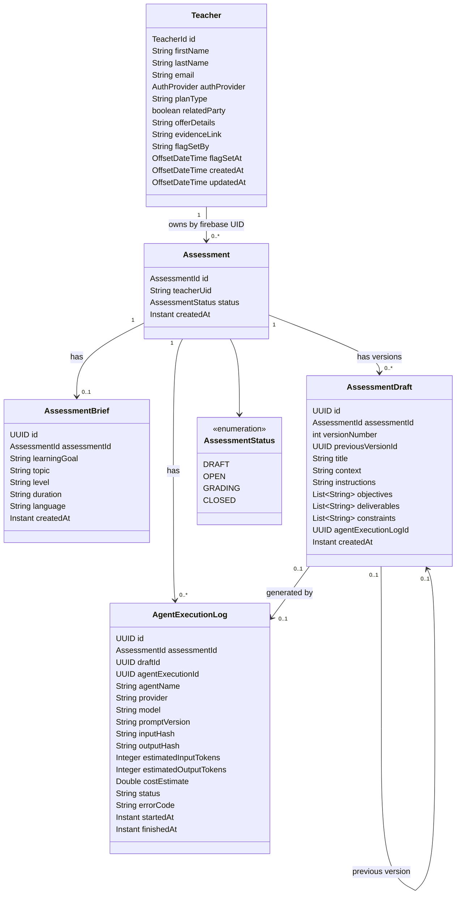
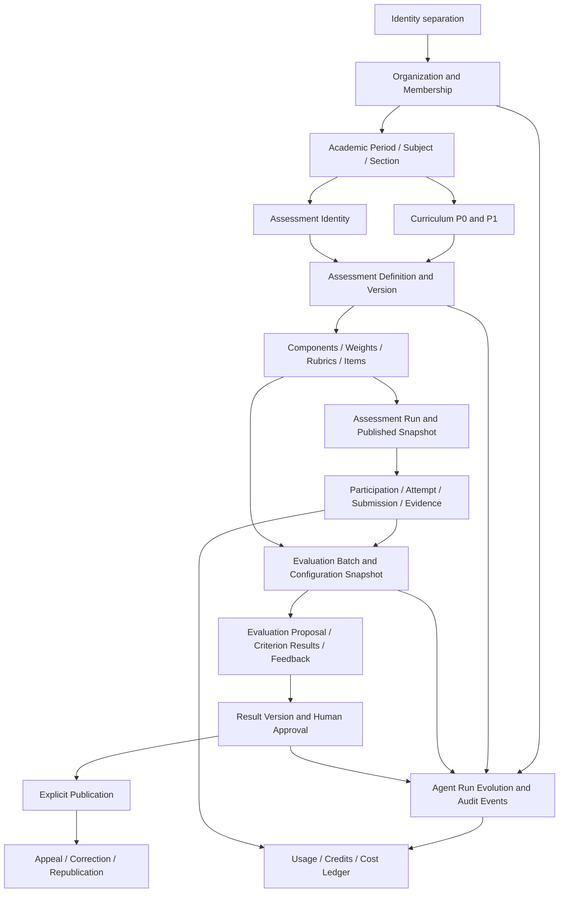

# Research 01 — Current Domain & Data Model Alignment Audit

**Repository:** `cmartinezs/grade-ops-ai`  
**Audited snapshot:** PR #94 head, commit `e6ab06de496ffb3bde7fc9774503f106ac5e36d0`  
**Former branch:** `design`  
**Audit date:** 2026-07-28  
**Research 00 relationship:** This report replaces implementation-level uncertainty from Research 00 for the domain and persistence scope. It does not repeat the strategic assessment.

---

## 1. Executive Summary

GradeOps AI currently implements a **small but coherent assessment-draft bounded context**, not yet the broader academic evaluation domain described by the approved design.

The executable model contains five central academic/operational records:

1. `Teacher`
2. `Assessment`
3. `AssessmentBrief`
4. `AssessmentDraft`
5. `AgentExecutionLog`

The implemented workflow is:

```text
Authenticated teacher
  → creates Assessment + AssessmentBrief
  → invokes assessment agent
  → persists AgentExecutionLog
  → persists versioned AssessmentDraft
  → optionally regenerates a new draft version
  → optionally edits the current version in place
```

This implementation is useful and reusable, but it represents only the **assessment authoring intake and draft-generation slice**. It does not yet implement:

- organizations, memberships, contextual roles or permissions;
- academic periods, courses, subjects, sections, teachers assigned to sections, students or enrollments;
- structured curriculum entities;
- assessment components, composite assessments, weights, rubrics, items or frozen assessment configuration;
- participation, attempts, submissions, evidence or resubmissions;
- evaluation, criterion-level results, grades, feedback or evaluation batches;
- result approval, explicit publication, correction, republication or immutable result history;
- appeals, appeal windows, academic calendars, business days or timezone-aware deadline policies;
- credit balances, usage transactions or cost ledgers.

### Overall assessment

| Area | Current state | Classification |
|---|---|---|
| Teacher identity | Implemented for one teacher account, without tenant/membership context | `PARTIALLY_ALIGNED` |
| Assessment authoring | Brief + AI-generated draft implemented | `PARTIALLY_ALIGNED` |
| Draft versioning | Strong for AI regeneration; incomplete for human edits | `PARTIALLY_ALIGNED` |
| AI output authority | AI output persists as a draft, not as an authoritative grade/result | `ALIGNED` |
| AI traceability | Provider/model/prompt/hash/tokens/cost/status persisted | `PARTIALLY_ALIGNED` |
| Academic structure | No executable model | `MISSING` |
| Curriculum | Free-text intake only; no reusable or relational curriculum model | `PARTIALLY_ALIGNED` at intake, otherwise `MISSING` |
| Assessment design semantics | No type/components/rubric/weights/rules | `MISSING` |
| Participation and submissions | No executable model | `MISSING` |
| Evaluation and results | No executable model | `MISSING` |
| Approval vs publication | No executable result governance lifecycle | `MISSING` |
| Appeals and academic calendar | No executable model | `MISSING` |
| Full auditability | Partial agent evidence; no immutable human decision history | `PARTIALLY_ALIGNED` |
| Credits and usage | Plan flags and estimated AI cost only | `PARTIALLY_ALIGNED` |

### Principal conclusion

The current codebase is **not semantically compatible enough to implement the approved product by merely adding fields to `Assessment`**. The correct direction is to preserve the existing authoring slice, then introduce the missing academic and evaluation aggregates around it.

The highest-risk mistake would be to evolve the current `Assessment.status` into a universal status covering authoring, publication, grading, result approval and job execution. The approved design explicitly requires those dimensions to remain separate.

There are **zero critical `INDETERMINATE` findings** in this audit. The critical concepts are classified as implemented, partially implemented, conflicting or missing based on executable code, migrations, contracts and tests.

---

## 2. Scope and Methodology

### 2.1 Scope

The audit inspected:

- domain models and aggregate roots;
- value objects and enums;
- application use cases and ownership checks;
- JPA entities and persistence adapters;
- Flyway migrations;
- API requests/responses where they expose domain semantics;
- API-to-agents structured contracts;
- domain and persistence tests;
- accepted ADRs and current design-system governance documents;
- architecture documentation only where needed to identify the approved target.

The audit did not attempt a full review of:

- React components or visual design;
- cloud infrastructure;
- CI/CD;
- general performance;
- commercial pricing;
- complete agents runtime architecture;
- complete API contract design;
- production database contents.

### 2.2 Snapshot discipline

All decisive file reads were performed against:

```text
e6ab06de496ffb3bde7fc9774503f106ac5e36d0
```

This is the head commit of the former `design` branch merged by PR #94. Using a fixed commit prevents conclusions from drifting with later changes to `develop`.

### 2.3 Evidence method

For each target capability, the audit followed this sequence:

1. Search for domain symbols and equivalent terminology.
2. Inspect actual domain classes.
3. Inspect JPA mappings.
4. Inspect Flyway migrations.
5. Follow use cases, repositories and API contracts.
6. Inspect tests for invariants and persistence behavior.
7. Contrast the implementation with accepted ADRs and the latest approved design.
8. Classify the result using only:
   - `ALIGNED`
   - `PARTIALLY_ALIGNED`
   - `MISSING`
   - `CONFLICTING`
   - `OBSOLETE`
   - `INDETERMINATE`

### 2.4 Limitations

This was a static repository audit through the GitHub connector. The following were not executed:

- Maven test suites;
- Flyway migrations against a new database;
- production or beta database queries;
- runtime API calls.

This does not prevent classification of the domain and schema because the migrations, mappings, use cases and tests are explicit. It does mean the report cannot quantify how many production rows require backfill.

---

## 3. Evidence Quality

| Evidence category | Quality | Notes |
|---|---|---|
| Domain classes | High | Exact classes inspected at fixed commit. |
| Persistence entities | High | Exact JPA mappings inspected. |
| Schema | High | Flyway V1–V12 inspected and current schema guide cross-checked. |
| Relationships | High | FK definitions and Testcontainers integration test inspected. |
| Domain invariants | High for existing slice | Domain unit tests directly express creation and draft-version invariants. |
| Target semantics | High | Accepted ADRs, product workflow and design governance inspected. |
| Missing capabilities | High | No executable symbols/migrations found, and repository documentation explicitly marks the corresponding tables as future. |
| Historical production data | Low | No database connection or row-level inspection. |
| Runtime behavior | Medium–High | Use cases and tests are explicit, but tests were not executed during this audit. |

### Evidence confidence statement

The repository provides enough evidence to describe the current academic domain and persistence model. Critical missing capabilities are not inferred from folder names: their absence is supported by all of the following:

- executable domain packages contain only the current authoring slice;
- current Flyway schema ends at V12;
- the database guide explicitly lists the missing tables as planned;
- API endpoints cover only assessment creation and draft operations;
- searches for `Rubric`, `StudentSubmission`, `GradeResult`, `Appeal`, `CurriculumNode` and `LearningObjective` return documentation rather than executable implementation.

---

## 4. Repository Areas Inspected

### API domain and application

```text
api/src/main/java/cl/gradeops/ai/api/teacher/
api/src/main/java/cl/gradeops/ai/api/assessment/
api/src/main/java/cl/gradeops/ai/api/shared/domain/
api/src/main/java/cl/gradeops/ai/api/shared/application/security/
api/src/main/java/cl/gradeops/ai/api/agentclient/
```

### Persistence and migrations

```text
api/src/main/resources/db/migration/V1__create_teacher_table.sql
api/src/main/resources/db/migration/V2__add_pilot_flag_columns.sql
api/src/main/resources/db/migration/V9__add_assessments.sql
api/src/main/resources/db/migration/V10__add_assessment_briefs.sql
api/src/main/resources/db/migration/V11__add_assessment_drafts.sql
api/src/main/resources/db/migration/V12__add_agent_execution_logs.sql
```

### Tests

```text
api/src/test/java/cl/gradeops/ai/api/assessment/domain/model/
api/src/test/java/cl/gradeops/ai/api/assessment/application/usecase/
api/src/test/java/cl/gradeops/ai/api/assessment/infrastructure/adapter/out/persistence/
api/src/test/java/cl/gradeops/ai/api/teacher/domain/model/
```

### Normative and target documentation

```text
docs/99-decisions/
docs/02-product/
docs/04-architecture/data-model.md
design-system/decisions/data-model-impact-ledger.md
design-system/governance/roles-and-authority.md
docs/09-developer-guide/05-database-guide.md
```

---

## 5. Current Domain Model

### 5.1 Neutral reconstruction



### 5.2 Implemented aggregate behavior

#### `Teacher`

- Provisions an account from Firebase identity data.
- Stores pilot/commercial flags directly on the teacher record.
- Supports a mutable partial update of those flags.
- Does not represent organization, membership, role or contextual permission.

#### `Assessment`

- Is an explicit aggregate root.
- Requires a nonblank `teacherUid`.
- Starts in `DRAFT`.
- Has no domain methods for `open`, `close`, `approve`, `publish`, `grade` or correction.
- Its enum is therefore a vocabulary without an enforced transition model.

#### `AssessmentBrief`

- Is an aggregate root separate from `Assessment`.
- Represents authoring intake.
- Enforces only non-null/nonblank fields.
- Has no structured curriculum references or typed duration/level/language semantics.

#### `AssessmentDraft`

- Is a separate aggregate root.
- Initial generation creates version 1.
- AI regeneration creates a new row and links to the previous version.
- List fields are defensively copied and exposed as immutable lists.
- Human editing updates the current row in place and preserves the same version and original creation timestamp.

#### `AgentExecutionLog`

- Is a separate aggregate root.
- Records agent execution metadata and failure evidence.
- Can be back-linked to a produced draft.
- Does not model human review, approval, rejection, accepted output version or frozen evaluation configuration.

---

## 6. Current Data Model

### 6.1 Executable academic schema

```mermaid
erDiagram
    TEACHER {
        varchar firebase_uid PK
        varchar first_name
        varchar last_name
        varchar email UK
        varchar provider
        timestamptz created_at
        timestamptz updated_at
        varchar plan_type
        boolean related_party
        text offer_details
        text evidence_link
        varchar flag_set_by
        timestamptz flag_set_at
    }

    ASSESSMENTS {
        uuid id PK
        varchar teacher_uid FK
        varchar status
        timestamptz created_at
    }

    ASSESSMENT_BRIEFS {
        uuid id PK
        uuid assessment_id FK_UK
        varchar learning_goal
        varchar topic
        varchar level
        varchar duration
        varchar language
        timestamptz created_at
    }

    ASSESSMENT_DRAFTS {
        uuid id PK
        uuid assessment_id FK
        int version_number
        uuid previous_version_id FK
        varchar title
        text context
        text instructions
        jsonb objectives
        jsonb deliverables
        jsonb constraints
        uuid agent_execution_log_id FK
        timestamptz created_at
    }

    AGENT_EXECUTION_LOGS {
        uuid id PK
        uuid assessment_id FK
        uuid draft_id FK
        uuid agent_execution_id
        varchar agent_name
        varchar provider
        varchar model
        varchar prompt_version
        varchar input_hash
        varchar output_hash
        int estimated_input_tokens
        int estimated_output_tokens
        double cost_estimate
        varchar status
        varchar error_code
        timestamptz started_at
        timestamptz finished_at
    }

    TEACHER ||--o{ ASSESSMENTS : owns
    ASSESSMENTS ||--o| ASSESSMENT_BRIEFS : has
    ASSESSMENTS ||--o{ ASSESSMENT_DRAFTS : versions
    ASSESSMENT_DRAFTS o|--o| ASSESSMENT_DRAFTS : previous
    ASSESSMENTS ||--o{ AGENT_EXECUTION_LOGS : logs
    ASSESSMENT_DRAFTS o|--o| AGENT_EXECUTION_LOGS : generated_by
```

### 6.2 Demonstrated database constraints

| Constraint | Current implementation | Assessment |
|---|---|---|
| Teacher email uniqueness | Unique index | Correct |
| Assessment owner FK | `assessments.teacher_uid → teacher.firebase_uid` | Correct for single-owner model |
| Brief cardinality | Unique `assessment_id` | Enforces max one brief per assessment |
| Draft assessment FK | Required FK with cascade delete | Correct |
| Draft version uniqueness | Unique `(assessment_id, version_number)` | Correct and important |
| Draft previous link | Self FK | Useful, but does not ensure same assessment or exact preceding version |
| Agent log assessment FK | Required FK | Correct |
| Agent log draft FK | Nullable, `ON DELETE SET NULL` | Supports failed runs |
| Draft-to-log FK | Nullable | Supports human/manual content but creates a cyclic optional relationship |

### 6.3 Missing database invariants

The schema does not enforce:

- allowed `AssessmentStatus` values;
- allowed agent execution statuses;
- allowed providers/models/operations;
- nonnegative tokens or cost;
- `finished_at >= started_at`;
- `previous_version_id` belongs to the same assessment;
- `previous.version_number = current.version_number - 1`;
- JSON arrays contain only valid nonblank strings;
- only one current draft;
- optimistic locking;
- an agent log produces at most one draft;
- human edit actor, timestamp, reason or diff;
- tenant boundaries beyond direct `teacher_uid`;
- immutable published snapshots;
- immutable approved results.

---

## 7. Domain Entity Inventory

| Element | Type | Responsibility | Persistence | Tests | Current decision |
|---|---|---|---|---|---|
| `Teacher` | Aggregate root | Authenticated teacher profile and pilot flags | `teacher` | Domain and adapter tests | `ADAPT` |
| `TeacherId` | Value object | Firebase UID identity | `teacher.firebase_uid` | Indirectly tested | `KEEP` initially |
| `AuthProvider` | Enum | Authentication provider | `teacher.provider` as string | Domain tests | `KEEP` |
| `Assessment` | Aggregate root | Minimal assessment identity, owner and broad status | `assessments` | Domain tests | `ADAPT` |
| `AssessmentId` | Value object | UUID assessment identity | Multiple tables | Domain tests | `KEEP` |
| `AssessmentStatus` | Enum | `DRAFT`, `OPEN`, `GRADING`, `CLOSED` | String | Basic tests only | `ADAPT` or rename |
| `AssessmentBrief` | Aggregate root | Free-text assessment generation intake | `assessment_briefs` | Domain and persistence tests | `ADAPT` |
| `AssessmentDraft` | Aggregate root | Versioned generated assessment draft | `assessment_drafts` | Strong domain tests | `ADAPT` |
| `AgentExecutionLog` | Aggregate root | AI invocation evidence and cost estimate | `agent_execution_logs` | Coordinator/domain/adapter tests | `ADAPT` |
| `AggregateRoot` | Shared base | Domain event collection | Not persisted | Infrastructure tests | `KEEP` |
| `OwnershipVerifier` | Application security service | Direct owner UID check | N/A | Use-case tests | `ADAPT` |
| `DraftGenerationCoordinator` | Application coordinator | External agent call + transactional log/draft persistence | N/A | Focused unit tests | `KEEP` pattern |
| `PasswordResetCode` | Auth aggregate | Password reset workflow | Auth table | Auth tests | Outside academic scope |

No executable equivalents were found for the remaining target academic concepts.

---

## 8. Target Model Summary

The approved direction requires several distinct semantic layers.

### 8.1 Identity and tenancy

```text
Organization
  └── Membership
       └── User/Teacher
```

Permissions must be contextual to organization and resources rather than derived only from one global owner UID.

### 8.2 Academic context

```text
Organization
  └── Academic Period
       └── Subject/Course
            └── Section
                 ├── Teacher assignments
       └── Student enrollments
```

### 8.3 Curriculum

At minimum, the accepted ADR defines:

```text
P0:
subject_area + topic tags + learning outcome strings

P1:
Subject
  └── CurriculumNode hierarchy
       └── LearningObjective
```

The latest approved design further requires curriculum coverage by unit, topic/content, objective, criterion and indicator.

### 8.4 Assessment design

The target needs to separate:

- assessment identity;
- assessment definition/version;
- assessment type or mode;
- components;
- component scope: individual/group;
- weights;
- rubric/version;
- criteria and indicators;
- evidence requirements;
- item/question snapshots;
- scoring/evaluation configuration;
- publication/run configuration.

### 8.5 Participation, evaluation and result governance

```text
Assessment Run
  └── Participation
       └── Attempt
            └── Submission/Evidence
                 └── Evaluation Proposal
                      └── Human Review
                           └── Approved Result Version
                                └── Explicit Publication
                                     └── Appeal/Correction/Republication
```

AI output is a proposal. Human authority and publication are separate domain actions.

---

## 9. Current → Target Mapping

| Target concept | Existing equivalent | Reuse | Change required | New concept required | Migration risk |
|---|---|---:|---|---:|---|
| User identity | `Teacher` / Firebase UID | High | Separate identity from academic role and tenant | Yes: `UserAccount` or equivalent | Medium |
| Organization | None | None | — | Yes | Critical |
| Membership | None | None | — | Yes | Critical |
| Contextual role/permission | Direct `teacherUid` ownership | Low | Replace direct-only authorization with resource context | Yes | High |
| Academic period | None | None | — | Yes | High |
| Course/Subject | Free-text `topic`/`language` only | Low | Normalize context and ownership | Yes | High |
| Section | None | None | — | Yes | Critical |
| Teacher assignment | Assessment owner only | Low | Support multiple assignments and delegated authority | Yes | High |
| Student/Learner reference | None | None | — | Yes | Critical |
| Enrollment/participant | None | None | — | Yes | Critical |
| Curriculum P0 tags | `learningGoal`, `topic` | Medium | Add subject/outcome/tags with stable semantics | No for P0; fields required | Medium |
| Curriculum P1 | None | None | — | Yes | High |
| Assessment identity | `Assessment` | High | Add tenant/context and split state dimensions | Possibly supporting aggregates | High |
| Assessment authoring intake | `AssessmentBrief` | High | Type fields and connect to curriculum/context | No | Medium |
| Assessment version | `AssessmentDraft` | High | Make all meaningful edits versioned; add origin/actor/config | Possibly rename/evolve | High |
| Assessment type/mode | No field | None | — | Yes | High |
| Composite assessment | None | None | — | Yes: `AssessmentComponent` | Critical |
| Group/individual component scope | None | None | — | Yes | Critical |
| Weights | None | None | — | Yes value object/rules | Critical |
| Rubric | None | None | — | Yes | Critical |
| Criterion/indicator | String objective lists only | Low | Structured criterion model | Yes | Critical |
| Question/item | None | None | — | Yes | High |
| Frozen published snapshot | None | None | — | Yes | Critical |
| Assessment run/publication | `AssessmentStatus.OPEN` vocabulary only | Low | Explicit publish/open commands and snapshot | Yes | Critical |
| Participation | None | None | — | Yes | Critical |
| Attempt | None | None | — | Yes | Critical |
| Submission/evidence | None | None | — | Yes | Critical |
| Evaluation proposal | None | None | — | Yes | Critical |
| Criterion result | None | None | — | Yes | Critical |
| Evaluation batch/config snapshot | None | None | — | Yes | High |
| Grade/result | None | None | — | Yes | Critical |
| Result version | Draft versioning pattern only | Pattern reuse | Apply immutable version pattern to results | Yes | Critical |
| Approval event | None | None | — | Yes | Critical |
| Publication event | None | None | — | Yes | Critical |
| Correction/republication | None | None | — | Yes | High |
| Appeal/window | None | None | — | Yes | High |
| Academic calendar/timezone | None | None | — | Yes | High |
| Agent run | `AgentExecutionLog` | High | Add operation/config/approval/outcome links | No, evolve current | High |
| Prompt/model snapshot | Partial strings | Medium | Freeze exact runtime configuration and tools | Supporting records/JSON | High |
| Human decision | None | None | — | Yes | Critical |
| Credit balance/transaction | None | None | — | Yes | High |
| AI cost | `costEstimate` | Medium | Numeric money semantics and attribution | Cost event/ledger | Medium |
| Usage event | None | None | — | Yes | High |

---

## 10. Capability Alignment Matrix

| ID | Capability | Target | Current implementation | Evidence | Classification | Severity | Required evolution |
|---|---|---|---|---|---|---|---|
| CAP-001 | Teacher identity | Stable authenticated user | Firebase-backed `Teacher` aggregate | E-001, E-002 | `ALIGNED` for identity | Low | Preserve identity mapping |
| CAP-002 | Organization tenancy | Tenant boundary independent from user | No organization entity/table | E-003, E-020 | `MISSING` | Critical | Introduce organization and backfill |
| CAP-003 | Membership and roles | Contextual membership/authority | No membership/role/permission model | E-001, E-021 | `MISSING` | Critical | Introduce membership and policy model |
| CAP-004 | Resource ownership | Contextual authorization | Direct `teacherUid == authenticatedUid` | E-022 | `PARTIALLY_ALIGNED` | High | Resolve owner through tenant/resource context |
| CAP-005 | Academic structure | Period/course/section/participants | No executable model | E-020 | `MISSING` | Critical | Introduce academic aggregates |
| CAP-006 | Curriculum P0 | Subject/topic/outcome tags | Free-text learning goal and topic only | E-005, E-023 | `PARTIALLY_ALIGNED` | High | Add stable P0 fields and semantics |
| CAP-007 | Curriculum P1 | Versionable structured taxonomy | Documentation only | E-023, E-024 | `MISSING` | Critical | Introduce relational curriculum |
| CAP-008 | Assessment identity | Stable assessment aggregate | Minimal aggregate implemented | E-004 | `PARTIALLY_ALIGNED` | High | Add organization, context, version/run links |
| CAP-009 | Assessment lifecycle | Separate authoring/publish/open/close dimensions | One enum with no transition methods | E-004, E-006, E-025 | `PARTIALLY_ALIGNED` | Critical | Split state machines and enforce transitions |
| CAP-010 | Assessment intake | Teacher declares evaluative intent | `AssessmentBrief` implemented | E-005, E-026 | `PARTIALLY_ALIGNED` | Medium | Type fields and link context/curriculum |
| CAP-011 | Assessment versioning | Immutable/reviewable versions | AI regeneration versioned; human edit in place | E-007, E-027 | `PARTIALLY_ALIGNED` | Critical | Version every authoritative content change |
| CAP-012 | Assessment modes | Open/closed/mixed semantics | No mode field | E-025 | `MISSING` | High | Introduce mode/type |
| CAP-013 | Composite assessments | Group and individual components with weights | No component model | E-020 | `MISSING` | Critical | Introduce component aggregate/entities |
| CAP-014 | Rubrics | Versioned criteria and weights | Documentation only | E-020, E-028 | `MISSING` | Critical | Introduce rubric and criteria |
| CAP-015 | Questions/items | Items and frozen snapshots | Documentation only | E-020, E-029 | `MISSING` | High | Introduce bank/items/snapshots |
| CAP-016 | Participation/attempt | Student + assessment run abstraction | No executable model | E-020, E-030 | `MISSING` | Critical | Introduce participation and attempts |
| CAP-017 | Submission/evidence | Immutable/traceable submission history | No executable model | E-020, E-030 | `MISSING` | Critical | Introduce submission/evidence/versioning |
| CAP-018 | Evaluation proposal | AI/deterministic evaluation separate from result | No executable model | E-020, E-025 | `MISSING` | Critical | Introduce evaluation proposal/config |
| CAP-019 | Criterion results | Score/evidence per criterion | No executable model | E-020 | `MISSING` | Critical | Introduce criterion result |
| CAP-020 | Result governance | Proposed/reviewed/approved/published | No result entity or lifecycle | E-020, E-025, E-031 | `MISSING` | Critical | Introduce result versions and commands |
| CAP-021 | Approval vs publication | Separate explicit human actions | No implementation | E-031, E-032 | `MISSING` | Critical | Separate approval and publication events |
| CAP-022 | Corrections | Preserve original and create corrected version | No implementation | E-029 | `MISSING` | High | Immutable result correction flow |
| CAP-023 | Appeals | Window, status and resolution | No executable model | E-030 | `MISSING` | High | Introduce appeal policy records |
| CAP-024 | Academic calendar | Timezone/business-day deadlines | No executable model | E-033 | `MISSING` | High | Introduce calendar/version/timezone |
| CAP-025 | AI run evidence | Every agent run traceable | `AgentExecutionLog` implemented | E-008, E-034 | `PARTIALLY_ALIGNED` | High | Add operation/config/tools/decision links |
| CAP-026 | AI output authority | AI remains non-authoritative | AI produces `AssessmentDraft` only | E-034, E-035 | `ALIGNED` | Critical positive | Preserve separation |
| CAP-027 | Human decision audit | Who/when/from/to/why | No approval event; edited draft overwrites row | E-007, E-027, E-031 | `MISSING` | Critical | Introduce immutable decision/event records |
| CAP-028 | Concurrency safety | Optimistic locking/idempotency | Unique version constraint only | E-013, E-036 | `PARTIALLY_ALIGNED` | High | Add lock/version/idempotency |
| CAP-029 | AI cost attribution | Reliable cost per operation | Double estimate on agent log | E-008, E-014 | `PARTIALLY_ALIGNED` | Medium | Use precise numeric money and cost event |
| CAP-030 | Credits/usage | Balance and immutable consumption ledger | Teacher plan flag only; no ledger | E-002, E-037 | `MISSING` | High | Introduce usage/credit transactions |
| CAP-031 | Dashboard semantics | Real submission/approval/report metrics | Hardcoded `0`, `0`, `null` | E-038 | `CONFLICTING` | Medium | Remove placeholders or mark unavailable |
| CAP-032 | Database/ORM consistency | Migrations tested against PostgreSQL | Dedicated Testcontainers+Flyway FK test | E-039 | `ALIGNED` | Low | Extend pattern to future migrations |

---

## 11. Detailed Domain Analysis

### Identity & Membership

#### Current implementation

`Teacher` is both:

- authenticated user identity;
- teacher profile;
- owner of assessments;
- holder of pilot plan and business evidence flags.

Its ID is the Firebase UID. `Assessment.teacherUid` references the same value.

#### Alignment

`PARTIALLY_ALIGNED`

The implementation is sound for a single-user MVP but conflates identity, academic role, commercial account and tenant ownership.

#### Problems

- No organization boundary.
- No membership.
- No contextual role.
- No multiple teachers per section.
- No substitute/delegate authority.
- No distinction between “created by”, “owned by”, “assigned teacher” and “authorized reviewer”.
- Deleting a teacher cascades to all assessments, which is unsafe once assessments belong to an institution rather than an individual account.

#### Reusable elements

- Firebase UID integration.
- `TeacherId`.
- authentication provider enum.
- profile data.
- the practice of hiding unauthorized resources as not found.

#### Required evolution

- Introduce `Organization`.
- Introduce `Membership` with role/status/effective dates.
- Move tenant ownership from `teacher_uid` to `organization_id`.
- Add `created_by` and possibly `owned_by_membership_id`.
- Preserve `teacher_uid` temporarily for compatibility/backfill.
- Replace direct equality authorization with contextual policy checks.

---

### Academic Structure

#### Current implementation

None beyond the teacher owning an assessment.

There is no executable representation of:

- academic period;
- course;
- subject;
- section;
- teacher assignment;
- student;
- enrollment;
- academic calendar;
- timezone.

#### Alignment

`MISSING`

#### Consequence

The current model cannot express:

```text
Institution
  → Academic Period
    → Section
      → Teachers
      → Students
```

It also cannot scope assessments, curriculum coverage, results, appeals or reporting to a section.

#### Required evolution

Introduce academic context before implementing submissions and results. Otherwise those records will be keyed directly to ad hoc strings or assessment IDs and will require a second migration later.

---

### Curriculum

#### Current implementation

`AssessmentBrief` stores:

- `learningGoal`
- `topic`
- `level`
- `language`

All are required strings.

`AssessmentDraft` stores `objectives` as a JSON array of strings.

#### Alignment

- Intake-level evaluative intent: `PARTIALLY_ALIGNED`
- Accepted P0 taxonomy: `PARTIALLY_ALIGNED`
- Structured P1 taxonomy: `MISSING`

#### Semantic gap

The accepted P0 model expects stable fields such as subject area, learning outcome and topic tags. Current fields are not sufficient because:

- `topic` is singular and untyped;
- `learningGoal` is free prose and not a stable outcome identifier;
- `objectives` live inside each draft version and are not reusable curriculum references;
- no ownership or master taxonomy exists;
- no criterion/indicator relationship exists;
- no curriculum version can be frozen for an assessment.

#### Required evolution

1. Implement P0 explicitly without pretending current strings are a taxonomy.
2. Add subject/outcome/tag fields with stable semantics.
3. Add nullable relational IDs for P1.
4. Introduce `Subject`, `CurriculumNode`, `LearningObjective` and version/source metadata.
5. Link assessment versions/components/rubric criteria to curriculum references.

---

### Assessment Design

#### Current implementation

`Assessment` contains only ID, teacher UID, broad status and creation time.

`AssessmentBrief` captures free-text generation input.

`AssessmentDraft` contains:

- title;
- context;
- instructions;
- objectives;
- deliverables;
- constraints.

#### Alignment

`PARTIALLY_ALIGNED`

#### Missing semantics

No current model can represent:

- summative, formative or bonus assessments;
- open, closed or mixed mode;
- composite assessment components;
- group vs individual component scope;
- component weighting;
- conditional components;
- rubrics and criterion weights;
- item/question composition;
- evidence requirements;
- frozen configuration;
- approved assessment version;
- assessment run/publication.

The following approved example is not representable:

```text
Assessment
├── Group delivery — 40%
└── Individual presentation — 60%
```

#### Modeling issue

`AssessmentDraft` is a useful content draft, but it must not become a god entity containing every future assessment rule in one JSON document. Assessment definition, rubric, components, evidence rules and run configuration have distinct lifecycles.

#### Required evolution

- Preserve `Assessment` as identity/root.
- Evolve `AssessmentDraft` toward `AssessmentVersion` or a versioned definition.
- Introduce components and typed weights.
- Introduce separate rubric/version lifecycle.
- Introduce assessment run/publication snapshot.
- Keep authoring status separate from operational status.

---

### Participation & Submission

#### Current implementation

None.

The dashboard response includes `submissionCount`, but the persistence adapter hardcodes it to zero. This is not an implementation of submissions.

#### Alignment

`MISSING`

#### Consequences

The system cannot express:

- who participates in an assessment;
- team/group participation;
- an attempt;
- draft vs final submission;
- partial submission;
- evidence or attachments;
- lateness;
- absence;
- blocked work;
- make-up/recovery;
- resubmission;
- immutable submission history.

#### Required evolution

Introduce:

- `AssessmentRun`;
- `Participation`;
- optional `ParticipantGroup`;
- `Attempt`;
- `Submission`;
- `SubmissionVersion` or immutable submission events;
- `EvidenceArtifact`;
- status/reason/deadline fields.

The model should not reduce participation to a unique mutable `(student, assessment)` row.

---

### Evaluation

#### Current implementation

None.

`AgentExecutionLog` records assessment-draft generation only. There is no evaluation proposal, score, grade, feedback or criterion result.

#### Alignment

`MISSING`

#### Required evolution

Separate at least:

```text
EvaluationJob / Batch
EvaluationConfigurationSnapshot
EvaluationProposal
CriterionResult
FeedbackProposal
HumanReviewDecision
```

For open assessments, AI output must remain a proposal. For closed assessments, the accepted ADR requires deterministic scoring against a frozen answer-key snapshot.

---

### Result Governance

#### Current implementation

There is no `EvaluationResult`, `GradeResult`, result version or publication record.

`AssessmentStatus` values do not implement result governance. The domain exposes no transition methods and no endpoint performs approval or publication.

#### Alignment

`MISSING`

#### Important distinction

Current code is not classified `CONFLICTING` merely because it has a `status` field. The current status belongs to the assessment aggregate and appears intended as a broad operational lifecycle.

It would become `CONFLICTING` if reused to represent:

- AI proposal state;
- teacher review state;
- approval state;
- publication visibility;
- grading job state;
- appeal state.

#### Required evolution

Introduce separate dimensions and explicit commands:

```text
Evaluation proposal state
Result review/approval state
Publication state
Correction/version state
Appeal state
Job/batch state
```

Approval must not imply publication.

A correction must create a new result version and preserve which version was previously visible to the student.

---

### Appeals

#### Current implementation

None.

The existing product documentation previously deferred student appeals, while the latest approved design and this research scope require appeal-aware result governance. This is a target-policy tension, not uncertainty about current code.

#### Alignment

`MISSING`

#### Required data foundation

- appeal;
- appeal status;
- appeal subject/result version;
- opened/closed timestamps;
- deadline and timezone;
- appeal window configuration;
- academic calendar version;
- resolution;
- actor;
- correction/republication link.

The implementation should not calculate deadlines from an unversioned global configuration.

---

### AI-related Records

#### Current implementation

`AgentExecutionLog` stores:

- assessment ID;
- draft ID;
- remote execution ID;
- agent name;
- provider;
- model;
- prompt version;
- input/output hashes;
- estimated input/output tokens;
- estimated cost;
- status/error;
- start/finish timestamps.

`DraftGenerationCoordinator`:

- calls the external agent outside a database transaction;
- persists the log and produced draft inside one transaction;
- persists failure logs without drafts;
- links successful logs to drafts.

#### Alignment

`PARTIALLY_ALIGNED`, with one important `ALIGNED` property:

> AI output is persisted as an `AssessmentDraft`, not directly as an authoritative grade or published result.

#### Gaps

- no operation enum;
- no tool/runtime configuration snapshot;
- no structured input/output retention policy;
- no confidence/uncertainty fields;
- no human review decision;
- no accepted/rejected version link;
- no tenant/user attribution;
- no batch/item relationship;
- `Double` is used for money;
- provider/model override fields exist in the API-to-agents command contract, although current handlers send null and let agents choose defaults.

#### Required evolution

Keep the log concept, but evolve it into a general `AgentRun`/`AgentExecution` record linked to:

- operation;
- requester;
- organization;
- subject entity/version;
- configuration snapshot;
- tools;
- token/cost accounting;
- outcome;
- human decision.

---

### Auditability

#### Current implementation

Available:

- creation timestamps;
- teacher updated timestamps;
- draft version chain for AI regeneration;
- agent execution hashes and timestamps;
- pilot flag actor/timestamp;
- a reusable `AggregateRoot` event collection mechanism.

Not available:

- actor on assessment draft edits;
- edit timestamp;
- before/after values;
- reason;
- approval/rejection events;
- publication events;
- result versions;
- policy/configuration snapshot;
- student-visible version history;
- academic domain event journal.

#### Alignment

`PARTIALLY_ALIGNED`

#### Key finding

`createdAt` and `updatedAt` are not full auditability.

The current human edit flow overwrites the current draft row while retaining the original `createdAt` and original AI log relationship. After an edit, the stored record can no longer prove which fields came from AI and which came from the teacher.

---

### Credits / Usage

#### Current implementation

- `Teacher.planType` with `pilot`, `free`, `paid`.
- pilot/commercial evidence fields.
- estimated cost on each agent execution.

#### Alignment

`PARTIALLY_ALIGNED`

#### Missing

- credit balance;
- immutable credit transaction;
- reservation/commit/release lifecycle;
- usage event;
- idempotency key;
- AI cost event;
- storage cost event;
- plan entitlement/version;
- currency and precise decimal money;
- reconciliation between usage and provider cost.

#### Required evolution

Introduce an append-only usage/credit ledger. Do not derive balance by mutating one numeric field without transaction history.

---

## 12. Domain Modeling Problems

### Anemic Models

#### `Assessment`

Although represented as an aggregate root, `Assessment` only validates creation/restoration. It has no behavior for its own declared statuses.

Result:

- state transitions are not protected by the aggregate;
- future services/controllers could assign semantics inconsistently;
- the enum creates an appearance of lifecycle modeling without enforcing one.

### Primitive Obsession

Observed strings with domain semantics include:

- `AssessmentBrief.level`
- `AssessmentBrief.duration`
- `AssessmentBrief.language`
- `Teacher.planType`
- `AgentExecutionLog.agentName`
- `AgentExecutionLog.provider`
- `AgentExecutionLog.model`
- `AgentExecutionLog.promptVersion`
- `AgentExecutionLog.status`
- `AgentExecutionLog.errorCode`

Not all require dedicated entities, but several need enums or value objects with validation.

### State Modeling

The current `AssessmentStatus` is too broad for the target and too weakly enforced for the present.

The design ledger explicitly rejects using one status for:

- elaboration;
- review;
- publication;
- AI origin;
- job state.

### Historical Mutation

`AssessmentDraft.applyEdit()` intentionally preserves:

- same ID;
- same version;
- same previous version;
- same creation timestamp;
- same generating agent log.

This loses provenance after a human edit.

### Missing Invariants

Examples not currently protected:

- component weights sum to 100%;
- rubric criterion weights sum correctly;
- only approved assessment versions can be published;
- approval does not publish automatically;
- published snapshots cannot mutate;
- approved result versions cannot mutate;
- a correction preserves the previous result;
- only authorized contextual roles can approve/publish;
- one final submission per attempt unless resubmission is allowed;
- deadline evaluation uses the frozen calendar/timezone;
- usage consumption is idempotent;
- two concurrent regenerations do not create conflicting versions.

### Domain Coupling

The current authoring intake includes `language`, and tests use values such as `Java`. This indicates the first slice is oriented toward programming assessments.

The coupling is currently contained mainly in intake/agent contracts, not in the generic `Assessment` identity or draft structure. Therefore:

- it is a valid initial specialization;
- it becomes structurally incorrect if `language` remains mandatory for all assessment types;
- future assessment mode/specialization must make programming-specific fields optional or move them into a specialization/configuration object.

### Contract Placeholders

The assessment list contract exposes:

- submission count;
- pending approvals;
- report link.

The adapter returns constants rather than real domain data.

This is classified `CONFLICTING` because the contract communicates capabilities that do not exist.

---

## 13. Persistence & Migration Impact

| Change | Current data | Target | Migration requirement | Risk |
|---|---|---|---|---|
| Bootstrap organizations | One `teacher` row per account | Organization + user + membership | Create one personal organization and owner membership per teacher | High |
| Re-home assessment ownership | `assessments.teacher_uid` | `organization_id` + `created_by` | Add columns, backfill through teacher organization, dual-read/write, then constrain | High |
| Preserve teacher compatibility | Firebase UID is PK/FK | User identity may use UUID plus external identity | Keep external UID mapping and avoid immediate destructive PK replacement | Medium |
| Add academic context | No period/course/section IDs | Assessment linked to section/run | Add nullable FKs first; backfill legacy “personal/unassigned” section or explicit legacy scope | High |
| Curriculum P0 | Free-text goal/topic | Subject/outcome/tags | Transform existing strings into provisional P0 fields; retain originals | Medium |
| Curriculum P1 | No relational records | Subject/nodes/objectives | Create entities and optional FKs; map only when confidence or user confirmation exists | High |
| Assessment version evolution | `assessment_drafts` | Versioned assessment definition | Add origin, actor, updated/revision metadata; possibly migrate rows into new table | High |
| Human edit provenance | Existing rows may have been overwritten | Immutable revision history | Cannot reconstruct past edits; mark migrated provenance as unknown/mixed | Critical |
| Assessment status split | One status string | Authoring/operational/publication dimensions | Map DRAFT/OPEN/GRADING/CLOSED only to an operational dimension; do not infer result state | High |
| Components and weights | None | Component rows and weight constraints | Introduce new tables; legacy assessment becomes one default component | High |
| Rubric | None | Versioned rubric/criteria | New schema; no data backfill except optional generated defaults | High |
| Published snapshot | None | Immutable snapshot | New schema; legacy drafts must remain unpublished until explicitly reviewed | Critical |
| Participation/submissions | None | New aggregates/tables | Additive migration | High |
| Evaluation/results | None | New versioned result schema | Additive migration | Critical |
| Agent log evolution | Partial log fields | General run/config/decision trace | Add organization, operation, subject version, config snapshot, precise cost | High |
| Cost precision | `DOUBLE PRECISION` estimate | Numeric money/currency | Add `NUMERIC`, currency and source; backfill approximate values | Medium |
| Approval events | None | Immutable append-only events | New table; no historical backfill beyond “unknown legacy” | Critical |
| Usage/credits | Plan string only | Usage and transaction ledger | New tables; establish opening balances explicitly | High |
| Dashboard fields | Hardcoded values | Real aggregates/read model | Remove or mark unavailable until backing data exists | Medium |
| Optimistic locking | None | Version columns/idempotency | Add `lock_version` and request idempotency records | High |
| Indexing | Owner/draft/log indexes only | Tenant/context/status/deadline queries | Add indexes after query model is defined | Medium |

### Legacy compatibility strategy

Use additive migration and explicit legacy states:

```text
legacy_scope = personal
provenance = unknown_or_mixed
publication_state = never_published
migration_source = assessment_draft_v1
```

Do not fabricate historical approvals, student visibility or human edit events.

---

## 14. Contract Impact Preview

| Domain evolution | API request | API response | Web | Agents | Persistence | Events |
|---|---:|---:|---:|---:|---:|---:|
| Organization/membership | High | High | High | Low | Critical | High |
| Academic period/course/section | High | High | High | Medium | Critical | High |
| Curriculum P0/P1 | High | High | High | High | High | Medium |
| Assessment version split | High | High | High | High | Critical | High |
| Assessment components/weights | High | High | High | High | Critical | High |
| Rubric/criteria | High | High | High | Critical | Critical | High |
| Participation/attempt/submission | Critical | Critical | Critical | High | Critical | High |
| Evaluation proposal/config | Critical | Critical | High | Critical | Critical | Critical |
| Result approval/publication | Critical | Critical | Critical | Medium | Critical | Critical |
| Correction/republication | High | High | High | Low | High | Critical |
| Appeals/calendar/timezone | High | High | High | Low | High | High |
| Agent run evolution | Medium | Medium | Medium | High | High | High |
| Usage/credits | High | High | Medium | Medium | Critical | High |

### Contract-specific warning

The current `CreateAssessmentBriefRequest` accepts five untyped strings. Expanding this request indefinitely would create a fragile “mega intake DTO”. The target should use:

- stable identifiers for existing context;
- typed nested objects for assessment intent;
- separate commands for components/rubrics/publication;
- version tokens for edits;
- idempotency keys for generation and batch operations.

---

## 15. Test Coverage of Domain Invariants

| Invariant | Test exists | Test path | Coverage quality | Missing test |
|---|---:|---|---|---|
| New assessment requires owner UID | Yes | `AssessmentTest` | Strong unit coverage | — |
| New assessment starts in DRAFT | Yes | `AssessmentTest` | Strong | — |
| Assessment lifecycle transitions are legal | No | — | None | Transition matrix and forbidden transitions |
| Brief fields are nonblank | Yes | `AssessmentBriefTest` and request validation tests | Basic | Semantic validation for duration/level/language |
| One brief per assessment | Yes, indirectly | Flyway constraint/integration tests | Strong DB constraint | Concurrent duplicate insert behavior |
| First draft is version 1 with no previous | Yes | `AssessmentDraftTest` | Strong | — |
| Regeneration creates a new linked version | Yes | `AssessmentDraftTest` | Strong | Concurrent regeneration |
| Draft collections are immutable | Yes | `AssessmentDraftTest` | Strong | — |
| Version >1 requires previous ID | Yes | `AssessmentDraftTest` | Strong domain restore validation | Same-assessment and exact predecessor DB invariant |
| Orphan brief/draft is rejected | Yes | `AssessmentPersistenceFkChainIntegrationTest` | Strong real PostgreSQL test | — |
| Assessment delete cascades to brief/drafts | Yes | `AssessmentPersistenceFkChainIntegrationTest` | Strong | Reconsider policy under institutional retention |
| Agent success persists log and draft | Yes | `DraftGenerationCoordinatorTest` | Strong unit ordering test | Real integration rollback failure |
| Agent failure persists failure log only | Yes | `DraftGenerationCoordinatorTest` | Strong | Retry/idempotency |
| Agent call occurs outside DB transaction | Yes | `DraftGenerationCoordinatorTest` | Strong | — |
| Teacher ownership blocks cross-user access | Yes in use-case/controller suites | Multiple assessment handler tests | Good for current model | Contextual role/membership cases |
| Human edit creates immutable history | No | Current test asserts the opposite | Conflicting with target | New revision/provenance tests |
| Two concurrent edits cannot overwrite | No | — | None | Optimistic locking |
| Assessment component weights sum to 100% | No | — | Capability absent | Required |
| Rubric weights/invariants are protected | No | — | Capability absent | Required |
| Only approved version can publish | No | — | Capability absent | Required |
| Approval does not automatically publish | No | — | Capability absent | Required |
| Published snapshot is immutable | No | — | Capability absent | Required |
| AI output cannot become final result directly | No end-to-end invariant test | Current architecture indirectly preserves it | Partial | Architecture/domain test |
| Submission finalization preserves history | No | — | Capability absent | Required |
| Result correction preserves prior result | No | — | Capability absent | Required |
| Student sees only explicitly published version | No | — | Capability absent | Required |
| Appeal deadline uses frozen timezone/calendar | No | — | Capability absent | Required |
| Credit consumption is idempotent | No | — | Capability absent | Required |

---

## 16. Critical Findings

### CRITICAL-01 — No academic tenant or contextual authority model

**Target:** Organization, membership, resource-scoped authority, sections and delegated roles.

**Current:** Assessments belong directly to one Firebase teacher UID. Authorization is equality between owner UID and authenticated UID.

**Evidence:** E-001, E-003, E-021, E-022.

**Why this matters:** Every future section, shared course, substitute reviewer, institutional account and contextual permission would otherwise be bolted onto direct ownership.

**Required direction:** Introduce organization/membership and migrate assessment ownership before adding student results.

---

### CRITICAL-02 — Curriculum coverage cannot be represented

**Target:** Subject/unit/topic/objective/criterion/indicator coverage with reusable and versionable references.

**Current:** Free-text `learningGoal`, `topic` and draft-local objective strings.

**Evidence:** E-005, E-007, E-023, E-024.

**Why this matters:** The approved primary analysis view—curricular coverage—cannot be computed reliably from unstructured draft text.

**Required direction:** Implement explicit P0 semantics immediately and a backward-compatible P1 relational taxonomy before institutional analytics.

---

### CRITICAL-03 — The assessment model cannot represent approved composite evaluations

**Target:** Multiple components, group/individual scopes, weights, rules and rubric associations.

**Current:** One minimal `Assessment` plus one free-form draft document.

**Evidence:** E-004, E-005, E-007, E-020.

**Why this matters:** Adding component semantics as more JSON lists inside `AssessmentDraft` would create an ungoverned god document and block validation of weights and component-specific results.

**Required direction:** Introduce versioned assessment definitions and first-class components.

---

### CRITICAL-04 — Participation, submission, evaluation and result domains are absent

**Target:** Participation → attempt → submission/evidence → evaluation → result.

**Current:** No executable entities, migrations, repositories or endpoints. Dashboard counts are placeholders.

**Evidence:** E-020, E-030, E-038.

**Why this matters:** These are the core revenue-producing and pedagogically sensitive workflows. They cannot be implemented safely as fields on the current assessment table.

**Required direction:** Introduce the missing aggregates in dependency order, beginning with academic context and participation.

---

### CRITICAL-05 — Approval, publication and correction governance do not exist

**Target:** Proposed, reviewed, approved, published, corrected and republished as distinct actions with actor, version and timestamp.

**Current:** No result entity; no approval event; no publication event; no relevant endpoints.

**Evidence:** E-025, E-029, E-031, E-032.

**Why this matters:** Student-visible academic decisions require an auditable source of truth. A single status cannot satisfy this requirement.

**Required direction:** Create immutable result versions and explicit approval/publication commands/events.

---

### CRITICAL-06 — Human editing destroys provenance inside the current draft version

**Target:** Trace who changed what, when, why and from which AI proposal.

**Current:** `applyEdit()` overwrites the current row while preserving its ID, version, creation time and agent log reference.

**Evidence:** E-007, E-027.

**Why this matters:** A record may still appear to be the original AI-generated version even after teacher modification. Historical reconstruction is impossible.

**Required direction:** Convert human edits into new revisions or append immutable edit events before the same pattern reaches rubrics and results.

---

### CRITICAL-07 — No frozen evaluation configuration exists

**Target:** Batch/recovery processing must preserve rubric, model, prompts, tools, runtime and policy configuration.

**Current:** Agent logs capture some model/prompt fields, but the draft and future evaluation configuration are not frozen as a coherent snapshot.

**Evidence:** E-008, E-034, E-031.

**Why this matters:** Reprocessing or recovery could produce incomparable outcomes using different configurations.

**Required direction:** Introduce versioned configuration snapshots referenced by every evaluation item/result.

---

## 17. Positive Findings

### 17.1 AI output is correctly non-authoritative

The agent produces an `AssessmentDraft`. It does not create a grade, result or publication record. This matches the human-authority principle and should be preserved.

### 17.2 Regeneration is non-destructive

AI regeneration creates a new draft row, increments the version and links to the previous version. This is the strongest reusable pattern in the current domain.

### 17.3 Existing draft invariants have strong unit tests

Tests cover:

- version numbering;
- previous-version rules;
- immutability of list values;
- restoration validation;
- partial edits.

### 17.4 External AI calls are outside database transactions

`DraftGenerationCoordinator` avoids holding a database transaction open during a slow network call and then persists the log and draft transactionally.

### 17.5 Failure evidence is preserved

Failed agent calls create a failure log without a draft. This is operationally valuable and should generalize to all agents.

### 17.6 Real schema behavior has a PostgreSQL test

The FK-chain test uses Testcontainers, enables Flyway and disables Hibernate schema generation. It verifies the real migration chain rather than only an H2 approximation.

### 17.7 The schema already has useful FK and uniqueness constraints

Especially valuable:

- one brief per assessment;
- unique draft version number per assessment;
- self-reference for draft lineage;
- assessment-level cascade behavior.

### 17.8 Hexagonal package boundaries are usable

Domain models, application ports, use cases and persistence adapters are separated. The transformation can evolve domain concepts without exposing JPA entities as the domain model.

### What should not be discarded

Do not rewrite the existing authoring slice from zero. Preserve and evolve:

- `AssessmentId`;
- aggregate/domain package separation;
- draft regeneration lineage;
- coordinator transaction pattern;
- agent failure logging;
- real PostgreSQL migration tests;
- ownership-denial behavior, while replacing the direct-only ownership source.

---

## 18. Keep / Adapt / Replace / Introduce Matrix

| Element | Decision | Reason | Dependencies |
|---|---|---|---|
| `AssessmentId` | `KEEP` | Stable UUID value object | None |
| `TeacherId` / Firebase external identity | `KEEP` initially | Stable authentication linkage | User/organization migration |
| `AggregateRoot` event support | `KEEP` | Reusable infrastructure | Add event publishing/journal |
| Hexagonal package structure | `KEEP` | Supports incremental domain migration | Architecture discipline |
| `DraftGenerationCoordinator` pattern | `KEEP` | Correct external-call/transaction boundary | Generalize per operation |
| Agent failure logging | `KEEP` | Valuable operational evidence | Evolved agent run model |
| `Teacher` | `ADAPT` | Useful profile, but conflates identity/tenant/plan | Organization, membership |
| `Assessment` | `ADAPT` | Correct identity anchor, insufficient semantics | Academic context, versions/runs |
| `AssessmentBrief` | `ADAPT` | Useful intake, primitive fields | Curriculum and typed intent |
| `AssessmentDraft` | `ADAPT` | Strong regeneration lineage | Immutable human revisions |
| `AgentExecutionLog` | `ADAPT` | Good foundation, incomplete audit/config | Organization, operation, decision |
| `AssessmentStatus` | `ADAPT` | May remain as operational state only | Separate authoring/publication/result states |
| `OwnershipVerifier` | `ADAPT` | Correct denial behavior, wrong authority source | Membership/policy service |
| Direct `assessments.teacher_uid` tenancy | `REPLACE` | Cannot support institutional/contextual ownership | Organization backfill |
| In-place human draft edit | `REPLACE` | Loses provenance | Revision/event model |
| Hardcoded dashboard metrics | `REPLACE` | Exposes false capability | Real read model |
| String-only status/provider/plan semantics | `REPLACE` selectively | Weak invariants | Enums/value objects |
| Organization | `INTRODUCE` | Required tenant boundary | Identity migration |
| Membership/role/permission | `INTRODUCE` | Required contextual authority | Organization |
| Academic period/course/section | `INTRODUCE` | Required academic context | Organization |
| Enrollment/participant | `INTRODUCE` | Required student scope | Section |
| Curriculum P0/P1 | `INTRODUCE` | Required coverage and alignment | Subject/section |
| Assessment definition/version/run | `INTRODUCE` | Separate authoring from execution | Assessment |
| Assessment component/weight | `INTRODUCE` | Composite evaluation | Definition version |
| Rubric/criterion/indicator | `INTRODUCE` | Evaluation semantics | Curriculum/version |
| Participation/attempt/submission/evidence | `INTRODUCE` | Core workflow | Assessment run |
| Evaluation proposal/config/batch | `INTRODUCE` | Safe AI/deterministic processing | Submission/rubric |
| Result version | `INTRODUCE` | Authoritative academic outcome | Evaluation |
| Approval/publication events | `INTRODUCE` | Human authority and visibility | Result version |
| Appeal/calendar/timezone | `INTRODUCE` | Governed review windows | Published result |
| Usage/credit/cost ledger | `INTRODUCE` | Billing and unit economics | Agent/storage events |

---

## 19. Dependency Graph



### Dependency interpretation

- Results cannot be modeled correctly before participation and evaluation.
- Participation should not be introduced before section/learner context.
- Publication should not be introduced before immutable assessment/result versions.
- Appeals depend on knowing exactly which result version was published.
- Credits depend on idempotent operations and attributable agent/storage events.

---

## 20. Suggested Migration Sequence

This is a high-level sequence, not a full master plan.

### 1. Resolve normative state boundaries

Create ADRs for:

- assessment identity vs definition vs run;
- authoring state;
- operational/open state;
- evaluation state;
- result approval state;
- publication state;
- correction and appeal state.

Do not modify the schema first.

### 2. Introduce tenant and membership foundations

- Add organizations.
- Create one personal organization per current teacher.
- Add owner membership.
- Add `organization_id` and `created_by` to assessments.
- Dual-write and migrate authorization.

### 3. Introduce minimum academic context

- Academic period.
- Subject/course.
- Section.
- Teacher assignment.
- Learner/enrollment model.

Provide an explicit legacy/personal section for existing assessments.

### 4. Implement curriculum P0, then P1-compatible references

- Add subject area, outcomes and tags.
- Preserve current learning goal/topic strings.
- Add optional relational IDs.
- Introduce structured taxonomy without destructive conversion.

### 5. Evolve assessment authoring into versioned definitions

- Keep `Assessment` as identity.
- Evolve/migrate `AssessmentDraft` into a versioned definition.
- Add origin, actor, reason, revision timestamp and optimistic lock.
- Stop in-place historical mutation.

### 6. Add assessment components, rubrics and snapshots

- Components.
- Individual/group scope.
- Weights and validation.
- Rubric versions and criteria.
- Item/question snapshots where applicable.
- Publish only a frozen approved version.

### 7. Introduce assessment run, participation and submission

- Run/publication record.
- Participants/groups.
- Attempts.
- Immutable final submissions and evidence.
- Late/absence/blocked/recovery states.

### 8. Introduce evaluation configuration and processing

- Frozen rubric/config/model/prompt/tool/runtime snapshot.
- Batch and item state.
- AI proposal for open assessment.
- Deterministic engine for closed assessment.
- Criterion-level evidence.

### 9. Introduce result governance

- Immutable result versions.
- Human review decision.
- Explicit approval.
- Explicit publication.
- Correction/republication preserving prior student-visible versions.

### 10. Add appeals and academic calendar

- Versioned calendar/timezone.
- Appeal window.
- Appeal resolution.
- Link corrections to affected result versions.

### 11. Add usage, credits and cost ledger

- Immutable usage events.
- Credit transactions.
- Cost events.
- Storage retention charges.
- Reconciliation and idempotency.

### 12. Retire legacy semantics

- Remove hardcoded dashboard placeholders.
- Retire direct-only tenant ownership.
- Stop writing legacy in-place edits.
- Rename or constrain the old `AssessmentStatus`.
- Remove compatibility fields only after all consumers migrate.

---

## 21. Blockers

### BLOCKER-01 — State machines are not yet technically resolved

The design ledger identifies separate dimensions but leaves the technical resolution open. Implementing new statuses before an ADR would create incompatible semantics.

### BLOCKER-02 — No agreed aggregate boundary for assessment definition/run/result

The current aggregate is too small, but the solution is not to put everything into it. Boundaries must be fixed before migrations.

### BLOCKER-03 — Tenant migration strategy is required before student data

Student and result data cannot safely be attached to a direct personal owner model if institutional use is in scope.

### BLOCKER-04 — Human edit provenance must be corrected before reuse

The in-place edit pattern must not propagate into rubrics, grades or feedback.

### BLOCKER-05 — Curriculum target must choose phased P0/P1 implementation

The accepted ADR defines both levels. A release must state whether it implements P0 only, P1 foundations or both.

### BLOCKER-06 — Existing legacy rows cannot be assigned fabricated history

Migration must explicitly support unknown provenance and never invent approvals/publications.

### BLOCKER-07 — Appeals policy is inconsistent across generations of documentation

Older product documentation defers appeals; the latest approved design requires appeal-aware governance. The target policy must be confirmed in an ADR before schema implementation.

---

## 22. Open Questions

These questions concern target decisions, not uncertainty about current implementation.

1. Is `Assessment` the identity of a reusable definition, a concrete run, or both?
2. Should every publication create an `AssessmentRun`, even when there is only one section?
3. Are component weights always required to sum to 100%, or can bonus components exceed the base?
4. Does a group component produce one shared evaluation result plus individual overrides, or one result per participant referencing shared evidence?
5. Is the accepted P0 curriculum model still a required intermediate step, or should the next release introduce P1 foundations immediately?
6. What becomes the canonical user ID: internal UUID with Firebase identity mapping, or Firebase UID retained as the user key?
7. Which contextual roles may review, approve, publish, correct and resolve appeals?
8. Should every human content edit create a full snapshot or an append-only patch event plus periodic snapshots?
9. What configuration must be frozen for an evaluation batch: model, provider, prompt, tools, runtime version, rubric, policy and pricing version?
10. How should existing edited drafts be labeled when AI/human provenance cannot be reconstructed?
11. Are appeals part of the next target release or only the model foundation?
12. What retention rules apply to submissions, artifacts, agent inputs/outputs and student-visible result versions?

---

## 23. Final Assessment

### Answers to the required research questions

1. **Current domain model:** A teacher-owned assessment authoring slice with brief intake, AI-generated versioned drafts and execution logs.
2. **Current persistence model:** PostgreSQL/Flyway V1–V12 with teacher/auth plus four academic/evidence tables.
3. **Main aggregates/value objects:** `Teacher`, `Assessment`, `AssessmentBrief`, `AssessmentDraft`, `AgentExecutionLog`, `TeacherId`, `AssessmentId`, `AuthProvider`, `AssessmentStatus`.
4. **Already existing target concepts:** authenticated teacher identity, assessment identity, authoring intake, AI draft, draft regeneration history, partial AI execution evidence.
5. **Partially existing:** ownership, curriculum intent, assessment lifecycle, versioning, auditability, AI cost.
6. **Missing:** organization, academic structure, structured curriculum, composite assessment design, submissions, evaluation, results, publication, appeals, credits.
7. **Contradictions:** dashboard capability placeholders; human edit history behavior conflicts with full provenance; future reuse of one status would conflict with approved state separation.
8. **Historical migration:** teachers, assessment ownership, free-text curriculum, draft versions and agent logs require backfill/evolution. Human edit history cannot be reconstructed.
9. **Reusable entities:** assessment identity, draft version lineage, agent log concept and teacher identity mapping.
10. **Entities to evolve:** `Teacher`, `Assessment`, `AssessmentBrief`, `AssessmentDraft`, `AgentExecutionLog`, `AssessmentStatus`.
11. **Concepts to introduce:** all academic context, evaluation and governance aggregates listed above.
12. **Legacy to retire:** direct teacher tenancy, in-place historical edits, placeholder metrics and overloaded status semantics.
13. **Probable contract impact:** high to critical across API/Web/Persistence; high for Agents where curriculum, rubric and frozen configuration are introduced.
14. **Protected invariants:** owner required, draft initial state, draft lineage, immutable lists, FK integrity, agent success/failure evidence, transaction ordering.
15. **Unprotected invariants:** all weights, publication, immutable results, contextual permissions, concurrency, deadlines, appeals and credit idempotency.
16. **Programming coupling:** present in intake/agent contract through mandatory language; currently contained but must become a specialization.
17. **Evaluation/approval/publication separation:** not implemented.
18. **Result/correction versioning:** not implemented.
19. **Curriculum foundation:** only free-text intent; insufficient for structured coverage.
20. **Appeal/calendar foundation:** absent.
21. **Human/AI traceability:** AI execution trace is partial; human decision trace is absent.
22. **Real blockers:** tenant/context foundation, aggregate/state decisions, immutable history, curriculum phasing and legacy migration policy.

### Sufficiency verdict

The audit satisfies the Research 01 completion criterion:

> We can describe the implemented domain and persistence model, and we can identify which elements should be kept, adapted, replaced or introduced.

The current repository is a valid foundation for assessment authoring, but it is not yet a foundation for authoritative academic results without the structural migration described in this report.

---

## Appendix A — Evidence Index

| Evidence ID | Path | Symbol | Used for |
|---|---|---|---|
| E-001 | `api/src/main/java/cl/gradeops/ai/api/teacher/domain/model/Teacher.java` | `Teacher` | Identity, profile, plan flags, mutation |
| E-002 | `api/src/main/java/cl/gradeops/ai/api/teacher/infrastructure/adapter/out/persistence/TeacherJpaEntity.java` | `TeacherJpaEntity` | Teacher persistence |
| E-003 | `api/src/main/resources/db/migration/V1__create_teacher_table.sql` and V2 | `teacher` | Identity schema and plan flags |
| E-004 | `api/src/main/java/cl/gradeops/ai/api/assessment/domain/model/Assessment.java` | `Assessment` | Minimal aggregate |
| E-005 | `api/src/main/java/cl/gradeops/ai/api/assessment/domain/model/AssessmentBrief.java` | `AssessmentBrief` | Free-text intake |
| E-006 | `api/src/main/java/cl/gradeops/ai/api/assessment/domain/model/AssessmentStatus.java` | `AssessmentStatus` | Current state vocabulary |
| E-007 | `api/src/main/java/cl/gradeops/ai/api/assessment/domain/model/AssessmentDraft.java` | `AssessmentDraft` | Versioning and in-place edits |
| E-008 | `api/src/main/java/cl/gradeops/ai/api/assessment/domain/model/AgentExecutionLog.java` | `AgentExecutionLog` | AI evidence |
| E-009 | `api/src/main/java/cl/gradeops/ai/api/assessment/infrastructure/adapter/out/persistence/AssessmentJpaEntity.java` | `AssessmentJpaEntity` | Assessment persistence |
| E-010 | `api/src/main/java/cl/gradeops/ai/api/assessment/infrastructure/adapter/out/persistence/AssessmentBriefJpaEntity.java` | `AssessmentBriefJpaEntity` | Brief persistence |
| E-011 | `api/src/main/java/cl/gradeops/ai/api/assessment/infrastructure/adapter/out/persistence/AssessmentDraftJpaEntity.java` | `AssessmentDraftJpaEntity` | Draft persistence |
| E-012 | `api/src/main/java/cl/gradeops/ai/api/assessment/infrastructure/adapter/out/persistence/AgentExecutionLogJpaEntity.java` | `AgentExecutionLogJpaEntity` | Log persistence |
| E-013 | `api/src/main/resources/db/migration/V11__add_assessment_drafts.sql` | `assessment_drafts` | Version uniqueness/FKs |
| E-014 | `api/src/main/resources/db/migration/V12__add_agent_execution_logs.sql` | `agent_execution_logs` | AI log schema |
| E-015 | `api/src/main/resources/db/migration/V9__add_assessments.sql` | `assessments` | Owner FK/status |
| E-016 | `api/src/main/resources/db/migration/V10__add_assessment_briefs.sql` | `assessment_briefs` | One brief per assessment |
| E-017 | `api/src/main/java/cl/gradeops/ai/api/assessment/application/usecase/CreateAssessmentBriefHandler.java` | `CreateAssessmentBriefHandler` | Atomic creation |
| E-018 | `api/src/main/java/cl/gradeops/ai/api/assessment/application/usecase/GenerateAssessmentDraftHandler.java` | `GenerateAssessmentDraftHandler` | Ownership and agent input |
| E-019 | `api/src/main/java/cl/gradeops/ai/api/assessment/application/usecase/RegenerateAssessmentDraftHandler.java` | `RegenerateAssessmentDraftHandler` | Regeneration/concurrency |
| E-020 | `docs/09-developer-guide/05-database-guide.md` | Current vs planned schema | Confirms V1–V12 and future tables |
| E-021 | `design-system/decisions/data-model-impact-ledger.md` | DMI-001–DMI-005 | Approved impact requirements |
| E-022 | `api/src/main/java/cl/gradeops/ai/api/shared/application/security/OwnershipVerifier.java` | `OwnershipVerifier` | Direct ownership model |
| E-023 | `docs/99-decisions/2026-06-10-curriculum-taxonomy.md` | Accepted curriculum ADR | P0/P1 target |
| E-024 | `docs/04-architecture/data-model.md` | Curriculum entities | Structured target |
| E-025 | `docs/02-product/assessment-modes.md` | Assessment/result lifecycles | Approval/publication target |
| E-026 | `api/src/main/java/cl/gradeops/ai/api/assessment/infrastructure/adapter/in/web/request/CreateAssessmentBriefRequest.java` | Create request | Primitive intake contract |
| E-027 | `api/src/main/java/cl/gradeops/ai/api/assessment/application/usecase/UpdateAssessmentDraftHandler.java` | `UpdateAssessmentDraftHandler` | In-place mutation |
| E-028 | Repository search plus `docs/04-architecture/data-model.md` | `Rubric` target only | Missing executable rubric |
| E-029 | `docs/99-decisions/2026-06-10-deterministic-grading-for-closed.md` | Deterministic grading ADR | Immutable snapshots/corrections |
| E-030 | `docs/02-product/student-access.md` | Learner/access/appeal target | Student model and appeal tension |
| E-031 | `design-system/governance/roles-and-authority.md` | Human authority rules | AI cannot approve |
| E-032 | `design-system/decisions/data-model-impact-ledger.md` | DMI-001 | Separate review/publication |
| E-033 | Attached approved Research 01 target | Appeals/calendar/timezone | Required audit target |
| E-034 | `api/src/main/java/cl/gradeops/ai/api/assessment/application/usecase/DraftGenerationCoordinator.java` | `DraftGenerationCoordinator` | Transaction and log behavior |
| E-035 | `api/src/main/java/cl/gradeops/ai/api/agentclient/AssessmentAgentResponse.java` | Agent response | Structured draft/log output |
| E-036 | `api/src/main/java/cl/gradeops/ai/api/assessment/infrastructure/adapter/out/persistence/AssessmentDraftPersistenceAdapter.java` | Current draft selection | Highest-version lookup/no locking |
| E-037 | `api/src/main/resources/db/migration/V2__add_pilot_flag_columns.sql` | Plan flags | No credit ledger |
| E-038 | `api/src/main/java/cl/gradeops/ai/api/assessment/infrastructure/adapter/out/persistence/AssessmentPersistenceAdapter.java` | Summary projection | Hardcoded metrics |
| E-039 | `api/src/test/java/cl/gradeops/ai/api/assessment/infrastructure/adapter/out/persistence/AssessmentPersistenceFkChainIntegrationTest.java` | FK-chain integration test | Real PostgreSQL/Flyway evidence |
| E-040 | `api/src/test/java/cl/gradeops/ai/api/assessment/domain/model/AssessmentTest.java` | Assessment tests | Existing invariants |
| E-041 | `api/src/test/java/cl/gradeops/ai/api/assessment/domain/model/AssessmentDraftTest.java` | Draft tests | Versioning/edit invariants |
| E-042 | `api/src/test/java/cl/gradeops/ai/api/assessment/application/usecase/DraftGenerationCoordinatorTest.java` | Coordinator tests | Success/failure/transaction order |
| E-043 | `api/src/main/java/cl/gradeops/ai/api/shared/domain/model/AggregateRoot.java` | Domain event support | Reusable event infrastructure |
| E-044 | `api/src/main/java/cl/gradeops/ai/api/assessment/infrastructure/adapter/in/web/AssessmentController.java` | Current endpoints | Confirms implemented workflow boundary |
| E-045 | `api/src/main/java/cl/gradeops/ai/api/agentclient/AssessmentCommand.java` | API-to-agents command | Programming-oriented flat inputs |
