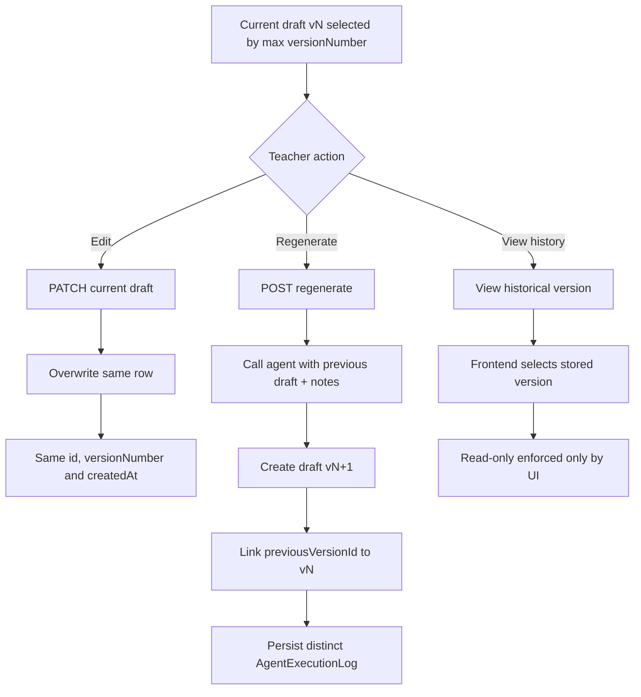
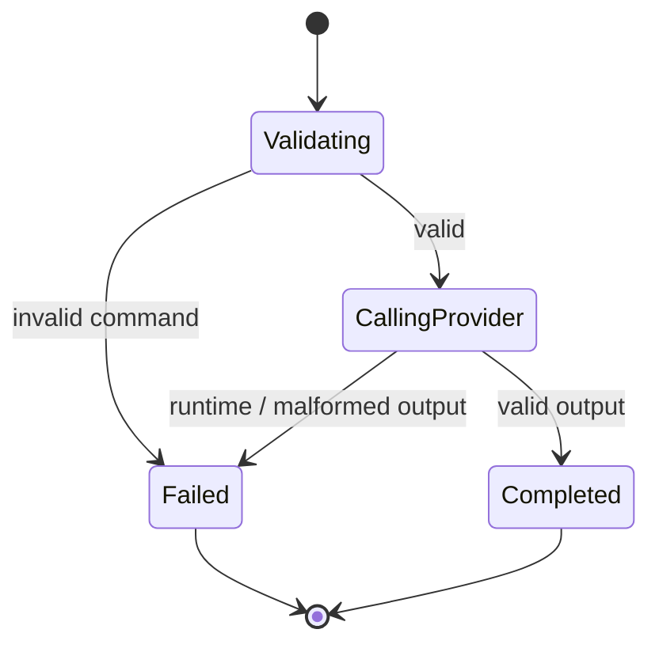
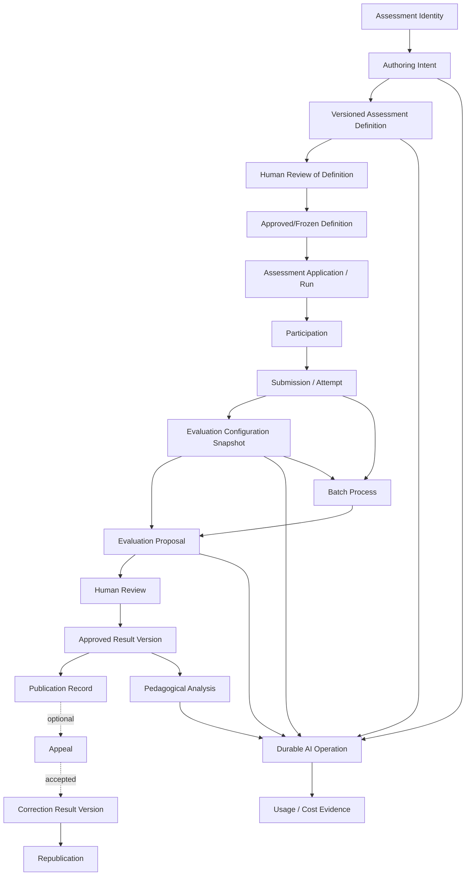

# Research 02 — Workflow & Lifecycle Alignment Audit

**Repository:** `cmartinezs/grade-ops-ai`  
**Branch:** `develop` — contiene el árbol fusionado de la antigua rama `design`  
**Commit:** `39f7c7dbbea7c7f7b77cd5a16ed0511d77d751f1`  
**Research 01 commit:** `e6ab06de496ffb3bde7fc9774503f106ac5e36d0`  
**Analysis date:** 2026-07-28  
**Relevant differences:** `39f7c7d` es el merge commit del PR #94. La comparación con `e6ab06d` contiene un commit adicional y **cero archivos modificados**; ambos snapshots tienen el mismo árbol funcional. La rama `design` ya no existe como ref independiente.

---

## 1. Executive Summary

GradeOps AI implementa actualmente un único workflow académico funcional y trazable:

```text
Teacher creates assessment intent
  → Assessment + AssessmentBrief are persisted
  → Assessment Agent generates a draft synchronously
  → Agent execution evidence is persisted
  → AssessmentDraft version 1 is persisted
  → Teacher may regenerate into a new version
  → Teacher may edit the current version in place
```

No existe todavía un lifecycle operativo completo de evaluación académica. En particular, no existen workflows ejecutables para:

- definición versus aplicación de una evaluación;
- asignación de participantes;
- intentos y entregas;
- evaluación de submissions;
- revisión humana estructurada;
- aprobación de resultados;
- publicación;
- corrección y republicación;
- appeals;
- análisis pedagógico;
- procesamiento batch.

### Conclusiones principales

1. **`AssessmentStatus` no es una máquina de estados funcional.**  
   El enum declara `DRAFT`, `OPEN`, `GRADING` y `CLOSED`, pero el código productivo solo entra en `DRAFT`. No hay comandos, métodos ni endpoints que ejecuten las otras transiciones.

2. **El lifecycle real está principalmente en `AssessmentDraft`, no en `Assessment`.**  
   La generación inicial produce versión 1. La regeneración crea una nueva fila y preserva la anterior. La versión vigente se deriva como la de mayor `versionNumber`.

3. **La edición humana contradice la trazabilidad objetivo.**  
   `UpdateAssessmentDraft` sobrescribe la fila vigente conservando ID, número de versión, `createdAt` y referencia al run de IA. Después de editar, el sistema no puede demostrar qué contenido vino de la IA y cuál fue cambiado por el docente.

4. **La creación visible en Web es un workflow compuesto no atómico.**  
   `web/` ejecuta primero `POST /assessments` y luego `POST /assessments/{id}/draft`. Si falla el segundo paso, quedan `Assessment + AssessmentBrief + FAILED AgentExecutionLog`, pero la UI no conserva una ruta operativa para reanudar la generación. Reenviar el formulario puede crear otra evaluación.

5. **La ejecución IA es síncrona y solo conserva estados terminales.**  
   No existen `REQUESTED`, `QUEUED`, `RUNNING`, `RETRYING`, `CANCELLED` ni `TIMED_OUT` persistidos. Tampoco existe operación durable, retry automático, cancellation ni idempotency key.

6. **La persistencia exitosa de log + draft sí es atómica localmente.**  
   El llamado al agente ocurre fuera de la transacción; luego `AgentExecutionLog`, `AssessmentDraft` y el backfill de referencias se guardan dentro de una transacción.

7. **La llamada externa ocurre antes de crear evidencia durable.**  
   Si la IA responde correctamente pero la transacción de persistencia falla, el costo y la ejecución ocurrieron, pero no queda un run persistido. Un retry puede repetir el consumo.

8. **No existe optimistic locking ni idempotencia implementada.**  
   Generaciones concurrentes pueden ejecutar dos veces la IA y competir por el mismo número de versión. Ediciones concurrentes aplican last-write-wins.

9. **La IA no produce efectos académicos autoritativos.**  
   Este comportamiento está correctamente separado: el agente solo devuelve un borrador. No aprueba, no publica y no genera notas finales.

10. **La documentación legacy contiene un lifecycle universal que debe retirarse.**  
    `docs/02-product/workflows.md` combina authoring, publicación, respuestas, grading y resultados en una secuencia única. El diseño vigente exige separar esas dimensiones.

### Clasificación general

| Workflow | Estado actual | Clasificación |
|---|---|---|
| Assessment authoring | Implementado de forma parcial | `PARTIALLY_ALIGNED` |
| Initial AI draft generation | Implementado, síncrono y no idempotente | `PARTIALLY_ALIGNED` |
| AI draft regeneration | Versionado no destructivo | `PARTIALLY_ALIGNED` |
| Human draft editing | Sobrescritura de la versión vigente | `CONFLICTING` |
| Assessment preparation/application | No existe | `MISSING` |
| Participation | No existe | `MISSING` |
| Submission | No existe | `MISSING` |
| Evaluation | No existe | `MISSING` |
| Human review formal | Solo edición libre, sin decisión auditable | `PARTIALLY_ALIGNED` |
| Approval | No existe | `MISSING` |
| Publication | No existe | `MISSING` |
| Correction/republication | No existe | `MISSING` |
| Appeals | No existe | `MISSING` |
| Pedagogical analysis | No existe | `MISSING` |
| AI execution lifecycle | Estados terminales y evidencia parcial | `PARTIALLY_ALIGNED` |
| Batch processing | Solo documentación objetivo | `MISSING` |

No quedan workflows críticos clasificados como `INDETERMINATE`.

---

## 2. Scope and Methodology

### 2.1 Alcance inspeccionado

La auditoría siguió el comportamiento a través de:

- controllers de `api/` y `agents/`;
- commands, use cases y coordinators;
- aggregates y entidades persistentes;
- repositories y queries de versión vigente;
- Flyway V1–V12;
- seguridad Firebase, ownership y autenticación interna;
- contratos HTTP Web → API → Agents;
- hooks y estados de UI necesarios para reconstruir la orquestación;
- tests unitarios, integración con PostgreSQL y tests de cliente Web;
- ADRs vigentes;
- documentación de workflows, únicamente para establecer el target.

### 2.2 Método de trazado

Cada operación se inspeccionó mediante la cadena:

```text
Entry point
  → command/request
  → authorization
  → preconditions
  → use case
  → domain mutation
  → persistence
  → side effects
  → error mapping
  → frontend behavior
  → tests
```

### 2.3 Criterio de ausencia

Un workflow se clasificó como `MISSING` únicamente después de contrastar:

- búsquedas por símbolos y términos equivalentes;
- packages ejecutables;
- migraciones;
- endpoints;
- repositorios;
- tests;
- guía del schema actual, que declara como futuras las tablas no implementadas.

### 2.4 Límites

La auditoría fue estática. No se ejecutaron:

- Maven/Jest;
- Testcontainers;
- una instancia real de PostgreSQL;
- llamadas a proveedores IA;
- consultas a beta/demo.

Los tests y contratos fueron inspeccionados, no ejecutados durante este research.

---

## 3. Repository Snapshot

```text
Repository:          cmartinezs/grade-ops-ai
Former branch:       design
Inspected branch:    develop
Commit:              39f7c7dbbea7c7f7b77cd5a16ed0511d77d751f1
Research 01 commit:  e6ab06de496ffb3bde7fc9774503f106ac5e36d0
Analysis date:       2026-07-28
```

### Snapshot verification

- `design` ya no está disponible como branch.
- `39f7c7d` es el merge commit del PR #94.
- `e6ab06d` es el head original utilizado por Research 01.
- `compare(e6ab06d, 39f7c7d)` reporta:
  - `ahead_by = 1`;
  - `files = []`.

### Resultado

Research 01 y Research 02 inspeccionan el mismo contenido funcional. No se mezcló evidencia de implementaciones diferentes.

---

## 4. Evidence Quality

| Evidencia | Calidad | Observación |
|---|---|---|
| Controllers y endpoints | Alta | Rutas y actores explícitos. |
| Use cases | Alta | Preconditions, mutaciones y repositorios visibles. |
| Domain model | Alta | Métodos de creación, regeneración y edición inspeccionados. |
| Persistencia | Alta | Flyway, JPA, FKs y unique constraints inspeccionados. |
| Agent pipeline | Alta | Pipeline completo y error mapping inspeccionados. |
| Frontend orchestration | Alta | Secuencia de dos requests y estados de error visibles. |
| Tests de dominio | Alta | Invariantes de versiones y edición explícitas. |
| Tests de integración | Alta | PostgreSQL real con Flyway definido en el test. |
| Concurrencia | Media–Alta | Ausencia de locks confirmada; escenarios derivados del código y constraints. |
| Runtime productivo | Media | No se ejecutaron servicios ni proveedores. |
| Workflows faltantes | Alta | Ausencia en código + schema actual + documentación que los marca futuros. |
| Target lifecycle | Alta | ADRs aceptados y diseño funcional vigente. |

---

## 5. Current Workflow Model

### 5.1 Workflow ejecutable completo

```mermaid
flowchart TD
    A[Teacher authenticated in Web]
    B[Submit assessment intake]
    C[POST /api/v1/assessments]
    D[Create Assessment status DRAFT]
    E[Create AssessmentBrief]
    F[Commit local DB transaction]
    G[POST /api/v1/assessments/{id}/draft]
    H[Load Assessment and verify owner]
    I[Load AssessmentBrief]
    J[POST /internal/agents/assessment]
    K[Validate command]
    L[Resolve provider]
    M[Render and hash prompt]
    N[Call LLM synchronously]
    O{Valid structured output?}
    P[Return result + COMPLETED log payload]
    Q[Persist log + draft v1 + cross-reference]
    R[Redirect to draft builder]
    S[Agent/client failure]
    T[Persist generic FAILED log]
    U[Show error in intake page]
    V[Assessment remains DRAFT with brief and no draft]

    A --> B --> C
    C --> D --> E --> F
    F --> G --> H --> I --> J --> K --> L --> M --> N --> O
    O -- Yes --> P --> Q --> R
    O -- No --> S --> T --> U --> V
    N -- Transport/provider error --> S
```

### 5.2 Draft operations



### 5.3 Procesos implementados

- crear `Assessment + AssessmentBrief`;
- generar draft inicial;
- regenerar draft;
- editar draft vigente;
- obtener draft vigente;
- listar versiones;
- listar assessments propios;
- registrar ejecución IA exitosa o fallida;
- elegir provider/model dentro de agents;
- traducir errores técnicos en estados UI.

### 5.4 Procesos documentados pero no implementados

- aprobar o validar el assessment draft;
- congelar configuración;
- publicar una evaluación;
- generar rúbrica;
- intake de submissions;
- grading;
- resultados;
- feedback;
- appeals;
- analytics;
- batch.

### 5.5 Procesos simulados

El listado de assessments expone:

```text
submissionCount
pendingApprovals
reportLink
```

pero el persistence adapter devuelve:

```text
0
0
null
```

No representan workflows reales.

### 5.6 Punto muerto demostrado

```text
Assessment + Brief persisted
  → initial generation fails
  → failed log persisted
  → Web shows error
  → assessmentId is not retained as a recoverable operation in the UI
  → draft page has no initial-generate action
  → retrying intake creates another Assessment
```

---

## 6. State Inventory

| State ID | Concept | State/flag | Defined in | Persisted | Owner | Meaning | Evidence |
|---|---|---|---|---:|---|---|---|
| ST-001 | Assessment | `DRAFT` | `AssessmentStatus` | Yes | `Assessment` | Initial value on creation | E-004, E-005 |
| ST-002 | Assessment | `OPEN` | `AssessmentStatus` | Possible | `Assessment` | Vocabulary only; no production transition | E-005, E-036 |
| ST-003 | Assessment | `GRADING` | `AssessmentStatus` | Possible | `Assessment` | Vocabulary only; no production transition | E-005 |
| ST-004 | Assessment | `CLOSED` | `AssessmentStatus` | Possible | `Assessment` | Vocabulary only; no production transition | E-005 |
| ST-005 | Draft lineage | `versionNumber = 1` | `AssessmentDraft` | Yes | `AssessmentDraft` | Initial generated version | E-006 |
| ST-006 | Draft lineage | `versionNumber > 1` | `AssessmentDraft` | Yes | `AssessmentDraft` | Regenerated descendant | E-006 |
| ST-007 | Draft lineage | `previousVersionId == null` | `AssessmentDraft` | Yes | `AssessmentDraft` | First version | E-006 |
| ST-008 | Draft lineage | `previousVersionId != null` | `AssessmentDraft` | Yes | `AssessmentDraft` | Subsequent version | E-006 |
| ST-009 | Draft currentness | Highest `versionNumber` | Repository query | Derived | Assessment draft collection | Current draft | E-013 |
| ST-010 | Agent run | `"COMPLETED"` | Agents orchestrator / log string | Yes | `AgentExecutionLog` | Valid agent output persisted | E-014, E-017 |
| ST-011 | Agent run | `"FAILED"` | Agents/API coordinator | Yes | `AgentExecutionLog` | Generation failure | E-014, E-017 |
| ST-012 | Agent output | `draftId == null` | `AgentExecutionLog` | Yes | Agent log | No produced/persisted draft | E-014 |
| ST-013 | Agent output | `draftId != null` | `AgentExecutionLog` | Yes | Agent log | Produced draft cross-linked | E-014 |
| ST-014 | Agents failure | `INVALID_COMMAND` | `AssessmentAgentException.Reason` | Returned, not faithfully persisted | Agents request | Input rejected | E-018 |
| ST-015 | Agents failure | `MALFORMED_OUTPUT` | `AssessmentAgentException.Reason` | Returned, not faithfully persisted | Agents request | Provider response invalid/unparseable | E-018 |
| ST-016 | API agent failure | `UNREACHABLE` | `AgentClientException.Reason` | Generic failed log | API call | Transport failure | E-016, E-019 |
| ST-017 | API agent failure | `AGENT_REJECTED` | `AgentClientException.Reason` | Generic failed log | API call | Any agents 4xx | E-016, E-019 |
| ST-018 | API agent failure | `AGENT_ERROR` | `AgentClientException.Reason` | Generic failed log | API call | Agents 5xx | E-016, E-019 |
| ST-019 | Intake UI | `idle` | `SubmitState` | No | Web page | Ready for input | E-020 |
| ST-020 | Intake UI | `submitting` | `SubmitState` | No | Web page | Two-request composite action running | E-020 |
| ST-021 | Intake UI | `success` | `SubmitState` | No | Web page | Both requests succeeded | E-020 |
| ST-022 | Intake UI | `error` | `SubmitState` | No | Web page | Either request failed | E-020 |
| ST-023 | Draft UI | `loading` | `RemoteData` | No | Web page | Loading draft + versions | E-021 |
| ST-024 | Draft UI | `ready` | `RemoteData` | No | Web page | Draft data available | E-021 |
| ST-025 | Draft UI | `not-found` | `RemoteData` | No | Web page | Assessment missing, unauthorized or draft absent are collapsed | E-021, E-035 |
| ST-026 | Draft UI | `error` | `RemoteData` | No | Web page | Unexpected load failure | E-021 |
| ST-027 | Draft UI | `isSaving` | Hook boolean | No | Web page | PATCH in flight | E-021 |
| ST-028 | Draft UI | `isRegenerating` | Hook boolean | No | Web page | Regeneration in flight | E-021 |
| ST-029 | Draft UI | `selectedVersion` | Hook state | No | Web page | Version displayed | E-021 |
| ST-030 | Draft UI | `isViewingHistoricalVersion` | Derived boolean | No | Web page | Current selection differs from current max version | E-021 |
| ST-031 | Draft provenance UI | `generado-por-ia` | Local UI label | No | Web page | Last local action was regeneration | E-021 |
| ST-032 | Draft provenance UI | `version-actual` | Local UI label | No | Web page | Default/after save; not authoritative provenance | E-021 |

### Estados inexistentes en implementación

No existen estados persistidos de:

```text
assessment application
participation
submission
evaluation
review
approval
publication
correction
appeal
batch
queued/running/retrying/cancelled/timed_out agent operation
```

---

## 7. Transition Inventory

| Transition ID | From | Command/Event | To | Actor | Preconditions | Side effects | Atomic | Idempotent | Evidence |
|---|---|---|---|---|---|---|---:|---:|---|
| TR-001 | No assessment | `CreateAssessmentBriefCommand` | `Assessment(DRAFT) + Brief` | Teacher | Authenticated; request fields nonblank | Two inserts | Yes, API local transaction | No | E-002, E-007 |
| TR-002 | Assessment with brief, no draft | `GenerateAssessmentDraftCommand` | Draft v1 + COMPLETED log | Teacher/System/AI | Assessment exists; ownership; brief exists; agent output valid | External LLM call; log/draft inserts | Persistence yes; end-to-end no | No | E-008, E-010 |
| TR-003 | Assessment with brief, no draft | Agent call failure | FAILED log; still no draft | System | Same load/ownership checks; agent failure | Failure log insert | Yes for failure log | No | E-010, E-029 |
| TR-004 | Current draft vN | `RegenerateAssessmentDraftCommand` | Draft vN+1 | Teacher/System/AI | Assessment exists; ownership; brief and current draft exist; notes valid | LLM call; new log; new draft | Persistence yes; end-to-end no | No | E-009, E-030 |
| TR-005 | Current draft vN | Regeneration failure | Current unchanged + FAILED log | System | Same preconditions; agent failure | Failure log | Yes for failure log | No | E-009, E-010 |
| TR-006 | Current draft vN content A | `UpdateAssessmentDraftCommand` | Same vN content B | Teacher | Assessment exists; ownership; current draft exists; provided values valid | UPDATE existing row | Single row write | No concurrency guarantee | E-011, E-031 |
| TR-007 | Any stored versions | `GetCurrentDraftCommand` | Read max version | Teacher | Assessment exists; ownership; at least one draft | None | Read-only | Yes as read | E-013, E-035 |
| TR-008 | Any stored versions | `ListDraftVersionsCommand` | Ordered version list | Teacher | Assessment exists; ownership | None | Read-only | Yes as read | E-012 |
| TR-009 | UI selected current version | Select historical version | Historical version displayed | Teacher | Version exists in loaded data | Local state only | N/A | Yes | E-021 |
| TR-010 | Valid agent command | `AssessmentAgentOrchestrator.generate` | COMPLETED payload | System/AI | Required fields; valid regeneration triple; supported provider; valid output | Provider call; hashes/cost estimate | No persistence in agents | No | E-017 |
| TR-011 | Invalid agent command | Validation failure | FAILED exception payload | System | Blank required field, inconsistent triple or unsupported provider | HTTP 422 | N/A | No durable key | E-017, E-018 |
| TR-012 | Provider call/output | Runtime/parsing/validation failure | FAILED exception payload | System | Provider error or malformed output | HTTP 422 from agents | N/A | No | E-017, E-018 |
| TR-013 | Intake UI idle | `submitAssessmentBrief` | success/error | Teacher/Web | Valid client form | Executes TR-001 then TR-002 | No distributed atomicity | No | E-020, E-022 |
| TR-014 | Draft UI ready | Save then refetch | ready/error | Teacher/Web | Viewing current version | PATCH then GET current/versions | No cross-request atomicity | No | E-021 |
| TR-015 | Draft UI ready | Regenerate then refetch | ready/error | Teacher/Web | Page ready; notes nonblank | POST then GET current/versions | No cross-request atomicity | No | E-021 |

### Transiciones declaradas pero no ejecutables

No existen implementaciones de:

```text
DRAFT → OPEN
OPEN → GRADING
GRADING → CLOSED
draft → validated
draft → approved
approved → published
result → corrected
appeal → resolved
agent requested → queued → running
batch created → started → resumed → closed
```

---

## 8. Command Inventory

| Command | Type | Entry point | Actor | Target | Preconditions | Result | Errors | Evidence |
|---|---|---|---|---|---|---|---|---|
| `CreateAssessmentBriefCommand` | Explicit command | `POST /api/v1/assessments` | Teacher | `Assessment`, `AssessmentBrief` | Auth + HTTP validation | Assessment ID | 401/422/500 | E-001, E-002 |
| `GenerateAssessmentDraftCommand` | Explicit command | `POST /api/v1/assessments/{id}/draft` | Teacher | Draft collection | Ownership; assessment + brief | Draft v1 | 404/422/502/503/500 | E-001, E-008, E-019 |
| `RegenerateAssessmentDraftCommand` | Explicit command | `POST /api/v1/assessments/{id}/draft/regenerate` | Teacher | Draft collection | Ownership; brief; prior draft; notes | New draft version | 404/422/502/503/500 | E-001, E-009 |
| `UpdateAssessmentDraftCommand` | Explicit command / partial mutation | `PATCH /api/v1/assessments/{id}/draft` | Teacher | Current draft row | Ownership; prior draft; field validation | Same version updated | 404/422/500 | E-001, E-011 |
| `GetCurrentDraftCommand` | Query object | `GET /api/v1/assessments/{id}/draft` | Teacher | Draft collection | Ownership; draft exists | Highest version | 404/500 | E-001, E-035 |
| `ListDraftVersionsCommand` | Query object | `GET /api/v1/assessments/{id}/draft/versions` | Teacher | Draft collection | Ownership | All versions desc | 404/500 | E-001, E-012 |
| `ListAssessments` | Query | `GET /api/v1/assessments` | Teacher | Assessment read model | Authenticated | Own assessments | 401/500 | E-001, E-034 |
| `submitAssessmentBrief` | Frontend composite command | Intake page | Teacher/Web | Two API resources | Client validation | Assessment + initial draft | Partial completion possible | E-020, E-022 |
| Agents `AssessmentCommand` | Internal operation | `POST /internal/agents/assessment` | API/System | Agent pipeline | Internal key; command validation | Result + log payload | 403/422 | E-015, E-017 |
| `ViewVersion` | Frontend-only action | Draft builder | Teacher | UI selection | Loaded version exists | Historical display | None | E-021 |

### Commands objetivo no existentes

```text
ValidateAssessmentDraft
ApproveAssessmentVersion
FreezeAssessmentConfiguration
CreateAssessmentApplication
OpenAssessmentApplication
AssignParticipant
StartAttempt
SubmitFinal
QueueEvaluation
ReviewEvaluation
ApproveResult
PublishResult
CorrectResult
RepublishResult
OpenAppeal
ResolveAppeal
CreateBatch
ResumeBatch
CancelAgentOperation
```

---

## 9. Event Inventory

| Event/evidence | Producer | Trigger | Consumers | Persisted | Replayable | Classification | Evidence |
|---|---|---|---|---:|---:|---|---|
| `AgentExecutionLog` row | API coordinator | Agent success/failure | Read persistence only | Yes | No | Technical evidence, not domain event | E-010, E-014 |
| Agents log payload | Agents orchestrator | Terminal execution | API HTTP client | No in agents | No | Response evidence | E-017, E-018 |
| Pino/Web technical log | Web API functions | HTTP operation | Log backend/stdout | Environment-dependent | No | Operational log | E-022 |
| `X-Correlation-Id` | API agent client | Each agent call | API/agents logs | Not persisted as domain data | No | Trace correlation only | E-016 |
| `DomainEvent` collection | Shared aggregate base | `registerEvent()` | No assessment consumer | No journal | No | Infrastructure capability unused | E-032, E-037 |
| Assessment-created event | None | — | — | No | No | `MISSING` | E-037 |
| Draft-generated event | None | — | — | No | No | `MISSING` | E-037 |
| Draft-edited event | None | — | — | No | No | `MISSING` | E-037 |
| Approval/publication events | None | — | — | No | No | `MISSING` | E-038 |
| Queue message/job event | None | — | — | No | No | `MISSING` | E-039, E-040 |

### Evaluación

La ausencia de eventos es aceptable para el slice síncrono actual mientras todas las mutaciones sean locales. Se vuelve bloqueante para:

- async operations;
- publication notifications;
- retries;
- batch recovery;
- credits;
- result audit;
- cross-service exactly-once/at-least-once behavior.

---

## 10. Actor and Authority Matrix

Valores:

```text
ALLOWED
DENIED
CONDITIONAL
NOT_IMPLEMENTED
UNKNOWN
```

| Action | Teacher | Substitute | Student | Reviewer | Admin | System | AI Agent |
|---|---:|---:|---:|---:|---:|---:|---:|
| List own assessments | ALLOWED | NOT_IMPLEMENTED | DENIED | NOT_IMPLEMENTED | NOT_IMPLEMENTED | CONDITIONAL | DENIED |
| Create assessment intent | ALLOWED | NOT_IMPLEMENTED | DENIED | NOT_IMPLEMENTED | NOT_IMPLEMENTED | CONDITIONAL | DENIED |
| Generate initial draft | ALLOWED | NOT_IMPLEMENTED | DENIED | NOT_IMPLEMENTED | NOT_IMPLEMENTED | CONDITIONAL | CONDITIONAL |
| Regenerate draft | ALLOWED | NOT_IMPLEMENTED | DENIED | NOT_IMPLEMENTED | NOT_IMPLEMENTED | CONDITIONAL | CONDITIONAL |
| Edit current draft | ALLOWED | NOT_IMPLEMENTED | DENIED | NOT_IMPLEMENTED | NOT_IMPLEMENTED | CONDITIONAL | DENIED |
| View draft versions | ALLOWED | NOT_IMPLEMENTED | DENIED | NOT_IMPLEMENTED | NOT_IMPLEMENTED | CONDITIONAL | DENIED |
| Execute internal agent endpoint | DENIED directly | DENIED | DENIED | DENIED | DENIED | ALLOWED | CONDITIONAL |
| Approve assessment | NOT_IMPLEMENTED | NOT_IMPLEMENTED | DENIED | NOT_IMPLEMENTED | NOT_IMPLEMENTED | NOT_IMPLEMENTED | DENIED |
| Publish assessment/result | NOT_IMPLEMENTED | NOT_IMPLEMENTED | DENIED | NOT_IMPLEMENTED | NOT_IMPLEMENTED | NOT_IMPLEMENTED | DENIED |
| Submit participation | DENIED | DENIED | NOT_IMPLEMENTED | DENIED | DENIED | NOT_IMPLEMENTED | DENIED |
| Review evaluation | NOT_IMPLEMENTED | NOT_IMPLEMENTED | DENIED | NOT_IMPLEMENTED | NOT_IMPLEMENTED | NOT_IMPLEMENTED | DENIED |
| Correct result | NOT_IMPLEMENTED | NOT_IMPLEMENTED | DENIED | NOT_IMPLEMENTED | NOT_IMPLEMENTED | NOT_IMPLEMENTED | DENIED |
| Resolve appeal | NOT_IMPLEMENTED | NOT_IMPLEMENTED | DENIED | NOT_IMPLEMENTED | NOT_IMPLEMENTED | NOT_IMPLEMENTED | DENIED |

### Condiciones vigentes

Para endpoints académicos actuales, el docente debe:

- presentar token Firebase válido;
- pasar el filtro de email verificado;
- ser el owner directo de `Assessment.teacherUid`.

Los accesos cross-teacher se responden como `404 NOT_FOUND`.

No existe:

- `@PreAuthorize`;
- role claim académico;
- membership;
- autorización contextual;
- substitute/reviewer/admin académico.

### Seguridad interna

`api/ → agents/` usa:

```text
X-Internal-Key
```

validada contra un shared secret. El agente no puede invocarse desde la UI a través del API público.

---

## 11. Detailed Workflow Analysis

### Assessment Authoring

#### Create assessment

**Current**

```text
POST /api/v1/assessments
  → CreateAssessmentBriefCommand
  → Assessment.create(teacherUid)
  → status = DRAFT
  → save Assessment
  → create/save AssessmentBrief
```

**Preconditions**

- usuario autenticado;
- payload HTTP válido;
- cinco strings no blank.

**Atomicidad**

`Assessment + AssessmentBrief` se crean en una transacción local.

**Gaps**

- no idempotency key;
- no deduplicación;
- no `Location`/operation resource;
- no estado “intent saved / generation pending”;
- todos los datos semánticos son strings;
- no `updatedAt` ni lock version en assessment/brief.

**Classification:** `PARTIALLY_ALIGNED`

#### Generate initial draft

**Current**

- carga assessment;
- verifica owner;
- carga brief;
- llama al agente síncronamente;
- guarda log y draft v1.

**Gaps**

- no verifica explícitamente que no exista draft;
- una segunda llamada vuelve a intentar `versionNumber = 1`;
- la unique constraint detecta el conflicto después de consumir IA;
- no operación durable anterior a la llamada;
- no retry seguro.

**Classification:** `PARTIALLY_ALIGNED`

#### Regenerate draft

**Current**

- obtiene la versión máxima;
- envía el contenido previo y adjustment notes;
- crea vN+1;
- preserva vN;
- asigna un log distinto.

**Behavior worth preserving**

- no sobrescribe la versión anterior;
- conserva lineage;
- registra ejecución separada.

**Gaps**

- sin optimistic locking;
- sin expected current version;
- sin idempotency key;
- dos requests concurrentes pueden calcular el mismo N+1;
- `adjustmentNotes` no se persiste en el draft o audit record;
- actor no queda registrado en la versión.

**Classification:** `PARTIALLY_ALIGNED`

#### Edit draft

**Current**

- selecciona la versión máxima;
- aplica patch;
- guarda la misma fila;
- no crea log ni versión.

**Conflict**

La versión conserva la referencia al run IA original, aunque el contenido ya no coincida con la salida hasheada del agente.

**Classification:** `CONFLICTING`

#### Validate / approve / freeze / discard

No existen.

**Classification:** `MISSING`

#### Responsabilidades de Assessment, Brief y Draft

| Concept | Current responsibility | Assessment |
|---|---|---|
| `Assessment` | Identity + owner + inert broad status | Reusable anchor, too small |
| `AssessmentBrief` | Teacher intent/intake | Useful but primitive |
| `AssessmentDraft` | Generated content + version lineage + mutable human content | Version and mutable working copy are mixed |

La separación identidad/intención/versión es una buena base, pero `AssessmentDraft` mezcla:

- immutable AI proposal;
- current editable document;
- provenance;
- version.

---

### Preparation and Application

No existe distinción ejecutable entre:

```text
Assessment definition
Assessment configured for section
Assessment application/run
Assessment opened to participants
```

`AssessmentStatus.OPEN` no tiene transición ni endpoint.

No existen:

- section/audience;
- date/window;
- frozen version;
- scoring configuration;
- learner list;
- application instance.

**Respuesta crítica**

> Abrir una evaluación no modifica una definición ni crea una aplicación específica, porque abrir no está implementado.

**Classification:** `MISSING`

---

### Participation

No existen:

- `LearnerRef` ejecutable;
- assignment;
- participation;
- attempt;
- magic link;
- start/pause/resume;
- absence;
- blocked/recovery.

La documentación describe estos conceptos, pero no hay tabla, entidad, endpoint ni test.

**Classification:** `MISSING`

---

### Submission

No existe workflow de:

- partial save;
- final submit;
- late submit;
- resubmit;
- invalidate;
- recovery;
- evidence versioning.

`submissionCount = 0` es un placeholder del dashboard.

**Respuesta crítica**

> No existe historia de entregas, porque no existe aún una entidad de entrega.

**Classification:** `MISSING`

---

### Evaluation

No existe evaluación de student work.

La única operación IA implementada es generación de assessment draft.

No existen:

- queue;
- evaluation batch;
- rubric snapshot;
- criterion processing;
- result proposal;
- retries;
- cancellation;
- partial failure.

**Classification:** `MISSING`

---

### Human Review

#### Current equivalent

El docente puede:

- leer el draft;
- editarlo;
- regenerarlo;
- ver versiones generadas.

#### Lo que falta

- review record;
- actor;
- reason;
- before/after;
- accept/reject;
- partial criterion review;
- completed review;
- reviewer distinct from owner;
- preservation of original AI output after human modification.

La edición no representa una decisión de review; es una mutación CRUD.

**Classification:** `PARTIALLY_ALIGNED`

---

### Approval

No existe objeto aprobable, command, actor authority, timestamp ni version pin.

La aprobación tampoco publica automáticamente: **ninguna de las dos operaciones existe**.

**Classification:** `MISSING`

---

### Publication

No existen:

- publish command;
- scheduled publication;
- `publishedAt`;
- `publishedBy`;
- published version;
- student visibility;
- notifications;
- rollback;
- unpublish;
- republish.

La IA no puede publicar porque el producto no tiene una ruta de publicación y agents no persiste dominio.

**Classification:** `MISSING`

---

### Correction and Republication

No existe resultado publicado que corregir.

No hay:

- result version;
- previous published version;
- correction reason;
- corrected-by;
- republication event;
- student-visible snapshot.

**Respuesta crítica**

> El sistema no puede demostrar qué resultado vio un estudiante porque aún no existe publicación de resultados.

**Classification:** `MISSING`

---

### Appeals

La búsqueda encuentra appeals solo en documentación. No existen:

- appeal aggregate;
- estados;
- endpoints;
- ventanas;
- deadline;
- timezone;
- academic calendar;
- resolution;
- relationship to result versions.

Una documentación anterior los difiere; el diseño aprobado más reciente exige fundación appeal-aware. Esto requiere ADR, no una inferencia desde legacy.

**Classification:** `MISSING`

---

### Pedagogical Analysis

No existen workflows ejecutables de:

- learning gap;
- cohort analytics;
- recommended action;
- recovery activity;
- teacher validation;
- action completion.

Los conteos y report links actuales son placeholders.

**Classification:** `MISSING`

---

### AI Execution Lifecycle

#### Current lifecycle real



`Validating` y `CallingProvider` son estados en memoria, no persistidos.

Persistencia actual:

```text
COMPLETED
FAILED
```

#### Initiator

- docente inicia la acción pública;
- API valida owner y construye command;
- agents ejecuta provider/model.

#### Correlation

- API crea un `X-Correlation-Id`;
- agents lo propaga en HTTP/logs;
- no se guarda en `AgentExecutionLog`.

#### Retry

- no automático;
- no durable;
- no attempt number;
- UI permite volver a pulsar;
- el retry crea un nuevo run lógico sin relación explícita.

#### Failure semantics

Todos los errores propios de agents retornan HTTP 422. API los reduce a:

```text
AGENT_REJECTED
```

y persiste un failed log genérico, perdiendo el payload detallado generado por agents.

#### Provider provenance

El coordinator persiste:

```java
provider = agentCommand.provider()
```

Los handlers actuales envían `null` para dejar que agents seleccione el default. Por lo tanto, el provider real seleccionado no queda persistido aunque el modelo sí pueda quedar registrado.

#### Classification

`PARTIALLY_ALIGNED`

---

### Batch Processing

No existe batch entity, job, queue, scheduler académico ni item processing.

Lo acordado sobre:

- configuration frozen;
- blocked items;
- partial completion;
- resume;
- provider substitution;
- cohort comparison;

está solo en diseño/documentación.

**Classification:** `MISSING`

---

## 12. State-machine Decomposition

| Concern | Current representation | Independent lifecycle? | Recommended representation | Reason | Risk if combined |
|---|---|---:|---|---|---|
| Assessment identity | `Assessment` | No lifecycle propio | Stable aggregate identity | Identity should persist across versions/runs | Recreating identity for every action |
| Authoring | Draft versions + in-place edit | Yes | Versioned definition/revision | Content maturity differs from operational use | Published content mutates |
| Assessment application | Absent | Yes | Dedicated run/application aggregate | Same definition may be applied to section/time window | Definition and cohort state collapse |
| Operational open/close | Inert `AssessmentStatus` | Yes | State on application/run | Opening applies to participants, not reusable definition | Reuse impossible |
| Participation | Absent | Yes | Participant/attempt process | Individual state differs per learner | Global assessment state hides absences/errors |
| Submission | Absent | Yes | Immutable finalization + versions/events | Submission history has independent rules | Silent overwrite |
| Evaluation | Absent | Yes | Evaluation job/proposal lifecycle | Processing can fail/retry independently | Job status becomes result status |
| Human review | In-place edit | Yes | Decision/event or review aggregate | Review is authority, not content mutation only | No actor/reason/audit |
| Approval | Absent | Yes | Explicit decision referencing version | Approval freezes a version | Saving becomes approval |
| Publication | Absent | Yes | Publication record/event | Visibility is separate from correctness | Approval leaks results automatically |
| Correction | Absent | Yes | New immutable result version | Must preserve prior visible result | Historical grade overwritten |
| Appeal | Absent | Yes | Appeal aggregate/process manager | Has window, evidence and resolution | Result status overloaded |
| AI execution | Terminal string log | Yes | Durable operation/run/attempt | Retry and cost are operational | AI status mixed with domain status |
| Batch | Absent | Yes | Batch + item states | Partial completion and recovery | Cohort operation becomes all-or-nothing |
| Pedagogical action | Absent | Usually yes | Recommendation + teacher decision/action | Learning response differs from grade | Analytics treated as authoritative result |

No se recomienda crear automáticamente un enum por fila. Según el concern, puede corresponder:

- aggregate;
- immutable version;
- timestamped event;
- process manager;
- derived state;
- small enum scoped to one aggregate.

### Documento obsolete

El bloque “Assessment Lifecycle (Unified)” de `docs/02-product/workflows.md` debe clasificarse `OBSOLETE` respecto del diseño más reciente, porque combina:

```text
authoring
approval
publication
response intake
grading
result publication
```

en un solo status sequence.

---

## 13. Invalid and Ambiguous States

| Invalid/Ambiguous combination | How it can occur | Evidence | Impact | Required direction |
|---|---|---|---|---|
| `Assessment.status = DRAFT` con múltiples drafts generados | Status never transitions | E-004, E-005, E-009 | DRAFT no expresa madurez real | Separate authoring state/version readiness |
| `Assessment DRAFT + Brief + no Draft + FAILED log` | Initial generation failure | E-010, E-020 | UI dead-end; duplicate retry risk | Durable operation and resumable generate action |
| Draft row references AI log but content was human-edited | In-place PATCH | E-011, E-031 | False provenance | Immutable human revision |
| `OPEN`, `GRADING`, `CLOSED` restored without transition validation | Public restore accepts enum | E-004, E-036 | Arbitrary state possible from persistence | Aggregate transition methods + DB constraint |
| Arbitrary status string in database | VARCHAR has no CHECK | E-026 | Mapper may fail on read | Typed/check-constrained state |
| Two drafts claim same predecessor and same intended next version | Concurrent regeneration | E-009, E-027 | One external result discarded by unique conflict | Expected-version/CAS/idempotency |
| Two human edits overwrite each other | No `@Version` or expected version | E-011, E-031, E-041 | Lost update | Optimistic locking |
| COMPLETED external run with no persisted evidence | DB transaction fails after LLM success | E-010 | Cost and output untraceable | Persist operation before dispatch |
| Agents failure payload has detailed reason, API stores generic reason | API maps any agents 4xx to AGENT_REJECTED | E-016, E-018, E-019 | Root cause/correlation lost | Typed error contract and attempt record |
| Actual provider selected but persisted provider is null | API command passes null; coordinator persists command provider | E-008, E-017, E-042 | Cost/audit cannot attribute provider | Return/persist resolved provider |
| Historical version is read-only only in UI | API PATCH has no expected draft/version | E-001, E-021 | Direct client can edit whichever is current without awareness | Version-aware command |
| AI disclosure resets on reload | Label is transient local state | E-021 | UI provenance can be inaccurate | Persist origin per revision |
| 404 combines nonexistent, unauthorized and no draft | Same domain exception | E-021, E-035 | Recovery action cannot be chosen safely | Operation/read model with explicit no-draft capability |

---

## 14. Temporal Rules

| Temporal rule | Source of time | Timezone | Persisted | Versioned | Tested | Risk |
|---|---|---|---:|---:|---:|---|
| Assessment creation | `Instant.now()` | UTC instant | Yes | No | Basic | Hard to deterministically test |
| Brief creation | `Instant.now()` | UTC instant | Yes | No | Basic | Same |
| Draft creation/regeneration | `Instant.now()` | UTC instant | Yes | Per draft | Yes indirectly | Clock not injectable |
| Human draft edit | Reuses original `createdAt` | UTC instant | No edit timestamp | No | Test confirms reuse | Edit time lost |
| Agent started/finished | `Instant.now()` | UTC instant | Yes in API log | No | Yes with fixtures | No durable requested time |
| API→Agents connect timeout | Fixed 5 seconds | N/A | No | No | Client tests partial | Config not contextual |
| API→Agents read timeout | Fixed 60 seconds | N/A | No | No | Client tests partial | Timeout may occur after provider completed |
| Web latency | `Date.now()` | Browser epoch | Technical log only | No | Yes | Not domain evidence |
| Assessment start/due/close | None | None | No | No | No | `MISSING` |
| Publication time | None | None | No | No | No | `MISSING` |
| Appeal deadline | None | None | No | No | No | `MISSING` |
| Academic calendar/business days | None | None | No | No | No | `MISSING` |

### Finding

No domain class uses an injected `Clock`. La lógica actual no depende de deadlines, pero la fundación temporal debe corregirse antes de implementar ventanas académicas.

---

## 15. Concurrency, Atomicity and Idempotency

| Operation | Transactional | Concurrency protected | Idempotent | Duplicate effect risk | Evidence |
|---|---:|---:|---:|---:|---|
| Create assessment + brief | Yes, local | No | No | High on client retry | E-002, E-007 |
| Web create + generate | No distributed transaction | No | No | High | E-020, E-022 |
| Initial agent generation | Persistence yes; external call outside | Unique v1 constraint only | No | High cost/duplicate call risk | E-008, E-010, E-027 |
| Regenerate draft | Persistence yes; external call outside | Unique `(assessment, version)` only | No | High under concurrency/retry | E-009, E-010, E-027 |
| Edit current draft | Single repository save | No optimistic lock | No formal guarantee | Lost updates | E-011, E-031, E-041 |
| Persist success log + draft + backfill | Yes | Transaction rollback | N/A | Low partial DB state; external run remains | E-010, E-029 |
| Persist failure log | Separate transaction | No dedupe | No | Duplicate failure rows | E-010 |
| Get current draft | Read-only | Snapshot depends on DB isolation | Yes as query | Low | E-013, E-035 |
| Approve result | Not implemented | — | — | — | — |
| Publish result | Not implemented | — | — | — | — |
| Correct/republish | Not implemented | — | — | — | — |
| Resolve appeal | Not implemented | — | — | — | — |
| Retry agent | Manual repeated command only | No | No | High | E-017, E-022 |
| Resume batch | Not implemented | — | — | — | — |

### Important distinction

`@Transactional` protects una unidad local de persistencia. No evita:

- repetir el LLM call;
- crear dos assessments;
- last-write-wins;
- timeout ambiguity;
- duplicate emails futuros;
- retry de una operación ya completada.

---

## 16. Failure and Recovery Analysis

| Workflow | Failure point | Persisted state | Retry behavior | Recovery path | Risk |
|---|---|---|---|---|---|
| Intake | Brief creation fails | Nothing | Resubmit form | Normal | Low |
| Intake | Brief succeeds, generation fails | Assessment + Brief + FAILED log | Resubmitting full form creates another assessment | No explicit UI continuation | Critical |
| Initial generation | API timeout after agents/provider completes | Possibly no API result/log | Teacher retries whole operation | New LLM call | High |
| Initial generation | LLM success, DB persistence fails | No draft/log due rollback | Retry calls LLM again | No durable operation | Critical |
| Initial generation | Second call after v1 exists | LLM executes, unique version conflict | Generic retry unsafe | No explicit already-generated response | High |
| Regeneration | Agent fails | Current draft preserved + failed log | Teacher can click again | New unrelated run | Medium |
| Regeneration | Mutation succeeds, frontend refetch fails | New version committed | UI may show error | User may regenerate again | High |
| Regeneration | Two concurrent requests | Both LLM calls; one DB conflict likely | Failed caller can retry | More versions/cost | Critical |
| Draft edit | Two tabs save | Last write wins | User may not notice | None | Critical |
| Draft edit | Save succeeds, refetch fails | Edit committed | UI reports generic error | Repeat PATCH | Medium |
| Agents validation | Invalid command | Detailed FAILED payload returned | API treats 4xx as AGENT_REJECTED | Generic log | Medium |
| Agents provider/parsing | Runtime exception | MALFORMED_OUTPUT payload | Manual retry | Root cause conflated | Medium |
| Failure logging | Persist failure log fails | No workflow evidence | Original exception may be obscured | Technical logs only | High |
| Publication notification | Not implemented | — | — | — | — |
| Batch item failure | Not implemented | — | — | — | — |

### Recovery assessment

El único recovery real es:

```text
teacher manually repeats the HTTP command
```

No hay:

- operation lookup;
- retry relation;
- attempt number;
- deduplication;
- resume token;
- compensation;
- dead-letter queue;
- administrative recovery command.

---

## 17. Auditability by Transition

| Transition | Actor captured | Before/after | Reason | Version | AI provenance | Correlation ID | Audit quality |
|---|---:|---:|---:|---:|---:|---:|---|
| Create assessment | Owner UID only | No | No | N/A | N/A | Web log only | Low |
| Generate v1 | Not as requester field | No | No | Yes, v1 | Model/prompt/hashes partial | Not persisted | Medium |
| Regenerate vN+1 | Not as requester field | Previous link, not diff | Notes sent but not persisted | Yes | Distinct run/log | Not persisted | Medium |
| Edit current draft | No | No | No | Same version | Original AI log remains | Web log only | Very low |
| Agent success | No user actor | Input/output hashes | No | Draft link | Model/prompt/tokens/cost | Not persisted | Medium |
| Agent failure | No user actor | No | Generic code | No result | Detailed agents evidence lost | Not persisted | Low |
| View historical draft | No | N/A | No | Selected version | Existing log relation | No | None |
| Approve | Not implemented | — | — | — | — | — | None |
| Publish | Not implemented | — | — | — | — | — | None |
| Correct | Not implemented | — | — | — | — | — | None |
| Appeal resolution | Not implemented | — | — | — | — | — | None |

### Logs técnicos versus auditoría

Pino, SLF4J y correlation IDs permiten troubleshooting. No responden:

```text
who made the academic decision
what version was approved
what was visible
why it changed
which policy applied
```

---

## 18. Workflow Test Coverage

| Workflow invariant | Test exists | Test path | Test type | Quality | Missing cases |
|---|---:|---|---|---|---|
| New assessment starts DRAFT | Yes | `AssessmentTest` | Unit | Strong | No transition matrix |
| Assessment owner required | Yes | `AssessmentTest` | Unit | Strong | Contextual roles |
| Assessment + brief are created together | Yes indirectly | `CreateAssessmentBriefHandlerTest` | Unit | Good | DB rollback integration |
| Initial draft is v1 | Yes | `AssessmentDraftTest` | Unit | Strong | Duplicate generate |
| Regeneration creates new version | Yes | `AssessmentDraftTest` | Unit | Strong | Concurrent regeneration |
| Previous version is preserved | Yes | `RegenerateAssessmentDraftHandlerIntegrationTest` | PostgreSQL integration | Strong | Deep chain concurrency |
| Every generated version has distinct log | Yes | Same integration test | Integration | Strong | Provider actual attribution |
| Agent call happens before DB transaction | Yes | `DraftGenerationCoordinatorTest` | Unit | Strong | Durable operation missing |
| Success persists log/draft cross-reference | Yes | `GenerateAssessmentDraftHandlerIntegrationTest` | Integration | Strong | Persistence failure after LLM |
| Failure persists log without draft | Yes | Same | Integration | Strong | Failure-log failure |
| Only owner can read/mutate | Yes | Handler/controller tests | Unit/API | Good | Substitute/reviewer/admin |
| Human edit keeps same version | Yes | `AssessmentDraftTest`, update integration | Unit/integration | Strong evidence of conflicting behavior | Must be replaced |
| Historical version read-only | UI test only | Hook/page tests | Frontend | Partial | Direct API/concurrent client |
| Initial generation failure after brief is distinguishable | Yes | Web assessments test | Unit | Good detection | No recovery |
| Initial generation retry is idempotent | No | — | — | None | Required |
| Concurrent edits are rejected | No | — | — | None | Required |
| Retry does not duplicate run/draft | No | — | — | None | Required |
| Final submission cannot be overwritten | Not applicable | Workflow missing | — | — | Required later |
| Evaluation retry does not duplicate result | Not applicable | Workflow missing | — | — | Required later |
| Approval does not publish | Not applicable | Workflow missing | — | — | Required later |
| Published version is immutable | Not applicable | Workflow missing | — | — | Required later |
| Correction creates new version | Not applicable | Workflow missing | — | — | Required later |
| Appeal deadline follows policy | Not applicable | Workflow missing | — | — | Required later |
| AI cannot publish | Architecture enforces indirectly | No focused invariant test | Architecture | Partial | Explicit contract/security test |

---

## 19. Current → Target Workflow Mapping

| Target workflow | Current equivalent | Classification | Reusable behavior | Missing behavior | Conflict |
|---|---|---|---|---|---|
| Authoring | Assessment + Brief + Draft | `PARTIALLY_ALIGNED` | Identity/intention/content separation | validation, readiness, approval, freeze | Human edit overwrites provenance |
| Preparation | None | `MISSING` | Assessment identity | section/config/schedule | — |
| Application | Inert `OPEN` enum value | `MISSING` | None | run, audience, window, snapshot | Universal status risk |
| Participation | None | `MISSING` | Ownership denial pattern | participant/attempt/access | — |
| Submission | Placeholder count only | `MISSING` | None | save/finalize/version/late/recovery | Placeholder contract |
| Evaluation | Assessment generation agent only | `MISSING` | Agent orchestration pattern | evaluation proposal/config/retry | — |
| Human review | Free-form draft edit | `PARTIALLY_ALIGNED` | Teacher remains in control | decision record, actor, reason | Mutation used as review |
| Approval | None | `MISSING` | None | explicit decision/version | — |
| Publication | None | `MISSING` | None | explicit command, visibility snapshot | — |
| Correction | None | `MISSING` | Draft version pattern reusable | result versions/reason | — |
| Republication | None | `MISSING` | None | publish corrected version | — |
| Appeal | None | `MISSING` | None | window, evidence, resolution | — |
| Pedagogical analysis | Placeholder report link | `MISSING` | Agent pattern | gaps/actions/review | Placeholder |
| AI lifecycle | Synchronous COMPLETED/FAILED | `PARTIALLY_ALIGNED` | validation, provider abstraction, logs | durable operation, attempts, retry/cancel | Failure provenance loss |
| Batch | None | `MISSING` | Transactional item persistence pattern | batch/item state/config/resume | — |

---

## 20. Capability Alignment Matrix

| ID | Capability | Current | Classification | Severity | Required evolution |
|---|---|---|---|---|---|
| WF-001 | Explicit authoring intent | Brief creation | `PARTIALLY_ALIGNED` | Medium | Typed intent and idempotency |
| WF-002 | Immutable generated proposal | Regeneration versions | `PARTIALLY_ALIGNED` | High | Preserve human revisions too |
| WF-003 | Current version selection | Max version query | `PARTIALLY_ALIGNED` | Medium | Explicit pointer/expected version |
| WF-004 | Human edit provenance | In-place overwrite | `CONFLICTING` | Critical | New revision/event |
| WF-005 | Authoring validation | Field nonblank only | `PARTIALLY_ALIGNED` | High | Semantic/domain validation |
| WF-006 | Authoring approval/freeze | None | `MISSING` | Critical | Explicit version decision |
| WF-007 | Definition vs application | None | `MISSING` | Critical | Separate run/application |
| WF-008 | Assessment operational transition | Inert enum | `PARTIALLY_ALIGNED` | High | Scoped lifecycle |
| WF-009 | Participation | None | `MISSING` | Critical | Participant + attempt |
| WF-010 | Submission finalization | None | `MISSING` | Critical | Immutable submit |
| WF-011 | Evaluation proposal | None | `MISSING` | Critical | Provisional result |
| WF-012 | Human review | Draft PATCH only | `PARTIALLY_ALIGNED` | Critical | Decision model |
| WF-013 | Approval | None | `MISSING` | Critical | Explicit action |
| WF-014 | Publication | None | `MISSING` | Critical | Explicit version publication |
| WF-015 | Correction | None | `MISSING` | Critical | Result version |
| WF-016 | Republication | None | `MISSING` | High | Publication history |
| WF-017 | Appeals | None | `MISSING` | High | Appeal process |
| WF-018 | Academic deadlines | None | `MISSING` | High | Clock/calendar/timezone |
| WF-019 | Pedagogical analysis | None | `MISSING` | Medium | Reviewed analytics |
| WF-020 | Agent command validation | Implemented | `ALIGNED` | Low | Preserve |
| WF-021 | Provider strategy | Implemented | `ALIGNED` | Low | Preserve |
| WF-022 | Actual provider evidence | Default provider not persisted | `CONFLICTING` | High | Persist resolved provider |
| WF-023 | Agent terminal evidence | COMPLETED/FAILED | `PARTIALLY_ALIGNED` | High | Durable operation/attempt |
| WF-024 | Agent retry/cancel/timeout | None | `MISSING` | High | Operation lifecycle |
| WF-025 | Correlation | Logs only | `PARTIALLY_ALIGNED` | Medium | Persist correlation |
| WF-026 | Initial workflow recovery | Partial state without continuation | `CONFLICTING` | Critical | Addressable operation |
| WF-027 | Optimistic locking | None | `MISSING` | Critical | `@Version`/CAS |
| WF-028 | Idempotency | None | `MISSING` | Critical | Idempotency key/store |
| WF-029 | Batch processing | None | `MISSING` | High | Batch/item model |
| WF-030 | Formal events/audit journal | None | `MISSING` | Critical | Immutable transition evidence |
| WF-031 | AI academic authority | Agent returns draft only | `ALIGNED` | Critical positive | Preserve |
| WF-032 | Dashboard workflow truth | Hardcoded metrics | `CONFLICTING` | Medium | Capability-aware read model |

---

## 21. Keep / Adapt / Replace / Introduce

| Workflow | Decision | Reason | Dependencies | Migration risk |
|---|---|---|---|---|
| Owner-authenticated access | KEEP initially | Safe current MVP boundary | Future membership model | Medium |
| Agent provider strategy | KEEP | Extensible and isolated | Provider evidence fix | Low |
| External call outside DB transaction | KEEP | Avoids long DB transaction | Durable operation record | Medium |
| Atomic success log+draft persistence | KEEP | Strong local consistency | Evolved run schema | Medium |
| Failure log on failed generation | ADAPT | Useful but incomplete provenance | Typed errors/correlation | Medium |
| Draft regeneration lineage | KEEP | Non-destructive and tested | Concurrency control | Medium |
| Current draft derivation | ADAPT | Works, but lacks explicit expected version | Current pointer/CAS | Medium |
| Create assessment + brief | ADAPT | Good local transaction, bad composite client flow | API-owned operation/idempotency | High |
| Human draft editing | REPLACE | Overwrites evidence | Revision model | High |
| `AssessmentStatus` as universal workflow | REPLACE | Inert today and semantically overloaded if extended | Lifecycle ADRs | High |
| Frontend `submitAssessmentBrief` orchestration | REPLACE | Partial completion and duplicate retry | Functional API operation | Medium |
| UI-only provenance label | REPLACE | Not source of truth | Persisted revision origin | Medium |
| Preparation/application | INTRODUCE | Absent | Definition/run ADR | Critical |
| Participation/submission | INTRODUCE | Absent | Academic context | Critical |
| Evaluation/review | INTRODUCE | Absent | Rubric/config snapshots | Critical |
| Approval/publication | INTRODUCE | Absent | Result version | Critical |
| Correction/republication | INTRODUCE | Absent | Publication history | High |
| Appeals | INTRODUCE | Absent | Calendar/result version | High |
| Pedagogical analysis | INTRODUCE | Absent | Evaluated results/curriculum | High |
| Durable AI operation lifecycle | INTRODUCE | Required by accepted ADR | Existing log migration | High |
| Batch lifecycle | INTRODUCE later | No current consumer | Durable operations | High |

---

## 22. Critical Findings

### CRITICAL-01 — Human editing overwrites the AI-generated version

**Target**

Every relevant human change must preserve:

- original AI proposal;
- actor;
- timestamp;
- reason;
- resulting version.

**Current**

`UpdateAssessmentDraft` updates the same row and preserves:

- `draftId`;
- `versionNumber`;
- `previousVersionId`;
- `createdAt`;
- `agentExecutionLogId`.

**Evidence**

E-006, E-011, E-031.

**Failure scenario**

1. IA generates version 1.
2. Teacher changes title, instructions and objectives.
3. Row still claims version 1 and remains linked to the original output hash.
4. Audit cannot reconstruct the AI output from the current row.

**Impact**

Loss of provenance and inability to compare AI versus human contribution.

**Required direction**

Every human edit that changes authoritative content must create an immutable revision or append an auditable patch event with a new content snapshot.

---

### CRITICAL-02 — Assessment creation is a non-atomic client-orchestrated workflow

**Target**

A functional command must have durable, resumable and idempotent semantics.

**Current**

Web executes:

```text
POST create assessment
POST generate draft
```

If the second call fails, the first remains committed.

**Evidence**

E-020, E-022, E-023.

**Failure scenario**

1. Assessment and brief are committed.
2. Agents is unavailable.
3. UI displays an error but does not navigate to or retain a recoverable operation.
4. Teacher submits again.
5. A second assessment is created.

**Impact**

Duplicate assessments, abandoned records and confusing recovery.

**Required direction**

API must own the functional orchestration or expose an addressable generation operation. Requests require idempotency keys and a retry path for the existing assessment.

---

### CRITICAL-03 — External AI execution is not durable before dispatch

**Target**

Every cost-bearing execution must be represented before or at dispatch and recoverable after timeout.

**Current**

API calls agents before opening the persistence transaction. The operation record is created only after a response or API-side exception.

**Evidence**

E-010, E-016, E-024.

**Failure scenario**

1. Provider completes generation.
2. API loses connection or database transaction fails.
3. No successful run/output is persisted.
4. Teacher retries.
5. Provider is charged again and a different draft may be produced.

**Impact**

Untraceable cost, duplicate executions and non-reproducible output.

**Required direction**

Create durable `AiOperation/AgentRun/AgentAttempt` before dispatch, then transition it through terminal states.

---

### CRITICAL-04 — Concurrent regeneration and editing are unprotected

**Target**

Mutations must use optimistic locking, expected version or compare-and-set.

**Current**

- no `@Version`;
- no expected version in commands;
- regeneration reads max version and computes N+1;
- edit overwrites current row.

**Evidence**

E-009, E-011, E-013, E-027, E-041.

**Failure scenario**

- two regenerations both call the LLM from vN and attempt vN+1;
- one DB insert fails after both calls incurred cost;
- two PATCH operations overwrite each other silently.

**Impact**

Lost teacher work, discarded AI output and duplicate cost.

**Required direction**

Introduce version-aware commands, optimistic locking and operation idempotency before adding high-stakes workflows.

---

### CRITICAL-05 — Failure and provider provenance are lost across the API-Agent boundary

**Target**

Persist the actual provider/model, correlation, attempt and exact typed failure.

**Current**

- agents creates detailed `INVALID_COMMAND`/`MALFORMED_OUTPUT` payloads;
- API maps all agents 4xx to `AGENT_REJECTED`;
- API creates a generic failed log;
- coordinator persists provider from the request;
- current handlers pass provider `null`;
- resolved default provider is therefore not persisted.

**Evidence**

E-008, E-016, E-017, E-018, E-019, E-042.

**Failure scenario**

An execution uses Groq and fails with malformed output, but API persists:

```text
provider = null
model = null
errorCode = AGENT_REJECTED
```

**Impact**

Incorrect reliability metrics, weak root-cause analysis and unreliable cost attribution.

**Required direction**

Return a stable typed execution envelope for both success and failure and persist the resolved provider plus correlation ID.

---

### CRITICAL-06 — The current status vocabulary is not a state machine, while legacy documentation proposes an invalid universal lifecycle

**Target**

Authoring, application, participation, evaluation, review, approval, publication and appeal remain separate concerns.

**Current**

- production creates only `DRAFT`;
- no transition methods exist;
- lower-authority workflow documentation combines all concerns into one lifecycle.

**Evidence**

E-004, E-005, E-036, E-043, E-044.

**Failure scenario**

A future implementation extends `AssessmentStatus` with every academic and operational state, making one assessment simultaneously represent definition, cohort run, grading job and published result.

**Impact**

Impossible invariants, ambiguous transitions and unsafe publication semantics.

**Required direction**

Resolve lifecycle decomposition through ADRs before implementing `OPEN`, approval or publication.

---

## 23. Positive Findings

### 23.1 AI output remains provisional

Agents returns content; API stores a draft. No route allows agents to approve, publish or finalize a grade.

### 23.2 Regeneration is genuinely non-destructive

Version N remains unchanged and N+1 receives:

- new ID;
- previous-version link;
- distinct execution log.

### 23.3 Persistence success is locally atomic

Log, draft and cross-reference are persisted within one transaction.

### 23.4 Failure evidence exists

A failed agent call leaves a failed log even without a draft.

### 23.5 Ownership is enforced server-side

Security does not rely on hidden frontend buttons. Resource use cases compare authenticated UID with owner UID.

### 23.6 Cross-service endpoint is internal

`agents/` requires a shared internal key and is not called directly by Web.

### 23.7 Provider abstraction is reusable

The strategy selector supports multiple providers without coupling the orchestrator to one adapter.

### 23.8 Prompt/model evidence is partially available

Prompt version, model, input/output hashes, token estimates and timestamps are captured on success.

### 23.9 Tests demonstrate real database semantics

Integration tests run against PostgreSQL with Flyway and verify:

- FKs;
- version preservation;
- cross-reference;
- failure behavior.

### Behavior to preserve

```text
AI produces proposals, not authority
regeneration creates a new version
previous versions remain readable
external calls do not hold DB transactions open
success persistence is atomic
failure leaves evidence
authorization is server-side
```

---

## 24. Blocking Decisions

| Decision | Why blocking | Evidence | Options visible | Recommended next action |
|---|---|---|---|---|
| Assessment identity vs definition vs application | Cannot place status/participants correctly | E-004, E-043 | Same aggregate; version aggregate; run aggregate | ADR before schema |
| Lifecycle decomposition | Universal status would be invalid | E-038, E-043, E-044 | Separate aggregates/events/derived state | State-machine ADR set |
| Draft revision semantics | Current edit destroys provenance | E-006, E-011 | Full snapshot per edit; patches + snapshots | Choose immutable revision |
| Functional create/generate contract | Current Web orchestration is unsafe | E-020, E-022 | Single command; operation resource; saga | API orchestration ADR |
| Idempotency semantics | Retries duplicate records/cost | E-028, E-041 | Header key + result store; operation ID | Define key scope/TTL |
| Durable AI operation | Run begins before persistence | E-010, E-024, E-038 | Operation/run/attempt tables | Implement minimal backbone |
| Agent failure contract | Detailed evidence is lost | E-016, E-018 | Error envelope; always-200 outcome; typed non-2xx | Contract ADR/update |
| Provider/model source of truth | Actual default provider not persisted | E-008, E-017, E-042 | Agents returns resolved provider | Change response contract |
| Submission and attempt model | Blocks evaluation and results | E-045 | Submission+attempt; normalized attempt | ADR before Release 02 |
| Evaluation configuration snapshot | Required for comparable retries/batches | E-038, E-044 | Immutable JSON snapshot; normalized versions | ADR before evaluation |
| AI proposal vs authoritative result | Academic integrity boundary | E-038, E-043 | Proposal aggregate + result version | ADR before grading |
| Review vs approval | Saving cannot imply authority | E-043 | Review decision + approval command | ADR before result UI |
| Publication semantics | Must reference exact version | E-043 | Publication record/event | ADR before student access |
| Correction/republication | Must preserve prior visible result | E-046 | New result version + publication history | ADR before corrections |
| Appeal deadline policy | Timezone/calendar/version required | E-047 | Policy snapshot + calendar version | Decide release scope |
| Batch consistency/recovery | Partial processing requires item states | E-038, E-044 | Batch aggregate/process manager | Defer until consumer |
| Audit journal | Logs are insufficient | E-032, E-037 | ApprovalEvent/domain audit table/outbox | ADR for high-stakes transitions |

### Decisions blocking the first cut

The first implementation boundary cannot begin safely without resolving:

1. assessment definition versus revision;
2. authoring state decomposition;
3. immutable human edit semantics;
4. idempotency scope;
5. durable AI operation/run/attempt contract;
6. actual provider/failure evidence contract.

---

## 25. Dependency Graph



### Tipos de dependencia

- **Obligatoria:** definición aprobada antes de application/run.
- **Obligatoria:** submission antes de evaluation.
- **Obligatoria:** approved result version antes de publication.
- **Eventual:** appeal después de publication.
- **Eventual:** correction/republication después de appeal o revisión administrativa.
- **Paralela:** AI operation acompaña authoring/evaluation/analytics, pero no controla autoridad.
- **Independiente:** batch lifecycle procesa items sin reemplazar el lifecycle de cada item.

---

## 26. First Implementation Boundary Recommendation

### Recommended first implementation boundary

# Assessment Authoring Operation Foundation

Este boundary debe reparar el workflow existente antes de introducir submissions o grading.

### Concepts included

- `Assessment` como identidad estable.
- `AssessmentBrief` como intención.
- `AssessmentRevision` o evolución compatible de `AssessmentDraft`.
- origen de revisión:
  - `AI_GENERATED`;
  - `HUMAN_EDITED`.
- actor, timestamp, reason y previous revision.
- explicit current revision / expected revision.
- optimistic locking.
- `AiOperation`.
- `AgentRun`.
- `AgentAttempt`.
- idempotency key.
- correlation ID persistido.
- resolved provider/model.
- typed success/failure evidence.
- resumable initial generation.
- capability/read model:
  - brief saved;
  - generation available;
  - operation failed/retryable;
  - current revision available.

### Explicitly excluded

- sections and participants;
- submissions;
- evaluation/grading;
- results;
- publication;
- appeals;
- batch processing;
- credits beyond recording cost evidence.

### Blocking ADRs

1. Assessment identity versus definition revision.
2. Authoring lifecycle and readiness.
3. Human edit revision policy.
4. Functional create/generate operation semantics.
5. Idempotency key semantics.
6. Agent run/attempt failure envelope.

### Prerequisite migrations

Additively introduce:

```text
assessment_revision metadata or replacement table
current_revision_id / lock_version
ai_operation
agent_run
agent_attempt
idempotency_record
correlation_id
resolved_provider
requested_by
failure_code/details
```

Existing `assessment_drafts` and `agent_execution_logs` must be migrated without fabricating actor/history.

### Acceptance criteria

1. Repeating create/generate with the same idempotency key returns the same assessment/operation.
2. A failed initial generation leaves an addressable assessment and retryable operation.
3. Retrying does not create another assessment.
4. Human edit creates a new immutable revision.
5. Original AI revision remains byte-for-byte available.
6. Every revision records origin, actor and timestamp.
7. Two concurrent edits produce one success and one deterministic conflict.
8. Two concurrent regenerations cannot both dispatch for the same expected revision/idempotency scope.
9. Every external attempt is persisted before dispatch.
10. Timeout and retry are linked as attempts of one operation.
11. Actual provider/model/correlation are persisted.
12. No new universal status combines authoring with publication or evaluation.
13. PostgreSQL/Flyway integration tests prove all invariants.
14. Web exposes retry/resume for an assessment with no generated draft.

### Why this is the correct first cut

- fixes real current defects;
- produces testable value;
- does not speculate about grading;
- establishes patterns later reusable by rubric, evaluation and analytics;
- avoids freezing an incorrect universal lifecycle.

---

## 27. Open Questions

1. ¿Debe `AssessmentDraft` renombrarse/evolucionar a `AssessmentRevision`, o mantenerse como content aggregate con revision records?
2. ¿Cada cambio humano produce snapshot completo o patch + snapshot?
3. ¿`AssessmentBrief` puede editarse después de generar una revisión?
4. ¿Cambiar el brief invalida la revisión vigente o crea una nueva generación branch?
5. ¿El current revision se guarda como FK explícita o se deriva bajo locking?
6. ¿Un initial generation ya completado debe responder 200/303 al repetirse o 409?
7. ¿Cuál es el scope de idempotencia: teacher + operation type + key, o assessment + key?
8. ¿Cuánto tiempo se conservan idempotency records?
9. ¿Los retries mantienen provider/model o permiten policy re-resolution?
10. ¿Cómo se registra una sustitución autorizada de provider/model?
11. ¿Qué parte del error del proveedor puede persistirse sin exponer datos sensibles?
12. ¿La operación síncrona actual debe mantenerse con durable run, o convertirse inmediatamente en async polling?
13. ¿Qué acción concreta convierte una definición revisada en aprobada/frozen?
14. ¿Quién puede aprobar una definición cuando exista membership?
15. ¿El status `DRAFT/OPEN/GRADING/CLOSED` se elimina o se reserva para una futura `AssessmentApplication`?
16. ¿Cómo se etiquetan legacy drafts human-edited cuyo historial no puede reconstruirse?
17. ¿Appeals entra en el siguiente release o solo se diseña su fundación?
18. ¿Qué timezone y calendario se congelarán por assessment application?

---

## 28. Final Assessment

### Respuestas a las preguntas obligatorias

| # | Pregunta | Respuesta |
|---:|---|---|
| 1 | ¿Qué workflows existen? | Creación de brief/assessment, generación inicial, regeneración, edición, lectura/versiones y ejecución IA síncrona. |
| 2 | ¿Qué máquinas de estado existen? | Ninguna máquina académica completa; draft lineage y agent terminal outcome son los únicos lifecycles efectivos. |
| 3 | ¿Estados explícitos/implícitos? | Enum de assessment, strings de agent log, versionNumber/previous ID, nullability y estados UI transitorios. |
| 4 | ¿Transiciones reales? | Create, generate v1, fail log, regenerate vN+1, edit same vN, select/read versions. |
| 5 | ¿Actores? | Teacher inicia; System coordina/persiste; AI genera propuesta. |
| 6 | ¿Preconditions? | HTTP validation, authentication, email verification, ownership, resource existence, command/output validation. |
| 7 | ¿Side effects? | Inserts/updates, synchronous LLM calls, technical logs, redirect/refetch. |
| 8 | ¿Operaciones atómicas? | Assessment+Brief y success/failure persistence local; no atomicidad Web→API→Agents. |
| 9 | ¿Idempotentes? | Solo queries; mutations no tienen garantía formal. |
| 10 | ¿Qué puede duplicarse? | Assessments, agent calls, failure logs y regenerated versions under retry/concurrency. |
| 11 | ¿Qué sobrescribe historia? | Human draft PATCH. |
| 12 | ¿Qué conserva versiones? | AI regeneration. |
| 13 | ¿Definition vs application? | No. |
| 14 | ¿Submission vs evaluation? | Ambos faltan. |
| 15 | ¿AI proposal vs authoritative result? | Sí conceptualmente: IA solo produce draft; authoritative result no existe. |
| 16 | ¿Review vs approval vs publication? | No workflows; no separación implementada. |
| 17 | ¿Approval publica? | No; ninguna operación existe. |
| 18 | ¿IA produce efectos autoritativos? | No. |
| 19 | ¿Cómo se corrige resultado publicado? | No implementado. |
| 20 | ¿Cómo se preserva versión visible? | No implementado. |
| 21 | ¿Republicación? | No. |
| 22 | ¿Appeals? | No. |
| 23 | ¿Deadlines? | No existen. |
| 24 | ¿Calendario/timezone? | Ningún workflow actual; serán necesarios para application, late submission y appeals. |
| 25 | ¿Batch? | No. |
| 26 | ¿Recovery de errores parciales? | Repetición manual no idempotente; no durable resume. |
| 27 | ¿Audit suficiente? | Regeneration lineage y success agent evidence son parciales; human edit y authority transitions no. |
| 28 | ¿Invariantes testeados? | Creación DRAFT, ownership, draft lineage, immutability, FK, log/draft transaction y failure log. |
| 29 | ¿Lifecycles a separar? | Authoring, application, participation, submission, evaluation, review, approval, publication, correction, appeal, agent and batch. |
| 30 | ¿Decisiones bloqueantes? | Aggregate boundaries, lifecycle decomposition, immutable revisions, idempotency, durable agent operations y publication semantics. |
| 31 | ¿Primer corte? | Assessment Authoring Operation Foundation. |

### Sufficiency verdict

Podemos describir con evidencia:

- workflows actuales;
- estados explícitos e implícitos;
- transiciones;
- actores y authority;
- invariantes;
- side effects;
- atomicidad;
- fallos;
- recuperación;
- auditoría;
- cobertura de tests.

También sabemos qué debe:

- preservarse;
- adaptarse;
- reemplazarse;
- introducirse.

No quedan `INDETERMINATE` críticos.

---

## Appendix A — Evidence Index

| Evidence ID | Path | Symbol | Evidence type | Used for |
|---|---|---|---|---|
| E-001 | `api/.../assessment/infrastructure/adapter/in/web/AssessmentController.java` | `AssessmentController` | Controller | Endpoints y actor |
| E-002 | `api/.../assessment/application/usecase/CreateAssessmentBriefHandler.java` | `CreateAssessmentBriefHandler` | Use case | Create transaction |
| E-003 | `api/.../assessment/domain/model/Assessment.java` | `Assessment` | Aggregate | Initial status/owner |
| E-004 | `api/.../assessment/domain/model/Assessment.java` | `create`, `restore` | Domain methods | No transitions |
| E-005 | `api/.../assessment/domain/model/AssessmentStatus.java` | `AssessmentStatus` | Enum | Inert status vocabulary |
| E-006 | `api/.../assessment/domain/model/AssessmentDraft.java` | generate/regenerate/applyEdit | Aggregate | Versioning and overwrite |
| E-007 | `api/.../assessment/domain/model/AssessmentBrief.java` | `AssessmentBrief` | Aggregate | Authoring intent |
| E-008 | `api/.../assessment/application/usecase/GenerateAssessmentDraftHandler.java` | execute | Use case | Initial generation |
| E-009 | `api/.../assessment/application/usecase/RegenerateAssessmentDraftHandler.java` | execute | Use case | Regeneration |
| E-010 | `api/.../assessment/application/usecase/DraftGenerationCoordinator.java` | callAgentAndPersist | Coordinator | Transaction boundaries |
| E-011 | `api/.../assessment/application/usecase/UpdateAssessmentDraftHandler.java` | execute | Use case | In-place edit |
| E-012 | `api/.../assessment/application/usecase/ListDraftVersionsHandler.java` | execute | Query use case | Version list |
| E-013 | `api/.../assessment/infrastructure/adapter/out/persistence/AssessmentDraftPersistenceAdapter.java` | findCurrent... | Repository adapter | Current = max version |
| E-014 | `api/.../assessment/domain/model/AgentExecutionLog.java` | `AgentExecutionLog` | Aggregate | Terminal evidence |
| E-015 | `agents/.../assessment/infrastructure/adapter/in/web/AssessmentController.java` | generate | Internal controller | Synchronous endpoint |
| E-016 | `api/.../agentclient/AssessmentAgentClient.java` | generate | HTTP client | Correlation/error mapping |
| E-017 | `agents/.../assessment/application/orchestrator/AssessmentAgentOrchestrator.java` | generate | Orchestrator | Agent pipeline |
| E-018 | `agents/.../assessment/application/exception/AssessmentAgentException.java` | Reason/log | Exception contract | Detailed failure |
| E-019 | `api/.../shared/infrastructure/adapter/in/web/GlobalExceptionHandler.java` | handleAgentClient | Error mapping | 422/502/503 |
| E-020 | `web/.../hooks/useIntakeAssessmentPage.ts` | handleSubmit | Frontend workflow | Partial failure UX |
| E-021 | `web/.../hooks/useAssessmentDraftBuilderPage.ts` | hook state/actions | Frontend workflow | UI states/history |
| E-022 | `web/src/lib/api/assessments.ts` | submit/create/generate/update/regenerate | Web API client | Composite orchestration |
| E-023 | `web/src/lib/api/__tests__/assessments.test.ts` | submit tests | Unit tests | Partial completion evidence |
| E-024 | `api/.../agentclient/AgentClientConfig.java` | timeouts | Configuration | Temporal/network rules |
| E-025 | `api/.../shared/application/security/OwnershipVerifier.java` | verify | Security service | Ownership |
| E-026 | `api/src/main/resources/db/migration/V9__add_assessments.sql` | assessments | Migration | Status/owner schema |
| E-027 | `api/src/main/resources/db/migration/V11__add_assessment_drafts.sql` | assessment_drafts | Migration | Version unique constraint |
| E-028 | Repository search for `@Version` and idempotency | — | Search evidence | No locking/idempotency implementation |
| E-029 | `api/.../GenerateAssessmentDraftHandlerIntegrationTest.java` | success/failure tests | PostgreSQL integration | Atomic persistence |
| E-030 | `api/.../RegenerateAssessmentDraftHandlerIntegrationTest.java` | version preservation | PostgreSQL integration | Non-destructive regeneration |
| E-031 | `api/.../UpdateAssessmentDraftHandlerIntegrationTest.java` | in-place edit | PostgreSQL integration | Historical overwrite |
| E-032 | `api/.../shared/domain/model/AggregateRoot.java` | event collection | Shared domain | Event capability |
| E-033 | Search `registerEvent`, `ApplicationEventPublisher`, `@Async` | — | Search evidence | No academic events/async |
| E-034 | `api/.../AssessmentPersistenceAdapter.java` | summary mapping | Adapter | Hardcoded metrics |
| E-035 | `api/.../GetCurrentDraftHandler.java` | execute | Query use case | 404 no-draft conflation |
| E-036 | `api/.../assessment/domain/model/AssessmentTest.java` | restore OPEN | Unit test | Arbitrary status restore |
| E-037 | Repository search `registerEvent(` | assessment absence | Search evidence | No assessment domain events |
| E-038 | `docs/99-decisions/2026-07-20-api-agent-orchestration.md` | accepted ADR | Normative ADR | API authority/idempotency/run target |
| E-039 | Repository search `@Scheduled` | scheduler inventory | Search evidence | No academic scheduler |
| E-040 | Repository search `@Async` | async inventory | Search evidence | No async execution |
| E-041 | Repository search `@Version` | locking inventory | Search evidence | No optimistic locking |
| E-042 | `docs/99-decisions/2026-07-20-agent-provider-model-policy.md` | provider policy | Normative ADR | Provider evidence target |
| E-043 | `design-system/decisions/data-model-impact-ledger.md` | DMI-001–004 | Approved design | Lifecycle separation |
| E-044 | `docs/02-product/workflows.md` | unified lifecycle | Product workflow doc | Target and obsolete universal state |
| E-045 | `docs/02-product/response-intake.md` | AssessmentAttempt/intake | Product target | Missing participation/submission |
| E-046 | `docs/99-decisions/2026-06-10-deterministic-grading-for-closed.md` | correction rule | Normative ADR | Result preservation |
| E-047 | `docs/02-product/student-access.md` | access/appeal scope | Product target | Appeal absence/tension |
| E-048 | `docs/02-product/assessment-modes.md` | target lifecycles | Product target | Approval/publication separation |
| E-049 | `docs/04-architecture/data-model.md` | target entities | Architecture | Missing workflow persistence |
| E-050 | `docs/09-developer-guide/05-database-guide.md` | V1–V12/current vs future | Technical documentation | Confirms implemented schema |
| E-051 | `api/.../shared/infrastructure/config/security/SecurityConfig.java` | filter chain | Security config | Authentication |
| E-052 | `api/.../shared/infrastructure/config/security/InternalAuthFilter.java` | internal key | Security filter | API internal auth |
| E-053 | `agents/.../shared/infrastructure/adapter/in/web/InternalAuthFilter.java` | internal key | Security filter | Agents internal auth |
| E-054 | `agents/.../assessment/application/port/out/AssessmentGenerationPortSelector.java` | provider selector | Strategy | Provider resolution |
| E-055 | `docs/99-decisions/2026-07-21-ui-design-data-semantics.md` | sync/async gate | Normative ADR | Operation UX requirements |
| E-056 | `api/.../assessment/infrastructure/adapter/out/persistence/AssessmentPersistenceFkChainIntegrationTest.java` | FK chain | PostgreSQL integration | Schema integrity |
| E-057 | `api/.../assessment/domain/model/AssessmentDraftTest.java` | version/edit invariants | Unit tests | Version behavior |
| E-058 | `api/.../assessment/application/usecase/DraftGenerationCoordinatorTest.java` | ordering/failure | Unit tests | Transaction ordering |

---

## Appendix B — State and Transition Reference

### Consolidated states

| Lifecycle | State | Entered by | Exited by | Persistent | Authoritative |
|---|---|---|---|---:|---:|
| Assessment identity | `DRAFT` | Create assessment | No implemented exit | Yes | Limited |
| Assessment identity | `OPEN` | No command | No command | Possible raw value | No demonstrated authority |
| Assessment identity | `GRADING` | No command | No command | Possible raw value | No demonstrated authority |
| Assessment identity | `CLOSED` | No command | No command | Possible raw value | No demonstrated authority |
| Draft lineage | v1 | Initial generation | Regeneration does not exit; remains historical | Yes | Current until later version |
| Draft lineage | vN | Regeneration | Later regeneration | Yes | Current if max version |
| Agent execution | `COMPLETED` | Valid output | Terminal | Yes | Technical |
| Agent execution | `FAILED` | API/agent failure | Terminal | Yes | Technical |
| Intake UI | idle/submitting/success/error | User/API response | User action/navigation | No | No |
| Draft UI | loading/ready/not-found/error | Load response | Refetch/navigation | No | No |
| Draft UI mutation | saving/regenerating | User action | Response | No | No |
| Historical view | selected current/historical | Local selection | Local selection | No | No |

### Consolidated transitions

| Lifecycle | Transition | Actor | Preconditions | Effect | Evidence |
|---|---|---|---|---|---|
| Authoring | Create intent | Teacher | Auth + valid payload | Assessment DRAFT + Brief | E-001, E-002 |
| Authoring/AI | Generate v1 | Teacher/System/AI | Owner + brief + valid agent output | Log + draft v1 | E-008, E-010 |
| Authoring/AI | Fail generation | System | Agent failure | Failed log, no draft | E-010, E-029 |
| Authoring | Regenerate | Teacher/System/AI | Owner + current draft + notes | Draft vN+1 + log | E-009, E-030 |
| Authoring | Edit current | Teacher | Owner + current draft | Same row/version overwritten | E-011, E-031 |
| Authoring | Read current | Teacher | Owner + at least one draft | Max version returned | E-013, E-035 |
| Authoring | Read history | Teacher | Owner | Ordered versions returned | E-012 |
| Agent | Validate command | System | Required fields/provider | Continue or fail | E-017 |
| Agent | Execute provider | AI runtime | Valid command | Structured result or failure | E-017, E-054 |
| Agent | Persist success evidence | System | Successful response | COMPLETED log + draft | E-010 |
| Agent | Persist failure evidence | System | AgentClientException | Generic FAILED log | E-010, E-019 |
| UI | Composite submit | Teacher/Web | Client-valid form | Create then generate | E-020, E-022 |
| UI | View historical | Teacher | Loaded version | Local read-only display | E-021 |

---

**Research 02 completion criterion**

> Podemos describir con evidencia los workflows actuales de GradeOps AI, sus estados, transiciones, actores, invariantes, efectos, fallos y mecanismos de recuperación; sabemos qué lifecycles pueden conservarse, cuáles deben adaptarse, cuáles faltan y cuáles contradicen el diseño aprobado.
