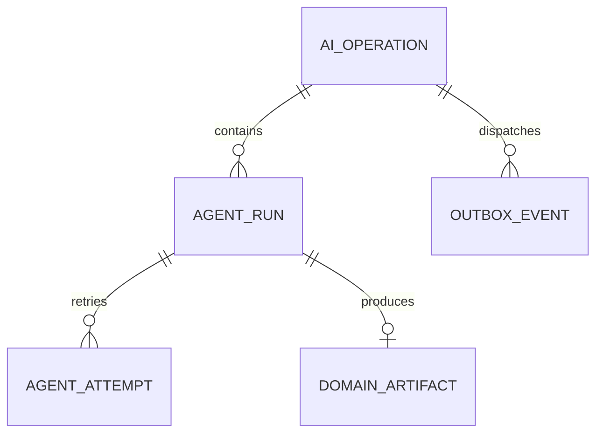
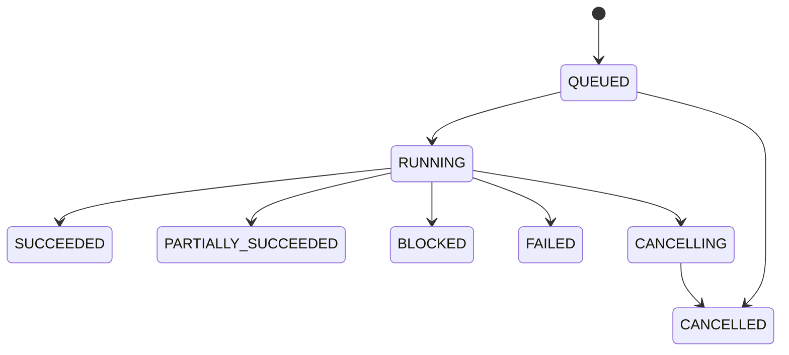

# Modelo de ejecución y estados

## Problema del modelo actual

`AgentExecutionLog` representa simultáneamente solicitud, ejecución e intento técnico. Esto impide modelar correctamente reintentos, batch, múltiples agentes y progreso parcial.

## Modelo propuesto

### `AiOperation`

Intención funcional iniciada por un usuario o proceso autorizado. Es el recurso consultado por la UI.

Campos mínimos:

```text
id
organization_id o teacher_uid
operation_type
aggregate_type
aggregate_id
status
execution_mode
idempotency_key
requested_by
requested_at
started_at
completed_at
progress_current
progress_total
result_reference_type
result_reference_id
failure_code
failure_message_safe
cancellation_requested_at
version
```

### `AgentRun`

Ejecución lógica de un agente dentro de una operación. Una operación batch puede tener muchos runs.

```text
id
operation_id
agent_name
agent_version
input_schema_version
output_schema_version
input_hash
status
provider_policy
attempt_count
started_at
finished_at
result_reference_type
result_reference_id
```

### `AgentAttempt`

Intento técnico concreto de un run. Permite retry sin duplicar el trabajo lógico.

```text
id
agent_run_id
attempt_number
provider
model
prompt_version
provider_request_id
correlation_id
status
estimated_input_tokens
estimated_output_tokens
actual_input_tokens
actual_output_tokens
estimated_cost
actual_cost
latency_ms
error_code
started_at
finished_at
```

## Cardinalidades



## Estados de operación

| Estado | Significado |
|---|---|
| `QUEUED` | Persistida y pendiente de despacho |
| `RUNNING` | Uno o más runs en ejecución |
| `SUCCEEDED` | Todos los resultados esperados fueron producidos |
| `PARTIALLY_SUCCEEDED` | Batch con éxitos y fallos terminales |
| `BLOCKED` | Requiere input o decisión externa |
| `FAILED` | No produjo resultado funcional utilizable |
| `CANCELLING` | Cancelación solicitada |
| `CANCELLED` | No continuará procesándose |
| `TIMED_OUT` | Se agotó el deadline global |

## Estados de run

```text
PENDING
DISPATCHED
RUNNING
NEEDS_INPUT
SUCCEEDED
FAILED_RETRYABLE
FAILED_FINAL
CANCELLED
TIMED_OUT
```

## Transiciones



Las transiciones deben estar encapsuladas en el dominio; no deben asignarse strings desde controllers o adapters.

## Estado técnico versus estado académico

Mantener dimensiones independientes:

| Dimensión | Estados ejemplo |
|---|---|
| Ejecución | `RUNNING`, `SUCCEEDED`, `FAILED` |
| Validación | `VALID`, `INVALID`, `WARNING` |
| Revisión | `PENDING_REVIEW`, `APPROVED`, `EDITED`, `REJECTED` |
| Publicación | `NOT_PUBLISHED`, `PUBLISHED`, `REVOKED` |

Un Grading Agent puede terminar `SUCCEEDED`, crear una `GradeSuggestion VALID/PENDING_REVIEW`, y aun así no existir nota final publicable.

