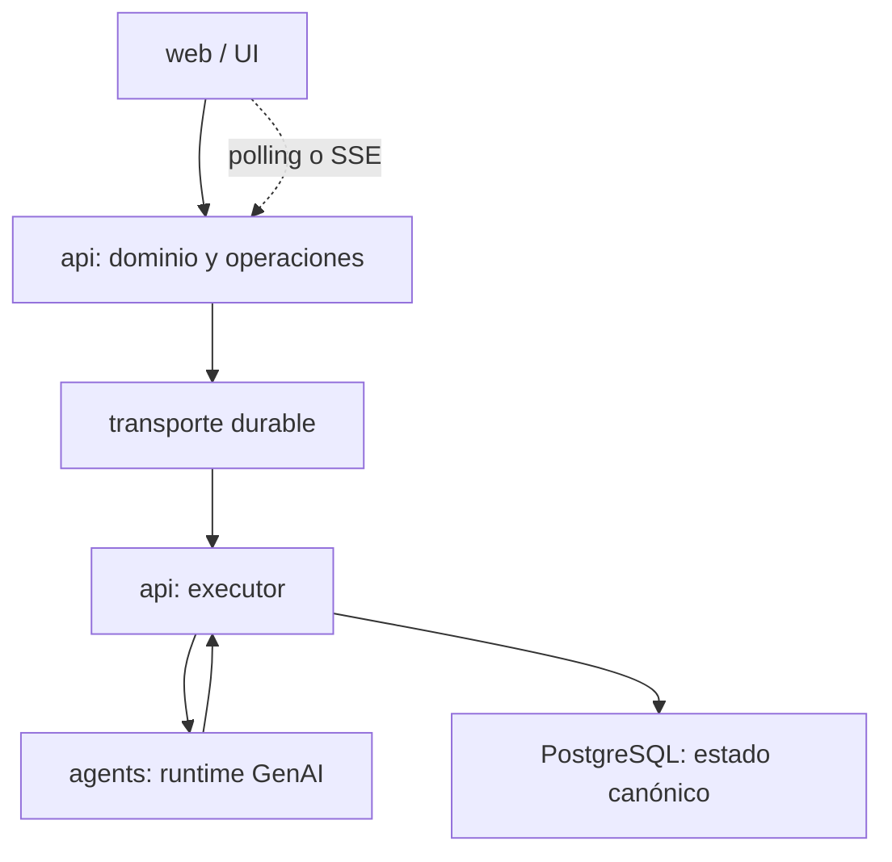

# GradeOps AI — API como intermediario entre UI y Agents

## Propósito

Este paquete documenta el análisis técnico y la arquitectura recomendada para que `api/` funcione como intermediario durable entre `web/` y `agents/` en GradeOps AI.

Está diseñado como material de entrada para el agente AI encargado de producir el plan de implementación. Distingue explícitamente:

- hechos verificados en el código actual;
- restricciones funcionales y no funcionales;
- arquitectura objetivo recomendada;
- brechas entre implementación y documentación;
- decisiones propuestas que aún requieren formalización;
- secuencia incremental sugerida, sin sustituir el Master Plan funcional.

## Baseline revisada

| Elemento | Valor |
|---|---|
| Repositorio | `cmartinezs/grade-ops-ai` |
| Rama | `develop` |
| Commit revisado | `aa2dc4e` |
| Fecha de revisión | 2026-07-20 |
| Componentes principales | `api/`, `agents/`, `docs/` |
| API | Spring Boot 4.1.0, Java 21, Web MVC, JPA, PostgreSQL, Flyway |
| Runtime de agentes | Spring Boot 4.1.0, Java 21, Spring AI, Gemini/Groq |

## Índice

1. [Resumen ejecutivo](01-resumen-ejecutivo.md)
2. [Evidencia y estado actual](02-estado-actual-y-evidencia.md)
3. [Responsabilidades y límites](03-responsabilidades-y-limites.md)
4. [Modelo de ejecución y estados](04-modelo-de-ejecucion-y-estados.md)
5. [Ejecución síncrona y asíncrona](05-sincronia-asincronia-y-flujos.md)
6. [Contratos y API](06-contratos-api-y-agents.md)
7. [Persistencia, consistencia e idempotencia](07-persistencia-consistencia-e-idempotencia.md)
8. [Requisitos no funcionales](08-requisitos-no-funcionales.md)
9. [Brechas, riesgos y deuda](09-brechas-riesgos-y-deuda.md)
10. [Estrategia incremental para planificación](10-estrategia-incremental.md)
11. [Decisiones y preguntas abiertas](11-decisiones-y-preguntas-abiertas.md)

## Reglas de interpretación para el agente planificador

1. `api/` es la única fuente de verdad del dominio y del workflow visible para la UI.
2. `agents/` ejecuta capacidades GenAI; no aprueba, publica, factura ni modifica directamente agregados de negocio.
3. No crear una release técnica aislada para “terminar el runtime”. Cada capacidad se incorpora con un consumidor funcional real.
4. Mantener compatibilidad con la vertical slice actual del Assessment Agent durante la migración.
5. No introducir Kafka, Temporal, WebSocket, RAG, memoria vectorial, multiagente genérico o sandbox sin una necesidad funcional concreta.
6. El grading de modo Closed continúa siendo determinístico en `api/`.
7. Toda salida que afecte evaluación, feedback o contenido estudiantil requiere revisión y aprobación docente explícita.
8. `StudentSubmission` es la unidad técnica y económica central del ciclo Open.
9. Los trabajos asíncronos deben ser durables; `@Async` en una instancia de Cloud Run no es suficiente.
10. Toda historia con AI debe incluir contratos, estados, idempotencia, costo, observabilidad, seguridad y pruebas.

## Incorporación al Master Plan

Este paquete se materializa en [`docs/master-plan/analysis/api-agent-orchestration-strategy.md`](../../master-plan/analysis/api-agent-orchestration-strategy.md). Las releases R01-R06 deben incorporar sus reglas como incrementos funcionales, no como una release técnica transversal.

Toda tarea que defina o cambie endpoints de `api/`, endpoints/contratos internos de `agents/` o rutas funcionales de `web/` debe completar el bloque `API / Agent / Web Contract Gate` del template de tarea correspondiente.

### Checkpoint Richardson REST

El gate debe buscar madurez REST cercana a Richardson nivel 3:

- recursos y URIs de negocio claros;
- métodos HTTP y status codes coherentes;
- `Location` cuando se crea un recurso u operación consultable;
- links o affordances para `self`, `operation`, `runs`, `result`, `cancel` y `retry` cuando apliquen;
- errores normalizados, seguros y trazables;
- idempotencia para comandos GenAI mutantes;
- contratos documentados y contract tests API-Web/API-Agents.

## Resultado arquitectónico esperado

La UI inicia comandos funcionales y consulta operaciones. La API valida, persiste y orquesta. El runtime ejecuta agentes tipados y devuelve resultados estructurados. La API valida nuevamente, persiste artefactos revisables y aplica las reglas de aprobación.

