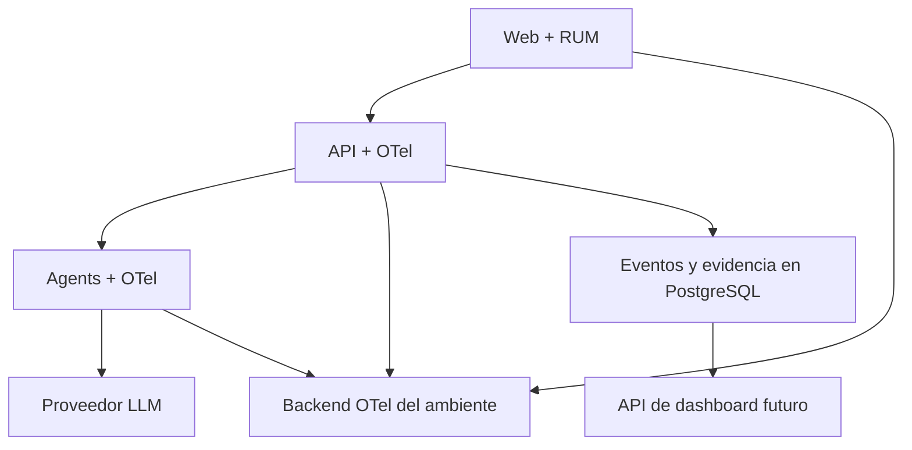

# Modelo objetivo de observabilidad

## Capas

1. **Instrumentación**: SDK OpenTelemetry, Micrometer/Actuator, Web Vitals y eventos canónicos.
2. **Contexto**: W3C Trace Context más IDs de negocio.
3. **Exportación**: OTLP o integración nativa mediante adaptadores por ambiente.
4. **Backends**: GCP para `demo`; Vercel/Render más un destino OTel acordado para `beta`; PostgreSQL/Neon para evidencia; object storage para artefactos.
5. **Consulta**: alertas operacionales, consultas internas y posteriormente dashboard GradeOps.

## Responsabilidades

| Componente | Responsabilidad |
|---|---|
| `web/` | RUM mínimo, Web Vitals, errores, navegación y eventos de UX sin PII |
| `api/` | Autoridad de operaciones, eventos de negocio, métricas HTTP/DB y spans principales |
| `agents/` | Runs/attempts, proveedor LLM, tokens, costo, validación y errores normalizados |
| `infra/` | Configuración reproducible de GCP y configuración versionada/automatizada de Vercel, Render, Neon, retención, alertas y exportadores |

## Identificadores complementarios

- `trace_id`: causalidad técnica distribuida.
- `span_id`: unidad técnica dentro de una traza.
- `request_id`: una interacción HTTP concreta.
- `correlation_id`: agrupación compatible con clientes/sistemas que no entienden trazas.
- `operation_id`: intención durable del usuario.
- `agent_run_id`: ejecución lógica de un agente.
- `attempt_id`: intento técnico individual.

No deben reutilizarse como si fueran el mismo concepto.

## Arquitectura mínima

## Convenciones

- Nombres semánticos estables: `gradeops.ai.run.completed`, no frases libres.
- Atributos de baja cardinalidad en métricas.
- IDs solo en logs, spans o eventos; nunca como labels de métricas.
- UTC y timestamps ISO-8601.
- `service.name`, `service.version`, `deployment.environment` y `cloud.region` en todas las señales.
- `deployment.environment.name` debe distinguir al menos `local`, `test`, `demo` y `beta`.
- `cloud.provider`/`cloud.platform` describen el runtime sin cambiar nombres de eventos ni métricas.
