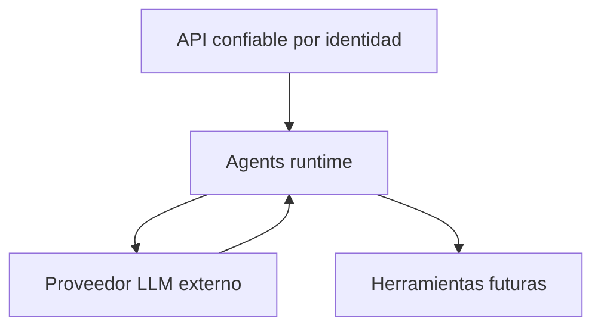

# Modelo de confianza

## Fronteras

- `api/` es caller autorizado, pero sus payloads deben validarse: un bug o compromiso no debe generar gasto ilimitado.
- Los datos Teacher/Student, archivos y resultados previos son contenido no confiable.
- El modelo LLM es probabilístico y su output nunca es autoridad.
- Herramientas y sandbox son fronteras adicionales, no extensiones inocuas.

## Responsabilidades

`api/`: autenticar usuario, roles, ownership, plan/cuota, reserva económica, idempotencia funcional, persistencia y aprobación.

`agents/`: autenticar servicio, validar capability/policy, limitar ejecución, proteger prompts, controlar provider/tools, validar output y emitir evidencia técnica.

`infra/`: servicio no público, IAM invoker, service accounts, Secret Manager, egress y observabilidad.

## Defensa en profundidad

Un request válido necesita identidad de servicio + audience + endpoint/capability permitida + contrato válido + policy dentro de límites locales. Ningún campo del payload sustituye estas comprobaciones.
