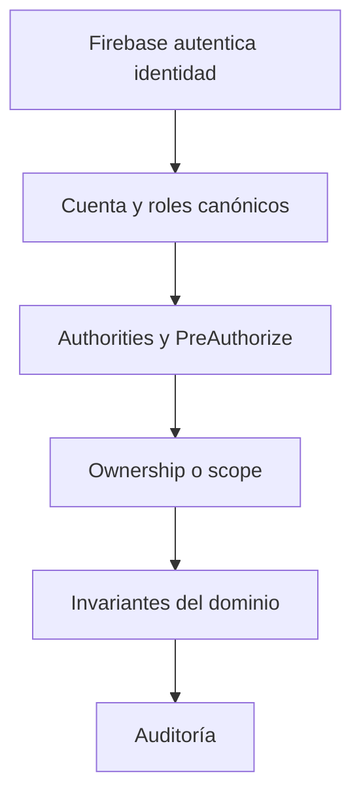

# Resumen general

## Conclusión principal

`api/` autentica usuarios mediante Firebase, exige condiciones básicas de identidad y restringe rutas no públicas a usuarios autenticados. Sin embargo, todavía no implementa autorización basada en roles o permisos.

El problema central está en la creación del objeto `Authentication`: el usuario se registra con una colección vacía de authorities. Por ello, Spring Security solo puede responder si existe o no un usuario autenticado; no puede diferenciar Teacher de Operator ni aplicar correctamente `hasRole(...)` o `hasAuthority(...)`.

Además:

- `@EnableMethodSecurity` no está habilitado.
- No existen roles persistidos como modelo canónico.
- Los assessments tienen controles parciales y correctos de ownership.
- El ownership no está generalizado como política transversal.
- Los endpoints internos usan un secreto compartido.
- El campo `setBy` llega desde el request, permitiendo falsificar al actor auditado.
- El estudiante del MVP no es una cuenta Firebase: accede mediante una invitación limitada.

## Arquitectura recomendada

La autorización debe componerse en capas:

Cada capa responde una pregunta distinta:

| Capa | Pregunta |
|---|---|
| Autenticación | ¿Quién es el actor? |
| Rol/permiso | ¿Tiene capacidad general para ejecutar la acción? |
| Ownership/scope | ¿Puede actuar sobre este recurso concreto? |
| Dominio | ¿La acción es válida en el estado actual? |
| Auditoría | ¿Qué intentó hacer, sobre qué y con qué resultado? |

## Alcance recomendado para el MVP

- Roles humanos: `TEACHER`, `OPERATOR`.
- Estudiante: invitación firmada y acotada, sin rol Spring global.
- Servicios internos: identidad OIDC service-to-service.
- Fuente canónica de autorización: PostgreSQL.
- Firebase Custom Claims: optimización opcional, no autoridad exclusiva.
- Protección de método: authorities semánticas mediante `@PreAuthorize`.
- Recursos docentes: consultas filtradas por `resourceId + teacherUid`.
- Auditoría: actor derivado exclusivamente del principal autenticado.
