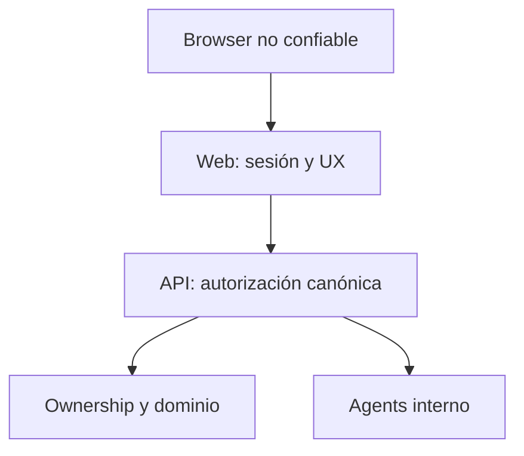

# Modelo objetivo y fronteras

## Principio central

El navegador es un cliente no confiable. El usuario puede modificar JavaScript, requests, storage, parámetros y respuestas simuladas. Por tanto:

1. Firebase prueba identidad.
2. `api/` resuelve cuenta, roles y permisos.
3. `web/` representa la sesión y las capacidades para UX.
4. `api/` valida nuevamente permission, ownership y estado en cada comando.

## Capas del frontend

- `AuthProvider`: estado Firebase, renovación y cierre de sesión.
- `SessionProvider`: perfil mínimo y capabilities obtenidos de `/api/v1/me`.
- `RoutePolicy`: decide render/redirect por tipo de superficie.
- `ApiClient`: tokens, errores normalizados, abort, correlation e idempotencia.
- Componentes de autorización: `Can`, `RequirePermission`; solo UX.
- Auditoría servidor: nunca confiar en eventos de seguridad emitidos solo por el navegador.

## Contrato recomendado `/api/v1/me`

Debe devolver identidad mínima, roles y permisos efectivos, sin políticas internas innecesarias. La UI puede construir menús con capabilities, pero una respuesta manipulada no concede acceso porque la API reautoriza cada acción.

## Server-side/BFF

Una sesión con cookie `HttpOnly`, `Secure` y `SameSite` reduce exposición directa del token a JavaScript, pero introduce CSRF, refresh y operación server-side. Debe decidirse mediante ADR. Mientras se mantenga Firebase cliente, no copiar tokens a cookies o storage manualmente.
