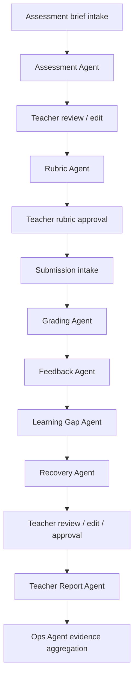
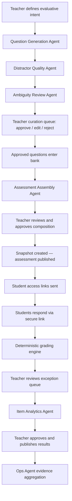

# Agents Overview

GradeOps AI uses specialized agents to operate the assessment workflow for programming educators. The agent layer is not a generic chatbot: each agent owns a bounded responsibility, returns structured output, creates audit evidence, and hands control back to the teacher when the output affects grading, feedback, reports, trust, or student-facing communication.

## Canonical Alignment

| Decision | Agent implication |
| --- | --- |
| Initial wedge: programming assessments | Agents specialize in practical programming assessment operations. |
| Teacher authority | Agents suggest; teachers approve high-impact outputs. |
| AI-native operation | Agent runs must be visible, logged, and demo-ready. |
| Business evidence | Logs support usage, cost, revenue, customer proof, and product validation. |
| Credit-based workflow pricing | Agents report actual workflow cost and resolved route; API owns quotes and credit ledger. |

## Current Implementation Status

The documentation describes the intended 13-agent catalog. The current verified implementation is narrower:

| Area | Status | Notes |
| --- | --- | --- |
| Assessment Agent | Implemented vertical slice | `agents/` exposes `POST /internal/agents/assessment`; API calls it through `agentclient`; output includes structured result and execution payload. |
| Provider adapters | Implemented for Assessment Agent | `gemini` and `groq` adapters exist; Groq is the current default provider, Gemini remains supported for Google Cloud-oriented environments. |
| Policy-based Model Router | Planned evolution | Current selector/default remains implemented; deterministic capability/budget/privacy routing replaces normal command-level selection incrementally. |
| Generic runtime | Planned incrementally | `AgentDefinition`, registry, shared gateway, tool loop, `AgentRun`/`AgentStep`, async/cancel/resume are not baseline capabilities yet. |
| Other 12 agents | Contracted / planned | Their files define required behavior; implementation should follow the release sequence in the Master Plan. |

Agents do not own domain entities or persistence. They receive `{Agent}Command`, return `{Agent}Result` plus execution metadata, and leave persistence, approvals, publication, billing and workflow state to `api/`.

## Agent Set

### Open Assessment Agents

| Agent | Responsibility | Primary output |
| --- | --- | --- |
| Assessment Agent | Draft assessment from learning goal and constraints. | Assessment brief. |
| Rubric Agent | Create and validate scoring rubric. | Rubric and validation notes. |
| Grading Agent | Analyze submissions against approved rubric. | Grading suggestions. |
| Feedback Agent | Draft student-facing feedback. | Feedback drafts. |
| Learning Gap Agent | Detect repeated cohort/student gaps. | Gap summary. |
| Recovery Agent | Suggest remedial activities. | Recovery activity. |
| Teacher Report Agent | Summarize the assessment cycle. | Teacher report. |
| Ops Agent | Capture usage, cost, and business evidence. | Logs and evidence summaries. |

### Closed Assessment Agents

| Agent | Responsibility | Primary output |
| --- | --- | --- |
| Question Generation Agent | Generate objective questions (TF/SC/MC) with alternatives, key, difficulty, and outcome. | Question batch for curation. |
| Distractor Quality Agent | Evaluate and flag weak, biased, or misleading incorrect alternatives. | Distractor quality assessment. |
| Ambiguity Review Agent | Detect interpretation problems, double-valid answers, and structural issues in questions. | Ambiguity flags per question. |
| Assessment Assembly Agent | Compose a balanced assessment from approved bank questions. | Proposed question composition. |
| Item Analytics Agent | Analyze post-assessment item performance, difficulty, and learning outcome coverage. | Item analytics report and reinforcement suggestions. |

## Agent Contracts And Runtime Responsibilities

| Agent | Mode | Command | Result | First planned runtime need |
| --- | --- | --- | --- | --- |
| Assessment Agent | Open/shared | `AssessmentCommand` | `AssessmentResult` + execution payload | Existing endpoint; stabilize provider/model policy, errors, cost and logs. |
| Rubric Agent | Open | `RubricCommand` | `RubricResult` | Shared `AgentDefinition`, registry/gateway and validators. |
| Grading Agent | Open | `GradingCommand` | `GradingResult` | Shared gateway, output validation, optional sandbox only if code execution is introduced. |
| Feedback Agent | Open | `FeedbackCommand` | `FeedbackResult` | Typed handoff from grading output and teacher edits. |
| Learning Gap Agent | Open | `LearningGapCommand` | `LearningGapResult` | Read-only aggregate tools and fact/inference separation. |
| Recovery Agent | Open | `RecoveryCommand` | `RecoveryResult` | Handoff from approved gap evidence, teacher approval before assignment. |
| Teacher Report Agent | Open/shared | `TeacherReportCommand` | `TeacherReportResult` | Report aggregation tools and source-grounded summaries. |
| Ops Agent | Shared | `OpsEvidenceCommand` | `OpsEvidenceResult` | Read-only evidence tools, cost/readiness checks, no mutation authority. |
| Question Generation Agent | Closed | `QuestionGenerationCommand` | `QuestionGenerationResult` | Controlled tool loop for bank/context lookups. |
| Distractor Quality Agent | Closed | `DistractorQualityCommand` | `DistractorQualityResult` | Batch validation and quality flags. |
| Ambiguity Review Agent | Closed | `AmbiguityReviewCommand` | `AmbiguityReviewResult` | Ambiguity/double-valid-answer validators. |
| Assessment Assembly Agent | Closed | `AssessmentAssemblyCommand` | `AssessmentAssemblyResult` | Tool loop with bank/coverage tools and deterministic publish validators. |
| Item Analytics Agent | Closed | `ItemAnalyticsCommand` | `ItemAnalyticsResult` | Analytics summarization; scoring remains deterministic in API. |

Every result must separate facts, model interpretations, recommendations and requested actions. `Block` / `NEEDS_INPUT` is preferable to fabricating missing context.

## End-To-End Agent Flows

### Open Assessment



### Closed Assessment



## Design Principles

1. One clear responsibility per agent.
2. Structured JSON-compatible output by default.
3. Teacher approval at every high-impact checkpoint.
4. Logs for every meaningful agent run.
5. Model, token estimate, retry count, and estimated cost captured when possible.
6. Explicit uncertainty flags instead of false confidence.
7. No silent final decisions.
8. Explicit handoffs between agents.
9. Domain-bound behavior focused on programming education.
10. Recoverable failure states.

## Required Control Checkpoints

### Open Assessment

| Checkpoint | Human control |
| --- | --- |
| Assessment draft | Teacher approves before student use. |
| Rubric | Teacher approves before grading starts. |
| Grading suggestion | Teacher confirms, edits, or rejects. |
| Feedback draft | Teacher approves before delivery/export. |
| Learning gap summary | Teacher confirms instructional relevance. |
| Recovery activity | Teacher approves before assigning. |
| Teacher report | Teacher validates before sharing. |

### Closed Assessment

| Checkpoint | Human control |
| --- | --- |
| Each generated question | Teacher approves, edits, or rejects before entering bank. |
| Assessment composition | Teacher approves before snapshot is created. |
| Answer key and scoring policy | Teacher confirms before publish. |
| Exception queue | Teacher resolves all exceptions before publishing results. |
| Item analytics and reinforcement | Teacher reviews before acting on or sharing. |
| Answer key correction (post-grading) | Teacher explicit action; triggers audited recalculation. |

### Shared

| Checkpoint | Human control |
| --- | --- |
| Evidence dashboard | Operator validates before public/demo use. |

## Common Agent Input Envelope

```json
{
  "request_id": "REQ-001",
  "tenant_id": "TENANT-001",
  "teacher_id": "TEACHER-001",
  "customer_id": "CUSTOMER-001",
  "assessment_id": "ASSESSMENT-001",
  "submission_id": null,
  "workflow_stage": "rubric_generation",
  "domain": "programming_education",
  "language": "en",
  "safety_policy": {
    "student_facing_requires_teacher_approval": true,
    "final_grading_requires_teacher_approval": true,
    "avoid_sensitive_personal_data": true
  },
  "cost_policy": {
    "track_model": true,
    "track_tokens": true,
    "track_estimated_cost": true,
    "premium_fallback_allowed": false
  }
}
```

## Common Agent Log Schema

```json
{
  "agent_run_id": "ARUN-001",
  "request_id": "REQ-001",
  "agent_name": "Rubric Agent",
  "agent_version": "0.1.0",
  "assessment_id": "ASSESSMENT-001",
  "submission_id": null,
  "teacher_id": "TEACHER-001",
  "customer_id": "CUSTOMER-001",
  "started_at": "2026-06-08T00:00:00Z",
  "completed_at": "2026-06-08T00:00:10Z",
  "status": "succeeded",
  "model_policy": "flash-class",
  "input_token_estimate": 10000,
  "output_token_estimate": 2000,
  "estimated_cost_usd": 0.012,
  "input_summary": "Assessment brief for Java control flow evaluation.",
  "output_summary": "Rubric with 5 criteria and validation notes.",
  "uncertainty_flags": [],
  "requires_teacher_approval": true,
  "teacher_approval_state": "pending",
  "error_code": null,
  "retry_count": 0
}
```

## Shared Uncertainty Flags

| Flag | Meaning |
| --- | --- |
| `missing_context` | Required input is incomplete. |
| `ambiguous_instruction` | Teacher brief or rubric is unclear. |
| `rubric_mismatch` | Submission cannot be judged cleanly against the rubric. |
| `possible_academic_integrity_issue` | Suspicious pattern; not a final accusation. |
| `low_confidence_score` | Suggested score needs careful review. |
| `long_submission` | Submission may increase cost or reduce quality. |
| `unsafe_student_facing_language` | Feedback needs tone/safety review. |
| `requires_domain_review` | Output requires teacher/domain judgment. |

## Provider / Model Routing Policy

| Agent | Default policy | Notes |
| --- | --- | --- |
| Assessment Agent | Balanced quality/cost profile | Current selector is a migration baseline; normal requests should provide capability and budget, not provider/model. |
| Rubric Agent | Balanced quality profile | Needs consistency and calibration. |
| Grading Agent | Economical bulk profile with allowlisted escalation | Highest-volume step. |
| Feedback Agent | Economical profile with quality fallback | Student-facing quality matters. |
| Learning Gap Agent | Volume-sensitive analysis profile | Aggregation and interpretation. |
| Recovery Agent | Balanced pedagogical profile | Pedagogical usefulness matters. |
| Teacher Report Agent | Balanced narrative profile | Summary quality matters. |
| Ops Agent | Deterministic code first; LLM only for summaries | Avoid unnecessary model spend. |
| Question Generation Agent | Balanced content profile | Content quality and pedagogical correctness matter. |
| Distractor Quality Agent | Economical structured-analysis profile | High volume per batch. |
| Ambiguity Review Agent | Balanced reasoning profile | Interpretation quality matters. |
| Assessment Assembly Agent | Deterministic rules first | Model assistance only inside budget when needed. |
| Item Analytics Agent | Balanced analysis profile | Interpretation and narrative require quality. |

The Model Router evaluates legal/privacy policy, required capabilities, authorized budget, tenant policy, provider health, expected quality, cost/latency, preference, and allowlisted fallback in that order. It is deterministic by default and must not call an LLM merely to route an ordinary execution.

Every workflow enforces token, call, tool, retry, cost, timeout, and idempotency limits. Exact provider/model overrides are internal, permission-gated, and audited. Logs always record the resolved `provider` and `model`.

## Quality Rules

Agents must separate evidence from interpretation, reference rubric criteria when grading or producing feedback, avoid unsupported claims, and fail safely when context is insufficient. Agents must not finalize grades, send feedback to students, override teacher edits, silently change approved rubrics, expose internal prompts to students, or claim certainty where evidence is weak.

## MVP Cut Line

### Open Assessment MVP

Protect these first: Assessment Agent, Rubric Agent, Grading Agent, Feedback Agent, Teacher Report Agent, and Ops Agent logs. Learning Gap and Recovery Agents may be lighter in the first build but must exist in the demo narrative and data model.

### Closed Assessment MVP

Protect these first: Question Generation Agent, question curation queue (Distractor Quality + Ambiguity Review integrated), Assessment Assembly Agent, deterministic grading engine (not an AI agent), and Item Analytics Agent. The demo must show at least one complete closed assessment cycle with student link delivery.

<!-- nav -->

---

[↑ inicio](#agents-overview) | [README](README.md) | [Assessment Agent →](assessment-agent.md)
