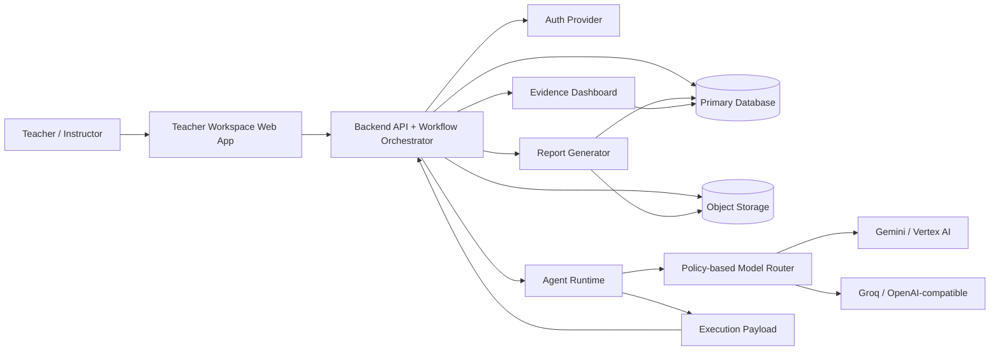
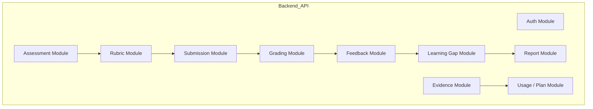
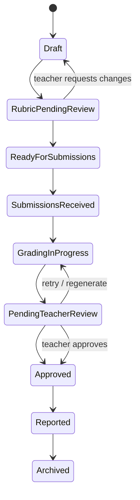
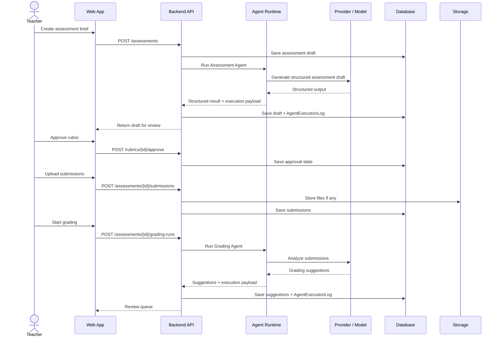
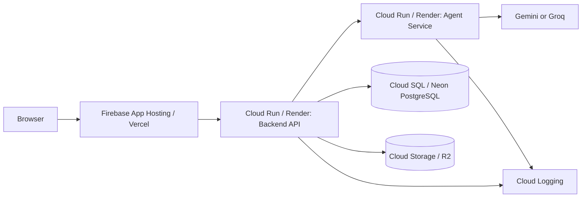

# System Architecture

GradeOps AI MVP should be built as a focused, evidence-first assessment operations system.

The architecture must support teacher-reviewed assessment workflows, specialized AI agents, structured persistence, file/artifact storage, cost and usage tracking, business evidence, and two explicitly different environment roles:

- `beta`: product-evidence environment for fast iteration and working pilot proof.
- `demo`: Google Cloud target with Gemini-capable provider path.

## Architectural Stance

Use a **modular monolith plus agent runtime** for the MVP.

Do not start with a distributed microservice architecture unless a real deployment constraint forces it.

Recommended structure:

```text
grade-ops-ai-web
grade-ops-ai-api
grade-ops-ai-agents
grade-ops-ai-infra
```

Possible MVP simplification:

```text
grade-ops-ai-web
grade-ops-ai-api
```

Where `api` contains the workflow and agent orchestration modules internally.

## Logical Architecture



## Runtime Components

| Component | Responsibility | Stack |
| --- | --- | --- |
| Web App | Teacher workspace, review UI, student access, dashboards | Next.js + TypeScript + Tailwind CSS (`grade-ops-ai-web`). |
| Backend API | Auth, workflow state, business rules, REST API, billing, audit | Spring Boot 4 + Java 21 + PostgreSQL (`grade-ops-ai-api`). |
| Workflow Orchestrator | Coordinates assessment lifecycle and agent handoffs | Module inside `grade-ops-ai-api`. |
| Agent Runtime | Executes agent calls, validates structured outputs, returns execution payloads | Spring Boot 4 + Java 21 + Spring AI (`grade-ops-ai-agents`). |
| Policy-based Model Router | Selects an allowlisted provider/model from capability, privacy, budget, tenant, health, quality, cost and latency constraints | Current Assessment Agent selector is the migration baseline; normal callers stop selecting exact routes. |
| Primary DB | Stores users, assessments, rubrics, submissions, feedback, reports, logs | Cloud SQL PostgreSQL. |
| Object Storage | Stores uploaded files, exports, report artifacts | Cloud Storage. |
| Infrastructure | Cloud Run services, secrets, networking, CI/CD | Terraform + GitHub Actions (`grade-ops-ai-infra`). |
| Evidence Dashboard | Shows agent runs, costs, usage, approvals, business evidence | Backend + Web. |
| Observability | Technical logs, errors, latency, failures | Cloud Logging + application evidence tables. |

## Module Architecture



## Workflow Orchestration



## Agent Execution Pattern

Every agent call should follow the same execution wrapper:

1. Validate command.
2. Load required domain data.
3. Build agent input envelope.
4. Resolve an allowlisted provider/model through deterministic routing policy and the authorized workflow budget.
5. Validate structured output.
6. Build execution payload with provider, model, tokens, cost, latency, status and error metadata.
7. Return structured result and execution payload to the API.
8. API stores domain output, `AgentExecutionLog`, and workflow state.
9. Return reviewable result to teacher.

## Agent Runtime Boundary

The agent runtime can generate assessment drafts, rubrics, grading suggestions, feedback drafts, gap summaries, recovery activities, teacher reports, question batches, quality reviews, assembly proposals, item analytics and evidence summaries.

It must not finalize scores, send feedback to students, silently change approved rubrics, hide failed or uncertain outputs, store secrets in prompts, or bypass workflow state rules.

The API remains the authority for domain state, approval, credit quoting/reservation, persistence and publication. It decides whether the operation may run and supplies the maximum budget. The agent runtime receives capability-oriented commands, selects only allowed tools/providers through its Model Router, enforces token/call/retry/cost/time limits, validates structured output and returns results plus execution metadata.

## Agent Runtime Evolution

The current implemented vertical slice is the Assessment Agent endpoint:

```text
POST /internal/agents/assessment
```

It is a real GenAI execution path, but it is not yet a generic headless runtime. The runtime evolves by functional release:

| Stage | First consumer | Runtime increment |
|---|---|---|
| R01 | Assessment Agent | Preserve compatibility while adding normalized errors, resolved-route evidence, costs, logs and idempotency. |
| R02 | Rubric, Grading, Feedback | `AgentDefinition`, lightweight registry, common gateway and reusable contracts/validators. |
| R03 | Learning Gap, Recovery, Teacher Report | Typed handoffs and read-only aggregate tools. |
| R04 | Closed authoring agents | Controlled tool loop with `AgentAction`, tool registry/executor, policy engine, Model Router and budget manager. |
| R05 | Item Analytics / student attempts | Persistent or async `AgentRun`/`AgentStep` only if volume or latency requires it. |
| R06 | Ops Agent / dashboard | Agent health, provider/model comparison, cost warnings, budget alerts and readiness signals. |

Do not add multi-agent orchestration, memory, RAG, queues, sandboxing or new providers without a release consumer and a decision record.

## Data Flow



## Deployment Topology



## Repository Boundary Recommendation

| Repository | Stack | Responsibilities |
| --- | --- | --- |
| `grade-ops-ai-docs` | Markdown | Documentation, decisions, pitch, roadmap, evidence. |
| `grade-ops-ai-web` | Next.js + TypeScript + Tailwind | Landing, teacher workspace, student access, dashboards. |
| `grade-ops-ai-api` | Spring Boot 4 + Java 21 + PostgreSQL | Auth, workflow, rubrics, submissions, billing, audit, persistence. |
| `grade-ops-ai-agents` | Spring Boot 4 + Java 21 + Spring AI | Agent execution, prompts, provider/model adapters, structured outputs, validation and execution payloads. |
| `grade-ops-ai-infra` | Terraform + GitHub Actions | Cloud Run, Cloud SQL, Cloud Storage, Secret Manager, CI/CD. |

The agents service is a separate internal deployment. In `demo`, it is a Cloud Run service invoked by the API through service-to-service auth. In `beta`, it can run on Render behind internal/shared-secret access. Merging `api` and `agents` into a single process is acceptable only as a temporary delivery shortcut if module boundaries and API-owned persistence remain explicit.

For the internal folder and module structure of each repository, see [`repository-structure.md`](repository-structure.md).

**Deferred repositories** — not created for the MVP:

| Repository | Reason deferred |
| --- | --- |
| `grade-ops-ai-mobile` | Requires validated web MVP first. |
| `grade-ops-ai-ocr` | Physical paper intake is P1; not required for the first MVP. |
| `grade-ops-ai-lms` | Out of scope; GradeOps AI is not an LMS. |
| `grade-ops-ai-code-runner` | Needed only when executing real student code in a sandbox. |
| `grade-ops-ai-sdk` | Public SDK is a post-product concern, not pre-product. |
| `grade-ops-ai-admin` | Institutional admin panel is post-MVP. |

## Synchronous vs Asynchronous Processing

Use synchronous processing for assessment draft, rubric draft, small demo runs, and teacher report draft.

Use asynchronous processing for batch grading, bulk feedback generation, report generation after many submissions, retries, and expensive fallback models.

MVP can start with synchronous calls for speed. Persistent `AgentRun`/`AgentStep`, cancellation, resume and queue-backed execution should be introduced only when a functional release creates a real volume or latency need.

## Environment Roles

| Environment | Role | Architecture notes |
|---|---|---|
| `beta` | Product-evidence environment | Vercel + Render + Neon + R2 + Firebase Authentication; supports fast iteration and currently uses the implemented provider adapters. |
| `demo` | Google Cloud target | Firebase App Hosting + Cloud Run + Cloud SQL + Cloud Storage + Firebase Authentication + Gemini-capable provider path. Terraform currently provisions core GCP resources, with Firebase App Hosting backend creation requiring manual CLI/OAuth steps. |

Do not state that the product is fully deployed on Google Cloud until deployment URL, GCP project evidence and provider/API usage evidence exist.

## Evidence Architecture

Evidence is not a side-effect. It is part of the core architecture.

| Operation | Evidence |
| --- | --- |
| Agent call | `AgentExecutionLog`. |
| Teacher approval | `ApprovalEvent`. |
| Cost estimate | `CostEvent` or cost fields in agent log. |
| Submission processed | `UsageEvent`. |
| Payment/commitment | `RevenueEvent` or external evidence link. |
| Report generated | `ReportArtifact`. |
| Customer testimonial | `CustomerEvidence`. |

## Key Architecture Decisions

| Decision | Rationale |
| --- | --- |
| Modular monolith first | Faster delivery, easier debugging, lower operational overhead. |
| Agent wrapper pattern | Consistent logs, validation, cost, retries. |
| Structured JSON outputs | Required for reliable persistence and reporting. |
| Teacher approval states | Trust, safety, and product positioning. |
| Cloud Run deployment | Simple Google Cloud production footprint. |
| Cloud Storage for artifacts | Clean separation of DB records and uploaded/exported files. |
| Evidence dashboard | Supports product management, business validation, and demos. |
| No student login in MVP | Reduces scope and security complexity. |

## MVP Architecture Acceptance Criteria

The architecture is sufficient when the system can create and persist an assessment, call a configured provider/model from the deployed agent runtime, store structured agent output, store submissions, generate grading suggestions linked to rubric criteria, persist teacher approvals, generate reports, expose agent logs with provider/model/status/cost/approval state, support the evidence dashboard, and produce deployment/provider evidence for any customer-facing environment claims.

<!-- nav -->

---

[↑ inicio](#system-architecture) | [README](README.md) | [Data Model →](data-model.md)
