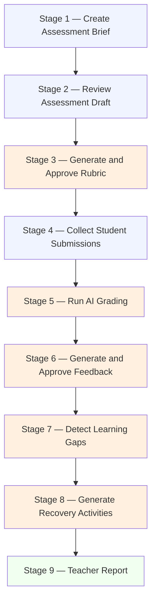

# Open Assessment Workflow

An open assessment is designed for practical, hands-on tasks: code submissions, programming exercises, extended written responses. AI agents draft the assessment content, build the grading rubric, analyze submissions, write feedback, detect learning gaps, and generate a final report. You review and approve every output before it has any effect on grading or student-facing content.

This guide walks through the complete cycle from brief to published report.

---

## The Open Assessment Pipeline

**Legend:** Blue = information you provide or actions you take. Orange = AI-generated outputs waiting for your review. Green = completed output.

---

## Stage 1 — Create Assessment Brief

The assessment brief is the input you give to the AI. It defines what you want to evaluate. The more specific your brief, the better the generated assessment will match your teaching context.

### How to create a brief

1. From your dashboard, click **Create assessment**.
2. Select **Open** as the assessment mode.
3. Fill in the brief form:

| Field | Description | Required |
|---|---|---|
| **Learning goal** | What should students be able to do after this assessment? | Yes |
| **Topic** | The specific subject area (e.g., "loops and iteration in Python") | Yes |
| **Programming language** | The language students will use, or "pseudocode" if language-agnostic | Yes |
| **Level** | Introductory, basic, intermediate, or advanced | Yes |
| **Estimated duration** | How long students have to complete the assessment (in minutes) | Yes |
| **Estimated student count** | Approximate number of submissions you expect | Yes |
| **Constraints** | Allowed or prohibited resources, special instructions, time limits | No |
| **Teacher notes** | Additional context for the AI (e.g., "students have not yet seen recursion") | No |

4. Click **Generate assessment** when the form is complete.

### Tips for writing a good learning goal

A good learning goal is specific, measurable, and tied to a programming concept. Avoid vague goals.

| Weak goal | Stronger goal |
|---|---|
| "Test Java knowledge" | "Evaluate correct use of conditionals, loops, and methods in Java for a basic problem-solving task" |
| "Python exercise" | "Assess ability to define and call functions, handle input/output, and use a list to solve a data processing problem in Python" |
| "Test algorithms" | "Evaluate understanding of sorting algorithm selection and implementation, with correct use of time complexity reasoning" |

### What the system does with your brief

Your brief is saved before any agent runs. If the agent fails or times out, your input is not lost. After you click **Generate assessment**, the Assessment Agent runs in the background — the interface shows the agent name and a progress indicator while it works.

---

## Stage 2 — Review Assessment Draft

The Assessment Agent reads your brief and generates a structured assessment draft. This draft is a starting point — it is not final until you approve it.

### What the draft contains

| Section | Description |
|---|---|
| **Title** | A suggested name for the assessment |
| **Context** | Background scenario or problem statement presented to students |
| **Instructions** | Step-by-step directions for students |
| **Tasks or exercises** | The specific activities students must complete |
| **Deliverables** | What students must submit (e.g., code file, written explanation) |
| **Constraints** | Allowed and prohibited resources |
| **Time allocation** | Suggested time breakdown per task |
| **Evaluation hints** | Notes to guide rubric generation (not shown to students) |

### How to review the draft

Read each section carefully and ask:

- Does this assessment match the learning goal I defined?
- Are the instructions clear for students at the level I selected?
- Do the tasks reflect what I actually teach?
- Is the difficulty appropriate?

### Actions available

| Action | What It Does |
|---|---|
| **Approve** | Locks the draft and makes rubric generation available |
| **Edit** | Opens inline editing for any section; you save your changes and then approve |
| **Regenerate** | Discards the current draft and asks the AI to try again with the same brief. You can add a note to guide the regeneration. |

### After approval

Once you approve the draft, it is locked. The rubric generation step becomes available. You cannot silently change an approved draft — any structural change creates a new version.

---

## Stage 3 — Generate and Approve the Rubric

The rubric is the grading standard for this assessment. It is generated from your approved assessment draft by the Rubric Agent. The rubric must be approved before AI grading can begin.

### What a rubric contains

A rubric consists of one or more **criteria**. Each criterion has:

| Element | Description |
|---|---|
| **Name** | The skill or behavior being evaluated (e.g., "Correct use of loops") |
| **Weight** | The percentage of the total score this criterion represents. All criteria weights sum to 100. |
| **Performance levels** | Descriptions of what each score level looks like: Excellent, Satisfactory, Developing, Insufficient |
| **Common mistakes** | Notes the agent identified as frequent errors for this criterion |

### How weights work

Weights determine how much each criterion contributes to the final score. For example:

| Criterion | Weight |
|---|---|
| Correct use of conditionals | 30% |
| Function definition and calls | 25% |
| Input/output handling | 20% |
| Code readability | 15% |
| Problem-solving approach | 10% |
| **Total** | **100%** |

If the generated weights do not match your priorities, edit them. The interface will warn you if the total deviates from 100.

### How to review the rubric

For each criterion, verify:

1. Is the name clear and measurable? A criterion like "Good code" is too vague. "Correct use of exception handling" is specific.
2. Is the weight proportional to how much this skill matters in this assessment?
3. Do the performance level descriptions match how you actually grade? Adjust any that feel too lenient or too strict for your context.
4. Do the listed common mistakes reflect what you actually see in your students' work?

### Actions available

| Action | What It Does |
|---|---|
| **Approve** | Locks the rubric permanently as the grading standard for this assessment |
| **Edit** | Modify any criterion name, weight, or level description. Edit as many criteria as needed, then approve. |
| **Reject and regenerate** | Discards the rubric and requests a new draft. Use this if the criteria are fundamentally misaligned with the assessment. |

### Why approval matters

Once you approve the rubric, it becomes the permanent grading standard. You cannot silently modify an approved rubric after grading has started. This protects grading consistency — all submissions are scored against the same criteria. If you need to change a criterion after grading has begun, this creates a new rubric version and requires an explicit acknowledgment.

---

## Stage 4 — Collect Student Submissions

After approving the rubric, the assessment moves to submission intake. In open mode, you are responsible for loading student submissions into the system. Students do not submit their own work directly in this mode.

### Adding a submission

For each student:

1. Navigate to the **Submissions** tab of the assessment.
2. Click **Add submission**.
3. Enter a **student identifier**. This can be a name, a code (e.g., "S01"), an alias, or a pseudonym — the format is your choice. You do not need to use real names.
4. Enter the submission content by either:
   - Pasting code or text directly into the text field.
   - Uploading a file. Supported formats include `.txt`, `.java`, `.py`, `.js`, `.ts`, `.html`, `.css`, and `.md`.
5. Click **Save submission**.

The submission appears in the list with status **received**.

### What a submission record contains

| Field | Description |
|---|---|
| **Student identifier** | The code or name you assigned |
| **Content** | The submitted code or text |
| **Language detected** | Programming language auto-detected from the content |
| **Status** | Current stage: received → analysis pending → analyzed |

### Adding multiple submissions

You can add submissions one at a time or use a bulk import option if available. There is no required order — you can add submissions over time and run grading when you are ready.

### Handling problems

| Problem | What to do |
|---|---|
| **Unsupported file format** | The system rejects the file with a clear message. Paste the content as text instead. |
| **Empty submission** | The system marks it as invalid. Add content before saving. |
| **Duplicate student identifier** | The system warns you. Each identifier must be unique within the assessment. |
| **Very large submission** | The system warns you about higher processing cost. Confirm to proceed. |
| **Student submitted the wrong file** | Delete the submission record and add a new one with the correct content. |

---

## Stage 5 — Run AI Grading

With submissions loaded and your rubric approved, you can run AI grading. The Grading Agent analyzes each submission against your rubric, criterion by criterion.

### How to start grading

1. Go to the **Grading** tab.
2. Select the submissions you want to analyze (or select all).
3. Click **Analyze submissions**.
4. The Grading Agent processes each submission. Progress is visible in real time.

### What grading produces

For each submission, the Grading Agent returns:

| Output | Description |
|---|---|
| **Suggested score per criterion** | A numeric score for each rubric criterion |
| **Evidence summary** | A short explanation of what the agent found in the submission to justify the score |
| **Suggested total score** | The sum of criterion scores, weighted according to your rubric |
| **Uncertainty flags** | Warnings about areas where the agent is not confident |

### Uncertainty flags

Uncertainty flags are important signals. When the Grading Agent is not confident about a suggestion, it flags it so you know to pay extra attention.

| Flag | Meaning |
|---|---|
| `ambiguous_submission` | The submission is unclear or does not match expected patterns |
| `low_confidence_score` | The agent score may be unreliable for this criterion |
| `incomplete_submission` | The submission appears to be missing required content |
| `requires_human_review` | The agent recommends direct teacher review for this item |

A flagged submission cannot be bulk-approved. You must open it and review it manually before approving.

### Reviewing grading suggestions

The grading review queue shows all submissions with their suggested scores. For each submission:

1. Click to open the full review view.
2. Read the suggested score and evidence summary for each criterion.
3. Check any uncertainty flags.
4. Take one of the following actions:

| Action | When to Use |
|---|---|
| **Approve** | You agree with the AI suggestion. The score is confirmed. |
| **Edit** | You want to change the score or add a note. Enter your revised score, add a comment if needed, then save. Your edit is logged with your identity. |
| **Reject** | You disagree with the suggestion. The submission is marked for manual scoring or regeneration. |
| **Defer** | You are not ready to decide yet. The submission stays in the queue as "needs review." |

### The core principle

**No grade is final until you approve it.** The grading queue shows "Suggested score" labels, not final scores. Your approval is what converts a suggestion into a confirmed result.

---

## Stage 6 — Generate and Approve Feedback

Once you have approved (or edited) grading suggestions, the Feedback Agent can generate personalized feedback for each student.

### What the Feedback Agent produces

For each student, the agent writes:

| Section | Description |
|---|---|
| **Summary** | A brief overall assessment of the submission |
| **Strengths** | What the student did well, with references to rubric criteria |
| **Improvement areas** | Where the student fell short, with specific examples from their submission |
| **Next steps** | Concrete actions the student can take to improve |
| **Rubric criterion references** | Links specific feedback points back to grading criteria |

### Tone options

You can configure the tone of feedback drafts:

| Tone | Description |
|---|---|
| **Supportive** | Encouraging language with a growth-focused framing |
| **Neutral** | Balanced, factual language without strong emotional coloring |
| **Formal** | Professional, structured language appropriate for institutional settings |

### How to review feedback

1. Go to the **Feedback** tab.
2. Open each student's feedback draft.
3. Read carefully — check that the feedback is accurate, matches the grading you approved, and is appropriate for the student's level.
4. Take one of the following actions:

| Action | What It Does |
|---|---|
| **Approve** | Feedback is confirmed as ready. It is now available for export and delivery. |
| **Edit** | Modify the text inline, then save and approve. |
| **Reject** | Discard this draft. The feedback is not delivered and can be regenerated. |

### After approval

Approved feedback is available for export. You can download it, copy it, or include it in the teacher report. GradeOps AI does not automatically deliver feedback to students in open mode — you decide how to share it (email, course platform, printed handout, etc.).

---

## Stage 7 — Detect Learning Gaps

The Learning Gap Agent reads across all graded submissions to identify patterns at the cohort level. Rather than looking at one student's mistakes, it finds recurring issues that affect multiple students.

### What the gap analysis produces

| Field | Description |
|---|---|
| **Topic** | The specific concept or skill where the gap was detected |
| **Severity** | How significant the gap is: low, medium, high, or critical |
| **Affected students** | How many submissions showed this gap |
| **Evidence summary** | A description of how the gap manifests in student work, with references to rubric criteria |

### How to review learning gaps

1. Go to the **Learning Gaps** tab.
2. Read each detected gap and its evidence summary.
3. Consider whether this gap matches what you observed in your class.
4. Take one of the following actions:

| Action | What It Does |
|---|---|
| **Approve** | Confirms the gap is real and instructionally relevant. It will appear in the report. |
| **Edit** | Adjust the severity or description if the AI's assessment is slightly off. |
| **Reject** | Discard the gap if it is not relevant or was detected in error. |

---

## Stage 8 — Generate Recovery Activities

For each confirmed learning gap, the Recovery Agent suggests a targeted remedial activity.

### What a recovery activity contains

| Section | Description |
|---|---|
| **Title** | A short name for the activity |
| **Focus gap** | The learning gap this activity addresses |
| **Instructions** | Step-by-step guidance for students completing the activity |
| **Expected output** | What the student should be able to produce after completing it |

### How to review recovery activities

1. Go to the **Recovery** tab.
2. Read each suggested activity.
3. Check that the activity is appropriate for your students' level and aligns with the gap it targets.
4. Take one of the following actions:

| Action | What It Does |
|---|---|
| **Approve** | The activity is confirmed and included in the report. |
| **Edit** | Adjust instructions, expected output, or difficulty. |
| **Reject** | Discard the suggestion. You can manually write an alternative in the report. |

---

## Stage 9 — Teacher Report

The Teacher Report Agent compiles all approved outputs into a complete assessment report.

### What the report contains

| Section | Description |
|---|---|
| **Assessment overview** | Title, learning goal, date, student count |
| **Distribution summary** | Score distribution across the cohort (high / passing / at-risk / failing) |
| **Score statistics** | Average, median, highest, and lowest scores |
| **Common mistakes** | Recurring errors identified across submissions |
| **Learning gap analysis** | All confirmed gaps with severity and affected student count |
| **Recovery action plan** | Approved recovery activities mapped to gaps |
| **Time-saved estimate** | Estimated time saved by using AI assistance vs. manual grading |
| **Evidence summary** | Summary of agent runs, approval counts, and model usage for this assessment |

### How to review the report

1. Go to the **Report** tab.
2. Read through each section.
3. Edit the summary or any section text that needs adjustment.
4. Approve the report.
5. Export if needed.

### Export

The report can be exported as a downloadable summary. Use the **Export** button on the report page.

---

## Cycle Summary

| Stage | AI Agent | Your Required Action | What Is Locked Until |
|---|---|---|---|
| 1 — Brief | (no agent) | Fill in and submit the form | Brief submitted |
| 2 — Assessment draft | Assessment Agent | Approve, edit, or regenerate | Draft approved |
| 3 — Rubric | Rubric Agent | Approve the rubric | Rubric approved |
| 4 — Submissions | (no agent) | Upload or paste submissions | Submissions present |
| 5 — Grading | Grading Agent | Review and approve each suggestion | All suggestions reviewed |
| 6 — Feedback | Feedback Agent | Approve or edit each feedback draft | Feedback approved |
| 7 — Learning gaps | Learning Gap Agent | Confirm or reject each gap | Gaps confirmed |
| 8 — Recovery | Recovery Agent | Approve or edit each activity | Activities approved |
| 9 — Report | Teacher Report Agent | Review, edit, and approve the report | Report approved |

---

*[← Getting Started](01-getting-started.md) | [Back to User Guide Index](README.md) | [Closed Assessment Workflow →](03-closed-assessment-cycle.md)*
