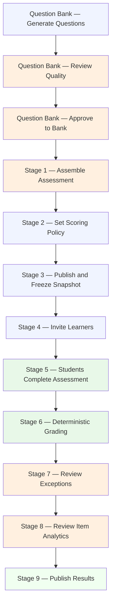
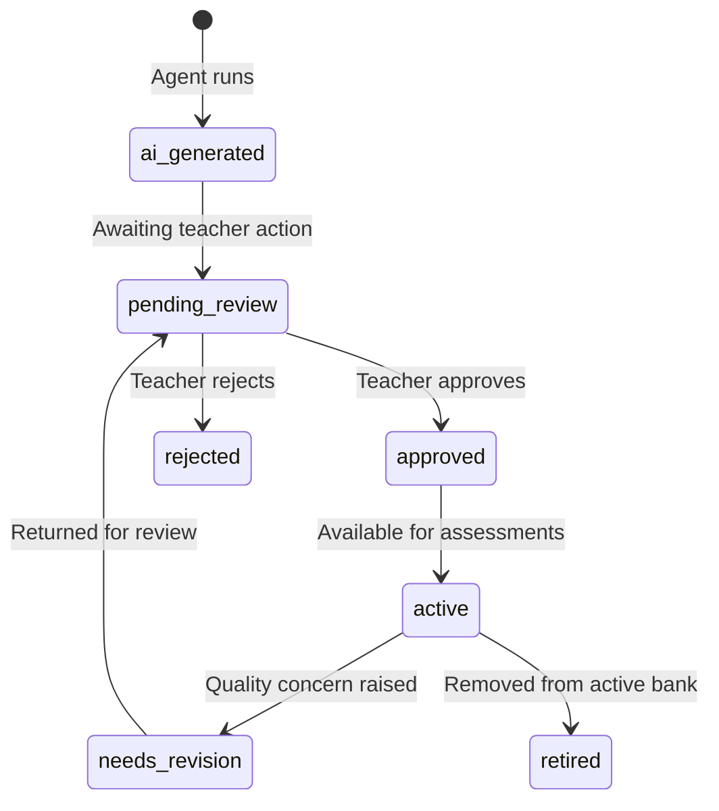

# Closed Assessment Workflow (Objective Questions)

A closed assessment uses objective question types: True/False, single-choice (one correct answer), and multiple-choice (one or more correct answers). AI agents help you build and curate a question bank. Students receive a unique secure link to respond — no account required. Grading is always deterministic: calculated automatically against a frozen answer key that you approved. You review exceptions and publish results.

This guide walks through the complete cycle from generating questions to publishing student results.

---

## The Closed Assessment Pipeline



**Legend:** Blue = actions you take. Orange = AI outputs awaiting your review. Light green = automatic or student-driven steps. Green = completed output.

---

## The Question Bank

Before you can assemble a closed assessment, you need approved questions in your question bank. The question bank is your organization's permanent repository of AI-curated questions. Questions are generated by AI agents, reviewed by you, and stored for reuse across multiple assessments.

### Question types

| Type | Description |
|---|---|
| **True/False (TF)** | A statement the student marks as true or false |
| **Single Choice (SC)** | A question with several options; exactly one is correct |
| **Multiple Choice (MC)** | A question with several options; one or more may be correct |

### What a question contains

| Field | Description |
|---|---|
| **Stem** | The question text |
| **Type** | TF, SC, or MC |
| **Difficulty** | A rating from easy to hard |
| **Subject area** | The topic this question covers |
| **Learning outcome** | The specific skill or knowledge being tested |
| **Alternatives** | The answer options, each flagged as correct or incorrect |
| **Explanation** | An explanation of why the correct answer is right (used in item analytics; not shown to students during the assessment) |
| **Quality flags** | Warnings from the Distractor Quality Agent or Ambiguity Review Agent |

### Question lifecycle



Only questions in **active** state are available for assessment composition.

---

## Generating Questions

### How to generate a question batch

1. Go to the **Question Bank** section in the navigation.
2. Click **Generate questions**.
3. Fill in the generation brief:

| Field | Description | Required |
|---|---|---|
| **Topic / learning outcome** | The specific concept or skill you want questions to cover | Yes |
| **Question types** | Which types you want: TF, SC, MC, or a mix | Yes |
| **Difficulty level** | Easy, medium, hard, or mixed | Yes |
| **Quantity** | How many questions to generate | Yes |

4. Click **Generate**.
5. The Question Generation Agent runs and produces questions with alternatives, answer keys, explanations, and difficulty ratings. The agent run is logged with a cost estimate.
6. Generated questions enter the review queue in `pending_review` state.

---

## Reviewing Question Quality

Before questions can enter the active bank, two additional AI agents evaluate them automatically:

**Distractor Quality Agent** reviews each incorrect alternative (distractor) for weaknesses — implausible options, inconsistent difficulty, or alternatives that are obviously wrong and therefore unhelpful.

**Ambiguity Review Agent** checks each question stem and set of alternatives for interpretation problems: cases where more than one answer could reasonably be considered correct, missing context, or poorly worded stems.

These evaluations appear as quality flags on each question in the curation queue.

### Understanding quality flags

| Flag type | What it means |
|---|---|
| **Weak distractor** | One or more incorrect options is too obviously wrong to function as a meaningful alternative |
| **Implausible option** | An alternative does not fit the domain or context of the question |
| **Ambiguous stem** | The question could be interpreted in more than one way |
| **Double-valid answer** | More than one alternative may be defensibly correct |
| **Missing context** | The question refers to material or context the student cannot be expected to know |

### Reviewing each question

In the curation queue, each question shows its stem, all alternatives, the answer key, and any quality flags.

For each question, take one of the following actions:

| Action | What It Does |
|---|---|
| **Approve** | Confirms the question. It moves to `active` state in the bank and becomes available for assessments. |
| **Edit and approve** | Make changes to the stem, alternatives, or answer key, then approve. Your edited version enters the bank. All edits are logged. |
| **Regenerate** | Discard this question and request a new question for the same slot (same topic and type). |
| **Reject** | Discard the question permanently. You can record an optional reason. |

### What to check before approving

For each question:

1. **Read the stem carefully.** Is it clear and unambiguous? Would students of your target level understand what is being asked?
2. **Check the correct answer.** Is it factually accurate? Is the explanation correct?
3. **Review each alternative.** Are the distractors plausible — wrong, but not obviously so?
4. **Look at the quality flags.** If the Ambiguity Review Agent flagged the question, resolve the issue before approving. If you disagree with the flag, you can override it by approving with an explicit acknowledgment.
5. **Confirm the difficulty rating.** Does it match your assessment of the question?

---

## Stage 1 — Assemble Assessment

Once you have approved questions in the bank, you can compose an assessment.

### How to start composition

1. From the dashboard, click **Create assessment** and select **Closed** as the mode.
2. Fill in the assessment details:

| Field | Description |
|---|---|
| **Title** | The name of this assessment |
| **Date** | When the assessment will be available |
| **Duration** | How long students have to complete it (in minutes) |
| **Learning outcomes to cover** | Which outcomes or topics this assessment should address |

3. Click **Propose composition**. The Assessment Assembly Agent selects questions from your approved bank and proposes a balanced set.

### What "balanced" means

The Assembly Agent aims for:

- Coverage across all specified learning outcomes
- An appropriate distribution of difficulty (not all easy, not all hard)
- A reasonable mix of question types (TF, SC, MC)
- A total point value consistent with your assessment goals

### Reviewing the composition

The composition screen shows:

- The full list of proposed questions
- The difficulty distribution chart
- Learning outcome coverage (which outcomes are addressed and how many questions each has)
- Total points

You can:

| Action | What It Does |
|---|---|
| **Approve composition** | Confirms this exact set of questions for the assessment |
| **Swap a question** | Replace one question with another from the bank for the same topic and difficulty |
| **Add a question** | Manually add a specific question from the bank |
| **Remove a question** | Remove a question from the composition |
| **Rebalance** | Ask the agent to propose a new composition |

Approve when you are satisfied with the question set.

---

## Stage 2 — Set Scoring Policy

Before publishing, you define how the assessment is scored.

### Scoring mode options

| Mode | How It Works |
|---|---|
| **Full credit** | Each question is worth its full point value for a correct answer; zero for an incorrect answer |
| **Partial credit** | For MC questions with multiple correct answers, students earn partial credit for each correct selection |
| **Penalty** | Incorrect answers deduct points (e.g., wrong answer = −0.25 points). Useful when you want to discourage guessing. |

### Other scoring settings

| Setting | Description |
|---|---|
| **Points per question** | Set individually or use a uniform point value |
| **Total points** | Automatically calculated from question point values |
| **Grade scale** | Map a score range to a final grade (e.g., 60–100 points → grade 4.0–7.0, or 0–100 percentage) |
| **Passing threshold** | The minimum percentage or score required to pass |

Review the scoring policy carefully. Once you publish and freeze the snapshot, the scoring policy is locked for this assessment run.

---

## Stage 3 — Publish and Freeze Snapshot

Publishing is a one-way action. It creates an immutable snapshot of everything the assessment needs: questions, alternatives, answer key, scoring policy, and grade scale. After this point, students can be invited.

### What happens at publication

1. The system validates:
   - All questions in the composition are in `active` state
   - Every question has a defined correct answer
   - Total score is internally consistent
   - No rejected or retired questions are included
2. If validation passes, the system creates the snapshot and locks it permanently.
3. The assessment transitions to `published` state.

### Why the snapshot matters

The snapshot is the integrity guarantee for the assessment. Even if you update questions in the bank later, the questions in this specific assessment run remain exactly as they were when you published. This ensures that all students who respond see the same questions and are graded against the same answer key.

If you need to change a question after publishing — for example, to correct an error — see the exception review section below (Stage 7) or consult the FAQ.

---

## Stage 4 — Invite Learners

With the assessment published, you invite students by adding them to the learner list and sending access links.

### Adding learners

1. Go to the **Learners** tab for the assessment.
2. Add learners one at a time or import from a CSV file:

| Field | Required | Description |
|---|---|---|
| **Email address** | Yes | Used for link delivery |
| **Display name** | No | Optional name for your reference |
| **External roster ID** | No | Optional code from your LMS or student information system |

Students do not create accounts. Their email address is used only to deliver the access link.

### Sending invitations

1. Select the learners you want to invite (or select all).
2. Click **Send invitations**.
3. The system generates a unique signed access link per learner and sends it to their email.

Each link is:
- Scoped to one learner and one assessment (cannot be used by another student)
- High-entropy and resistant to guessing
- Valid until the learner submits or you revoke access

### Monitoring invitation status

The learner list shows the current status for each student:

| Status | Meaning |
|---|---|
| **pending** | Link not yet sent |
| **sent** | Email has been dispatched |
| **accessed** | Student opened the link |
| **submitted** | Student completed and submitted the assessment |
| **graded** | Automatic grading complete |
| **results_published** | Student can see their results |

If a learner did not receive their link, select them and click **Resend invitation**.

To revoke access for a specific learner — for example, if they need to be excluded or a link was shared — select them and click **Revoke access**. Revocation is immediate.

---

## Stage 5 — Students Complete the Assessment

Students interact with a minimal, purpose-built screen — no account, no navigation, no teacher-facing interface. Their experience is:

1. They receive the invitation email and click the link.
2. The system validates the token (not expired, not revoked, assessment accepting responses).
3. They see the assessment title, instructions, and time window.
4. They click **Start assessment**.
5. They read each question and select their answer(s).
6. They review their selections before submitting.
7. They click **Submit**. A confirmation screen appears: the submission was received, no score is shown yet.

Students cannot go back and change a submitted response by default. The link is marked as used after submission.

### What you see in real time

On the learner list, invitation statuses update automatically as students access and submit the assessment. You do not need to take any action during this phase.

---

## Stage 6 — Deterministic Grading

Once a student submits, the deterministic grading engine processes their response automatically. This requires no AI and no teacher action for the grading calculation itself.

### How it works

```text
Student response
  + frozen answer key (from snapshot)
  + scoring policy (from snapshot)
  + grade scale (from snapshot)
= calculated score and final grade
```

The engine applies your scoring policy (full credit, partial credit, or penalty) to each question, totals the score, and converts it to a final grade using your grade scale. This calculation is deterministic — the same inputs always produce the same result.

### What is calculated

| Output | Description |
|---|---|
| **Raw score** | Total points earned from the scoring policy |
| **Weighted score** | Score adjusted for subject weighting (if applicable) |
| **Final grade** | Converted using your grade scale |

---

## Stage 7 — Review Exceptions

Most responses are graded automatically without issue. However, the system surfaces exceptions that require your attention.

### Types of exceptions

| Exception | Description |
|---|---|
| **Blank answer** | Student left one or more questions unanswered |
| **Duplicate attempt** | More than one submission was recorded for the same student |
| **Invalid response** | Response data does not map cleanly to the snapshot options |
| **Student not in learner list** | A response arrived from a token that cannot be matched to a learner record |

### Resolving exceptions

For each exception, you decide:

| Action | What It Does |
|---|---|
| **Include with current score** | Accept the grade as calculated (blank answers score zero) |
| **Exclude from results** | Remove this attempt from the published results |
| **Manual override** | Enter a specific grade manually. This is logged with your identity and reason. |
| **Annul a question** | If a question had an error, annul it for all students. Scores are recalculated for everyone. The annulment is logged with your reason and the original results are preserved in the audit trail. |

---

## Stage 8 — Review Item Analytics

After students have submitted and exceptions are resolved, the Item Analytics Agent analyzes per-question performance across all responses.

### What item analytics shows

| Metric | Description |
|---|---|
| **Correct rate** | Percentage of students who answered this question correctly |
| **Difficulty index** | Statistical measure of question difficulty based on actual performance |
| **Distractor effectiveness** | How often each incorrect option was selected (useful for identifying overly attractive wrong answers) |
| **Learning outcome coverage** | Which outcomes had strong vs. weak performance |
| **Reinforcement suggestions** | Suggested follow-up activities for outcomes where performance was low |

### How to use item analytics

Item analytics helps you improve the question bank for future assessments:

- A question with a very high correct rate may be too easy for future use.
- A question where a specific distractor was chosen by most students may indicate the distractor is misleading or the concept is widely misunderstood.
- Questions flagged for possible key error deserve a second review.

You review analytics before they are shared. Reinforcement suggestions can be included in the report.

---

## Stage 9 — Publish Results

After reviewing exceptions and item analytics, you confirm and publish the grade results.

### Before publishing

Review the results list:

- Check that all expected students have a grade.
- Verify that any exceptions were resolved.
- Confirm the grade scale was applied correctly.

### Publishing

Click **Publish results**. This is an explicit action — results are not automatically visible to students. When you publish:

1. Each student's grade status changes to `results_published`.
2. The system makes the result access link available for each learner.
3. Students receive their result link via email (or you can share it directly).

### What students see

When a student opens their result link:

- Their total score
- Their final grade
- Per-question result (correct / incorrect) — if you chose to release item-level detail
- Teacher-approved feedback — if you chose to publish it
- Correct answers — only if you explicitly enabled this

Students cannot see other students' results. Each result link is scoped to one student.

---

## Cycle Summary

| Stage | Who Acts | Required Teacher Action |
|---|---|---|
| Generate questions | AI (Question Generation Agent) | Initiate generation; specify parameters |
| Review question quality | AI flags + Teacher | Approve, edit, regenerate, or reject each question |
| Assemble assessment | AI (Assembly Agent) + Teacher | Review composition; approve or adjust |
| Set scoring policy | Teacher | Define scoring mode, grade scale, passing threshold |
| Publish and freeze | System | Confirm publication (one-way action) |
| Invite learners | Teacher + System | Add learners; send invitations |
| Students respond | Students | None — monitor status |
| Deterministic grading | System (no AI) | None — automatic |
| Review exceptions | Teacher | Resolve each flagged exception |
| Item analytics | AI (Item Analytics Agent) | Review before sharing |
| Publish results | Teacher | Explicit confirmation required |

---

*[← Open Assessment Workflow](02-open-assessment-cycle.md) | [Back to User Guide Index](README.md) | [Reviewing AI Outputs →](04-reviewing-ai-outputs.md)*
