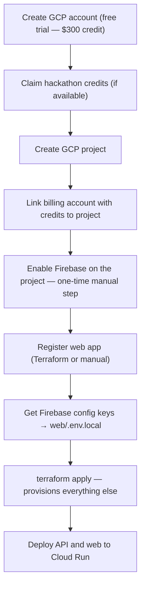

# GCP Project Setup — Account Creation, Credits, Billing, and Firebase Linking

> **Run this guide before `terraform apply`.** It covers the one-time steps that Terraform cannot automate: creating a GCP account, activating credits, creating or selecting your GCP project, linking Firebase, and obtaining the Firebase web configuration keys.

---

## Overview



---

## Step 0 — Create a Google Cloud Account (From Scratch)

> If you already have a GCP account with a billing account set up, skip to [Step 1](#step-1--claim-your-gcp-credits).

You need a **Google Account** (any Gmail or Google Workspace email) before you can create a GCP account.

### 0.1 — Prerequisites

- A **Google Account** (gmail or Google Workspace). If you don't have one, create it at [accounts.google.com](https://accounts.google.com/signup).
- A **credit or debit card** — required for identity verification. **You will not be charged** during the free trial unless you manually upgrade to a paid account (see FAQ below).
- A phone number for two-factor verification (optional but recommended).

### 0.2 — Sign Up for Google Cloud

1. Go to [cloud.google.com/free](https://cloud.google.com/free) and click **"Get started for free"** (or **"Start Free"**).
2. Sign in with your Google Account.
3. Select your **country** and read/accept the **Terms of Service**.
4. Choose your account type:
   - **Individual** — for personal projects and hackathons
   - **Business** — if you have a company (not needed for the hackathon)
5. Enter your **name**, **address**, and **payment method** (credit/debit card).
   > Google uses the card to verify your identity. A temporary authorization hold (not a charge) may appear and disappear within 1–14 business days.
6. Click **"Start my free trial"**.

### 0.3 — What You Get

| Benefit | Detail |
|---------|--------|
| **$300 credit** | Free usage of any GCP service for 90 days |
| **20+ Free Tier products** | Always-free usage limits that never expire (e.g., Cloud Functions, Cloud Storage 5 GB, Firebase) |
| **Default project** | A project called "My First Project" is created automatically |

**What the hackathon asks for:**

> The Build with Gemini XPRIZE hackathon (and similar Google Cloud hackathons) typically requires:
> - A **public open-source repository** with your project code
> - A **hosted/demo URL** (deployed on Cloud Run, Firebase Hosting, etc.)
> - A **demo video** (~3 minutes) showing the working project
> - **Cost transparency** — total operating costs, what was covered by credits vs. out-of-pocket
> - Your project must use **Google Cloud services** (Firebase, Cloud Run, Gemini API, etc.)
>
> Check the specific hackathon rules page for exact requirements: <https://xprize.devpost.com/rules>

### 0.4 — Important: You Will NOT Be Automatically Charged

- The $300 credit is valid for **90 days** from signup.
- When the trial ends (90 days or $300 spent), your resources are **paused**, not deleted. You are **not charged**.
- To continue, you must **manually upgrade** to a paid account. Google will never charge you automatically.
- Set up a **budget alert** early: go to **Billing → Budgets & Alerts → Create Budget** — set a $25–$50 alert threshold to avoid surprises.

---

## Step 1 — Claim Your GCP Credits

The Build with Gemini XPRIZE hackathon provides Google Cloud credits to participants. The redemption process is specific to the cohort; verify the exact steps at the Devpost rules and resources page:

> **Check:** <https://xprize.devpost.com/rules> → look for "Google Cloud credits" or "sponsor resources" section.

**General redemption process (confirm details at the link above):**

1. Log in to Devpost with the account used for your team's submission.
2. Navigate to the sponsor resources or "Prizes" section.
3. Find the Google Cloud credit offer — it will be a coupon code or a redemption link (e.g., `g.co/cloud/credits/...`).
4. Open the redemption link while signed in to the Google account you will use for the GCP project.
5. Create a new **Billing Account** (do not attach the credits to an existing personal or company billing account — keep hackathon costs isolated).
6. The credits will appear under **Billing → Credits** in the Google Cloud Console within a few minutes.

> **Important for evidence:** the hackathon requires disclosing total operating costs. Keeping a dedicated billing account makes the cost export clean — all charges come from this project, all covered (or partially covered) by these credits. Cash cost = amount you pay out of pocket after credits are exhausted.

---

## Step 2 — Create the GCP Project

If you don't have a project yet:

1. Go to [console.cloud.google.com](https://console.cloud.google.com)
2. Click the project selector (top left) → **New Project**
3. Project name: `gradeops-ai-demo` (or your preferred name)
4. Organization: leave as-is (personal account = no organization)
5. Click **Create**
6. Note the **Project ID** — this is what goes into `variables.tf` as `project_id`

**Attach the billing account:**

1. In the Cloud Console, go to **Billing → Manage billing accounts**
2. Select the billing account you created in Step 1 (the one with credits)
3. Go to **My Projects** tab → find your project → **Change billing** → select the credits account

Verify credits are linked: **Billing → Credits** should show your credit balance.

---

## Step 3 — Enable Firebase on the Project (Manual, One-Time)

This is the step Terraform cannot do. `google_identity_platform_config` requires the project to already be a Firebase project. Firebase project initialization cannot be done via Terraform because it requires accepting Firebase's Terms of Service in the console.

Firebase provides backend services used by the project:
- **Firebase Authentication** — email/password sign-in, Google sign-in, token validation
- **Firebase Admin SDK** — server-side token verification and user management (used by the `api/` service)

**Do this exactly once per project:**

1. Go to [console.firebase.google.com](https://console.firebase.google.com)
2. Click **Add project** (or **Create a project**)
3. In the dropdown, **select your existing GCP project** (`gradeops-ai-demo`) — do NOT create a new project
   > If you don't see your GCP project in the list, make sure you are signed in with the same Google account used to create the GCP project.
4. Accept the Firebase terms of service
5. You do **NOT** need to enable Google Analytics for the hackathon MVP
6. Click **Continue** → Firebase finishes linking to your GCP project

**Verify it worked:**

- The Firebase console should now show your project with no apps yet (apps are created by Terraform)
- In Google Cloud Console, check **APIs & Services → Enabled APIs** — you should see `firebase.googleapis.com` listed
- In Firebase Console, you should see "Project Overview" with no apps registered yet

> After this step, Terraform will be able to create `google_identity_platform_config`, `google_firebase_web_app`, and all other Firebase resources.

---

## Step 3b — Register a Web App in Firebase (Manual, Alternative to Terraform)

> You only need to do this if you are **not using Terraform** yet (e.g., rapid prototyping before infra is ready). If you use Terraform, it will create the web app automatically — skip to Step 7.

If you want to register the web app manually in the Firebase Console:

1. In [Firebase Console](https://console.firebase.google.com), open your project
2. Click the **Web icon** (`</>`) on the project overview page
3. Enter an app nickname (e.g., `gradeops-ai-web`). This is for internal identification only.
4. Click **Register app**
5. The console displays a **Firebase configuration object** with all the keys you need:

```javascript
const firebaseConfig = {
  apiKey: "AIzaSy...",
  authDomain: "gradeops-ai-demo.firebaseapp.com",
  projectId: "gradeops-ai-demo",
  storageBucket: "gradeops-ai-demo.firebasestorage.app",
  messagingSenderId: "123456789",
  appId: "1:123456789:web:abc123..."
};
```

6. Copy these values — they go into `web/.env.local` (see Step 7 for the format).
7. Click **Continue to console**.

> You can retrieve this config object at any time from **Project Settings → General → Your apps → select your web app → Config**.

### What Each Key Is Used For

| Key | Purpose |
|-----|---------|
| `apiKey` | Encrypted string for calling Firebase APIs. Public — embedded in the browser bundle. |
| `authDomain` | OAuth redirect domain for Firebase Authentication. Format: `PROJECT_ID.firebaseapp.com` |
| `projectId` | Identifies your GCP/Firebase project across all services |
| `storageBucket` | Default Cloud Storage bucket (not used in MVP unless file uploads are added) |
| `messagingSenderId` | Identifier for Firebase Cloud Messaging (not used in MVP) |
| `appId` | Unique identifier for this specific web app (auto-generated by Firebase) |

> **Security note:** These values are considered **public** — they are embedded in the browser bundle and visible to anyone who inspects the frontend. Firebase Security Rules and server-side token validation (not the config) are what protect your data.

---

## Step 4 — Configure Terraform Variables

Edit (or create) `infra/terraform/environments/demo/terraform.tfvars`:

```hcl
project_id  = "gradeops-ai-demo"   # your GCP project ID (not the display name)
region      = "us-central1"         # Cloud Run region; us-central1 has best Gemini availability
environment = "demo"
```

> `terraform.tfvars` is gitignored by default — never commit it. Use `.tfvars.example` as a template.

---

## Step 5 — Authenticate Terraform with GCP

```bash
# Install gcloud CLI if not already installed
# https://cloud.google.com/sdk/docs/install

# Log in and set application default credentials
gcloud auth login
gcloud auth application-default login
gcloud config set project gradeops-ai-demo
```

Terraform uses Application Default Credentials (ADC) — the same mechanism used by the API service locally.

---

## Step 6 — Run Terraform

```bash
cd infra/

# Initialize (downloads providers)
terraform -chdir=terraform/environments/demo init

# Review what will be created
terraform -chdir=terraform/environments/demo plan

# Apply — creates Firebase config, Admin SA, web app, Secret Manager secrets
terraform -chdir=terraform/environments/demo apply
```

**What Terraform provisions:**

| Resource | Type | Purpose |
|----------|------|---------|
| `identitytoolkit.googleapis.com` | API | Firebase Authentication |
| `firebase.googleapis.com` | API | Firebase core |
| `firebaserules.googleapis.com` | API | Firebase Rules |
| `google_identity_platform_config` | Config | Email/password sign-in, authorized domains |
| `google_firebase_web_app` | App | Registers web app; provides `apiKey`, `authDomain`, `appId` |
| `google_service_account` (firebase-admin-sa) | SA | API service identity with `roles/firebaseauth.admin` |
| `google_service_account_key` | Key | Admin SDK credentials for the api/ service |
| `google_secret_manager_secret` (FIREBASE_ADMIN_CREDENTIALS) | Secret | Stores the SA key JSON |
| `google_secret_manager_secret_version` | Version | Populates the secret with the SA key |

**What Terraform does NOT provision yet** (to be added in a future infra planning):

- Cloud Run services (web, api, agents)
- Cloud SQL (PostgreSQL)
- Cloud Storage
- Artifact Registry

These are deployed manually with `gcloud` commands for the hackathon demo — see [`09-deployment-guide.md`](09-deployment-guide.md).

---

## Step 7 — Get Firebase Config for the Web App

These values go into `web/.env.local`. The web (Next.js) needs them at build time to initialize the Firebase SDK in the browser.

### Via Terraform (recommended)

After `terraform apply`, retrieve the Firebase web app configuration:

```bash
terraform -chdir=terraform/environments/demo output
```

Expected output:

```
firebase_api_key           = "AIza..."
firebase_auth_domain       = "gradeops-ai-demo.firebaseapp.com"
firebase_project_id        = "gradeops-ai-demo"
firebase_app_id            = "1:123456789:web:abc..."
firebase_messaging_sender_id = "123456789"
```

### Via Firebase Console (manual)

If you registered the web app manually (Step 3b) or need to retrieve the config again:

1. Go to [Firebase Console → Project Settings](https://console.firebase.google.com/project/_/settings/general)
2. Scroll to **Your apps** section
3. Select your web app by nickname
4. Click **Config** in the Firebase SDK snippet pane
5. Copy the entire `firebaseConfig` object

### `.env.local` Format

Create `web/.env.local` with these values:

```bash
NEXT_PUBLIC_FIREBASE_API_KEY=AIza...
NEXT_PUBLIC_FIREBASE_AUTH_DOMAIN=gradeops-ai-demo.firebaseapp.com
NEXT_PUBLIC_FIREBASE_PROJECT_ID=gradeops-ai-demo
NEXT_PUBLIC_FIREBASE_APP_ID=1:123456789:web:abc...
NEXT_PUBLIC_FIREBASE_MESSAGING_SENDER_ID=123456789
```

> These values are **public** by design — Firebase web config is embedded in the browser bundle. Anyone who opens your web app can see them. Security comes from Firebase Security Rules and server-side token validation, not from keeping the config private.

---

## Step 8 — Get the Firebase Admin Credentials for the API

The API service needs the Firebase Admin SDK credentials to validate ID tokens and manage users.

**For local development:**

```bash
# Download the service account key from Secret Manager
gcloud secrets versions access latest \
  --secret="FIREBASE_ADMIN_CREDENTIALS" \
  --project="gradeops-ai-demo" \
  > ~/secrets/firebase-admin-key.json
```

Then set in `api/src/main/resources/application-local.yml`:

```yaml
# Point to the downloaded key
# Note: this is set as an environment variable, not a YAML key
# Run: export GOOGLE_APPLICATION_CREDENTIALS=~/secrets/firebase-admin-key.json
# Then: ./mvnw spring-boot:run -Dspring.profiles.active=local
```

Or set the environment variable in your shell:

```bash
export GOOGLE_APPLICATION_CREDENTIALS=~/secrets/firebase-admin-key.json
./mvnw spring-boot:run -Dspring.profiles.active=local
```

**For Cloud Run (production):** the SA key is mounted automatically from Secret Manager — no env var needed if the Cloud Run service is configured to use the `firebase-admin-sa` service account.

---

## Credit Tracking for Hackathon Evidence

The hackathon requires disclosing total operating costs, including which costs were covered by credits vs. paid in cash.

**Monitor your spend:**

1. Google Cloud Console → **Billing → Reports** — filter by this project
2. Set up a **budget alert** at $50 to avoid unexpected charges if credits run out
3. Note the credit balance: **Billing → Credits** — shows remaining balance

**For the evidence checklist:**
- `cash_cost` = amount charged to your payment method (after credits)
- `covered_by_credit` = amount covered by the GCP credits
- Both fields exist in the `CostEvent` entity — log them per billing export

See [`../05-evidence/`](../05-evidence/) for the cost evidence template.

---

## Troubleshooting

| Error | Cause | Fix |
|-------|-------|-----|
| `Error: googleapi: Error 400: Firebase project already exists` | Firebase was already enabled | Run `terraform import` or skip this resource |
| `Error: Permission denied on 'identitytoolkit.googleapis.com'` | Billing not attached | Attach billing account to project first |
| `Error: The caller does not have permission` on `google_identity_platform_config` | Firebase not linked to project | Complete Step 3 (Firebase console linking) |
| `Error: google_firebase_web_app: Error creating WebApp` | Firebase API not enabled | Wait 2-3 minutes after enabling APIs before applying |
| SA key JSON not showing in output | `google_service_account_key` outputs are sensitive | Use `terraform output -json` to see sensitive values |

---

<!-- nav -->

← [README](README.md) | [↑ top](#gcp-project-setup--account-creation-credits-billing-and-firebase-linking) | [Local Setup →](01-local-setup.md)
