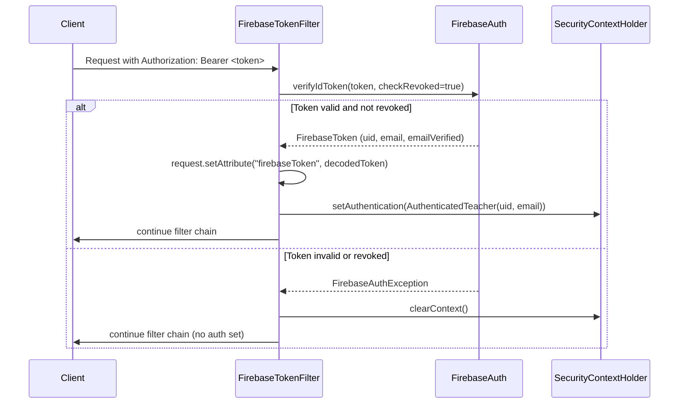
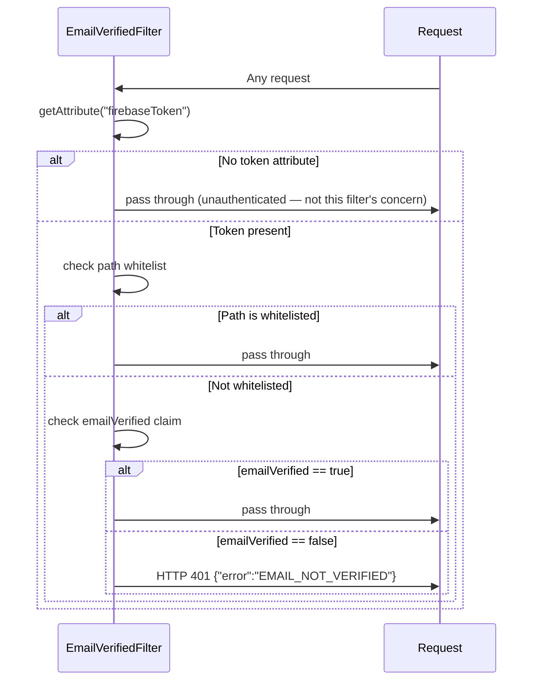

# Security Implementation

This document describes the security implementation in detail: the API filter chain, token verification flow, email enforcement, ownership verification, Firebase Admin SDK initialization, and the web client's 401 interceptor. All descriptions are based on the current code.

---

## Filter chain overview

Spring Security processes each request through a chain of filters before it reaches any controller. The filter registration order in `SecurityConfig.java` is:

```
Request
  │
  ├── InternalAuthFilter          (guards /internal/** paths only)
  │
  ├── FirebaseTokenFilter         (runs on all paths)
  │
  ├── EmailVerifiedFilter         (runs after FirebaseTokenFilter)
  │
  └── Spring Security access rules
        - /internal/**       → permitAll (auth is done by InternalAuthFilter)
        - /auth/register     → permitAll
        - /auth/verify/resend → permitAll
        - /**                → authenticated
```

`InternalAuthFilter` and `FirebaseTokenFilter` are both registered `addFilterBefore(UsernamePasswordAuthenticationFilter.class)`. `EmailVerifiedFilter` is registered `addFilterAfter(FirebaseTokenFilter.class)`.

---

## Filter-by-filter detail

### InternalAuthFilter

**Applies to:** Paths starting with `/internal/`
**Skips itself for:** Everything else (via `shouldNotFilter()`)

```java
protected boolean shouldNotFilter(HttpServletRequest request) {
    return !request.getRequestURI().startsWith("/internal/");
}
```

**Logic:**
1. Reads the `X-Internal-Key` request header
2. Compares it to the `app.internal.secret` value (injected from configuration)
3. If missing or wrong: writes `{"error":"FORBIDDEN"}` and returns HTTP 403; the filter chain stops here
4. If correct: passes the request through to the next filter

**Key point:** Internal paths are `permitAll` in Spring Security's access rules. This means Spring Security itself does not require authentication for `/internal/**`. `InternalAuthFilter` provides the authentication check independently, before Spring Security's access control layer runs.

---

### FirebaseTokenFilter

**Applies to:** All paths

**Logic:**
1. Reads the `Authorization` header
2. If absent or does not start with `Bearer `, clears the security context and passes through (unauthenticated request; downstream access rules will reject if the path requires authentication)
3. Extracts the token string (characters after `Bearer `)
4. Calls `firebaseAuth.verifyIdToken(token, true)`:
   - Second argument `true` enables revocation check — tokens whose refresh tokens have been revoked (via `revokeRefreshTokens`) are rejected
5. On success:
   - Sets `request.setAttribute("firebaseToken", decodedToken)` — the decoded `FirebaseToken` is available to downstream filters without re-verifying
   - Creates `AuthenticatedTeacher(uid, email)` as the principal
   - Wraps it in `UsernamePasswordAuthenticationToken` and sets it in `SecurityContextHolder`
6. On failure:
   - Logs the error at DEBUG level (not WARN/ERROR, to avoid log noise from expired tokens in normal usage)
   - Clears `SecurityContextHolder`
   - Passes through — the filter does not write a 401 here; Spring Security's access rules write the 401 if the path requires authentication



---

### EmailVerifiedFilter

**Applies to:** All paths (but short-circuits for most)

**Logic:**
1. Reads `request.getAttribute("firebaseToken")` — the decoded token set by `FirebaseTokenFilter`
2. If null (no token in the request): passes through unchanged. This filter does not concern itself with unauthenticated requests.
3. If the path starts with a whitelisted prefix (`/auth/register`, `/auth/verify/resend`): passes through regardless of verification status
4. If the token is present and `emailVerified == false`: writes `{"error":"EMAIL_NOT_VERIFIED"}` and returns HTTP 401; the filter chain stops here
5. If `emailVerified == true`: passes through

**Whitelist:**
```java
private static final List<String> WHITELIST = List.of(
    "/auth/register",
    "/auth/verify/resend"
);
```

**Why these paths are whitelisted:**
- `/auth/register`: The teacher just created a Firebase account. The teacher record does not yet exist in the database, but the email is not yet verified. The register endpoint must be reachable so the backend record is created before the user verifies their email.
- `/auth/verify/resend`: Users with unverified email need to request a new verification email. Blocking this path would lock them out permanently.



---

## The `AuthenticatedTeacher` principal

```java
public record AuthenticatedTeacher(String uid, String email) {}
```

This record is the Spring Security principal for all authenticated teacher requests. It is set in `SecurityContextHolder` by `FirebaseTokenFilter` and read by controllers and services.

**Accessing the principal in a controller:**

```java
@GetMapping("/assessments")
public List<AssessmentSummaryDto> listAssessments() {
    AuthenticatedTeacher teacher = (AuthenticatedTeacher)
        SecurityContextHolder.getContext().getAuthentication().getPrincipal();
    return assessmentService.listForTeacher(teacher.uid());
}
```

**Accessing the principal in a service:**

Services receive the teacher UID as a method parameter from the controller. Services should not read from `SecurityContextHolder` directly — that responsibility stays in the controller layer. This makes services testable without mocking the security context.

---

## OwnershipVerifier

`OwnershipVerifier` is a Spring component that must be used whenever a service method accesses a resource that belongs to a specific teacher. It enforces that the authenticated teacher matches the resource owner.

```java
@Component
public class OwnershipVerifier {
    public void verify(String ownerUid, String authenticatedUid, String resourceId) {
        if (!ownerUid.equals(authenticatedUid)) {
            log.warn("Cross-teacher access denied: authenticatedTeacher={} resource={}",
                    authenticatedUid, resourceId);
            throw new ResourceNotFoundException(resourceId);
        }
    }
}
```

**Why HTTP 404 (not 403)?**

Returning 403 on a cross-teacher access attempt reveals that the resource exists. Returning 404 is indistinguishable from a genuinely non-existent resource, so an attacker cannot enumerate other teachers' resource IDs by probing for 403 vs 404 responses.

**Usage pattern in a service:**

```java
@Service
public class SomeResourceService {

    private final SomeResourceRepository repository;
    private final OwnershipVerifier ownershipVerifier;

    // ... constructor

    public SomeResourceDto getById(String resourceId, String authenticatedUid) {
        SomeResourceEntity resource = repository.findById(resourceId)
            .orElseThrow(() -> new ResourceNotFoundException(resourceId));

        ownershipVerifier.verify(resource.getTeacherUid(), authenticatedUid, resourceId);

        return toDto(resource);
    }
}
```

Call `verify()` immediately after loading the resource — before any other processing. The `WARN` log entry is captured by Cloud Logging via the JSON appender and can be used to detect probing attempts.

**When not to use it:**

List endpoints that are already scoped by `teacherUid` in the repository query do not need `OwnershipVerifier` — the query itself prevents cross-teacher leakage:

```java
// Safe: the query is already scoped
List<Assessment> assessments = repository.findByTeacherUid(teacherUid);
```

---

## Adding a new protected endpoint

Follow this pattern when adding a new endpoint that accesses teacher-owned resources:

**1. Create the controller method:**
```java
@GetMapping("/some-resource/{id}")
public SomeDto getById(@PathVariable String id) {
    AuthenticatedTeacher teacher = (AuthenticatedTeacher)
        SecurityContextHolder.getContext().getAuthentication().getPrincipal();
    return someResourceService.getById(id, teacher.uid());
}
```

**2. In the service, load and verify ownership:**
```java
public SomeDto getById(String id, String authenticatedUid) {
    SomeEntity entity = repository.findById(id)
        .orElseThrow(() -> new ResourceNotFoundException(id));
    ownershipVerifier.verify(entity.getTeacherUid(), authenticatedUid, id);
    return toDto(entity);
}
```

**3. The endpoint does not need to be added to `SecurityConfig`** unless it requires special access rules. All paths not explicitly whitelisted already require authentication (the `anyRequest().authenticated()` rule in `SecurityConfig`).

---

## Firebase Admin SDK initialization

`FirebaseConfig.java` declares two beans:

```java
@Bean
@ConditionalOnMissingBean(FirebaseAuth.class)
public FirebaseApp firebaseApp() throws IOException {
    if (!FirebaseApp.getApps().isEmpty()) {
        return FirebaseApp.getInstance();
    }
    FirebaseOptions options = FirebaseOptions.builder()
            .setCredentials(GoogleCredentials.getApplicationDefault())
            .build();
    return FirebaseApp.initializeApp(options);
}

@Bean
@ConditionalOnMissingBean
public FirebaseAuth firebaseAuth(FirebaseApp firebaseApp) {
    return FirebaseAuth.getInstance(firebaseApp);
}
```

`GoogleCredentials.getApplicationDefault()` follows the Application Default Credentials (ADC) chain:

1. `GOOGLE_APPLICATION_CREDENTIALS` environment variable — if set, loads the JSON key file at that path. Use this for local development.
2. gcloud application-default credentials — if you have run `gcloud auth application-default login`
3. GCP metadata server — used automatically in Cloud Run. No environment variable or key file needed, provided the Cloud Run service account has the `roles/firebaseauth.admin` IAM role.

**`@ConditionalOnMissingBean`** on both beans means tests can register a mock `FirebaseAuth` bean in their `@TestConfiguration` class and the production beans will not be created. This is how unit tests avoid making real Firebase calls.

---

## Session revocation on sign-out

`POST /auth/sign-out` calls `firebaseAuth.revokeRefreshTokens(uid)`.

**What this does:** Revokes all refresh tokens for the UID. Firebase stores a `tokensValidAfterTime` claim on the user record and updates it to the current time.

**Effect on existing ID tokens:** ID tokens are short-lived JWTs (valid for 1 hour) and are not individually invalidated. However, because the API uses `checkRevoked=true` in `verifyIdToken`, every subsequent API call with an existing ID token will receive an `UidRevokedException` from the Firebase Admin SDK — even before the token expires. This means the effective session termination is near-immediate (within the time it takes for the Firebase revocation to propagate, typically a few seconds).

**Web client behavior on sign-out (`SignOutButton.tsx`):**
1. Gets the current ID token
2. Makes `POST /api/auth/sign-out` with a 3-second timeout (best-effort)
3. In the `finally` block, always calls `firebaseSignOut(auth)` regardless of server response
4. Redirects to `/login`

The 3-second timeout ensures the UI remains responsive even if the API is slow. Client-side sign-out (clearing the local Firebase auth state) is guaranteed.

---

## Web: `apiClient` interceptor

`src/lib/api/client.ts` is the single HTTP client for all authenticated API calls from the web:

```typescript
export async function apiClient(path: string, options: RequestInit = {}): Promise<Response> {
    const token = await auth.currentUser?.getIdToken();

    const res = await fetch(`${API_BASE}${path}`, {
        ...options,
        headers: {
            "Content-Type": "application/json",
            ...(token ? { Authorization: `Bearer ${token}` } : {}),
            ...options.headers,
        },
    });

    if (res.status === 401) {
        const body = await res.clone().json().catch(() => ({}));
        if (body?.error === "EMAIL_NOT_VERIFIED") {
            if (typeof window !== "undefined") {
                window.location.replace("/verify-email");
            }
        } else {
            await signOut(auth).catch(() => {});
            if (typeof window !== "undefined") {
                window.location.replace("/login?reason=expired");
            }
        }
    }

    return res;
}
```

**Token attachment:** `auth.currentUser?.getIdToken()` returns a cached token if it is still valid, or automatically fetches a new one from Firebase if it has expired. The Firebase client SDK handles token refresh transparently.

**401 handling — two cases:**

| 401 body | Meaning | Action |
|----------|---------|--------|
| `{"error":"EMAIL_NOT_VERIFIED"}` | User authenticated but email not verified | Redirect to `/verify-email` |
| Any other 401 body | Token expired, revoked, or invalid | Sign out client-side + redirect to `/login?reason=expired` |

**The `?reason=expired` parameter:** The login page reads this query parameter and displays a "Your session has expired, please sign in again" banner. This gives users context rather than just presenting a bare login form.

**`res.clone()`:** The response body can only be read once. `res.clone()` is called before reading the body as JSON so the original `res` is still available for the caller to read if it was a non-401 response.

**`registerTeacher()` and `signOutApi()` in `lib/api/auth.ts`** make direct `fetch` calls instead of using `apiClient`:
- `registerTeacher()`: called immediately after Firebase user creation, before the user is in a normal auth state. Goes to `/api/auth/register` (the Next.js proxy path).
- `signOutApi()`: called during sign-out where `apiClient`'s 401 handling could cause a redirect loop if token revocation is already in progress.

---

## Data classification and prompt safety

Per the security architecture, the following data must never appear in AI prompts or agent logs:

- Teacher personal data not needed for the task
- Full student names if anonymized IDs work
- Email addresses, phone numbers
- Payment records or Gemini/Firebase API keys
- Raw Cloud Logging output not needed by the model

Agent input and output summaries stored in `AgentExecutionLog` must be redacted summaries, not raw copies of student submissions or full feedback text.

---

<!-- nav -->

[← API Reference](03-api-reference.md) | [↑ Top](#security-implementation) | [Developer Guide Index](README.md)
