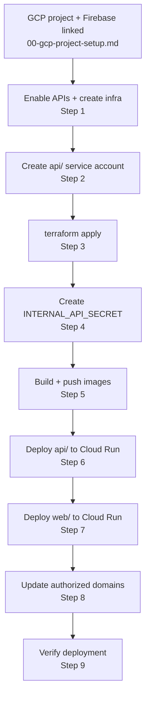

# Deployment Guide — Cloud (demo environment)

This guide walks through deploying GradeOps AI to Google Cloud from scratch. It covers infrastructure creation, image builds, Cloud Run deployment, and post-deploy verification.

> **Before starting:** complete [00-gcp-project-setup.md](00-gcp-project-setup.md) — you must have a GCP project with Firebase linked and billing attached before any step below.

---

## Overview



---

## Step 1 — Create supporting infrastructure

These resources must exist **before** `terraform apply` because the api/ service account email is a required Terraform variable.

### 1a — Enable APIs

```bash
gcloud services enable \
  run.googleapis.com \
  sqladmin.googleapis.com \
  artifactregistry.googleapis.com \
  secretmanager.googleapis.com \
  --project=YOUR_PROJECT_ID
```

### 1b — Create Artifact Registry repository

```bash
gcloud artifacts repositories create grade-ops-ai \
  --repository-format=docker \
  --location=us-central1 \
  --project=YOUR_PROJECT_ID
```

Configure Docker authentication for this registry:

```bash
gcloud auth configure-docker us-central1-docker.pkg.dev
```

### 1c — Create Cloud SQL (PostgreSQL) instance

```bash
gcloud sql instances create gradeops-demo \
  --database-version=POSTGRES_15 \
  --tier=db-f1-micro \
  --region=us-central1 \
  --no-assign-ip \
  --enable-google-private-path \
  --project=YOUR_PROJECT_ID
```

> `--no-assign-ip` and `--enable-google-private-path` configure the instance for private Cloud Run access only. For the hackathon demo, a public IP with Cloud SQL Connector (socket factory) is simpler and equally secure — remove those flags if you prefer.

Create the database and user:

```bash
# Create database
gcloud sql databases create gradeops \
  --instance=gradeops-demo \
  --project=YOUR_PROJECT_ID

# Create application user (choose a strong password)
gcloud sql users create gradeops \
  --instance=gradeops-demo \
  --password=STRONG_DB_PASSWORD \
  --project=YOUR_PROJECT_ID
```

Note the **instance connection name** — you'll need it for the JDBC URL:

```bash
gcloud sql instances describe gradeops-demo \
  --project=YOUR_PROJECT_ID \
  --format="value(connectionName)"
# Example output: gradeops-ai-demo:us-central1:gradeops-demo
```

---

## Step 2 — Create the api/ service account

Terraform needs this service account's email before it can run (it grants the SA access to Secret Manager secrets).

```bash
# Create the SA
gcloud iam service-accounts create grade-ops-api-sa \
  --display-name="GradeOps AI — api Cloud Run" \
  --project=YOUR_PROJECT_ID

# Grant Cloud SQL access (needed to connect to the database at runtime)
gcloud projects add-iam-policy-binding YOUR_PROJECT_ID \
  --member="serviceAccount:grade-ops-api-sa@YOUR_PROJECT_ID.iam.gserviceaccount.com" \
  --role="roles/cloudsql.client"

# Grant Cloud Run invoker on itself (allows internal service calls if needed later)
gcloud projects add-iam-policy-binding YOUR_PROJECT_ID \
  --member="serviceAccount:grade-ops-api-sa@YOUR_PROJECT_ID.iam.gserviceaccount.com" \
  --role="roles/run.invoker"
```

The SA email is: `grade-ops-api-sa@YOUR_PROJECT_ID.iam.gserviceaccount.com`

---

## Step 3 — Run Terraform

With the api/ SA now created, run Terraform. It provisions Firebase Authentication, the Firebase web app, the Firebase Admin SA (`firebase-admin-sa`), and its credentials in Secret Manager.

```bash
cd infra/

# Initialize (downloads provider plugins — skip if already done)
terraform -chdir=terraform/environments/demo init

# Review the plan
terraform -chdir=terraform/environments/demo plan \
  -var="project_id=YOUR_PROJECT_ID" \
  -var="api_cloud_run_sa_email=grade-ops-api-sa@YOUR_PROJECT_ID.iam.gserviceaccount.com"

# Apply
terraform -chdir=terraform/environments/demo apply \
  -var="project_id=YOUR_PROJECT_ID" \
  -var="api_cloud_run_sa_email=grade-ops-api-sa@YOUR_PROJECT_ID.iam.gserviceaccount.com"
```

After apply, retrieve the Firebase web config for later use:

```bash
terraform -chdir=terraform/environments/demo output
```

Save the `NEXT_PUBLIC_FIREBASE_*` output values — you will need them in Step 7.

**What Terraform provisions:**

| Resource | Purpose |
|----------|---------|
| `google_identity_platform_config` | Firebase Authentication (email/password) |
| `google_firebase_web_app` | Registers the web app; produces Firebase config values |
| `firebase-admin-sa` service account | Used by the api/ service to call Firebase Admin SDK |
| `FIREBASE_ADMIN_CREDENTIALS` in Secret Manager | Firebase Admin SA key JSON |
| Secret accessor IAM grant | Allows `grade-ops-api-sa` to read `FIREBASE_ADMIN_CREDENTIALS` |

---

## Step 4 — Create INTERNAL_API_SECRET

Terraform does not create this secret. Create it manually:

```bash
# Generate a strong random secret
openssl rand -base64 32

# Store it in Secret Manager (paste the generated value)
printf 'YOUR_GENERATED_SECRET' | gcloud secrets create INTERNAL_API_SECRET \
  --data-file=- \
  --project=YOUR_PROJECT_ID

# Grant api/ SA access to read this secret
gcloud secrets add-iam-policy-binding INTERNAL_API_SECRET \
  --member="serviceAccount:grade-ops-api-sa@YOUR_PROJECT_ID.iam.gserviceaccount.com" \
  --role="roles/secretmanager.secretAccessor" \
  --project=YOUR_PROJECT_ID
```

Also grant api/ SA access to `FIREBASE_ADMIN_CREDENTIALS` (Terraform handles this via the `api_cloud_run_sa_email` variable, but verify it was applied):

```bash
gcloud secrets get-iam-policy FIREBASE_ADMIN_CREDENTIALS \
  --project=YOUR_PROJECT_ID
# Should show grade-ops-api-sa with roles/secretmanager.secretAccessor
```

---

## Step 5 — Build and push images

### 5a — Build the api/ image

Spring Boot's Maven plugin builds an OCI-compliant image without a Dockerfile. The image is built using Buildpacks.

```bash
cd api/

./mvnw spring-boot:build-image \
  -Dspring-boot.build-image.imageName=us-central1-docker.pkg.dev/YOUR_PROJECT_ID/grade-ops-ai/grade-ops-ai-api:latest

docker push us-central1-docker.pkg.dev/YOUR_PROJECT_ID/grade-ops-ai/grade-ops-ai-api:latest
```

This requires Docker to be running locally. The Maven plugin calls the local Docker daemon.

### 5b — Build the web/ image

The web app uses a two-stage Dockerfile (`web/Dockerfile`) that produces a Node.js standalone server. The `output: "standalone"` setting in `next.config.ts` generates the `.next/standalone` directory used by the final image stage.

```bash
cd web/

# Build-time Firebase vars must be present so Next.js can embed them in the client bundle
docker build \
  --build-arg NEXT_PUBLIC_FIREBASE_API_KEY=AIza... \
  --build-arg NEXT_PUBLIC_FIREBASE_AUTH_DOMAIN=YOUR_PROJECT_ID.firebaseapp.com \
  --build-arg NEXT_PUBLIC_FIREBASE_PROJECT_ID=YOUR_PROJECT_ID \
  --build-arg NEXT_PUBLIC_FIREBASE_APP_ID=1:123:web:abc \
  --build-arg NEXT_PUBLIC_FIREBASE_MESSAGING_SENDER_ID=123456789 \
  -t us-central1-docker.pkg.dev/YOUR_PROJECT_ID/grade-ops-ai/grade-ops-ai-web:latest \
  .

docker push us-central1-docker.pkg.dev/YOUR_PROJECT_ID/grade-ops-ai/grade-ops-ai-web:latest
```

> **Why build-time args?** `NEXT_PUBLIC_*` variables are inlined into the JavaScript bundle at build time by the Next.js compiler. They cannot be injected at runtime from Cloud Run env vars. Their values come from the `terraform output` you saved in Step 3.

---

## Step 6 — Deploy api/ to Cloud Run

```bash
gcloud run deploy grade-ops-ai-api \
  --image us-central1-docker.pkg.dev/YOUR_PROJECT_ID/grade-ops-ai/grade-ops-ai-api:latest \
  --region us-central1 \
  --service-account grade-ops-api-sa@YOUR_PROJECT_ID.iam.gserviceaccount.com \
  --add-cloudsql-instances YOUR_PROJECT_ID:us-central1:gradeops-demo \
  --set-secrets "FIREBASE_ADMIN_CREDENTIALS=FIREBASE_ADMIN_CREDENTIALS:latest" \
  --set-secrets "INTERNAL_API_SECRET=INTERNAL_API_SECRET:latest" \
  --set-env-vars "SPRING_PROFILES_ACTIVE=demo" \
  --set-env-vars "SPRING_DATASOURCE_URL=jdbc:postgresql:///gradeops?cloudSqlInstance=YOUR_PROJECT_ID:us-central1:gradeops-demo&socketFactory=com.google.cloud.sql.postgres.SocketFactory" \
  --set-env-vars "SPRING_DATASOURCE_USERNAME=gradeops" \
  --set-env-vars "SPRING_DATASOURCE_PASSWORD=STRONG_DB_PASSWORD" \
  --memory 512Mi \
  --allow-unauthenticated \
  --project YOUR_PROJECT_ID
```

**Key configuration:**

| Setting | Value | Notes |
|---------|-------|-------|
| `--service-account` | `grade-ops-api-sa` | Has Cloud SQL client + Secret Manager accessor roles |
| `--add-cloudsql-instances` | Instance connection name | Enables the Cloud SQL connector socket |
| `FIREBASE_ADMIN_CREDENTIALS` | From Secret Manager | Firebase Admin SDK reads this path automatically |
| `INTERNAL_API_SECRET` | From Secret Manager | Used by `InternalAuthFilter` to validate `X-Internal-Key` |
| `SPRING_DATASOURCE_URL` | Cloud SQL socket factory URL | The `postgres-socket-factory` dependency in `pom.xml` provides `com.google.cloud.sql.postgres.SocketFactory` |
| `--memory 512Mi` | Minimum for this service | Firebase Admin SDK + Spring Boot startup requires ≥ 512Mi |
| `--allow-unauthenticated` | Required | Requests arrive via the Next.js proxy with Firebase tokens; Spring Security enforces auth, not Cloud Run IAM |

Note the **api/ service URL** from the deploy output — you need it in the next step:
```
Service URL: https://grade-ops-ai-api-HASH-uc.a.run.app
```

### Verify api/ is running

```bash
curl https://grade-ops-ai-api-HASH-uc.a.run.app/actuator/health
# Expected: {"status":"UP"}
```

---

## Step 7 — Deploy web/ to Cloud Run

```bash
gcloud run deploy grade-ops-ai-web \
  --image us-central1-docker.pkg.dev/YOUR_PROJECT_ID/grade-ops-ai/grade-ops-ai-web:latest \
  --region us-central1 \
  --set-env-vars "API_BASE_URL=https://grade-ops-ai-api-HASH-uc.a.run.app" \
  --memory 256Mi \
  --allow-unauthenticated \
  --project YOUR_PROJECT_ID
```

**Key configuration:**

| Setting | Value | Notes |
|---------|-------|-------|
| `API_BASE_URL` | api/ Cloud Run URL | Server-side only; used by the Next.js rewrite to proxy `/api/:path*` |
| `NEXT_PUBLIC_FIREBASE_*` | Not set here | These are embedded in the image at build time (Step 5b) |
| `--allow-unauthenticated` | Required | The web app is the public-facing service; end users reach it without GCP auth |

Note the **web/ service URL** from the deploy output:
```
Service URL: https://grade-ops-ai-web-HASH-uc.a.run.app
```

---

## Step 8 — Update Firebase authorized domains

Firebase Authentication blocks sign-in from domains not in the authorized list. Add the Cloud Run web URL:

Edit `infra/terraform/environments/demo/identity_platform.tf` — find the `authorized_domains` list and add the web Cloud Run hostname (without `https://`):

```hcl
authorized_domains = [
  "localhost",
  "${var.project_id}.firebaseapp.com",
  "${var.project_id}.web.app",
  "grade-ops-ai-web-HASH-uc.a.run.app",   # add this
]
```

Then re-apply Terraform:

```bash
terraform -chdir=infra/terraform/environments/demo apply \
  -var="project_id=YOUR_PROJECT_ID" \
  -var="api_cloud_run_sa_email=grade-ops-api-sa@YOUR_PROJECT_ID.iam.gserviceaccount.com"
```

---

## Step 9 — Verify the deployment

### Smoke test

```bash
# api/ health
curl https://grade-ops-ai-api-HASH-uc.a.run.app/actuator/health
# Expected: {"status":"UP"}

# web/ home page (should return HTML, not an error page)
curl -I https://grade-ops-ai-web-HASH-uc.a.run.app
# Expected: HTTP/2 200
```

### End-to-end test

1. Open the web Cloud Run URL in a browser
2. Register a new teacher account with a real email address
3. Check your inbox for the Firebase verification email — click the link
4. Log in — you should see the empty dashboard
5. Sign out — you should be redirected to the login page

### Operator provision test (optional)

```bash
curl -X POST https://grade-ops-ai-api-HASH-uc.a.run.app/internal/teachers \
  -H "X-Internal-Key: YOUR_INTERNAL_SECRET" \
  -H "Content-Type: application/json" \
  -d '{"name": "Demo Teacher", "email": "demo@example.com"}'
# Expected: HTTP 201 with firebaseUid and inviteLink
```

---

## Environments

| Environment | Purpose | Infrastructure |
|-------------|---------|---------------|
| `demo` | Hackathon live demo and pilot users | Cloud Run + Cloud SQL (provisioned by this guide) |
| `local` | Developer workstation | Local PostgreSQL + local Firebase project — see [01-local-setup.md](01-local-setup.md) |
| `prod` | Post-hackathon production | Not yet provisioned |

---

## Secret management

| Secret | Location | Used by | How created |
|--------|----------|---------|------------|
| `FIREBASE_ADMIN_CREDENTIALS` | Secret Manager | `api/` Cloud Run | `firebase_admin_iam.tf` via Terraform |
| `INTERNAL_API_SECRET` | Secret Manager | `api/` Cloud Run | Manual — Step 4 of this guide |
| Database password | `--set-env-vars` | `api/` Cloud Run | Manual — set during `gcloud run deploy` |

Rules:
- Never commit secret values to the repository
- Use `--set-secrets` (not `--set-env-vars`) for values from Secret Manager — this prevents them from appearing in deployment logs
- Database password is currently passed as a plain env var in the deploy command; for post-hackathon production, store it in Secret Manager too

---

## Terraform file inventory

The Terraform configuration lives in `infra/terraform/environments/demo/`.

### `providers.tf`
Declares the `hashicorp/google` (≥ 5.0, < 6.0) and `hashicorp/google-beta` providers. Both providers use `var.project_id` and `var.region`. The `google-beta` provider is required for `google_identity_platform_config` and `google_firebase_web_app`.

### `variables.tf`

| Variable | Required | Description |
|----------|---------|-------------|
| `project_id` | Yes | GCP project ID |
| `region` | No (default `us-central1`) | GCP region for all regional resources |
| `environment` | No (default `demo`) | Environment name; used in display names |
| `api_cloud_run_sa_email` | Yes | Email of the api/ Cloud Run SA; granted Secret Manager accessor on `FIREBASE_ADMIN_CREDENTIALS` |

### `identity_platform.tf`
Enables Firebase Authentication APIs, configures email/password sign-in, and sets the `authorized_domains` list. **Update `authorized_domains` after Step 7** to add the web Cloud Run hostname.

### `firebase_admin_iam.tf`
Creates the `firebase-admin-sa` service account (with `roles/firebaseauth.admin`), generates its key, stores the key in Secret Manager as `FIREBASE_ADMIN_CREDENTIALS`, and grants `var.api_cloud_run_sa_email` Secret Manager accessor on that secret.

### `firebase_web_app.tf`
Registers a Firebase web app and reads back its configuration via a data source.

### `outputs.tf`
Exports `NEXT_PUBLIC_FIREBASE_*` values and admin references (`firebase_admin_credentials_secret_id`, `firebase_admin_sa_email`).

**What Terraform does NOT provision** (manual — this guide):
- Cloud SQL instance and database
- Artifact Registry repository
- api/ service account (`grade-ops-api-sa`)
- `INTERNAL_API_SECRET`
- Cloud Run services

---

## CI/CD baseline (not yet implemented)

The following is the target structure for GitHub Actions. Each repo has its own independent workflow file.

### `api/` — `.github/workflows/api.yml`

Triggers: push to `main`, pull request to `main`

1. Check out code
2. Set up Java 21
3. Run `./mvnw test`
4. Build image: `./mvnw spring-boot:build-image`
5. Push to Artifact Registry
6. Deploy to Cloud Run `demo` (on merge to `main` only)

### `web/` — `.github/workflows/web.yml`

Triggers: push to `main`, pull request to `main`

1. Check out code
2. Set up Node.js 18
3. Run `npm ci && npm test -- --watchAll=false`
4. Build Docker image (with `NEXT_PUBLIC_*` build args from GitHub Secrets)
5. Push to Artifact Registry
6. Deploy to Cloud Run `demo` (on merge to `main` only)

### `agents/` — `.github/workflows/agents.yml`

Same structure as `api/`. Not implemented — agents service is scaffolding-only.

---

## Rollback

Cloud Run retains all previous revisions. To route traffic back to a prior revision:

```bash
# List revisions
gcloud run revisions list --service grade-ops-ai-api --region us-central1

# Roll back to a specific revision
gcloud run services update-traffic grade-ops-ai-api \
  --to-revisions REVISION_NAME=100 \
  --region us-central1
```

For database migrations:
- Flyway migrations are append-only — there is no automated rollback
- To undo a migration, write a new `V{n+1}` migration that reverses the change
- Back up Cloud SQL before any migration that drops or modifies columns:
  ```bash
  gcloud sql backups create --instance=gradeops-demo --project=YOUR_PROJECT_ID
  ```

---

## Troubleshooting

| Symptom | Likely cause | Fix |
|---------|-------------|-----|
| `SPRING_DATASOURCE_URL` error on api/ startup | `postgres-socket-factory` not in classpath | Verify `pom.xml` includes `com.google.cloud.sql:postgres-socket-factory:1.22.1` |
| `Error: com.google.cloud.sql.postgres.SocketFactory not found` | Wrong JDBC URL format or missing dependency | Rebuild the image after verifying pom.xml |
| api/ returns 500 on all requests | `FIREBASE_ADMIN_CREDENTIALS` not mounted or malformed | Check Cloud Run service → Edit & deploy → Secrets; verify the secret has a version |
| api/ health check fails (`{"status":"DOWN"}`) | Database not reachable | Verify `--add-cloudsql-instances` matches the instance connection name exactly |
| Web app shows blank page or auth error | Firebase domain not authorized | Add the Cloud Run web hostname to `authorized_domains` in `identity_platform.tf` and re-apply |
| `docker push` fails with 403 | Docker not authenticated to Artifact Registry | Run `gcloud auth configure-docker us-central1-docker.pkg.dev` |
| `gcloud run deploy` fails with permission error | api/ SA missing roles | Verify `roles/cloudsql.client` and `roles/secretmanager.secretAccessor` are assigned |
| Login works but API calls return 401 | Firebase project mismatch | Verify `NEXT_PUBLIC_FIREBASE_PROJECT_ID` used at build time matches the project that issued the token |

---

<!-- nav -->

← [08-testing-guide.md](08-testing-guide.md) | [↑ Top](#deployment-guide--cloud-demo-environment) | [README](README.md)
