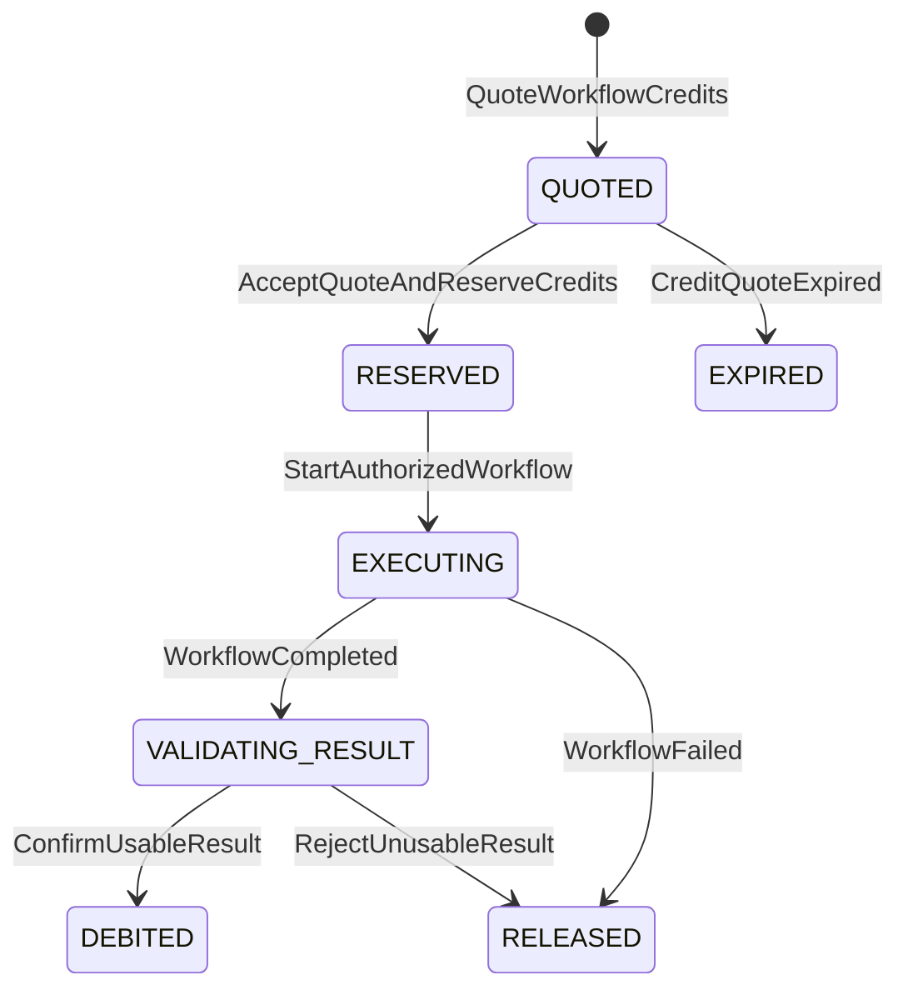

# Credit-Based Pricing And Workflow Metering

- Status: Accepted
- Date: 2026-07-27
- Decision owner: Business / Founder
- Supersedes: [`2026-06-08-price-by-graded-submissions.md`](2026-06-08-price-by-graded-submissions.md)

## Context

The original pricing model counted every analyzed student submission as the same commercial unit. That was simple, but it became inaccurate once GradeOps AI supported operations with materially different cost profiles:

- rubric import and generation;
- standard and complex submission evaluation;
- OCR and multimodal analysis;
- feedback regeneration;
- section-level summaries;
- independent second review;
- provider/model routing, retries, and fallback.

A submission count remains an important product and value metric, but it cannot safely price all workflows as if they consumed equal technical capacity. The commercial model also needs to remain stable when providers, models, token prices, or routing policies change.

## Decision

GradeOps AI will meter billable AI-assisted workflows in **GradeOps credits**.

The initial planning definition is:

```text
1 GradeOps credit = USD 0.01 of P90 technical budget
```

This is an internal economic reserve, not a promise that the actual provider charge is always USD 0.01 and not a direct token resale.

Each workflow has a versioned, customer-visible credit quote based on observable workload characteristics. Initial examples:

| Workflow | Credits |
| --- | ---: |
| Import and structure a rubric | 1 |
| Analyze assessment instructions | 2 |
| Generate or improve a rubric | 3 |
| OCR/vision block up to 10 pages | 4 |
| Standard evaluation with feedback | 8 |
| Complex or multi-file evaluation | 16 |
| Regenerate feedback without reevaluation | 3 |
| Section results summary | 8 |

The exact catalog remains an experimental `Credit Model v0.1` and must be recalibrated with beta telemetry.

The commercial rules are:

- Quote and reserve credits before execution.
- Confirm consumption only after GradeOps produces a valid, usable result.
- Release the reservation when GradeOps or a provider fails.
- Do not separately charge retries, output repair, or internal model calls already included in the quoted workflow.
- Do not double-charge a component already included in a composite workflow.
- Require a new quote when the user changes the rubric, input files, or requested operation.
- Use idempotency to prevent duplicate charges.
- Never offer unlimited GenAI processing.
- Keep provider, model, tokens, cost, and submission counts as operational metrics without exposing them as the primary commercial unit.



| Origen | Operación | Guarda principal | Destino | Movimiento de ledger |
|---|---|---|---|---|
| Inexistente | Cotizar | Catálogo vigente y características observables | `QUOTED` | Ninguno |
| `QUOTED` | Aceptar y reservar | Saldo suficiente, cotización vigente e idempotency key | `RESERVED` | `RESERVATION` |
| `QUOTED` | Expirar | Vigencia agotada | `EXPIRED` | Ninguno |
| `RESERVED` | Ejecutar | Presupuesto autorizado y reserva activa | `EXECUTING` | Ninguno |
| `EXECUTING` | Completar técnicamente | Resultado estructurado disponible | `VALIDATING_RESULT` | Ninguno |
| `VALIDATING_RESULT` | Confirmar consumo | Resultado válido y utilizable | `DEBITED` | `DEBIT` |
| `EXECUTING`, `VALIDATING_RESULT` | Liberar | Fallo atribuible a GradeOps/proveedor o resultado inutilizable | `RELEASED` | `RELEASE` |

`DEBITED`, `RELEASED` y `EXPIRED` son terminales para una cotización. Un
reprocesamiento comercialmente nuevo requiere otra cotización; un reintento
técnico incluido conserva la misma reserva e idempotency key.

## Initial Plan Hypotheses

These plans are experiments, not final public commitments:

| Plan | Monthly price | Credits | Intended profile |
| --- | ---: | ---: | --- |
| Initial | CLP $8,990 | 250 | Approximately 25 standard submissions plus cycle setup |
| Pro | CLP $24,990 | 750 | Approximately 70 mixed-complexity submissions |
| Intensive | CLP $69,990 | 2,500 | Approximately 210 mixed/multimodal submissions |

Initial institutional hypotheses:

| Offer | Included credits | Indicative price |
| --- | ---: | ---: |
| Pilot, up to 5 teachers | 4,000 | CLP $199,000/month |
| Department, up to 20 teachers | 20,000 | CLP $749,000/month |
| Institution, 50+ teachers | From 50,000 | From CLP $1,549,000/month |

Institutional pricing also includes organization administration, auditability, budget controls, reporting, support, retention policy, contractual data handling, and future SSO/SLA capabilities. It is not merely discounted credit volume.

## Rationale

- Credits decouple the commercial contract from provider-specific tokens and model names.
- Different workflows can consume different amounts without pretending all submissions are equivalent.
- P90 budgeting protects margin against long inputs, retries, thinking tokens, multimodal work, provider changes, and exchange-rate movement.
- A pre-execution quote makes complex-workflow pricing explainable and prevents surprise billing.
- Submission counts remain useful for ROI and product analytics while technical metering becomes more accurate.
- Versioned credit schedules allow optimization and routing changes without redefining every plan.

## Consequences

- `api/` owns authorization, quote acceptance, credit reservation, confirmation/release, plan balances, idempotency, and the customer ledger.
- `agents/` reports actual provider/model usage and workflow cost but does not debit customer credits.
- A versioned workflow catalog maps observable workload characteristics to credits.
- `UsageEvent` must distinguish product metrics such as submissions from commercial credit movements.
- Credit ledgers need immutable reservation, debit, release, grant, expiration, and adjustment events.
- Subscription credits expire monthly with limited rollover; purchased top-up credits use a longer explicit validity period.
- Credit pricing and included quantities remain hypotheses until validated with real consumption and willingness-to-pay evidence.
- Customer interfaces should show both credits and an approximate monetary equivalent under the current plan.

<!-- nav -->

---

← [Price by Graded Submission](2026-06-08-price-by-graded-submissions.md) | [↑ inicio](#credit-based-pricing-and-workflow-metering) | [README](README.md) | [Policy-Based Model Routing →](2026-07-27-policy-based-model-routing.md)
